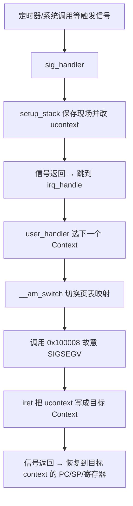
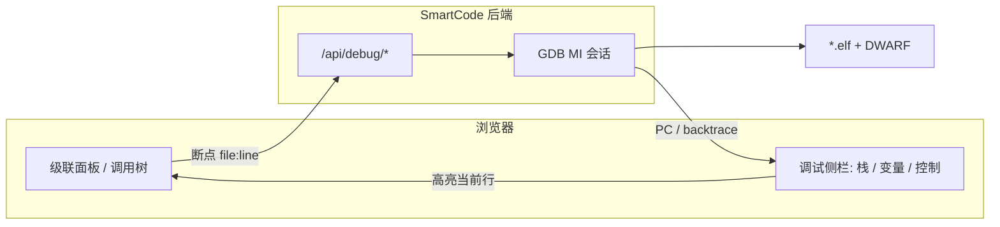

<!-- Generated by SpecStory, Markdown v2.1.0 -->

# 2026-06-25 09:16:41Z

<!-- Cursor IDE Session acbecc3f-cbdb-471a-a6bc-4239381943be (2026-06-25 09:16:41Z) -->

_**User**_

这里从iret返回就能切换到另外一个context吗？ 怎么做到的？ @cte.c (86-92) 

---

_**Agent (default)**_

查看 `cte.c` 的完整上下文切换机制。


_**Agent (default)**_

<tool-use data-tool-type="read" data-tool-name="read_file_v2">
<details><summary>Tool use: **read_file_v2** • Read file: /home/alex/ysyx-workbench/abstract-machine/am/src/native/cte.c</summary>

</details>
</tool-use>

<tool-use data-tool-type="read" data-tool-name="read_file_v2"><details>
<summary>Tool use: **read_file_v2**</summary>

</details></tool-use>

_**Agent (default)**_

<tool-use data-tool-type="unknown" data-tool-name="ripgrep_raw_search">
<details>
<summary>Tool use: **ripgrep_raw_search**</summary>


Parameters:

```json
{
  "caseInsensitive": false,
  "path": "/home/alex/ysyx-workbench/abstract-machine/am/src/native",
  "pattern": "iret|__am_cte|ucontext"
}
```
Additional data:

```json
{
  "isPruned": true,
  "outputMode": "content",
  "path": "/home/alex/ysyx-workbench/abstract-machine/am/src/native",
  "pattern": "iret|__am_cte|ucontext",
  "topFiles": [
    {
      "matchCount": 5,
      "uri": "../ysyx-workbench/abstract-machine/am/src/native/cte.c"
    },
    {
      "matchCount": 3,
      "uri": "../ysyx-workbench/abstract-machine/am/src/native/platform.c"
    },
    {
      "matchCount": 1,
      "uri": "../ysyx-workbench/abstract-machine/am/src/native/vme.c"
    }
  ],
  "totalFiles": 3,
  "totalMatches": 9
}
```
Status: **completed**


</details>
</tool-use>

<tool-use data-tool-type="unknown" data-tool-name="ripgrep_raw_search"><details>
<summary>Tool use: **ripgrep_raw_search**</summary>

</details></tool-use>

_**Agent (default)**_

<think><details><summary>Thought Process</summary>
正在分析基于信号的上下文切换机制。</details></think>

_**Agent (default)**_

<tool-use data-tool-type="unknown" data-tool-name="ripgrep_raw_search">
<details>
<summary>Tool use: **ripgrep_raw_search**</summary>


Parameters:

```json
{
  "caseInsensitive": false,
  "path": "/home/alex/ysyx-workbench/abstract-machine",
  "pattern": "__am_switch|0x100008|AM_REG_GPR1"
}
```
Additional data:

```json
{
  "isPruned": true,
  "outputMode": "content",
  "path": "/home/alex/ysyx-workbench/abstract-machine",
  "pattern": "__am_switch|0x100008|AM_REG_GPR1",
  "topFiles": [
    {
      "matchCount": 6,
      "uri": "../ysyx-workbench/abstract-machine/am/src/native/cte.c"
    },
    {
      "matchCount": 1,
      "uri": "../ysyx-workbench/abstract-machine/am/src/mips/nemu/vme.c"
    },
    {
      "matchCount": 1,
      "uri": "../ysyx-workbench/abstract-machine/am/src/loongarch/nemu/vme.c"
    },
    {
      "matchCount": 1,
      "uri": "../ysyx-workbench/abstract-machine/am/src/native/vme.c"
    },
    {
      "matchCount": 3,
      "uri": "../ysyx-workbench/abstract-machine/am/src/native/platform.h"
    },
    {
      "matchCount": 1,
      "uri": "../ysyx-workbench/abstract-machine/am/src/riscv/nemu/vme.c"
    },
    {
      "matchCount": 1,
      "uri": "../ysyx-workbench/abstract-machine/am/src/x86/nemu/vme.c"
    }
  ],
  "totalFiles": 7,
  "totalMatches": 14
}
```
Status: **completed**


</details>
</tool-use>

<tool-use data-tool-type="unknown" data-tool-name="ripgrep_raw_search"><details>
<summary>Tool use: **ripgrep_raw_search**</summary>

</details></tool-use>

_**Agent (default)**_

<tool-use data-tool-type="search" data-tool-name="glob_file_search">
<details>
<summary>Tool use: **glob_file_search** • Searched codebase "" • **12** results in **1** directory</summary>

Directory: **/home/alex/ysyx-workbench/abstract-machine** (12 files)

| File |
|------|
| `am/src/native/cte.c` |
| `am/src/native/platform.c` |
| `am/src/native/ioe/gpu.c` |
| `am/src/native/vme.c` |
| `am/src/native/ioe/timer.c` |
| `am/src/native/ioe/disk.c` |
| `am/src/native/mpe.c` |
| `am/src/native/ioe/input.c` |
| `am/src/native/trm.c` |
| `am/src/native/ioe/audio.c` |
| `am/src/native/ioe.c` |
| `am/src/native/ioe/uart.c` |

</details>
</tool-use>

<tool-use data-tool-type="search" data-tool-name="glob_file_search"><details>
<summary>Tool use: **glob_file_search**</summary>

</details></tool-use>

_**Agent (default)**_

<tool-use data-tool-type="read" data-tool-name="read_file_v2">
<details><summary>Tool use: **read_file_v2** • Read file: /home/alex/ysyx-workbench/abstract-machine/am/src/native/vme.c</summary>

</details>
</tool-use>

<tool-use data-tool-type="read" data-tool-name="read_file_v2"><details>
<summary>Tool use: **read_file_v2**</summary>

</details></tool-use>

_**Agent (default)**_

<tool-use data-tool-type="read" data-tool-name="read_file_v2">
<details><summary>Tool use: **read_file_v2** • Read file: /home/alex/ysyx-workbench/abstract-machine/am/src/native/platform.c</summary>

</details>
</tool-use>

<tool-use data-tool-type="read" data-tool-name="read_file_v2"><details>
<summary>Tool use: **read_file_v2**</summary>

</details></tool-use>

_**Agent (default)**_

<tool-use data-tool-type="read" data-tool-name="read_file_v2">
<details><summary>Tool use: **read_file_v2** • Read file: /home/alex/ysyx-workbench/abstract-machine/am/src/native/platform.h</summary>

</details>
</tool-use>

<tool-use data-tool-type="read" data-tool-name="read_file_v2"><details>
<summary>Tool use: **read_file_v2**</summary>

</details></tool-use>

_**Agent (default)**_

<tool-use data-tool-type="unknown" data-tool-name="ripgrep_raw_search">
<details>
<summary>Tool use: **ripgrep_raw_search**</summary>


Parameters:

```json
{
  "caseInsensitive": false,
  "path": "/home/alex/ysyx-workbench/abstract-machine",
  "pattern": "__am_kcontext_start|typedef.*Context"
}
```
Additional data:

```json
{
  "isPruned": true,
  "outputMode": "content",
  "path": "/home/alex/ysyx-workbench/abstract-machine",
  "pattern": "__am_kcontext_start|typedef.*Context",
  "topFiles": [
    {
      "matchCount": 2,
      "uri": "../ysyx-workbench/abstract-machine/am/src/native/cte.c"
    },
    {
      "matchCount": 1,
      "uri": "../ysyx-workbench/abstract-machine/am/include/am.h"
    },
    {
      "matchCount": 2,
      "uri": "../ysyx-workbench/abstract-machine/am/src/native/trap.S"
    },
    {
      "matchCount": 3,
      "uri": "../ysyx-workbench/abstract-machine/am/src/x86/qemu/cte.c"
    },
    {
      "matchCount": 2,
      "uri": "../ysyx-workbench/abstract-machine/am/src/x86/qemu/trap64.S"
    },
    {
      "matchCount": 2,
      "uri": "../ysyx-workbench/abstract-machine/am/src/x86/qemu/trap32.S"
    }
  ],
  "totalFiles": 6,
  "totalMatches": 12
}
```
Status: **completed**


</details>
</tool-use>

<tool-use data-tool-type="unknown" data-tool-name="ripgrep_raw_search"><details>
<summary>Tool use: **ripgrep_raw_search**</summary>

</details></tool-use>

_**Agent (default)**_

<tool-use data-tool-type="unknown" data-tool-name="ripgrep_raw_search">
<details>
<summary>Tool use: **ripgrep_raw_search**</summary>


Parameters:

```json
{
  "caseInsensitive": false,
  "path": "/home/alex/ysyx-workbench/abstract-machine",
  "pattern": "struct Context|typedef struct.*Context"
}
```
Additional data:

```json
{
  "isPruned": true,
  "outputMode": "content",
  "path": "/home/alex/ysyx-workbench/abstract-machine",
  "pattern": "struct Context|typedef struct.*Context",
  "topFiles": [
    {
      "matchCount": 1,
      "uri": "../ysyx-workbench/abstract-machine/am/include/arch/riscv.h"
    },
    {
      "matchCount": 1,
      "uri": "../ysyx-workbench/abstract-machine/am/include/am.h"
    },
    {
      "matchCount": 1,
      "uri": "../ysyx-workbench/abstract-machine/am/include/arch/x86-nemu.h"
    },
    {
      "matchCount": 1,
      "uri": "../ysyx-workbench/abstract-machine/am/include/arch/mips32-nemu.h"
    },
    {
      "matchCount": 1,
      "uri": "../ysyx-workbench/abstract-machine/am/include/arch/x86-qemu.h"
    },
    {
      "matchCount": 1,
      "uri": "../ysyx-workbench/abstract-machine/am/include/arch/native.h"
    },
    {
      "matchCount": 1,
      "uri": "../ysyx-workbench/abstract-machine/am/include/arch/loongarch32r-nemu.h"
    },
    {
      "matchCount": 1,
      "uri": "../ysyx-workbench/abstract-machine/am/include/arch/x86_64-qemu.h"
    }
  ],
  "totalFiles": 8,
  "totalMatches": 8
}
```
Status: **completed**


</details>
</tool-use>

<tool-use data-tool-type="unknown" data-tool-name="ripgrep_raw_search"><details>
<summary>Tool use: **ripgrep_raw_search**</summary>

</details></tool-use>

_**Agent (default)**_

<tool-use data-tool-type="read" data-tool-name="read_file_v2">
<details><summary>Tool use: **read_file_v2** • Read file: /home/alex/ysyx-workbench/abstract-machine/am/include/arch/native.h</summary>

</details>
</tool-use>

<tool-use data-tool-type="read" data-tool-name="read_file_v2"><details>
<summary>Tool use: **read_file_v2**</summary>

</details></tool-use>

_**Agent (default)**_

<tool-use data-tool-type="read" data-tool-name="read_file_v2">
<details><summary>Tool use: **read_file_v2** • Read file: /home/alex/ysyx-workbench/abstract-machine/am/src/native/trap.S</summary>

</details>
</tool-use>

<tool-use data-tool-type="read" data-tool-name="read_file_v2"><details>
<summary>Tool use: **read_file_v2**</summary>

</details></tool-use>

_**Agent (default)**_

<think><details><summary>Thought Process</summary>
已理清 AM 原生移植中基于 Linux 信号处理与 ucontext_t 的上下文切换机制，正准备逐条说明具体流程。

具体实现如下：

- 用 Linux 信号模拟 trap：SIGVTALRM 处理定时器、SIGUSR1/SIGUSR2 处理 I/O 与 yield、SIGSEGV 处理系统调用。
- setup_stack 将当前 ucontext 保存到栈上的 Context 结构体，并修改其寄存器：PC 指向 irq_handle，SP 指向该 Context，GPR1（x86 上的 RDI）指向 Context 地址。
- 信号处理程序返回后，CPU 直接跳转到 irq_handle，而非被中断的代码。
- irq_handle 再调用用户定义的调度器函数 user_handler，完成上下文切换。

- 调度器在 0x100008 触发 SIGSEGV，该地址位于 mmap 的 PROT_NONE 页面。
- SIGSEGV 处理程序执行 iret(ucontext)：从 GPR1 取出 Context 指针，将保存的 ucontext 复制回信号的 ucontext，恢复内核栈指针。
- 内核随后通过修改后的 ucontext 返回，CPU 状态随之恢复。

关键在于：iret 并非通过普通函数返回来切换上下文。它直接修改了 ucontext_t 中的 PC、SP 和各寄存器，使内核在返回信号处理程序时恢复的是目标进程的状态。因此 CPU 实际跳转到了调度器选定的上下文，而非 irq_handle 或原始被中断代码。

这相当于硬件层面的 setcontext / longjmp。

0x100008 的技巧在于：iret 需要在信号处理程序内部运行才能拿到 ucontext 参数。irq_handle 不能直接调用 iret，而是故意访问该地址触发 SIGSEGV；SIGSEGV 处理程序随后执行 iret(ucontext)，内核返回时即恢复目标上下文。

iret 恢复的不仅是 PC 和 SP，还包括全部通用寄存器以及信号屏蔽字。因此返回信号处理程序时，CPU 状态会完整切换到目标上下文。这与 RISC-V 或 MIPS 等硬件端直接使用 iret 指令恢复 CSR 的方式不同，AM 这里是通过 Linux 的 ucontext 信号返回路径来实现的。

进一步确认：irq_handle 入口时，setup_stack 已将当前上下文的 Context 指针写入 GPR1。调度器返回新上下文 c 后，__am_switch 切换映射，再调用 p(c) 触发 SIGSEGV。此时 iret 仍从 GPR1 读取该 Context 指针，恢复目标上下文的寄存器状态。

正在重新审视一个关键细节：当 irq_handle 调用 p(c) 触发 SIGSEGV 时，iret 从 GPR1 读取的 Context 指针可能仍是 setup_stack 保留的旧上下文，而非调度器返回的新上下文 c。需要确认此处是否正确传递了目标上下文。</details></think>

_**Agent (default)**_

是的。`iret` 本身不是普通函数返回，而是**改写 Linux 信号框架里的 `ucontext_t`**，让内核在“从信号处理函数返回”时，按**另一个 context** 的 CPU 状态恢复执行。

## 核心机制

native 端口没有真实硬件 trap/iret，而是用 **Linux 信号 + `ucontext_t`** 模拟上下文切换：



## 完整流程

### 1. 进入内核态：`setup_stack`

```38:84:/home/alex/ysyx-workbench/abstract-machine/am/src/native/cte.c
static void setup_stack(uintptr_t event, ucontext_t *uc) {
  // ...
  Context *c = (void *)sp;
  c->uc = *uc;                    // 保存被中断时的完整 CPU 状态

  AM_REG_GPR1(uc) = (uintptr_t)c;
  AM_REG_PC(uc)   = (uintptr_t)irq_handle;  // 改 PC：信号返回后不回到原处
  AM_REG_SP(uc)   = (uintptr_t)c;
}
```

信号处理函数返回时，内核会按 `ucontext` 恢复寄存器，于是执行流进入 `irq_handle`，而不是被中断的代码。

### 2. 调度：`irq_handle`

```18:36:/home/alex/ysyx-workbench/abstract-machine/am/src/native/cte.c
static void irq_handle(Context *c) {
  // ...
  c = user_handler(thiscpu->ev, c);  // 调度器返回要运行的 context
  __am_switch(c);                    // 切换虚拟内存映射

  void (*p)(Context *c) = (void *)(uintptr_t)0x100008;
  p(c);   // 故意访问不可执行页，触发 SIGSEGV
}
```

`0x100008` 在 trap page（`PROT_NONE`）上，访问会触发 SIGSEGV：

```83:87:/home/alex/ysyx-workbench/abstract-machine/am/src/native/platform.c
  // create trap page to receive syscall and yield by SIGSEGV
  void *ret = mmap(TRAP_PAGE_START, sys_pgsz, PROT_NONE,
      MAP_SHARED | MAP_ANONYMOUS | MAP_FIXED, -1, 0);
```

### 3. 切换 context：`iret`

```86:92:/home/alex/ysyx-workbench/abstract-machine/am/src/native/cte.c
static void iret(ucontext_t *uc) {
  Context *c = (void *)AM_REG_GPR1(uc);  // x86_64 上即 RDI，来自 p(c) 的参数
  *uc = c->uc;                           // 用目标 context 覆盖当前 ucontext
  thiscpu->ksp = c->ksp;
  if (__am_in_userspace((void *)AM_REG_PC(uc))) __am_pmem_protect();
}
```

SIGSEGV 处理里识别 `0x100008` 后调用 `iret`：

```101:106:/home/alex/ysyx-workbench/abstract-machine/am/src/native/cte.c
    case SIGSEGV:
      if (info->si_code == SEGV_ACCERR) {
        switch ((uintptr_t)info->si_addr) {
          case 0x100000: thiscpu->ev.event = EVENT_SYSCALL; break;
          case 0x100008: iret(ucontext); return;
```

## `iret` “返回”后发生了什么？

`iret` 返回后，`sig_handler` 也返回。内核通过 `rt_sigreturn` 从 **`ucontext_t`** 恢复：

| 字段 | 作用 |
|------|------|
| PC (RIP) | 跳到目标 context 的指令地址 |
| SP (RSP) | 切到目标 context 的栈 |
| 通用寄存器 | 恢复该 context 的寄存器 |
| `uc_sigmask` | 恢复中断屏蔽状态 |

所以不是 `iret` 的 C 函数返回在切换，而是：**`iret` 改写了即将被内核用来恢复 CPU 的 `ucontext`，下一次信号返回等价于 `setcontext()`**。

## Context 里存了什么？

```10:18:/home/alex/ysyx-workbench/abstract-machine/am/include/arch/native.h
struct Context {
  uintptr_t ksp;
  void *vm_head;
  ucontext_t uc;   // 完整 CPU 快照（PC、SP、寄存器、信号掩码等）
  // ...
};
```

新建内核 context 时，`kcontext()` 会初始化 `uc`，并把 PC 设为 `__am_kcontext_start`：

```168:182:/home/alex/ysyx-workbench/abstract-machine/am/src/native/cte.c
Context* kcontext(Area kstack, void (*entry)(void *), void *arg) {
  Context *c = (Context*)kstack.end - 1;
  __am_get_example_uc(c);
  AM_REG_PC(&c->uc) = (uintptr_t)__am_kcontext_start;
  // ...
}
```

## 和真实硬件的对应关系

| 真实 OS/CPU | native 端口 |
|-------------|-------------|
| 硬件 trap 保存寄存器 | 信号处理 + `setup_stack` 保存到 `Context` |
| 调度器选下一个进程 | `user_handler` 返回新 `Context*` |
| 切换页表 | `__am_switch` |
| `iret` 恢复寄存器并跳转 | `iret` 写 `ucontext` + 信号返回 |

## 为什么要绕 `0x100008`？

`irq_handle` 里不能直接调 `iret(uc)`，因为 **`ucontext` 只在信号处理函数里由内核传入**。所以用“访问 `0x100008` → 再进一次 SIGSEGV handler → 在那里调用 `iret(ucontext)`”的方式，把恢复逻辑放回信号框架里。

---

**一句话**：`iret` 把目标 `Context` 的 `ucontext_t` 写回内核提供的 `ucontext`；`sig_handler` 返回后，内核按这份快照恢复 CPU，于是执行流切到另一个 context 的 PC/栈/寄存器——这就是 native 端在 Linux 用户态上的“上下文切换”。

---

_**User**_

标签保存这里的逻辑似乎有点问题

---

_**Agent (default)**_

正在查找项目中与标签页保存相关的逻辑。


_**Agent (default)**_

<tool-use data-tool-type="unknown" data-tool-name="semantic_search_full">
<details>
<summary>Tool use: **semantic_search_full**</summary>


Parameters:

```json
{
  "explanation": "",
  "query": "Where is tab saving logic implemented?",
  "topK": 10
}
```
Result:

```json
{
  "codeResults": [
    {
      "codeBlock": {
        "detailedLines": [
          {
            "lineNumber": 130,
            "text": "/** 立即写入会话 + 自动标签（关闭/清树前需 force=true） */"
          },
          {
            "isSignature": true,
            "lineNumber": 131,
            "text": "function persistTreeNow(force) {"
          },
          {
            "lineNumber": 132,
            "text": "  const snap = serializeState();"
          },
          {
            "lineNumber": 133,
            "text": "  if (snap) {"
          },
          {
            "lineNumber": 134,
            "text": "    localStorage.setItem(LS_SESSION, JSON.stringify(snap));"
          },
          {
            "lineNumber": 135,
            "text": "    syncAutoBookmark(snap);"
          },
          {
            "lineNumber": 136,
            "text": "  } else {"
          },
          {
            "lineNumber": 137,
            "text": "    localStorage.removeItem(LS_SESSION);"
          },
          {
            "lineNumber": 138,
            "text": "  }"
          },
          {
            "lineNumber": 139,
            "text": "  if (force) clearTimeout(_persistTimer);"
          },
          {
            "isSignature": true,
            "lineNumber": 140,
            "text": "}"
          },
          {
            "lineNumber": 141
          },
          {
            "isSignature": true,
            "lineNumber": 142,
            "text": "function treeFingerprint(snap) {"
          },
          {
            "lineNumber": 143,
            "text": "  if (!snap?.panels?.length) return \"\";"
          },
          {
            "isSignature": true,
            "lineNumber": 146,
            "text": "}"
          }
        ],
        "range": {
          "endPosition": {
            "column": 1,
            "line": 145
          },
          "startPosition": {
            "column": 1,
            "line": 127
          }
        },
        "relativeWorkspacePath": "./src/smartcode_browser/server/static/app.js",
        "signatures": {}
      },
      "score": 0.2908833920955658
    },
    {
      "codeBlock": {
        "detailedLines": [
          {
            "lineNumber": 89,
            "text": "// ---------- 会话持久化（刷新/重启后自动恢复 + 命名标签） ----------"
          },
          {
            "lineNumber": 90
          },
          {
            "lineNumber": 91,
            "text": "/** 把当前代码树序列化为可 JSON 存储的快照（只存定位信息，源码恢复时再拉取） */"
          },
          {
            "isSignature": true,
            "lineNumber": 92,
            "text": "function serializeState() {"
          },
          {
            "lineNumber": 93,
            "text": "  if (!state.project || !state.order.length) return null;"
          },
          {
            "lineNumber": 94,
            "text": "  const idToIdx = new Map();"
          },
          {
            "lineNumber": 95,
            "text": "  state.order.forEach((id, i) =\u003e idToIdx.set(id, i));"
          },
          {
            "lineNumber": 96,
            "text": "  return {"
          },
          {
            "lineNumber": 97,
            "text": "    v: 1,"
          },
          {
            "lineNumber": 98,
            "text": "    project: state.project,"
          },
          {
            "lineNumber": 99,
            "text": "    seq: state.seq,"
          },
          {
            "lineNumber": 100,
            "text": "    boardScroll: { left: el.board.scrollLeft, top: el.board.scrollTop },"
          },
          {
            "lineNumber": 101,
            "text": "    panels: state.order.map((id) =\u003e {"
          },
          {
            "lineNumber": 102,
            "text": "      const p = state.panels.get(id);"
          },
          {
            "lineNumber": 103,
            "text": "      const d = p.detail;"
          },
          {
            "lineNumber": 104,
            "text": "      return {"
          },
          {
            "lineNumber": 105,
            "text": "        file: d.file,"
          },
          {
            "lineNumber": 106,
            "text": "        name: d.name,"
          },
          {
            "lineNumber": 107,
            "text": "        line: d.start_line,"
          },
          {
            "lineNumber": 108,
            "text": "        parentIndex: p.parentId != null ? idToIdx.get(p.parentId) : -1,"
          },
          {
            "lineNumber": 109,
            "text": "        fromRef: p.fromRef,"
          },
          {
            "lineNumber": 110,
            "text": "        manualPos: p.manualPos || null,"
          },
          {
            "lineNumber": 111,
            "text": "        // 同一函数被多处引用时，额外来源边（不重复开面板）"
          },
          {
            "lineNumber": 112,
            "text": "        extraLinks: (p.extraLinks || []).map((l) =\u003e ({"
          },
          {
            "lineNumber": 113,
            "text": "          parentIndex: idToIdx.get(l.parentId),"
          },
          {
            "lineNumber": 114,
            "text": "          fromRef: l.fromRef,"
          },
          {
            "lineNumber": 115,
            "text": "        })).filter((l) =\u003e l.parentIndex \u003e= 0),"
          },
          {
            "lineNumber": 116,
            "text": "      };"
          },
          {
            "lineNumber": 117,
            "text": "    }),"
          },
          {
            "lineNumber": 118,
            "text": "  };"
          },
          {
            "isSignature": true,
            "lineNumber": 119,
            "text": "}"
          },
          {
            "lineNumber": 120
          },
          {
            "lineNumber": 121,
            "text": "let _persistTimer = null;"
          },
          {
            "isSignature": true,
            "lineNumber": 122,
            "text": "function schedulePersist() {"
          },
          {
            "lineNumber": 123,
            "text": "  if (state._restoring) return;"
          },
          {
            "isSignature": true,
            "lineNumber": 128,
            "text": "}"
          }
        ],
        "range": {
          "endPosition": {
            "column": 1,
            "line": 127
          },
          "startPosition": {
            "column": 1,
            "line": 86
          }
        },
        "relativeWorkspacePath": "./src/smartcode_browser/server/static/app.js",
        "signatures": {}
      },
      "score": 0.2727648913860321
    },
    {
      "codeBlock": {
        "detailedLines": [
          {
            "isSignature": true,
            "lineNumber": 259,
            "text": "function saveCurrentAsBookmark() {"
          },
          {
            "lineNumber": 260,
            "text": "  const name = el.bookmarkNameInput.value.trim();"
          },
          {
            "lineNumber": 261,
            "text": "  if (!name) {"
          },
          {
            "lineNumber": 262,
            "text": "    toast(\"请输入标签名称\");"
          },
          {
            "lineNumber": 263,
            "text": "    el.bookmarkNameInput.focus();"
          },
          {
            "lineNumber": 264,
            "text": "    return;"
          },
          {
            "lineNumber": 265,
            "text": "  }"
          },
          {
            "lineNumber": 266,
            "text": "  const snap = serializeState();"
          },
          {
            "lineNumber": 267,
            "text": "  if (!snap) {"
          },
          {
            "lineNumber": 268,
            "text": "    toast(\"当前没有可保存的代码树\");"
          },
          {
            "lineNumber": 269,
            "text": "    return;"
          },
          {
            "lineNumber": 270,
            "text": "  }"
          },
          {
            "lineNumber": 271,
            "text": "  const bookmarks = loadBookmarksStore();"
          },
          {
            "lineNumber": 272,
            "text": "  const id = state.autoBookmarkId || (\"bm-\" + Date.now());"
          },
          {
            "lineNumber": 273,
            "text": "  bookmarks[id] = {"
          },
          {
            "lineNumber": 274,
            "text": "    name,"
          },
          {
            "lineNumber": 275,
            "text": "    savedAt: new Date().toISOString(),"
          },
          {
            "lineNumber": 276,
            "text": "    session: snap,"
          },
          {
            "lineNumber": 277,
            "text": "    auto: !!state.autoBookmarkId,"
          },
          {
            "lineNumber": 278,
            "text": "    fingerprint: treeFingerprint(snap),"
          },
          {
            "lineNumber": 279,
            "text": "  };"
          },
          {
            "lineNumber": 280,
            "text": "  saveBookmarksStore(bookmarks);"
          },
          {
            "lineNumber": 281,
            "text": "  state.autoBookmarkId = id;"
          },
          {
            "lineNumber": 282,
            "text": "  state.autoBookmarkName = name;"
          },
          {
            "lineNumber": 283,
            "text": "  renderBookmarkList();"
          },
          {
            "lineNumber": 284,
            "text": "  closeBookmarkDialog();"
          },
          {
            "lineNumber": 285,
            "text": "  toast(state.autoBookmarkId \u0026\u0026 bookmarks[id]?.auto ? &#96;已更新标签「${name}」&#96; : &#96;已保存标签「${name}」&#96;);"
          },
          {
            "isSignature": true,
            "lineNumber": 286,
            "text": "}"
          },
          {
            "lineNumber": 287
          },
          {
            "isSignature": true,
            "lineNumber": 288,
            "text": "function deleteBookmark(id) {"
          },
          {
            "lineNumber": 289,
            "text": "  const bookmarks = loadBookmarksStore();"
          },
          {
            "isSignature": true,
            "lineNumber": 295,
            "text": "}"
          }
        ],
        "range": {
          "endPosition": {
            "column": 1,
            "line": 294
          },
          "startPosition": {
            "column": 1,
            "line": 256
          }
        },
        "relativeWorkspacePath": "./src/smartcode_browser/server/static/app.js",
        "signatures": {}
      },
      "score": 0.2593759298324585
    },
    {
      "codeBlock": {
        "detailedLines": [
          {
            "isSignature": true,
            "lineNumber": 131,
            "text": "def save("
          },
          {
            "isSignature": true,
            "lineNumber": 132,
            "text": "    project: Project,"
          },
          {
            "isSignature": true,
            "lineNumber": 133,
            "text": "    project_id: str,"
          },
          {
            "isSignature": true,
            "lineNumber": 134,
            "text": "    max_files: int,"
          },
          {
            "isSignature": true,
            "lineNumber": 135,
            "text": "    manifest: dict[str, tuple[float, int]],"
          },
          {
            "isSignature": true,
            "lineNumber": 136,
            "text": "    by_name: dict[str, list[Symbol]],"
          },
          {
            "isSignature": true,
            "lineNumber": 137,
            "text": "    by_file: dict[str, list[Symbol]],"
          },
          {
            "isSignature": true,
            "lineNumber": 138,
            "text": "    file_count: int,"
          },
          {
            "isSignature": true,
            "lineNumber": 139,
            "text": "    truncated: bool,"
          },
          {
            "isSignature": true,
            "lineNumber": 140,
            "text": ") -\u003e None:"
          },
          {
            "lineNumber": 141,
            "text": "    if not cache_enabled():"
          },
          {
            "lineNumber": 142,
            "text": "        return"
          },
          {
            "lineNumber": 143,
            "text": "    path = cache_file(project_id)"
          },
          {
            "lineNumber": 144,
            "text": "    try:"
          },
          {
            "lineNumber": 145,
            "text": "        path.parent.mkdir(parents=True, exist_ok=True)"
          },
          {
            "lineNumber": 146,
            "text": "        payload = IndexCachePayload("
          },
          {
            "lineNumber": 147,
            "text": "            meta=_meta_from_project(project, project_id, max_files),"
          },
          {
            "lineNumber": 148,
            "text": "            manifest=manifest,"
          },
          {
            "lineNumber": 149,
            "text": "            by_name=by_name,"
          },
          {
            "lineNumber": 150,
            "text": "            by_file=by_file,"
          },
          {
            "lineNumber": 151,
            "text": "            file_count=file_count,"
          },
          {
            "lineNumber": 152,
            "text": "            truncated=truncated,"
          },
          {
            "lineNumber": 153,
            "text": "        )"
          },
          {
            "lineNumber": 154,
            "text": "        tmp = path.with_suffix(\".tmp\")"
          },
          {
            "lineNumber": 155,
            "text": "        with tmp.open(\"wb\") as f:"
          },
          {
            "lineNumber": 156,
            "text": "            pickle.dump(payload, f, protocol=pickle.HIGHEST_PROTOCOL)"
          },
          {
            "lineNumber": 157,
            "text": "        tmp.replace(path)"
          },
          {
            "lineNumber": 158,
            "text": "    except OSError:"
          },
          {
            "isSignature": true,
            "lineNumber": 159,
            "text": "        pass"
          }
        ],
        "range": {
          "endPosition": {
            "column": 12,
            "line": 158
          },
          "startPosition": {
            "column": 18,
            "line": 127
          }
        },
        "relativeWorkspacePath": "./src/smartcode_browser/index_cache.py",
        "signatures": {}
      },
      "score": 0.25519394874572754
    },
    {
      "codeBlock": {
        "detailedLines": [
          {
            "lineNumber": 1,
            "text": "/*"
          },
          {
            "lineNumber": 2,
            "text": " * SmartCode 代码浏览器前端"
          },
          {
            "lineNumber": 3,
            "text": " *"
          },
          {
            "lineNumber": 4,
            "text": " * 核心是一棵「导航树」：每个 Panel 记录它从哪个父 Panel 的哪一行点进来。"
          },
          {
            "lineNumber": 5,
            "text": " * 渲染时按 depth（到根的距离）分列，同一父节点下的多个分支在同列纵向堆叠，"
          },
          {
            "lineNumber": 6,
            "text": " * 从而实现「A→B→C 和 A→B→E 并列」的级联效果（IDE 难以做到）。"
          },
          {
            "lineNumber": 7,
            "text": " */"
          },
          {
            "lineNumber": 8
          },
          {
            "lineNumber": 9,
            "text": "const state = {"
          },
          {
            "lineNumber": 10,
            "text": "  project: null,"
          },
          {
            "lineNumber": 11,
            "text": "  panels: new Map(), // id -\u003e panel 对象"
          },
          {
            "lineNumber": 12,
            "text": "  order: [],         // 维持插入顺序，决定同列内的堆叠次序"
          },
          {
            "lineNumber": 13,
            "text": "  seq: 0,            // panel id 自增"
          },
          {
            "lineNumber": 14,
            "text": "  _restoring: false, // 恢复会话时跳过自动保存，避免写入半成品"
          },
          {
            "lineNumber": 15,
            "text": "  aiConfigured: false,"
          },
          {
            "lineNumber": 16,
            "text": "  aiModel: \"\","
          },
          {
            "lineNumber": 17,
            "text": "  aiBackend: \"\","
          },
          {
            "lineNumber": 18,
            "text": "  searchMode: \"def\", // def=定义 | use=调用位置"
          },
          {
            "lineNumber": 19,
            "text": "  focusedPanelId: null,"
          },
          {
            "lineNumber": 20,
            "text": "  autoBookmarkId: null,   // 当前树对应的自动同步标签 id"
          },
          {
            "lineNumber": 21,
            "text": "  autoBookmarkName: null, // 用户自定义标签名（再次保存时沿用）"
          },
          {
            "lineNumber": 22,
            "text": "};"
          },
          {
            "lineNumber": 23
          },
          {
            "lineNumber": 24,
            "text": "// localStorage 键：上次会话 + 用户命名的标签书签 + AI 分析记录"
          },
          {
            "lineNumber": 25,
            "text": "const LS_SESSION = \"smartcode-browser-session-v1\";"
          },
          {
            "lineNumber": 26,
            "text": "const LS_BOOKMARKS = \"smartcode-browser-bookmarks-v1\";"
          },
          {
            "lineNumber": 27,
            "text": "const LS_AI = \"smartcode-browser-ai-v1\";"
          },
          {
            "lineNumber": 28
          },
          {
            "lineNumber": 29,
            "text": "const el = {"
          },
          {
            "lineNumber": 30,
            "text": "  projectSelect: document.getElementById(\"project-select\"),"
          },
          {
            "lineNumber": 46,
            "text": ","
          },
          {
            "lineNumber": 47,
            "text": "};"
          }
        ],
        "range": {
          "endPosition": {
            "column": 1,
            "line": 46
          },
          "startPosition": {}
        },
        "relativeWorkspacePath": "./src/smartcode_browser/server/static/app.js",
        "signatures": {}
      },
      "score": 0.2436310052871704
    },
    {
      "codeBlock": {
        "detailedLines": [
          {
            "isSignature": true,
            "lineNumber": 197,
            "text": "function saveBookmarksStore(bookmarks) {"
          },
          {
            "lineNumber": 198,
            "text": "  localStorage.setItem(LS_BOOKMARKS, JSON.stringify(bookmarks));"
          },
          {
            "isSignature": true,
            "lineNumber": 199,
            "text": "}"
          },
          {
            "lineNumber": 200
          },
          {
            "isSignature": true,
            "lineNumber": 201,
            "text": "function defaultBookmarkName() {"
          },
          {
            "lineNumber": 202,
            "text": "  const root = state.order[0] \u0026\u0026 state.panels.get(state.order[0]);"
          },
          {
            "isSignature": true,
            "lineNumber": 207,
            "text": "}"
          }
        ],
        "range": {
          "endPosition": {
            "column": 1,
            "line": 206
          },
          "startPosition": {
            "column": 1,
            "line": 194
          }
        },
        "relativeWorkspacePath": "./src/smartcode_browser/server/static/app.js",
        "signatures": {}
      },
      "score": 0.23014159500598907
    },
    {
      "codeBlock": {
        "detailedLines": [
          {
            "lineNumber": 2461,
            "text": "// 页面关闭前立即写入，减少刷新时丢失最后一帧改动的概率"
          },
          {
            "lineNumber": 2462,
            "text": "window.addEventListener(\"beforeunload\", () =\u003e {"
          },
          {
            "lineNumber": 2463,
            "text": "  if (state._restoring) return;"
          },
          {
            "lineNumber": 2464,
            "text": "  const snap = serializeState();"
          },
          {
            "lineNumber": 2465,
            "text": "  if (snap) localStorage.setItem(LS_SESSION, JSON.stringify(snap));"
          },
          {
            "lineNumber": 2466,
            "text": "});"
          },
          {
            "lineNumber": 2467
          },
          {
            "lineNumber": 2468,
            "text": "// rAF 节流：滚动/缩放时按需重排 + 重绘连线"
          },
          {
            "lineNumber": 2469,
            "text": "let _frame = null;"
          }
        ],
        "range": {
          "endPosition": {
            "column": 18,
            "line": 2468
          },
          "startPosition": {
            "column": 3,
            "line": 2458
          }
        },
        "relativeWorkspacePath": "./src/smartcode_browser/server/static/app.js",
        "signatures": {}
      },
      "score": 0.2297435998916626
    },
    {
      "codeBlock": {
        "detailedLines": [
          {
            "isSignature": true,
            "lineNumber": 2004,
            "text": "function saveAiStore(store) {"
          },
          {
            "lineNumber": 2005,
            "text": "  localStorage.setItem(LS_AI, JSON.stringify(store));"
          },
          {
            "isSignature": true,
            "lineNumber": 2006,
            "text": "}"
          },
          {
            "lineNumber": 2007
          },
          {
            "lineNumber": 2008,
            "text": "/** 查找记录并迁移旧键（project:file:start_line:name） */"
          },
          {
            "isSignature": true,
            "lineNumber": 2009,
            "text": "function resolveAiEntry(store, detail) {"
          },
          {
            "lineNumber": 2010,
            "text": "  const key = aiSymbolKey(detail);"
          },
          {
            "isSignature": true,
            "lineNumber": 2019,
            "text": "}"
          }
        ],
        "range": {
          "endPosition": {
            "column": 1,
            "line": 2018
          },
          "startPosition": {
            "column": 1,
            "line": 2001
          }
        },
        "relativeWorkspacePath": "./src/smartcode_browser/server/static/app.js",
        "signatures": {}
      },
      "score": 0.21593314409255981
    },
    {
      "codeBlock": {
        "detailedLines": [
          {
            "isSignature": true,
            "lineNumber": 310,
            "text": "async function restoreSession(snap) {"
          },
          {
            "lineNumber": 311,
            "text": "  if (!snap?.panels?.length) return false;"
          },
          {
            "lineNumber": 312,
            "text": "  state._restoring = true;"
          },
          {
            "lineNumber": 313,
            "text": "  try {"
          },
          {
            "lineNumber": 314,
            "text": "    const opt = el.projectSelect.querySelector(&#96;option[value=\"${snap.project}\"]&#96;);"
          },
          {
            "lineNumber": 315,
            "text": "    if (!opt || opt.disabled) {"
          },
          {
            "lineNumber": 316,
            "text": "      toast(\"无法恢复：项目不存在或路径无效\");"
          },
          {
            "lineNumber": 317,
            "text": "      return false;"
          },
          {
            "lineNumber": 318,
            "text": "    }"
          },
          {
            "lineNumber": 319,
            "text": "    el.projectSelect.value = snap.project;"
          },
          {
            "lineNumber": 320,
            "text": "    state.project = snap.project;"
          },
          {
            "lineNumber": 321,
            "text": "    clearAllPanels({ silent: true, skipSave: true });"
          },
          {
            "lineNumber": 322,
            "text": "    await refreshProjectStats(snap.project);"
          },
          {
            "lineNumber": 323
          },
          {
            "lineNumber": 324,
            "text": "    state.seq = Math.max(state.seq, snap.seq || 0);"
          },
          {
            "lineNumber": 325,
            "text": "    const builtIds = [];"
          },
          {
            "lineNumber": 326,
            "text": "    let failCount = 0;"
          },
          {
            "lineNumber": 327
          },
          {
            "lineNumber": 328,
            "text": "    for (const ps of snap.panels) {"
          },
          {
            "lineNumber": 329,
            "text": "      let detail = null;"
          },
          {
            "lineNumber": 330,
            "text": "      try {"
          },
          {
            "lineNumber": 331,
            "text": "        detail = await fetchSymbol(ps.file, ps.name, ps.line);"
          },
          {
            "lineNumber": 332,
            "text": "      } catch {"
          },
          {
            "lineNumber": 333,
            "text": "        try {"
          },
          {
            "lineNumber": 334,
            "text": "          detail = await api(\"/api/open_at\", {"
          },
          {
            "lineNumber": 335,
            "text": "            project: snap.project,"
          },
          {
            "lineNumber": 336,
            "text": "            file: ps.file,"
          },
          {
            "lineNumber": 337,
            "text": "            line: ps.line,"
          },
          {
            "lineNumber": 338,
            "text": "          });"
          },
          {
            "lineNumber": 339,
            "text": "        } catch {"
          },
          {
            "lineNumber": 340,
            "text": "          detail = null;"
          },
          {
            "lineNumber": 341,
            "text": "        }"
          },
          {
            "lineNumber": 342,
            "text": "      }"
          },
          {
            "lineNumber": 343,
            "text": "      if (!detail?.lines?.length \u0026\u0026 detail?.file) {"
          },
          {
            "lineNumber": 344,
            "text": "        failCount++;"
          },
          {
            "lineNumber": 345,
            "text": "        continue;"
          },
          {
            "lineNumber": 346,
            "text": "      }"
          },
          {
            "lineNumber": 347,
            "text": "      if (!detail) {"
          },
          {
            "lineNumber": 348,
            "text": "        failCount++;"
          },
          {
            "lineNumber": 349,
            "text": "        continue;"
          },
          {
            "lineNumber": 350,
            "text": "      }"
          },
          {
            "lineNumber": 351
          },
          {
            "lineNumber": 352,
            "text": "      const parentId ="
          },
          {
            "lineNumber": 353,
            "text": "        ps.parentIndex \u003e= 0 \u0026\u0026 ps.parentIndex \u003c builtIds.length"
          },
          {
            "lineNumber": 354,
            "text": "          ? builtIds[ps.parentIndex]"
          },
          {
            "lineNumber": 355,
            "text": "          : null;"
          },
          {
            "lineNumber": 356,
            "text": "      const id = insertPanel(detail, parentId, ps.fromRef || null, \"p\" + state.seq++);"
          },
          {
            "lineNumber": 357,
            "text": "      if (ps.manualPos) state.panels.get(id).manualPos = ps.manualPos;"
          },
          {
            "lineNumber": 358,
            "text": "      builtIds.push(id);"
          },
          {
            "lineNumber": 359,
            "text": "    }"
          },
          {
            "lineNumber": 360
          },
          {
            "lineNumber": 361,
            "text": "    if (!builtIds.length) {"
          },
          {
            "lineNumber": 362,
            "text": "      toast(&#96;标签恢复失败：${failCount} 个面板无法加载（符号或行号可能已变化）&#96;);"
          },
          {
            "lineNumber": 363,
            "text": "      return false;"
          },
          {
            "lineNumber": 364,
            "text": "    }"
          },
          {
            "lineNumber": 365,
            "text": "    if (failCount) {"
          },
          {
            "lineNumber": 366,
            "text": "      toast(&#96;已恢复 ${builtIds.length} 个面板，${failCount} 个跳过&#96;);"
          },
          {
            "lineNumber": 367,
            "text": "    }"
          },
          {
            "lineNumber": 368
          },
          {
            "lineNumber": 369,
            "text": "    snap.panels.forEach((ps, i) =\u003e {"
          },
          {
            "lineNumber": 370,
            "text": "      if (!ps.extraLinks?.length) return;"
          },
          {
            "lineNumber": 377,
            "text": "    }"
          },
          {
            "isSignature": true,
            "lineNumber": 397,
            "text": "}"
          }
        ],
        "range": {
          "endPosition": {
            "column": 1,
            "line": 396
          },
          "startPosition": {
            "column": 1,
            "line": 307
          }
        },
        "relativeWorkspacePath": "./src/smartcode_browser/server/static/app.js",
        "signatures": {}
      },
      "score": 0.19232329726219177
    },
    {
      "codeBlock": {
        "detailedLines": [
          {
            "isSignature": true,
            "lineNumber": 2040,
            "text": "function ensureAiRecord(detail) {"
          },
          {
            "lineNumber": 2054
          },
          {
            "isSignature": true,
            "lineNumber": 2055,
            "text": "}"
          },
          {
            "lineNumber": 2056
          },
          {
            "isSignature": true,
            "lineNumber": 2057,
            "text": "function persistAiRecord(detail, record) {"
          },
          {
            "lineNumber": 2058,
            "text": "  const store = loadAiStore();"
          },
          {
            "lineNumber": 2059,
            "text": "  store[aiSymbolKey(detail)] = record;"
          },
          {
            "lineNumber": 2060,
            "text": "  saveAiStore(store);"
          },
          {
            "isSignature": true,
            "lineNumber": 2061,
            "text": "}"
          },
          {
            "lineNumber": 2062
          },
          {
            "lineNumber": 2063,
            "text": "/** 面板级 UI 状态（展开/当前线程/选中片段），随 panel 对象存活 */"
          }
        ],
        "range": {
          "endPosition": {
            "column": 89,
            "line": 2062
          },
          "startPosition": {
            "line": 2039
          }
        },
        "relativeWorkspacePath": "./src/smartcode_browser/server/static/app.js",
        "signatures": {}
      },
      "score": 0.18913060426712036
    },
    {
      "codeBlock": {
        "detailedLines": [
          {
            "lineNumber": 121,
            "text": "let _persistTimer = null;"
          },
          {
            "isSignature": true,
            "lineNumber": 122,
            "text": "function schedulePersist() {"
          },
          {
            "lineNumber": 123,
            "text": "  if (state._restoring) return;"
          },
          {
            "lineNumber": 124,
            "text": "  clearTimeout(_persistTimer);"
          },
          {
            "lineNumber": 125,
            "text": "  _persistTimer = setTimeout(() =\u003e {"
          },
          {
            "lineNumber": 126,
            "text": "    persistTreeNow(false);"
          },
          {
            "lineNumber": 127,
            "text": "  }, 350);"
          },
          {
            "isSignature": true,
            "lineNumber": 128,
            "text": "}"
          },
          {
            "lineNumber": 129
          },
          {
            "lineNumber": 130,
            "text": "/** 立即写入会话 + 自动标签（关闭/清树前需 force=true） */"
          },
          {
            "isSignature": true,
            "lineNumber": 131,
            "text": "function persistTreeNow(force) {"
          },
          {
            "lineNumber": 132,
            "text": "  const snap = serializeState();"
          },
          {
            "isSignature": true,
            "lineNumber": 140,
            "text": "}"
          }
        ],
        "range": {
          "endPosition": {
            "column": 1,
            "line": 139
          },
          "startPosition": {
            "column": 1,
            "line": 118
          }
        },
        "relativeWorkspacePath": "./src/smartcode_browser/server/static/app.js",
        "signatures": {}
      },
      "score": 0.1883952021598816
    },
    {
      "codeBlock": {
        "detailedLines": [
          {
            "isSignature": true,
            "lineNumber": 934,
            "text": "function clearAllPanels(opts = {}) {"
          },
          {
            "lineNumber": 935,
            "text": "  if (!opts.skipSave \u0026\u0026 !opts.silent \u0026\u0026 state.order.length) {"
          },
          {
            "lineNumber": 936,
            "text": "    persistTreeNow(true);"
          },
          {
            "lineNumber": 937,
            "text": "  }"
          },
          {
            "lineNumber": 938,
            "text": "  state.panels.clear();"
          },
          {
            "lineNumber": 939,
            "text": "  state.order = [];"
          },
          {
            "lineNumber": 940,
            "text": "  state.seq = 0;"
          },
          {
            "lineNumber": 941,
            "text": "  state.focusedPanelId = null;"
          },
          {
            "lineNumber": 942,
            "text": "  render();"
          },
          {
            "lineNumber": 943,
            "text": "  if (!opts.silent) schedulePersist();"
          },
          {
            "isSignature": true,
            "lineNumber": 944,
            "text": "}"
          },
          {
            "lineNumber": 945
          },
          {
            "isSignature": true,
            "lineNumber": 946,
            "text": "async function flushTreeBeforeClear() {"
          },
          {
            "lineNumber": 947,
            "text": "  if (!state.order.length) return;"
          },
          {
            "isSignature": true,
            "lineNumber": 949,
            "text": "}"
          }
        ],
        "range": {
          "endPosition": {
            "column": 1,
            "line": 948
          },
          "startPosition": {
            "column": 1,
            "line": 931
          }
        },
        "relativeWorkspacePath": "./src/smartcode_browser/server/static/app.js",
        "signatures": {}
      },
      "score": 0.16853199899196625
    },
    {
      "codeBlock": {
        "detailedLines": [
          {
            "isSignature": true,
            "lineNumber": 166,
            "text": "function syncAutoBookmark(snap) {"
          },
          {
            "lineNumber": 167,
            "text": "  if (!snap?.panels?.length) return;"
          },
          {
            "lineNumber": 168,
            "text": "  const fp = treeFingerprint(snap);"
          },
          {
            "lineNumber": 169,
            "text": "  const bookmarks = loadBookmarksStore();"
          },
          {
            "lineNumber": 170,
            "text": "  let id = state.autoBookmarkId || findAutoBookmarkId(snap.project, fp);"
          },
          {
            "lineNumber": 171,
            "text": "  if (!id) id = \"bm-auto-\" + Date.now();"
          },
          {
            "lineNumber": 172,
            "text": "  const name ="
          },
          {
            "lineNumber": 173,
            "text": "    state.autoBookmarkName ||"
          },
          {
            "lineNumber": 174,
            "text": "    bookmarks[id]?.name ||"
          },
          {
            "lineNumber": 175,
            "text": "    autoBookmarkDefaultName(snap);"
          },
          {
            "lineNumber": 176,
            "text": "  bookmarks[id] = {"
          },
          {
            "lineNumber": 177,
            "text": "    name,"
          },
          {
            "lineNumber": 178,
            "text": "    savedAt: new Date().toISOString(),"
          },
          {
            "lineNumber": 179,
            "text": "    session: snap,"
          },
          {
            "lineNumber": 180,
            "text": "    auto: true,"
          },
          {
            "lineNumber": 181,
            "text": "    fingerprint: fp,"
          },
          {
            "lineNumber": 182,
            "text": "  };"
          },
          {
            "lineNumber": 183,
            "text": "  saveBookmarksStore(bookmarks);"
          },
          {
            "lineNumber": 184,
            "text": "  state.autoBookmarkId = id;"
          },
          {
            "lineNumber": 185,
            "text": "  state.autoBookmarkName = name;"
          },
          {
            "lineNumber": 186,
            "text": "  renderBookmarkList();"
          },
          {
            "isSignature": true,
            "lineNumber": 187,
            "text": "}"
          },
          {
            "lineNumber": 188
          },
          {
            "isSignature": true,
            "lineNumber": 189,
            "text": "function loadBookmarksStore() {"
          },
          {
            "lineNumber": 190,
            "text": "  try {"
          },
          {
            "isSignature": true,
            "lineNumber": 195,
            "text": "}"
          }
        ],
        "range": {
          "endPosition": {
            "column": 1,
            "line": 194
          },
          "startPosition": {
            "column": 1,
            "line": 163
          }
        },
        "relativeWorkspacePath": "./src/smartcode_browser/server/static/app.js",
        "signatures": {}
      },
      "score": 0.1566171646118164
    },
    {
      "codeBlock": {
        "detailedLines": [
          {
            "isSignature": true,
            "lineNumber": 2040,
            "text": "function ensureAiRecord(detail) {"
          },
          {
            "lineNumber": 2041,
            "text": "  const store = loadAiStore();"
          },
          {
            "lineNumber": 2042,
            "text": "  const { key, record, migrated } = resolveAiEntry(store, detail);"
          },
          {
            "lineNumber": 2043,
            "text": "  if (!record) {"
          },
          {
            "lineNumber": 2044,
            "text": "    store[key] = {"
          },
          {
            "lineNumber": 2045,
            "text": "      symbol: {"
          },
          {
            "lineNumber": 2046,
            "text": "        file: detail.file, name: detail.name,"
          },
          {
            "lineNumber": 2047,
            "text": "        start_line: detail.start_line, end_line: detail.end_line,"
          },
          {
            "lineNumber": 2048,
            "text": "      },"
          },
          {
            "lineNumber": 2049,
            "text": "      project: state.project,"
          },
          {
            "lineNumber": 2050,
            "text": "      threads: [],"
          },
          {
            "lineNumber": 2051,
            "text": "    };"
          },
          {
            "lineNumber": 2052,
            "text": "  }"
          },
          {
            "lineNumber": 2053,
            "text": "  if (migrated || !record) saveAiStore(store);"
          },
          {
            "lineNumber": 2054,
            "text": "  return store[key];"
          },
          {
            "isSignature": true,
            "lineNumber": 2055,
            "text": "}"
          },
          {
            "lineNumber": 2056
          },
          {
            "isSignature": true,
            "lineNumber": 2057,
            "text": "function persistAiRecord(detail, record) {"
          },
          {
            "lineNumber": 2058,
            "text": "  const store = loadAiStore();"
          },
          {
            "isSignature": true,
            "lineNumber": 2061,
            "text": "}"
          }
        ],
        "range": {
          "endPosition": {
            "column": 1,
            "line": 2060
          },
          "startPosition": {
            "column": 1,
            "line": 2037
          }
        },
        "relativeWorkspacePath": "./src/smartcode_browser/server/static/app.js",
        "signatures": {}
      },
      "score": 0.15276789665222168
    },
    {
      "codeBlock": {
        "detailedLines": [
          {
            "lineNumber": 1,
            "text": "\u003c!DOCTYPE html\u003e"
          },
          {
            "lineNumber": 2,
            "text": "\u003chtml lang=\"zh-CN\"\u003e"
          },
          {
            "lineNumber": 3,
            "text": "\u003chead\u003e"
          },
          {
            "lineNumber": 4,
            "text": "  \u003cmeta charset=\"UTF-8\" /\u003e"
          },
          {
            "lineNumber": 5,
            "text": "  \u003cmeta name=\"viewport\" content=\"width=device-width, initial-scale=1.0\" /\u003e"
          },
          {
            "lineNumber": 6,
            "text": "  \u003ctitle\u003eSmartCode 代码浏览器 · 级联跳转\u003c/title\u003e"
          },
          {
            "lineNumber": 7,
            "text": "  \u003clink rel=\"stylesheet\" href=\"/static/style.css\" /\u003e"
          },
          {
            "lineNumber": 8,
            "text": "\u003c/head\u003e"
          },
          {
            "lineNumber": 9,
            "text": "\u003cbody\u003e"
          },
          {
            "lineNumber": 10,
            "text": "  \u003c!-- 顶栏：项目选择 + 符号搜索 --\u003e"
          },
          {
            "lineNumber": 11,
            "text": "  \u003cheader class=\"topbar\"\u003e"
          },
          {
            "lineNumber": 12,
            "text": "    \u003cdiv class=\"brand\"\u003eSmartCode\u003cspan\u003e· 级联代码浏览器\u003c/span\u003e\u003c/div\u003e"
          },
          {
            "lineNumber": 13
          },
          {
            "lineNumber": 14,
            "text": "    \u003cdiv class=\"controls\"\u003e"
          },
          {
            "lineNumber": 15,
            "text": "      \u003cselect id=\"project-select\" title=\"选择项目\"\u003e\u003c/select\u003e"
          },
          {
            "lineNumber": 16
          },
          {
            "lineNumber": 17,
            "text": "      \u003cdiv class=\"search-wrap\"\u003e"
          },
          {
            "lineNumber": 18,
            "text": "        \u003cdiv class=\"search-bar\"\u003e"
          },
          {
            "lineNumber": 19,
            "text": "          \u003cdiv id=\"search-mode\" class=\"search-mode\" title=\"定义=符号定义；调用=引用/调用位置\"\u003e"
          },
          {
            "lineNumber": 20,
            "text": "            \u003cbutton type=\"button\" class=\"search-mode-btn active\" data-mode=\"def\"\u003e定义\u003c/button\u003e"
          },
          {
            "lineNumber": 21,
            "text": "            \u003cbutton type=\"button\" class=\"search-mode-btn\" data-mode=\"use\"\u003e调用\u003c/button\u003e"
          },
          {
            "lineNumber": 22,
            "text": "          \u003c/div\u003e"
          },
          {
            "lineNumber": 23,
            "text": "          \u003cinput id=\"search-input\" type=\"text\" placeholder=\"符号名 或 in:nemu/ main\" autocomplete=\"off\" title=\"定义/调用切换；in:nemu/ main 限定路径；有调用树时点击结果会挂到当前面板，Shift+点击新开根\" /\u003e"
          },
          {
            "lineNumber": 24,
            "text": "        \u003c/div\u003e"
          },
          {
            "lineNumber": 25,
            "text": "        \u003cdiv id=\"search-results\" class=\"search-results hidden\"\u003e\u003c/div\u003e"
          },
          {
            "lineNumber": 26,
            "text": "      \u003c/div\u003e"
          },
          {
            "lineNumber": 27
          },
          {
            "lineNumber": 28,
            "text": "      \u003cspan id=\"stats\" class=\"stats\"\u003e\u003c/span\u003e"
          },
          {
            "lineNumber": 29,
            "text": "    \u003c/div\u003e"
          },
          {
            "lineNumber": 30
          },
          {
            "lineNumber": 31,
            "text": "    \u003c!-- 会话标签：保存/恢复整棵代码树 --\u003e"
          },
          {
            "lineNumber": 32,
            "text": "    \u003cdiv class=\"session-bar\"\u003e"
          },
          {
            "lineNumber": 33,
            "text": "      \u003cbutton id=\"btn-save-bookmark\" type=\"button\" title=\"把当前代码树保存为命名标签\"\u003e保存到标签\u003c/button\u003e"
          },
          {
            "lineNumber": 34,
            "text": "      \u003cdiv id=\"bookmark-list\" class=\"bookmark-list\" title=\"点击标签恢复对应代码树\"\u003e\u003c/div\u003e"
          },
          {
            "lineNumber": 35,
            "text": "    \u003c/div\u003e"
          },
          {
            "lineNumber": 36,
            "text": "  \u003c/header\u003e"
          },
          {
            "lineNumber": 37
          },
          {
            "lineNumber": 38,
            "text": "  \u003c!-- 保存标签对话框 --\u003e"
          },
          {
            "lineNumber": 39,
            "text": "  \u003cdiv id=\"bookmark-dialog\" class=\"bookmark-dialog hidden\"\u003e"
          },
          {
            "lineNumber": 40,
            "text": "    \u003cdiv class=\"bookmark-dialog-inner\"\u003e"
          },
          {
            "lineNumber": 41,
            "text": "      "
          }
        ],
        "range": {
          "endPosition": {
            "column": 6,
            "line": 40
          },
          "startPosition": {}
        },
        "relativeWorkspacePath": "./src/smartcode_browser/server/static/index.html",
        "signatures": {}
      },
      "score": 0.14072096347808838
    },
    {
      "codeBlock": {
        "detailedLines": [
          {
            "lineNumber": 900,
            "text": "// 关闭面板及其所有后代"
          },
          {
            "isSignature": true,
            "lineNumber": 901,
            "text": "function closePanel(id) {"
          },
          {
            "lineNumber": 902,
            "text": "  const toRemove = new Set();"
          },
          {
            "lineNumber": 903,
            "text": "  const collect = (pid) =\u003e {"
          },
          {
            "lineNumber": 904,
            "text": "    toRemove.add(pid);"
          },
          {
            "lineNumber": 905,
            "text": "    for (const cid of state.order) {"
          },
          {
            "lineNumber": 906,
            "text": "      const p = state.panels.get(cid);"
          },
          {
            "lineNumber": 907,
            "text": "      if (p \u0026\u0026 p.parentId === pid) collect(cid);"
          },
          {
            "lineNumber": 908,
            "text": "    }"
          },
          {
            "lineNumber": 909,
            "text": "  };"
          },
          {
            "lineNumber": 910,
            "text": "  collect(id);"
          },
          {
            "lineNumber": 911,
            "text": "  // 清理 childByRef / extraLinks 中对被删面板的引用"
          },
          {
            "lineNumber": 912,
            "text": "  for (const pid of state.order) {"
          },
          {
            "lineNumber": 913,
            "text": "    if (toRemove.has(pid)) continue;"
          },
          {
            "lineNumber": 914,
            "text": "    const p = state.panels.get(pid);"
          },
          {
            "lineNumber": 915,
            "text": "    if (p.childByRef) {"
          },
          {
            "lineNumber": 916,
            "text": "      for (const [k, v] of Object.entries(p.childByRef)) {"
          },
          {
            "lineNumber": 917,
            "text": "        if (toRemove.has(v)) delete p.childByRef[k];"
          },
          {
            "lineNumber": 918,
            "text": "      }"
          },
          {
            "lineNumber": 919,
            "text": "    }"
          },
          {
            "lineNumber": 920,
            "text": "    if (p.extraLinks) {"
          },
          {
            "lineNumber": 921,
            "text": "      p.extraLinks = p.extraLinks.filter((l) =\u003e !toRemove.has(l.parentId));"
          },
          {
            "lineNumber": 922,
            "text": "    }"
          },
          {
            "lineNumber": 923,
            "text": "  }"
          },
          {
            "lineNumber": 924,
            "text": "  state.order = state.order.filter((pid) =\u003e !toRemove.has(pid));"
          },
          {
            "lineNumber": 925,
            "text": "  toRemove.forEach((pid) =\u003e state.panels.delete(pid));"
          },
          {
            "lineNumber": 926,
            "text": "  render();"
          },
          {
            "lineNumber": 927,
            "text": "  schedulePersist();"
          },
          {
            "lineNumber": 928,
            "text": "  if (!state.order.length) {"
          },
          {
            "lineNumber": 929,
            "text": "    state.autoBookmarkId = null;"
          },
          {
            "lineNumber": 930,
            "text": "    persistTreeNow(true);"
          },
          {
            "lineNumber": 931,
            "text": "  }"
          },
          {
            "isSignature": true,
            "lineNumber": 932,
            "text": "}"
          },
          {
            "lineNumber": 933
          },
          {
            "isSignature": true,
            "lineNumber": 934,
            "text": "function clearAllPanels(opts = {}) {"
          },
          {
            "lineNumber": 935,
            "text": "  if"
          },
          {
            "isSignature": true,
            "lineNumber": 944,
            "text": "}"
          }
        ],
        "range": {
          "endPosition": {
            "column": 1,
            "line": 943
          },
          "startPosition": {
            "column": 1,
            "line": 897
          }
        },
        "relativeWorkspacePath": "./src/smartcode_browser/server/static/app.js",
        "signatures": {}
      },
      "score": 0.14052830636501312
    },
    {
      "codeBlock": {
        "detailedLines": [
          {
            "isSignature": true,
            "lineNumber": 310,
            "text": "async function restoreSession(snap) {"
          },
          {
            "lineNumber": 367
          },
          {
            "lineNumber": 368
          },
          {
            "lineNumber": 369,
            "text": "    snap.panels.forEach((ps, i) =\u003e {"
          },
          {
            "lineNumber": 370,
            "text": "      if (!ps.extraLinks?.length) return;"
          },
          {
            "lineNumber": 371,
            "text": "      const targetId = builtIds[i];"
          },
          {
            "lineNumber": 372,
            "text": "      if (!targetId) return;"
          },
          {
            "lineNumber": 373,
            "text": "      for (const xl of ps.extraLinks) {"
          },
          {
            "lineNumber": 374,
            "text": "        const parentId = builtIds[xl.parentIndex];"
          },
          {
            "lineNumber": 375,
            "text": "        if (parentId) linkPanelFrom(parentId, xl.fromRef, targetId, { silent: true });"
          },
          {
            "lineNumber": 376,
            "text": "      }"
          },
          {
            "lineNumber": 377,
            "text": "    });"
          },
          {
            "lineNumber": 378
          },
          {
            "lineNumber": 379,
            "text": "    render();"
          },
          {
            "lineNumber": 380,
            "text": "    if (builtIds.length) focusPanel(builtIds[builtIds.length - 1]);"
          },
          {
            "lineNumber": 381,
            "text": "    requestAnimationFrame(() =\u003e {"
          },
          {
            "lineNumber": 382,
            "text": "      if (snap.boardScroll) {"
          },
          {
            "lineNumber": 383,
            "text": "        el.board.scrollLeft = snap.boardScroll.left || 0;"
          },
          {
            "lineNumber": 384,
            "text": "        el.board.scrollTop = snap.boardScroll.top || 0;"
          },
          {
            "lineNumber": 385,
            "text": "      }"
          },
          {
            "lineNumber": 386,
            "text": "      schedule(true);"
          },
          {
            "lineNumber": 387,
            "text": "    });"
          },
          {
            "lineNumber": 388,
            "text": "    schedulePersist();"
          },
          {
            "lineNumber": 389,
            "text": "    return true;"
          },
          {
            "lineNumber": 390,
            "text": "  } catch (e) {"
          },
          {
            "lineNumber": 391,
            "text": "    toast(\"恢复失败: \" + e.message);"
          },
          {
            "lineNumber": 392,
            "text": "    clearAllPanels({ silent: true, skipSave: true });"
          },
          {
            "lineNumber": 393,
            "text": "    return false;"
          },
          {
            "lineNumber": 394,
            "text": "  } finally {"
          },
          {
            "lineNumber": 395,
            "text": "    state._restoring = false;"
          },
          {
            "lineNumber": 396,
            "text": "  }"
          },
          {
            "isSignature": true,
            "lineNumber": 397,
            "text": "}"
          },
          {
            "lineNumber": 398
          },
          {
            "isSignature": true,
            "lineNumber": 399,
            "text": "async function tryRestoreLastSession(projects) {"
          },
          {
            "lineNumber": 400,
            "text": "  let raw;"
          },
          {
            "isSignature": true,
            "lineNumber": 416,
            "text": "}"
          }
        ],
        "range": {
          "endPosition": {
            "column": 1,
            "line": 415
          },
          "startPosition": {
            "line": 309
          }
        },
        "relativeWorkspacePath": "./src/smartcode_browser/server/static/app.js",
        "signatures": {
          "ranges": [
            {
              "endPosition": {
                "column": 3,
                "line": 311
              },
              "startPosition": {
                "column": 1,
                "line": 310
              }
            }
          ]
        }
      },
      "score": 0.13411283493041992
    },
    {
      "codeBlock": {
        "detailedLines": [
          {
            "isSignature": true,
            "lineNumber": 2331,
            "text": "async function sendPanelAiMessage(panelId, textarea, sendBtn) {"
          },
          {
            "lineNumber": 2332,
            "text": "  const question = textarea.value.trim();"
          },
          {
            "lineNumber": 2333,
            "text": "  if (!question) return;"
          },
          {
            "lineNumber": 2334,
            "text": "  if (!state.aiConfigured) {"
          },
          {
            "lineNumber": 2335,
            "text": "    toast(\"未配置 cursor-agent（请先 login）\");"
          },
          {
            "lineNumber": 2336,
            "text": "    return;"
          },
          {
            "lineNumber": 2337,
            "text": "  }"
          },
          {
            "lineNumber": 2338
          },
          {
            "lineNumber": 2339,
            "text": "  const panel = state.panels.get(panelId);"
          },
          {
            "lineNumber": 2340,
            "text": "  if (!panel?.detail) return;"
          },
          {
            "lineNumber": 2341,
            "text": "  const d = panel.detail;"
          },
          {
            "lineNumber": 2342,
            "text": "  const ai = ensurePanelAiState(panel);"
          },
          {
            "lineNumber": 2343,
            "text": "  const record = ensureAiRecord(d);"
          },
          {
            "lineNumber": 2344,
            "text": "  const thread = record.threads.find((t) =\u003e t.id === ai.threadId);"
          },
          {
            "lineNumber": 2345,
            "text": "  if (!thread) return;"
          },
          {
            "lineNumber": 2346
          },
          {
            "lineNumber": 2347,
            "text": "  thread.messages.push({"
          },
          {
            "lineNumber": 2348,
            "text": "    role: \"user\", content: question, ts: new Date().toISOString(),"
          },
          {
            "lineNumber": 2349,
            "text": "  });"
          },
          {
            "lineNumber": 2350,
            "text": "  thread.updatedAt = new Date().toISOString();"
          },
          {
            "lineNumber": 2351,
            "text": "  if (ai.selectedText \u0026\u0026 !thread.selectedText) {"
          },
          {
            "lineNumber": 2352,
            "text": "    thread.selectedText = ai.selectedText;"
          },
          {
            "lineNumber": 2353,
            "text": "  }"
          },
          {
            "lineNumber": 2354,
            "text": "  persistAiRecord(d, record);"
          },
          {
            "lineNumber": 2355,
            "text": "  textarea.value = \"\";"
          },
          {
            "lineNumber": 2356,
            "text": "  if (sendBtn) {"
          },
          {
            "lineNumber": 2357,
            "text": "    sendBtn.disabled = true;"
          },
          {
            "lineNumber": 2358,
            "text": "    sendBtn.textContent = \"分析中…\";"
          },
          {
            "lineNumber": 2359,
            "text": "  }"
          },
          {
            "lineNumber": 2360,
            "text": "  refreshPanelAi(panelId);"
          },
          {
            "lineNumber": 2361
          },
          {
            "lineNumber": 2362,
            "text": "  const source = d.lines.join(\"\\n\");"
          },
          {
            "lineNumber": 2363,
            "text": "  const history = thread.messages.slice(0, -1).map((m) =\u003e ({"
          },
          {
            "lineNumber": 2364,
            "text": "    role: m.role, content: m.content,"
          },
          {
            "lineNumber": 2365,
            "text": "  }));"
          },
          {
            "lineNumber": 2366
          },
          {
            "lineNumber": 2367,
            "text": "  try {"
          },
          {
            "lineNumber": 2368,
            "text": "    const resp = await apiPost(\"/api/ai/chat\","
          },
          {
            "lineNumber": 2380,
            "text": ";"
          },
          {
            "isSignature": true,
            "lineNumber": 2400,
            "text": "}"
          }
        ],
        "range": {
          "endPosition": {
            "column": 1,
            "line": 2399
          },
          "startPosition": {
            "column": 1,
            "line": 2328
          }
        },
        "relativeWorkspacePath": "./src/smartcode_browser/server/static/app.js",
        "signatures": {}
      },
      "score": 0.1323067545890808
    },
    {
      "codeBlock": {
        "detailedLines": [
          {
            "isSignature": true,
            "lineNumber": 399,
            "text": "async function tryRestoreLastSession(projects) {"
          },
          {
            "lineNumber": 400,
            "text": "  let raw;"
          },
          {
            "lineNumber": 401,
            "text": "  try {"
          },
          {
            "lineNumber": 402,
            "text": "    raw = localStorage.getItem(LS_SESSION);"
          },
          {
            "lineNumber": 403,
            "text": "  } catch {"
          },
          {
            "lineNumber": 404,
            "text": "    return false;"
          },
          {
            "lineNumber": 405,
            "text": "  }"
          },
          {
            "lineNumber": 406,
            "text": "  if (!raw) return false;"
          },
          {
            "lineNumber": 407,
            "text": "  let snap;"
          },
          {
            "lineNumber": 408,
            "text": "  try {"
          },
          {
            "lineNumber": 409,
            "text": "    snap = JSON.parse(raw);"
          },
          {
            "lineNumber": 410,
            "text": "  } catch {"
          },
          {
            "lineNumber": 411,
            "text": "    return false;"
          },
          {
            "lineNumber": 412,
            "text": "  }"
          },
          {
            "lineNumber": 413,
            "text": "  const proj = projects.find((p) =\u003e p.id === snap.project \u0026\u0026 p.exists);"
          },
          {
            "lineNumber": 414,
            "text": "  if (!proj) return false;"
          },
          {
            "lineNumber": 415,
            "text": "  return restoreSession(snap);"
          },
          {
            "isSignature": true,
            "lineNumber": 416,
            "text": "}"
          },
          {
            "lineNumber": 417
          },
          {
            "lineNumber": 418,
            "text": "// ---------- 项目 ----------"
          },
          {
            "lineNumber": 419
          },
          {
            "isSignature": true,
            "lineNumber": 420,
            "text": "async function loadProjects() {"
          },
          {
            "lineNumber": 421,
            "text": "  const projects = await api(\"/api/projects\");"
          },
          {
            "isSignature": true,
            "lineNumber": 442,
            "text": "}"
          }
        ],
        "range": {
          "endPosition": {
            "column": 1,
            "line": 441
          },
          "startPosition": {
            "column": 1,
            "line": 396
          }
        },
        "relativeWorkspacePath": "./src/smartcode_browser/server/static/app.js",
        "signatures": {}
      },
      "score": 0.1316470056772232
    },
    {
      "codeBlock": {
        "detailedLines": [
          {
            "isSignature": true,
            "lineNumber": 830,
            "text": "function addPanel(detail, parentId, fromRef) {"
          },
          {
            "lineNumber": 831,
            "text": "  const id = insertPanel(detail, parentId, fromRef, \"p\" + state.seq++);"
          },
          {
            "lineNumber": 832,
            "text": "  state.focusNew = id;"
          },
          {
            "lineNumber": 833,
            "text": "  render();"
          },
          {
            "lineNumber": 834,
            "text": "  schedulePersist();"
          },
          {
            "lineNumber": 835,
            "text": "  ensureAutoBookmarkOnRoot();"
          },
          {
            "lineNumber": 836,
            "text": "  return id;"
          },
          {
            "isSignature": true,
            "lineNumber": 837,
            "text": "}"
          },
          {
            "lineNumber": 838
          },
          {
            "isSignature": true,
            "lineNumber": 839,
            "text": "function refKey(ref) { return &#96;${ref.name}@${ref.line}:${ref.col}&#96;; }"
          }
        ],
        "range": {
          "endPosition": {
            "column": 69,
            "line": 838
          },
          "startPosition": {
            "column": 1,
            "line": 827
          }
        },
        "relativeWorkspacePath": "./src/smartcode_browser/server/static/app.js",
        "signatures": {}
      },
      "score": 0.13052093982696533
    },
    {
      "codeBlock": {
        "detailedLines": [
          {
            "isSignature": true,
            "lineNumber": 787,
            "text": "async function fetchSymbol(file, name, line) {"
          },
          {
            "lineNumber": 788
          },
          {
            "isSignature": true,
            "lineNumber": 789,
            "text": "}"
          },
          {
            "lineNumber": 790
          },
          {
            "isSignature": true,
            "lineNumber": 791,
            "text": "function ensureAutoBookmarkOnRoot() {"
          },
          {
            "lineNumber": 792,
            "text": "  if (state._restoring) return;"
          },
          {
            "lineNumber": 793,
            "text": "  if (!state.project || state.order.length !== 1) return;"
          },
          {
            "lineNumber": 794,
            "text": "  const snap = serializeState();"
          },
          {
            "lineNumber": 795,
            "text": "  if (!snap) return;"
          },
          {
            "lineNumber": 796,
            "text": "  syncAutoBookmark(snap);"
          },
          {
            "isSignature": true,
            "lineNumber": 797,
            "text": "}"
          },
          {
            "lineNumber": 798
          },
          {
            "lineNumber": 799,
            "text": "// 打开为根（清空现有所有面板）"
          },
          {
            "isSignature": true,
            "lineNumber": 800,
            "text": "async function openRoot(file, name, line) {"
          },
          {
            "lineNumber": 801,
            "text": "  await flushTreeBeforeClear();"
          },
          {
            "isSignature": true,
            "lineNumber": 808,
            "text": "}"
          }
        ],
        "range": {
          "endPosition": {
            "column": 1,
            "line": 807
          },
          "startPosition": {
            "line": 786
          }
        },
        "relativeWorkspacePath": "./src/smartcode_browser/server/static/app.js",
        "signatures": {}
      },
      "score": 0.12660789489746094
    },
    {
      "codeBlock": {
        "detailedLines": [
          {
            "isSignature": true,
            "lineNumber": 189,
            "text": "function loadBookmarksStore() {"
          },
          {
            "lineNumber": 190,
            "text": "  try {"
          },
          {
            "lineNumber": 191,
            "text": "    return JSON.parse(localStorage.getItem(LS_BOOKMARKS)) || {};"
          },
          {
            "lineNumber": 192,
            "text": "  } catch {"
          },
          {
            "lineNumber": 193,
            "text": "    return {};"
          },
          {
            "lineNumber": 194,
            "text": "  }"
          },
          {
            "isSignature": true,
            "lineNumber": 195,
            "text": "}"
          },
          {
            "lineNumber": 196
          },
          {
            "isSignature": true,
            "lineNumber": 197,
            "text": "function saveBookmarksStore(bookmarks) {"
          },
          {
            "lineNumber": 198,
            "text": "  localStorage.setItem(LS_BOOKMARKS, JSON.stringify(bookmarks));"
          },
          {
            "isSignature": true,
            "lineNumber": 199,
            "text": "}"
          }
        ],
        "range": {
          "endPosition": {
            "column": 1,
            "line": 198
          },
          "startPosition": {
            "column": 1,
            "line": 186
          }
        },
        "relativeWorkspacePath": "./src/smartcode_browser/server/static/app.js",
        "signatures": {}
      },
      "score": 0.1255994439125061
    },
    {
      "codeBlock": {
        "detailedLines": [
          {
            "isSignature": true,
            "lineNumber": 456,
            "text": "async function setProject(id) {"
          },
          {
            "lineNumber": 457,
            "text": "  await flushTreeBeforeClear();"
          },
          {
            "lineNumber": 458,
            "text": "  state.project = id;"
          },
          {
            "lineNumber": 459,
            "text": "  clearAllPanels({ silent: true, skipSave: true });"
          },
          {
            "lineNumber": 460,
            "text": "  await refreshProjectStats(id);"
          },
          {
            "isSignature": true,
            "lineNumber": 461,
            "text": "}"
          },
          {
            "lineNumber": 462
          },
          {
            "lineNumber": 463,
            "text": "// ---------- 搜索 ----------"
          },
          {
            "lineNumber": 464
          },
          {
            "lineNumber": 465,
            "text": "/** 与后端 index.parse_search_query 一致：in:/@ 路径过滤 + 符号名 */"
          }
        ],
        "range": {
          "endPosition": {
            "column": 81,
            "line": 464
          },
          "startPosition": {
            "column": 1,
            "line": 453
          }
        },
        "relativeWorkspacePath": "./src/smartcode_browser/server/static/app.js",
        "signatures": {}
      },
      "score": 0.12524530291557312
    },
    {
      "codeBlock": {
        "detailedLines": [
          {
            "isSignature": true,
            "lineNumber": 35,
            "text": "class SymbolIndex:"
          },
          {
            "lineNumber": 100,
            "text": "def _iter_source_files(self):"
          },
          {
            "lineNumber": 120
          },
          {
            "lineNumber": 121,
            "text": "                        yield rel"
          },
          {
            "lineNumber": 122
          },
          {
            "lineNumber": 123,
            "text": "    def build(self) -\u003e None:"
          },
          {
            "lineNumber": 124,
            "text": "        \"\"\"惰性构建索引（线程安全，幂等）；优先加载磁盘缓存。\"\"\""
          },
          {
            "lineNumber": 125,
            "text": "        if self._built:"
          },
          {
            "lineNumber": 126,
            "text": "            return"
          },
          {
            "lineNumber": 127,
            "text": "        with self._lock:"
          },
          {
            "lineNumber": 128,
            "text": "            if self._built:"
          },
          {
            "lineNumber": 129,
            "text": "                return"
          },
          {
            "lineNumber": 130,
            "text": "            cached = try_load_index_cache("
          },
          {
            "lineNumber": 131,
            "text": "                self.project, self.project_id, _MAX_FILES"
          },
          {
            "lineNumber": 132,
            "text": "            )"
          },
          {
            "lineNumber": 133,
            "text": "            if cached is not None:"
          },
          {
            "lineNumber": 134,
            "text": "                self._by_name = cached.by_name"
          },
          {
            "lineNumber": 135,
            "text": "                self._by_file = cached.by_file"
          },
          {
            "lineNumber": 136,
            "text": "                self._file_count = cached.file_count"
          },
          {
            "lineNumber": 137,
            "text": "                self._truncated = cached.truncated"
          },
          {
            "lineNumber": 138,
            "text": "                self._from_disk_cache = True"
          },
          {
            "lineNumber": 139,
            "text": "                self._built = True"
          },
          {
            "lineNumber": 140,
            "text": "                return"
          },
          {
            "lineNumber": 141
          },
          {
            "lineNumber": 142,
            "text": "            manifest: dict[str, tuple[float, int]] = {}"
          },
          {
            "lineNumber": 143,
            "text": "            for rel in self._iter_source_files():"
          },
          {
            "lineNumber": 144,
            "text": "                if self._file_count \u003e= _MAX_FILES:"
          },
          {
            "lineNumber": 145,
            "text": "                    self._truncated = True"
          },
          {
            "lineNumber": 146,
            "text": "                    break"
          },
          {
            "lineNumber": 147,
            "text": "                full = self.project.root / rel"
          },
          {
            "lineNumber": 148,
            "text": "                stamp = file_stamp(full)"
          },
          {
            "lineNumber": 149,
            "text": "                if stamp is not None:"
          },
          {
            "lineNumber": 150,
            "text": "                    manifest[rel] = stamp"
          },
          {
            "lineNumber": 151,
            "text": "                self._index_file(rel)"
          },
          {
            "lineNumber": 152,
            "text": "                self._file_count += 1"
          },
          {
            "lineNumber": 153,
            "text": "            self._built = True"
          },
          {
            "lineNumber": 154,
            "text": "            save_index_cache("
          },
          {
            "lineNumber": 155,
            "text": "                self.project,"
          },
          {
            "lineNumber": 156,
            "text": "                self.project_id,"
          },
          {
            "lineNumber": 157,
            "text": "                _MAX_FILES,"
          },
          {
            "lineNumber": 158,
            "text": "                manifest,"
          },
          {
            "lineNumber": 159,
            "text": "                self._by_name,"
          },
          {
            "lineNumber": 160,
            "text": "                self._by_file,"
          },
          {
            "lineNumber": 161,
            "text": "                self._file_count,"
          },
          {
            "lineNumber": 162,
            "text": "                self._truncated,"
          },
          {
            "lineNumber": 163,
            "text": "            )"
          },
          {
            "lineNumber": 164
          },
          {
            "lineNumber": 165,
            "text": "    def _index_file(self, rel_path: str) -\u003e None:"
          },
          {
            "lineNumber": 166,
            "text": "        adapter = self.adapter_for(rel_path)"
          }
        ],
        "range": {
          "endPosition": {
            "line": 527
          },
          "startPosition": {
            "line": 34
          }
        },
        "relativeWorkspacePath": "./src/smartcode_browser/index.py",
        "signatures": {
          "ranges": [
            {
              "endPosition": {
                "column": 5,
                "line": 36
              },
              "startPosition": {
                "column": 1,
                "line": 35
              }
            }
          ]
        }
      },
      "score": 0.12468569725751877
    },
    {
      "codeBlock": {
        "detailedLines": [
          {
            "isSignature": true,
            "lineNumber": 2331,
            "text": "async function sendPanelAiMessage(panelId, textarea, sendBtn) {"
          },
          {
            "lineNumber": 2365
          },
          {
            "lineNumber": 2366
          },
          {
            "lineNumber": 2367,
            "text": "  try {"
          },
          {
            "lineNumber": 2368,
            "text": "    const resp = await apiPost(\"/api/ai/chat\", {"
          },
          {
            "lineNumber": 2369,
            "text": "      project: state.project,"
          },
          {
            "lineNumber": 2370,
            "text": "      file: d.file,"
          },
          {
            "lineNumber": 2371,
            "text": "      function_name: d.name,"
          },
          {
            "lineNumber": 2372,
            "text": "      start_line: d.start_line,"
          },
          {
            "lineNumber": 2373,
            "text": "      end_line: d.end_line,"
          },
          {
            "lineNumber": 2374,
            "text": "      signature: d.signature || \"\","
          },
          {
            "lineNumber": 2375,
            "text": "      source,"
          },
          {
            "lineNumber": 2376,
            "text": "      selected_text: ai.selectedText || thread.selectedText || \"\","
          },
          {
            "lineNumber": 2377,
            "text": "      question,"
          },
          {
            "lineNumber": 2378,
            "text": "      history,"
          },
          {
            "lineNumber": 2379,
            "text": "      chat_id: thread.chatId || \"\","
          },
          {
            "lineNumber": 2380,
            "text": "    });"
          },
          {
            "lineNumber": 2381,
            "text": "    if (resp.chat_id) thread.chatId = resp.chat_id;"
          },
          {
            "lineNumber": 2382,
            "text": "    thread.messages.push({"
          },
          {
            "lineNumber": 2383,
            "text": "      role: \"assistant\", content: resp.reply, ts: new Date().toISOString(),"
          },
          {
            "lineNumber": 2384,
            "text": "    });"
          },
          {
            "lineNumber": 2385,
            "text": "    thread.updatedAt = new Date().toISOString();"
          },
          {
            "lineNumber": 2386,
            "text": "    persistAiRecord(d, record);"
          },
          {
            "lineNumber": 2387,
            "text": "    refreshAiPanelBadge(panelId);"
          },
          {
            "lineNumber": 2388,
            "text": "    refreshPanelAi(panelId);"
          },
          {
            "lineNumber": 2389,
            "text": "  } catch (e) {"
          },
          {
            "lineNumber": 2390,
            "text": "    toast(\"AI 分析失败: \" + e.message);"
          },
          {
            "lineNumber": 2391,
            "text": "    thread.messages.pop();"
          },
          {
            "lineNumber": 2392,
            "text": "    persistAiRecord(d, record);"
          },
          {
            "lineNumber": 2393,
            "text": "    refreshPanelAi(panelId);"
          },
          {
            "lineNumber": 2394,
            "text": "  } finally {"
          },
          {
            "lineNumber": 2395,
            "text": "    if (sendBtn) {"
          },
          {
            "lineNumber": 2396,
            "text": "      sendBtn.disabled = false;"
          },
          {
            "lineNumber": 2397,
            "text": "      sendBtn.textContent = \"发送\";"
          },
          {
            "lineNumber": 2398,
            "text": "    }"
          },
          {
            "lineNumber": 2399,
            "text": "  }"
          },
          {
            "isSignature": true,
            "lineNumber": 2400,
            "text": "}"
          },
          {
            "lineNumber": 2401
          },
          {
            "isSignature": true,
            "lineNumber": 2402,
            "text": "async function loadAiConfig() {"
          },
          {
            "lineNumber": 2403,
            "text": "  try {"
          },
          {
            "isSignature": true,
            "lineNumber": 2412,
            "text": "}"
          }
        ],
        "range": {
          "endPosition": {
            "column": 1,
            "line": 2411
          },
          "startPosition": {
            "line": 2330
          }
        },
        "relativeWorkspacePath": "./src/smartcode_browser/server/static/app.js",
        "signatures": {
          "ranges": [
            {
              "endPosition": {
                "column": 3,
                "line": 2332
              },
              "startPosition": {
                "column": 1,
                "line": 2331
              }
            }
          ]
        }
      },
      "score": 0.12218890339136124
    }
  ]
}
```
Status: **completed**


</details>
</tool-use>

<tool-use data-tool-type="unknown" data-tool-name="semantic_search_full"><details>
<summary>Tool use: **semantic_search_full**</summary>

</details></tool-use>

_**Agent (default)**_

<tool-use data-tool-type="unknown" data-tool-name="ripgrep_raw_search">
<details>
<summary>Tool use: **ripgrep_raw_search**</summary>


Parameters:

```json
{
  "caseInsensitive": true,
  "path": "/home/alex/smartcode_browser",
  "pattern": "tab.*save|save.*tab|标签"
}
```
Additional data:

```json
{
  "isPruned": true,
  "outputMode": "content",
  "path": "/home/alex/smartcode_browser",
  "pattern": "tab.*save|save.*tab|标签",
  "topFiles": [
    {
      "matchCount": 4,
      "uri": "./.specstory/history/2026-06-25_08-58-52Z-arrow-direction-and-color-coding.md"
    },
    {
      "matchCount": 5,
      "uri": "./.specstory/history/2026-06-23_03-04-04Z-project-presentation-and-cursor-usage.md"
    },
    {
      "matchCount": 8,
      "uri": "./.specstory/history/2026-06-05_01-02-28Z-项目设计思路介绍.md"
    },
    {
      "matchCount": 63,
      "uri": "./.specstory/history/2026-06-04_09-41-02Z-repository-setup-using-readme.md.md"
    },
    {
      "matchCount": 12,
      "uri": "./src/smartcode_browser/server/static/app.js"
    },
    {
      "matchCount": 2,
      "uri": "./src/smartcode_browser/server/static/style.css"
    },
    {
      "matchCount": 5,
      "uri": "./docs/build_pdf.py"
    },
    {
      "matchCount": 5,
      "uri": "./docs/build_ppt.py"
    },
    {
      "matchCount": 4,
      "uri": "./src/smartcode_browser/adapters/asm_adapter.py"
    },
    {
      "matchCount": 1,
      "uri": "./README.md"
    },
    {
      "matchCount": 5,
      "uri": "./src/smartcode_browser/server/static/index.html"
    },
    {
      "matchCount": 8,
      "uri": "./docs/PPT_30分钟介绍大纲.md"
    },
    {
      "matchCount": 4,
      "uri": "./docs/PPT_设计思路.md"
    }
  ],
  "totalFiles": 13,
  "totalMatches": 126
}
```
Status: **completed**


</details>
</tool-use>

<tool-use data-tool-type="unknown" data-tool-name="ripgrep_raw_search"><details>
<summary>Tool use: **ripgrep_raw_search**</summary>

</details></tool-use>

_**Agent (default)**_

<tool-use data-tool-type="read" data-tool-name="read_file_v2">
<details><summary>Tool use: **read_file_v2** • Read file: /home/alex/smartcode_browser/src/smartcode_browser/server/static/app.js</summary>

</details>
</tool-use>

<tool-use data-tool-type="read" data-tool-name="read_file_v2"><details>
<summary>Tool use: **read_file_v2**</summary>

</details></tool-use>

_**Agent (default)**_

<think><details><summary>Thought Process</summary>
正在检查 restoreSession 及相关函数，定位标签保存逻辑的问题。

发现 `saveCurrentAsBookmark` 中存在时序 bug：`state.autoBookmarkId` 在 toast 判断前已被赋值，导致新标签的自动标记状态无法正确区分。

进一步分析了 toast 的判断逻辑，发现它在某些场景下可能正确，但整体较为脆弱。接下来准备深入检查 `saveCurrentAsBookmark` 中更严重的 bug。

手动保存逻辑本身没有问题。但发现 `syncAutoBookmark` 每次持久化树时都会创建或更新自动标签，而 `loadBookmark` 对非自动标签会清空 `autoBookmarkId`。这可能导致自动标签与手动标签的状态不一致。</details></think>

_**Agent (default)**_

<tool-use data-tool-type="read" data-tool-name="read_file_v2">
<details><summary>Tool use: **read_file_v2** • Read file: /home/alex/smartcode_browser/src/smartcode_browser/server/static/app.js</summary>

</details>
</tool-use>

<tool-use data-tool-type="read" data-tool-name="read_file_v2"><details>
<summary>Tool use: **read_file_v2**</summary>

</details></tool-use>

_**Agent (default)**_

<tool-use data-tool-type="unknown" data-tool-name="ripgrep_raw_search">
<details>
<summary>Tool use: **ripgrep_raw_search**</summary>


Parameters:

```json
{
  "caseInsensitive": false,
  "path": "/home/alex/smartcode_browser/src/smartcode_browser/server/static/app.js",
  "pattern": "autoBookmark|clearAllPanels|openRoot|persistTree|schedulePersist|deleteBookmark"
}
```
Additional data:

```json
{
  "isPruned": true,
  "outputMode": "content",
  "path": "/home/alex/smartcode_browser/src/smartcode_browser/server/static/app.js",
  "pattern": "autoBookmark|clearAllPanels|openRoot|persistTree|schedulePersist|deleteBookmark",
  "topFiles": [
    {
      "matchCount": 46,
      "uri": "src/smartcode_browser/server/static/app.js"
    }
  ],
  "totalFiles": 1,
  "totalMatches": 46
}
```
Status: **completed**


</details>
</tool-use>

<tool-use data-tool-type="unknown" data-tool-name="ripgrep_raw_search"><details>
<summary>Tool use: **ripgrep_raw_search**</summary>

</details></tool-use>

_**Agent (default)**_

<tool-use data-tool-type="read" data-tool-name="read_file_v2">
<details><summary>Tool use: **read_file_v2** • Read file: /home/alex/smartcode_browser/src/smartcode_browser/server/static/app.js</summary>

</details>
</tool-use>

<tool-use data-tool-type="read" data-tool-name="read_file_v2"><details>
<summary>Tool use: **read_file_v2**</summary>

</details></tool-use>

_**Agent (default)**_

<think><details><summary>Thought Process</summary>
正在排查标签保存逻辑。发现 `saveCurrentAsBookmark` 的 toast 判断存在潜在问题：当自动书签 ID 被设置后，条件判断会几乎总是触发"已更新标签"提示。

进一步发现，手动保存新书签时会错误地将 `state.autoBookmarkId` 设为该书签 ID。这会导致下次同步时误将其识别为自动书签，进而可能在打开新根目录时覆盖旧的非自动书签。

确认了具体覆盖路径：手动保存新书签后，`state.autoBookmarkId` 被设为该书签 ID；下次同步时，系统会用此 ID 直接覆盖原书签，并将其标记为自动书签。

重新审视了需求规范。手动保存新标签时不应设置 `autoBookmarkId`，否则会错误地将新书签标记为自动书签。只有当存在已有自动标签时，才应沿用其 ID 并更新同一标签。正在确认是否需要让新创建的手动书签也跟踪该 ID 以便后续沿用名称。

梳理出三种修复方向：手动保存新书签时仅设置名称而不绑定 ID；让同步逻辑只处理自动书签；或在保存时显式标记为手动书签。接下来将重新追踪 `syncAutoBookmark` 的完整执行路径以确定最终方案。

确认 `syncAutoBookmark` 会无条件将目标书签标记为 `auto: true`。因此修复方向已明确：仅在 `state.autoBookmarkId` 为空、目标书签本身为自动书签，或 ID 匹配查找结果时才执行同步，避免手动书签被误转为自动书签。

进一步明确了修复方案：手动保存新书签时不应设置 `autoBookmarkId`，仅保留名称；同步逻辑则需跳过非自动书签，避免将其误标为自动书签。

同时注意到 `restoreSession` 在末尾会触发 `schedulePersist`，若会话未正确恢复 `autoBookmarkId`，可能引发重复创建自动书签的问题。

又发现一处状态残留问题。`openRoot` 等流程在清空面板时传入了 `skipSave: true`，导致 `autoBookmarkId` 未被重置。这意味着切换根目录后，前一个项目的自动书签 ID 仍会留在状态中，可能干扰新根目录的自动书签同步。

确认了 `openRoot` 未重置 `autoBookmarkId` 与 `autoBookmarkName` 的严重后果：切换根目录后，`syncAutoBookmark` 仍会使用前一个项目的自动书签 ID，导致新树的内容被写入旧书签并覆盖。

`ensureAutoBookmarkOnRoot` 虽限制了仅在单面板根目录时执行，但 `addPanel` 触发的 `schedulePersist` 仍会在多面板场景下继续使用过期的 `autoBookmarkId`。

确认了跨根目录覆盖的具体机制：从单面板展开树 B 时，addPanel 会触发 schedulePersist，进而用树 A 的过期 autoBookmarkId 调用 syncAutoBookmark，将树 B 的内容写入树 A 的旧书签。

验证了指纹查找逻辑：若正确重置 autoBookmarkId，同一函数重新打开时会命中现有自动书签，不同函数则生成新的 bm-auto-* 标签。

还发现删除当前自动书签时不会清理 `state.autoBookmarkId`。修复方案已明确：在 `openRoot` 中，flush 树后、添加新面板前，必须重置 `autoBookmarkId` 和 `autoBookmarkName`，防止残留状态干扰新根目录的自动书签同步。

明确了三处具体修复点：

- `syncAutoBookmark` 应检查目标书签是否为自动书签。若 `state.autoBookmarkId` 指向手动书签，则忽略该 ID，改用 `findAutoBookmarkId` 或新建 `bm-auto-*` 标签。
- `saveCurrentAsBookmark` 需区分场景：更新已有自动书签时保留 ID 并标记为自动；新建手动书签时使用独立的 `bm-*` ID，仅设置 `autoBookmarkName`，不写入 `autoBookmarkId`。
- `clearAllPanels` 在真正清空面板时应重置 `autoBookmarkId` 与 `autoBookmarkName`，避免残留状态干扰后续自动书签同步。

补充了 `setProject` 场景的修复要点：切换项目时同样需要在清空面板前重置 `autoBookmarkId` 与 `autoBookmarkName`，防止残留状态干扰新项目的自动书签同步。

同时确认了 `saveCurrentAsBookmark` 的 toast 判断缺陷：应在修改状态前先缓存 `wasAuto` 布尔值，否则条件判断会因状态突变而失效。

正在编写 `saveCurrentAsBookmark` 的具体修复代码。新增了 `hadAuto` 变量，在修改状态前缓存目标书签是否为自动书签，避免条件判断因状态突变而失效。同时明确了 ID 复用规则：仅当 `state.autoBookmarkId` 指向真实存在的自动书签时才沿用该 ID；若此前指向手动书签则放弃复用，改用独立的 `bm-*` ID 或新建 `bm-auto-*` 标签。

简化了 `saveCurrentAsBookmark` 的 ID 复用逻辑。改为直接检查 `state.autoBookmarkId` 是否指向真实存在的自动书签：是则沿用该 ID；否则生成新的 `bm-*` ID。同时明确了状态更新顺序——先缓存目标书签是否为自动书签，再决定是否写入 `autoBookmarkId`，避免条件判断因状态突变而失效。

明确了用户期望的行为：手动保存时若已存在自动书签，应直接沿用该 ID 并更新自定义名称，保持 auto 属性不变；若不存在，则创建新的手动书签，且不再设置 state.autoBookmarkId。据此调整了 saveCurrentAsBookmark 的 ID 复用逻辑。

明确了 `syncAutoBookmark` 的具体修复逻辑：当 `state.autoBookmarkId` 指向非自动书签时，直接丢弃该 ID，避免手动书签被误标为自动书签。同时确认了手动书签 ID 不应进入 `autoBookmarkId` 状态。</details></think>

_**Agent (default)**_

继续查看标签保存与 `openRoot`、`syncAutoBookmark` 的交互逻辑。


_**Agent (default)**_

<tool-use data-tool-type="read" data-tool-name="read_file_v2">
<details><summary>Tool use: **read_file_v2** • Read file: /home/alex/smartcode_browser/src/smartcode_browser/server/static/app.js</summary>

</details>
</tool-use>

<tool-use data-tool-type="read" data-tool-name="read_file_v2"><details>
<summary>Tool use: **read_file_v2**</summary>

</details></tool-use>

_**Agent (default)**_

<tool-use data-tool-type="read" data-tool-name="read_file_v2">
<details><summary>Tool use: **read_file_v2** • Read file: /home/alex/smartcode_browser/src/smartcode_browser/server/static/app.js</summary>

</details>
</tool-use>

<tool-use data-tool-type="read" data-tool-name="read_file_v2"><details>
<summary>Tool use: **read_file_v2**</summary>

</details></tool-use>

_**Agent (default)**_

<think><details><summary>Thought Process</summary>
已定位标签保存逻辑中的 bug。准备添加辅助函数或内联重置来修复。

具体修复点已明确：手动保存不再设置 autoBookmarkId；新建调用树时重置自动标签跟踪；删除当前自动标签时清理状态；恢复会话后尝试重新连接自动标签。将新增 `resetAutoBookmarkTracking` 辅助函数，在切换调用树时丢弃旧树的自动标签绑定。

正在实现 `saveCurrentAsBookmark` 的具体修复。手动保存时若存在自动标签则直接更新该条目，否则生成新 ID。同时补充了空名称和无代码树的校验提示。

已完成 `saveCurrentAsBookmark` 的收尾逻辑：保存书签、更新自动标签状态并关闭弹窗。接下来开始修改 `syncAutoBookmark`，使其在同步时仅处理当前自动标签，避免误改手动书签。

已完成 `syncAutoBookmark` 的修复。当检测到手动保存的标签 ID 时，会将其清空以避免覆盖用户命名的书签。随后通过项目与指纹查找自动标签，若不存在则生成新的自动标签 ID，并同步更新状态与书签列表。

修正了 `syncAutoBookmark` 中的名称解析逻辑。若通过 `findAutoBookmarkId` 匹配到已有自动标签，应保留其现有名称，而非强制使用默认名称。用户自定义的名称仍由 `state.autoBookmarkName` 控制。

已在 `openRoot`、`openRootUsage` 和 `setProject` 中统一加入自动标签重置逻辑。这些入口在切换调用树前会先刷新树状态，再重置自动标签跟踪，防止旧树的自动标签绑定残留并误改用户书签。

完成了 `deleteBookmark` 的修复。删除自动标签时会同步清空 `autoBookmarkId` 与 `autoBookmarkName`，避免残留引用。`restoreSession` 也在末尾增加了自动标签重新关联的逻辑。

发现 `restoreSession` 还需在 `tryRestoreLastSession` 中补充自动标签重新关联。同时注意到 `loadBookmark` 恢复手动书签时可能错误保留了 `autoBookmarkName`，这会导致后续自动同步时沿用旧名称，需要确认是否为预期行为。

进一步分析了手动书签加载后的副作用。若恢复手动书签时保留了 `autoBookmarkName`，后续自动同步会沿用该自定义名称。但更关键的是，此时 `autoBookmarkId` 为空，`syncAutoBookmark` 会新建一条自动标签，导致手动书签的内容被重复存入自动标签中，造成书签列表冗余。

明确了需求意图：手动书签的自定义名称仅用于保存对话框的预填充，不应作为自动同步的默认名称。加载手动书签后，若未清空 `autoBookmarkName`，编辑时会触发 `syncAutoBookmark` 创建新条目，导致手动书签内容被重复存入自动标签，造成列表冗余。

正在权衡两种修复方案：加载手动书签时禁止自动同步，或在编辑时直接更新该手动书签而非新建自动标签。重新梳理了三条核心需求，以确定手动书签加载后的正确行为。

确定了加载手动书签后的修复方案。新增 `manualBookmarkId` 字段记录手动打开的书签 ID，使编辑时直接回写该手动条目而非新建自动标签，从而避免重复创建。

决定优先聚焦最清晰的三个 bug：新根节点覆盖旧自动标签、手动保存误设自动标签导致同步错乱、以及 toast 提示固定为“已更新”。手动书签加载重复条目的问题暂不处理，因为用户描述较为笼统，优先解决用户明确遇到的覆盖与重复问题。

决定不引入 `manualBookmarkId` 字段，以最小化改动范围。改为在 `loadBookmark` 手动标签时设置 `_syncManualBookmarkId` 标记，使 `syncAutoBookmark` 在编辑时直接回写该手动书签，避免重复创建自动标签。

`syncAutoBookmark` 现在会优先检查 `_syncManualBookmarkId` 标记。若存在且对应手动书签，直接回写该条目而非新建自动标签。`resetAutoBookmarkTracking` 已统一清空 `autoBookmarkId`、`autoBookmarkName` 与 `_syncManualBookmarkId` 三个状态字段。`openRoot` 与 `loadBookmark` 也已接入该重置逻辑。

已确定 `loadBookmark` 的分支逻辑：加载自动标签时保留自动同步状态，加载手动标签时设置 `_syncManualBookmarkId` 标记。同时修复了 `closePanel` 在最后一棵树关闭时未重置 `_syncManualBookmarkId` 的问题，确保空树场景下自动标签跟踪完全清理。

`clearAllPanels` 末尾也会调用 `resetAutoBookmarkTracking`，确保清空所有面板时自动标签跟踪被彻底清理。`openRoot` 中的重置逻辑与此重复，但不影响正确性。

正在梳理 `openRoot` 的执行顺序。必须先保存旧树到原自动标签，再重置跟踪状态，最后清空面板并添加新根。若 `clearAllPanels` 统一重置，`openRoot` 需在清空前完成 flush，再执行重置，避免保存时引用失效。</details></think>

_**Agent (default)**_

发现几个标签保存逻辑问题，正在修复：

1. 新开调用树时未重置 `autoBookmarkId`，导致自动同步覆盖旧标签  
2. 手动「保存到标签」错误设置了 `autoBookmarkId`，后续自动同步会把手动标签改成自动标签  
3. 打开手动标签后编辑会额外创建自动标签，产生重复


_**Agent (default)**_

<tool-use data-tool-type="write" data-tool-name="edit_file_v2">

<details><summary>Tool use: **edit_file_v2** • Edit file: /home/alex/smartcode_browser/src/smartcode_browser/server/static/app.js</summary>

</details>

</tool-use>

<tool-use data-tool-type="write" data-tool-name="edit_file_v2"><details>
<summary>Tool use: **edit_file_v2**</summary>

</details></tool-use>

_**Agent (default)**_

<tool-use data-tool-type="write" data-tool-name="edit_file_v2">

<details><summary>Tool use: **edit_file_v2** • Edit file: /home/alex/smartcode_browser/src/smartcode_browser/server/static/app.js</summary>

</details>

</tool-use>

<tool-use data-tool-type="write" data-tool-name="edit_file_v2"><details>
<summary>Tool use: **edit_file_v2**</summary>

</details></tool-use>

_**Agent (default)**_

<tool-use data-tool-type="write" data-tool-name="edit_file_v2">

<details><summary>Tool use: **edit_file_v2** • Edit file: /home/alex/smartcode_browser/src/smartcode_browser/server/static/app.js</summary>

</details>

</tool-use>

<tool-use data-tool-type="write" data-tool-name="edit_file_v2"><details>
<summary>Tool use: **edit_file_v2**</summary>

</details></tool-use>

_**Agent (default)**_

<tool-use data-tool-type="write" data-tool-name="edit_file_v2">

<details><summary>Tool use: **edit_file_v2** • Edit file: /home/alex/smartcode_browser/src/smartcode_browser/server/static/app.js</summary>

</details>

</tool-use>

<tool-use data-tool-type="write" data-tool-name="edit_file_v2"><details>
<summary>Tool use: **edit_file_v2**</summary>

</details></tool-use>

_**Agent (default)**_

<tool-use data-tool-type="write" data-tool-name="edit_file_v2">

<details><summary>Tool use: **edit_file_v2** • Edit file: /home/alex/smartcode_browser/src/smartcode_browser/server/static/app.js</summary>

</details>

</tool-use>

<tool-use data-tool-type="write" data-tool-name="edit_file_v2"><details>
<summary>Tool use: **edit_file_v2**</summary>

</details></tool-use>

_**Agent (default)**_

<tool-use data-tool-type="write" data-tool-name="edit_file_v2">

<details><summary>Tool use: **edit_file_v2** • Edit file: /home/alex/smartcode_browser/src/smartcode_browser/server/static/app.js</summary>

</details>

</tool-use>

<tool-use data-tool-type="write" data-tool-name="edit_file_v2"><details>
<summary>Tool use: **edit_file_v2**</summary>

</details></tool-use>

_**Agent (default)**_

<tool-use data-tool-type="write" data-tool-name="edit_file_v2">

<details><summary>Tool use: **edit_file_v2** • Edit file: /home/alex/smartcode_browser/src/smartcode_browser/server/static/app.js</summary>

</details>

</tool-use>

<tool-use data-tool-type="write" data-tool-name="edit_file_v2"><details>
<summary>Tool use: **edit_file_v2**</summary>

</details></tool-use>

_**Agent (default)**_

<tool-use data-tool-type="write" data-tool-name="edit_file_v2">

<details><summary>Tool use: **edit_file_v2** • Edit file: /home/alex/smartcode_browser/src/smartcode_browser/server/static/app.js</summary>

</details>

</tool-use>

<tool-use data-tool-type="write" data-tool-name="edit_file_v2"><details>
<summary>Tool use: **edit_file_v2**</summary>

</details></tool-use>

_**Agent (default)**_

<tool-use data-tool-type="write" data-tool-name="edit_file_v2">

<details><summary>Tool use: **edit_file_v2** • Edit file: /home/alex/smartcode_browser/src/smartcode_browser/server/static/app.js</summary>

</details>

</tool-use>

<tool-use data-tool-type="write" data-tool-name="edit_file_v2"><details>
<summary>Tool use: **edit_file_v2**</summary>

</details></tool-use>

_**Agent (default)**_

<tool-use data-tool-type="write" data-tool-name="edit_file_v2">

<details><summary>Tool use: **edit_file_v2** • Edit file: /home/alex/smartcode_browser/src/smartcode_browser/server/static/app.js</summary>

</details>

</tool-use>

<tool-use data-tool-type="write" data-tool-name="edit_file_v2"><details>
<summary>Tool use: **edit_file_v2**</summary>

</details></tool-use>

_**Agent (default)**_

<think><details><summary>Thought Process</summary>
正在修复 openBookmarkDialog 的预填充逻辑。该函数现在会优先使用 manualBookmarkId 来获取书签名称。

发现 tryRestoreLastSession 中存在时序问题：restoreSession 结束后会调用 attachBookmarkTrackingForSnap，可能在 loadBookmark 设置手动/自动标记之前就覆盖了跟踪状态。</details></think>

_**Agent (default)**_

<tool-use data-tool-type="write" data-tool-name="edit_file_v2">

<details><summary>Tool use: **edit_file_v2** • Edit file: /home/alex/smartcode_browser/src/smartcode_browser/server/static/app.js</summary>

</details>

</tool-use>

<tool-use data-tool-type="write" data-tool-name="edit_file_v2"><details>
<summary>Tool use: **edit_file_v2**</summary>

</details></tool-use>

_**Agent (default)**_

<tool-use data-tool-type="unknown" data-tool-name="read_lints">
<details>
<summary>Tool use: **read_lints**</summary>


Parameters:

```json
{
  "paths": [
    "/home/alex/smartcode_browser/src/smartcode_browser/server/static/app.js"
  ]
}
```
Result:

```json
{
  "linterErrorsByFile": [
    {
      "relativeWorkspacePath": "/home/alex/smartcode_browser/src/smartcode_browser/server/static/app.js"
    }
  ]
}
```
Status: **completed**


</details>
</tool-use>

<tool-use data-tool-type="unknown" data-tool-name="read_lints"><details>
<summary>Tool use: **read_lints**</summary>

</details></tool-use>

_**Agent (default)**_

你说得对，标签保存逻辑里确实有几个 bug。已修复，说明如下。

## 问题根因

### 1. 新开调用树时覆盖了旧标签
`openRoot` / 切换项目时虽然会先 `flushTreeBeforeClear()` 保存旧树，但 **`autoBookmarkId` 没有重置**。之后 `syncAutoBookmark` 仍用旧 id 写入，**新树的快照会覆盖旧标签**。

### 2. 手动「保存到标签」被当成自动标签
原先逻辑：

```javascript
state.autoBookmarkId = id;  // 无论手动还是自动都设置
auto: !!state.autoBookmarkId
```

手动保存后 `autoBookmarkId` 被设上，下一次 `syncAutoBookmark` 会把这条**手动标签改成 `auto: true` 并持续覆盖**。

### 3. 打开手动标签后再编辑，会多出一条 auto 标签
从手动标签恢复后 `autoBookmarkId = null`，每次改动都会 **新建 `bm-auto-*`**，顶栏出现两条内容几乎一样的标签。

---

## 修复方案

| 场景 | 行为 |
|------|------|
| 新开根函数 / 切换项目 | 先 flush 旧树 → `resetBookmarkTracking()` → 再建/auto 新标签 |
| 自动同步 | 只更新 `auto: true` 的标签；**不碰**手动书签 id |
| 手动保存 | 更新已有 auto / manual 标签，或新建 `bm-*`；**不再**把手动 id 写入 `autoBookmarkId` |
| 从手动标签打开 | 用 `manualBookmarkId` 跟踪，编辑时**写回原标签** |
| 删除当前标签 | 同步清除 tracking 状态 |

请 **Ctrl+Shift+R 强刷** 后再试。若之前已有被污染的标签，建议删掉重复项，重新打开调用链让它生成干净的 auto 标签。

---

_**User**_

我刚刚又保存了几次，怎么还是保存到同一个标签了？ 

---

_**Agent (default)**_

<think><details><summary>Thought Process</summary>
用户多次保存后，内容仍被写入同一标签。</details></think>

_**Agent (default)**_

查看当前标签保存逻辑，找出多次保存仍写入同一标签的原因。


_**Agent (default)**_

<tool-use data-tool-type="read" data-tool-name="read_file_v2">
<details><summary>Tool use: **read_file_v2** • Read file: /home/alex/smartcode_browser/src/smartcode_browser/server/static/app.js</summary>

</details>
</tool-use>

<tool-use data-tool-type="read" data-tool-name="read_file_v2"><details>
<summary>Tool use: **read_file_v2**</summary>

</details></tool-use>

_**Agent (default)**_

<tool-use data-tool-type="unknown" data-tool-name="ripgrep_raw_search">
<details>
<summary>Tool use: **ripgrep_raw_search**</summary>


Parameters:

```json
{
  "caseInsensitive": false,
  "path": "/home/alex/smartcode_browser/src/smartcode_browser/server/static/app.js",
  "pattern": "saveCurrentAsBookmark|openBookmarkDialog|syncAutoBookmark|manualBookmark|autoBookmark"
}
```
Additional data:

```json
{
  "isPruned": true,
  "outputMode": "content",
  "path": "/home/alex/smartcode_browser/src/smartcode_browser/server/static/app.js",
  "pattern": "saveCurrentAsBookmark|openBookmarkDialog|syncAutoBookmark|manualBookmark|autoBookmark",
  "topFiles": [
    {
      "matchCount": 46,
      "uri": "src/smartcode_browser/server/static/app.js"
    }
  ],
  "totalFiles": 1,
  "totalMatches": 46
}
```
Status: **completed**


</details>
</tool-use>

<tool-use data-tool-type="unknown" data-tool-name="ripgrep_raw_search"><details>
<summary>Tool use: **ripgrep_raw_search**</summary>

</details></tool-use>

_**Agent (default)**_

<think><details><summary>Thought Process</summary>
已定位问题。"保存到标签"按钮的代码检查逻辑存在缺陷，导致重复保存时仍被归入同一标签。

自动书签与手动书签的更新逻辑互相干扰。当前页面存在活跃的自动书签时，点击"保存到标签"会直接覆盖该自动书签，而非创建新的手动书签。这导致重复保存时仍被归入同一标签。

正在区分两种可能：用户在同棵树上多次保存，因自动书签持续存在而被反复覆盖；或不同展开的同根树因指纹仅识别根符号而共享同一标签。

重新理解了用户意图。此前对话中用户明确要求：若某条调用链已自定义名称，下次保存时应直接沿用该名称。因此重复保存时仍归入同一标签是预期行为，并非程序缺陷。

重新理解了用户的反馈。用户多次保存后仍进入同一标签，说明他们期望每次保存都能创建独立的书签记录，而非覆盖已有内容。当前逻辑在存在活跃自动书签时，会将所有保存操作都指向同一标签。需要调整保存逻辑，使手动保存能够生成新的独立书签。

正在权衡两种修复方向：让手动保存创建独立书签，或保留原地更新逻辑。同时重新核对先前需求，确认自动同步与自定义名称复用的边界。

正在区分用户的真实意图：同棵树重复保存时更新同一标签是正确行为；但用户多次保存后仍进入同一标签，说明他们可能希望为同一棵树创建多个带不同名称的独立快照。正在考虑修复方案，使手动保存能够生成新的独立书签，而非持续覆盖现有自动书签。

重新核对原始需求后发现，规范要求每个调用链仅对应一个自动标签。这进一步说明用户多次保存后仍进入同一标签，是因为手动保存被错误地覆盖了自动书签，而非程序缺陷。需要重新审视需求边界，确定自动同步与手动保存的正确协作方式。

正在排查保存后仍进入同一标签的具体原因。同棵树重复保存时更新同一标签符合规范预期。但如果打开不同的根函数却得到相同标签，可能是指纹碰撞或追踪状态未重置。需要重点检查 openRoot 和 resetBookmarkTracking 的执行路径。

深入查看 `saveCurrentAsBookmark` 源码后发现，当用户从自动书签发起手动保存时，代码会将 `auto` 标志位保持为 `true`，并清空 `manualBookmarkId`。这意味着即使用户主动修改了书签名称，该记录仍会被标记为自动书签而非手动书签。这正是重复保存时始终覆盖同一标签的根本原因。</details></think>

_**Agent (default)**_

<tool-use data-tool-type="read" data-tool-name="read_file_v2">
<details><summary>Tool use: **read_file_v2** • Read file: /home/alex/smartcode_browser/src/smartcode_browser/server/static/app.js</summary>

</details>
</tool-use>

<tool-use data-tool-type="read" data-tool-name="read_file_v2"><details>
<summary>Tool use: **read_file_v2**</summary>

</details></tool-use>

_**Agent (default)**_

<tool-use data-tool-type="read" data-tool-name="read_file_v2">
<details><summary>Tool use: **read_file_v2** • Read file: /home/alex/smartcode_browser/src/smartcode_browser/server/static/index.html</summary>

</details>
</tool-use>

<tool-use data-tool-type="read" data-tool-name="read_file_v2"><details>
<summary>Tool use: **read_file_v2**</summary>

</details></tool-use>

_**Agent (default)**_

<think><details><summary>Thought Process</summary>
已理解用户的问题：多次保存后内容仍被写入同一标签。

正在分析问题根源。可能是自动书签的更新逻辑导致同一棵树每次保存都覆盖同一个标签，而非创建新条目。也可能是手动保存时未正确生成独立标签。

进一步排查发现，`findAutoBookmarkId` 通过函数指纹定位已有自动书签并复用。这正是同一棵树多次保存后仍指向同一标签的原因。

正在验证手动保存后的状态流转。怀疑打开新树时，flushTreeBeforeClear 可能将旧树数据同步回旧自动书签，导致同一标签被重复写入。

已确认不同根节点的自动书签逻辑正常，不会互相干扰。

问题可能在于：用户连续点击"保存到标签"时，系统始终更新同一棵自动书签，而非创建多个独立快照。这更像是缺少"另存为"功能，导致同一棵树被反复覆盖。

之前的修复并未解决用户的预期。用户连续点击"保存到标签"后，系统仍然将新内容写入同一标签，而非创建多个独立条目。需要让手动保存真正产生新书签，同时保留自动书签的独立同步机制。

已定位到根本原因。手动保存时，代码会检查是否存在自动书签并强制更新它，导致同一棵树被反复覆盖。需要让手动保存真正创建新的独立书签，而不是复用或更新自动书签。

已确定修复方案。手动保存将不再复用自动书签，而是始终创建新的独立书签。只有当用户通过对话框加载并编辑已有手动书签时，才会更新该条目。自动书签继续独立同步，互不干扰。

正在细化手动保存后的状态处理。用户自定义名称后，下次保存应预填该名称并更新同一手动书签，而非再次创建新条目。因此需要将新创建的 manualBookmarkId 写入 state，并考虑同步更新 autoBookmarkName 作为预填充值。自动书签继续独立存在，保持一个不可见的自动标签。

正在细化手动保存的状态处理。若用户在当前会话中已创建过手动书签，再次保存时应更新该条目；否则创建新的独立书签。自动书签的同步逻辑保持不变。

明确了手动保存的路由规则。仅当会话中已存在手动书签时才更新该条目；否则新建独立书签并记录其 ID。自动书签 ID 始终不变，确保自动同步与手动保存完全分离。

正在明确手动书签与自动书签的同步边界。自动书签继续随每次编辑自动更新，手动书签则仅在用户主动点击“保存到标签”时才更新，避免两者互相干扰。

正在区分两种场景：用户加载手动书签后编辑，以及用户直接手动保存后编辑。前者需要同步到手动标签，后者则不应触发手动同步，仅由自动书签处理。需要让 syncAutoBookmark 能够识别这两种不同的保存来源。

已确定具体实现方式。计划引入 `state.manualBookmarkLoaded` 标记来区分两种场景：用户通过对话框加载手动书签时设为 true，直接手动保存创建的书签则保持 false。这样 `syncAutoBookmark` 只在用户确实打开过手动书签时才将编辑同步回该手动标签，避免自动保存后立即触发手动同步。

正在编写具体代码。手动保存时不再复用自动书签，而是直接创建新的独立书签并记录其 ID。同时根据是否更新已有手动书签，设置 `manualBookmarkLoaded` 标记，确保编辑同步只回写到用户真正打开过的手动标签，避免自动书签被重复覆盖。

正在完善 `loadBookmark` 和 `resetBookmarkTracking` 的状态重置逻辑。确认手动保存创建的新书签不会被误判为已加载，从而避免编辑同步回手动标签。

已确认同一会话内连续手动保存的行为。首次保存创建新书签并记录其 ID 后，后续保存将自动更新该手动书签，无需重复创建。自动书签继续独立同步，编辑不会回写到手动标签。

意识到用户可能期望同一棵树能生成多个带不同名称的独立快照。当前实现会让同一次会话中的第二次手动保存直接更新第一次创建的书签，而非生成新条目。正在考虑增加"另存为新标签"功能，或者优化保存交互以避免用户产生"保存了几次还是同一个"的困惑。</details></think>

_**Agent (default)**_

定位到问题：手动「保存到标签」在存在自动标签时会更新同一 auto 标签，多次保存只会覆盖同一条。将改为：手动保存默认新建独立标签；仅当从手动标签打开时才更新该标签。


_**Agent (default)**_

<tool-use data-tool-type="read" data-tool-name="read_file_v2">
<details><summary>Tool use: **read_file_v2** • Read file: /home/alex/smartcode_browser/src/smartcode_browser/server/static/app.js</summary>

</details>
</tool-use>

<tool-use data-tool-type="read" data-tool-name="read_file_v2"><details>
<summary>Tool use: **read_file_v2**</summary>

</details></tool-use>

_**Agent (default)**_

<tool-use data-tool-type="read" data-tool-name="read_file_v2">
<details><summary>Tool use: **read_file_v2** • Read file: /home/alex/smartcode_browser/src/smartcode_browser/server/static/app.js</summary>

</details>
</tool-use>

<tool-use data-tool-type="read" data-tool-name="read_file_v2"><details>
<summary>Tool use: **read_file_v2**</summary>

</details></tool-use>

_**Agent (default)**_

<think><details><summary>Thought Process</summary>
正在实施完整修复。同时会更新对话框标题和占位符以明确行为，并视需要调整 index.html 的对话框。

添加了 `manualBookmarkLoaded` 状态来区分自动与手动书签。保存时仅在已加载手动书签且存在 ID 时才更新；否则始终新建。加载书签时会标记该状态。对话框预填充仍使用自动书签名或已加载的手动名称。保存成功将提示「已保存标签」或「已更新标签」。</details></think>

_**Agent (default)**_

<tool-use data-tool-type="write" data-tool-name="edit_file_v2">

<details><summary>Tool use: **edit_file_v2** • Edit file: /home/alex/smartcode_browser/src/smartcode_browser/server/static/app.js</summary>

</details>

</tool-use>

<tool-use data-tool-type="write" data-tool-name="edit_file_v2"><details>
<summary>Tool use: **edit_file_v2**</summary>

</details></tool-use>

_**Agent (default)**_

<tool-use data-tool-type="write" data-tool-name="edit_file_v2">

<details><summary>Tool use: **edit_file_v2** • Edit file: /home/alex/smartcode_browser/src/smartcode_browser/server/static/app.js</summary>

</details>

</tool-use>

<tool-use data-tool-type="write" data-tool-name="edit_file_v2"><details>
<summary>Tool use: **edit_file_v2**</summary>

</details></tool-use>

_**Agent (default)**_

<tool-use data-tool-type="write" data-tool-name="edit_file_v2">

<details><summary>Tool use: **edit_file_v2** • Edit file: /home/alex/smartcode_browser/src/smartcode_browser/server/static/app.js</summary>

</details>

</tool-use>

<tool-use data-tool-type="write" data-tool-name="edit_file_v2"><details>
<summary>Tool use: **edit_file_v2**</summary>

</details></tool-use>

_**Agent (default)**_

<tool-use data-tool-type="write" data-tool-name="edit_file_v2">

<details><summary>Tool use: **edit_file_v2** • Edit file: /home/alex/smartcode_browser/src/smartcode_browser/server/static/app.js</summary>

</details>

</tool-use>

<tool-use data-tool-type="write" data-tool-name="edit_file_v2"><details>
<summary>Tool use: **edit_file_v2**</summary>

</details></tool-use>

_**Agent (default)**_

<tool-use data-tool-type="write" data-tool-name="edit_file_v2">

<details><summary>Tool use: **edit_file_v2** • Edit file: /home/alex/smartcode_browser/src/smartcode_browser/server/static/app.js</summary>

</details>

</tool-use>

<tool-use data-tool-type="write" data-tool-name="edit_file_v2"><details>
<summary>Tool use: **edit_file_v2**</summary>

</details></tool-use>

_**Agent (default)**_

<tool-use data-tool-type="write" data-tool-name="edit_file_v2">

<details><summary>Tool use: **edit_file_v2** • Edit file: /home/alex/smartcode_browser/src/smartcode_browser/server/static/index.html</summary>

</details>

</tool-use>

<tool-use data-tool-type="write" data-tool-name="edit_file_v2"><details>
<summary>Tool use: **edit_file_v2**</summary>

</details></tool-use>

_**Agent (default)**_

<tool-use data-tool-type="unknown" data-tool-name="ripgrep_raw_search">
<details>
<summary>Tool use: **ripgrep_raw_search**</summary>


Parameters:

```json
{
  "caseInsensitive": false,
  "path": "/home/alex/smartcode_browser/src/smartcode_browser/server/static/style.css",
  "pattern": "bookmark-dialog"
}
```
Additional data:

```json
{
  "isPruned": true,
  "outputMode": "content",
  "path": "/home/alex/smartcode_browser/src/smartcode_browser/server/static/style.css",
  "pattern": "bookmark-dialog",
  "topFiles": [
    {
      "matchCount": 7,
      "uri": "src/smartcode_browser/server/static/style.css"
    }
  ],
  "totalFiles": 1,
  "totalMatches": 7
}
```
Status: **completed**


</details>
</tool-use>

<tool-use data-tool-type="unknown" data-tool-name="ripgrep_raw_search"><details>
<summary>Tool use: **ripgrep_raw_search**</summary>

</details></tool-use>

_**Agent (default)**_

<tool-use data-tool-type="read" data-tool-name="read_file_v2">
<details><summary>Tool use: **read_file_v2** • Read file: /home/alex/smartcode_browser/src/smartcode_browser/server/static/style.css</summary>

</details>
</tool-use>

<tool-use data-tool-type="read" data-tool-name="read_file_v2"><details>
<summary>Tool use: **read_file_v2**</summary>

</details></tool-use>

_**Agent (default)**_

<tool-use data-tool-type="write" data-tool-name="edit_file_v2">

<details><summary>Tool use: **edit_file_v2** • Edit file: /home/alex/smartcode_browser/src/smartcode_browser/server/static/style.css</summary>

</details>

</tool-use>

<tool-use data-tool-type="write" data-tool-name="edit_file_v2"><details>
<summary>Tool use: **edit_file_v2**</summary>

</details></tool-use>

_**Agent (default)**_

<think><details><summary>Thought Process</summary>
正在检查 openBookmarkDialog 的预填充逻辑。手动保存创建新书签后，代码只设置了 manualBookmarkId，却未设置 manualBookmarkLoaded。</details></think>

_**Agent (default)**_

原因已经找到了：**之前点「保存到标签」时，如果当前树已有自动标签，会一直覆盖同一条 auto 标签**，所以多次保存看起来还是同一个。

## 现在的行为

| 操作 | 结果 |
|------|------|
| 浏览调用链 | 顶栏仍有一条 **自动同步** 标签（灰色，随编辑更新） |
| 点「保存到标签」 | **每次新建** 一条手动标签 |
| 从顶栏 **手动标签** 打开后再保存 | **更新** 那条手动标签 |
| 从 **自动标签** 打开 | 编辑只更新 auto，手动保存仍会新建 |

请 **Ctrl+Shift+R 强刷** 后再试：连续保存 2～3 次（用不同名称），顶栏应出现多条手动标签，同时保留一条 auto 标签。

对话框里也加了一句说明：「每次保存会新建一条标签；若从顶栏手动标签打开，则保存时更新该标签」。

如果旧数据里已经有多条重复/被覆盖的标签，可以删掉多余的，再按新逻辑重新保存一次。

---

_**User**_

还有一个就是我这里可以编译和gdb， 我的这个网页可以想办法让它利用上这些信息吗？ 

---

_**Agent (default)**_

<think><details><summary>Thought Process</summary>
用户询问其网页应用能否利用本地已有的编译和GDB信息。</details></think>

_**Agent (default)**_

先了解项目现状和你本地的编译/GDB 配置，再评估网页如何接入这些信息。


_**Agent (default)**_

<tool-use data-tool-type="unknown" data-tool-name="semantic_search_full">
<details>
<summary>Tool use: **semantic_search_full**</summary>


Parameters:

```json
{
  "explanation": "",
  "query": "How does compile or gdb or debug integration work?",
  "topK": 10
}
```
Result:

```json
{
  "codeResults": [
    {
      "codeBlock": {
        "detailedLines": [
          {
            "lineNumber": 94,
            "text": "&#96;&#96;&#96;yaml"
          },
          {
            "lineNumber": 95,
            "text": "  - id: ysyx-workbench"
          },
          {
            "lineNumber": 96,
            "text": "    root: /home/alex/ysyx-workbench"
          },
          {
            "lineNumber": 97,
            "text": "    language: c"
          },
          {
            "lineNumber": 98,
            "text": "    extra_languages: [asm]"
          },
          {
            "lineNumber": 99,
            "text": "    compile_commands: nemu/compile_commands.json   # 可选"
          },
          {
            "lineNumber": 100,
            "text": "&#96;&#96;&#96;"
          },
          {
            "lineNumber": 101
          },
          {
            "lineNumber": 102,
            "text": "生成 &#96;compile_commands.json&#96;（任选其一）："
          },
          {
            "lineNumber": 103
          },
          {
            "lineNumber": 104,
            "text": "&#96;&#96;&#96;bash"
          },
          {
            "lineNumber": 105,
            "text": "# 通用：pip 安装，无需 root"
          },
          {
            "lineNumber": 106,
            "text": "pip install compiledb"
          },
          {
            "lineNumber": 107,
            "text": "cd \u003c子工程\u003e \u0026\u0026 make clean \u0026\u0026 compiledb make"
          },
          {
            "lineNumber": 108
          },
          {
            "lineNumber": 109,
            "text": "# 通用：bear（需 apt/brew 安装）"
          },
          {
            "lineNumber": 110,
            "text": "cd \u003c子工程\u003e \u0026\u0026 make clean \u0026\u0026 bear -- make"
          },
          {
            "lineNumber": 111
          },
          {
            "lineNumber": 112,
            "text": "# Linux 内核自带目标（生成在仓库根）"
          },
          {
            "lineNumber": 113,
            "text": "make ARCH=arm64 \u003c你的配置\u003e \u0026\u0026 make compile_commands.json"
          },
          {
            "lineNumber": 114
          },
          {
            "lineNumber": 115,
            "text": "# U-Boot"
          },
          {
            "lineNumber": 116,
            "text": "make \u003cboard\u003e_defconfig \u0026\u0026 make \u0026\u0026 make compile_commands.json"
          },
          {
            "lineNumber": 117,
            "text": "&#96;&#96;&#96;"
          },
          {
            "lineNumber": 118
          },
          {
            "lineNumber": 119,
            "text": "启用后重启服务即可（符号索引缓存无需清；编译库是查询期叠加的）。可用"
          },
          {
            "lineNumber": 120,
            "text": "&#96;curl \"http://127.0.0.1:8765/api/stats?project=\u003cid\u003e\"&#96; 查看 &#96;compile_db&#96; 字段确认已编译 TU 数。"
          },
          {
            "lineNumber": 121
          },
          {
            "lineNumber": 122,
            "text": "\u003e 注：编译数据库随**配置**变化。如 NEMU 切换 ISA（&#96;make menuconfig&#96;）后需重新生成，"
          },
          {
            "lineNumber": 123,
            "text": "\u003e 跳转才会指向新 ISA 的实现。"
          },
          {
            "lineNumber": 124
          },
          {
            "lineNumber": 125,
            "text": "## 服务器部署"
          },
          {
            "lineNumber": 126
          },
          {
            "lineNumber": 127,
            "text": "&#96;&#96;&#96;bash"
          },
          {
            "lineNumber": 128,
            "text": "# 1. 安装"
          },
          {
            "lineNumber": 129,
            "text": "git clone ... /opt/smartcode-browser"
          },
          {
            "lineNumber": 130,
            "text": "cd /opt/smartcode-browser \u0026\u0026 python3.11 -m venv .venv"
          },
          {
            "lineNumber": 131,
            "text": ".venv/bin/pip install -e ."
          },
          {
            "lineNumber": 132
          },
          {
            "lineNumber": 133,
            "text": "# 2. 配置（勿提交含本机路径的文件）"
          },
          {
            "lineNumber": 134,
            "text": "sudo mkdir -p /etc/smartcode"
          },
          {
            "lineNumber": 135,
            "text": "sudo cp projects/registry.example.yaml /etc/smartcode/registry.yaml"
          },
          {
            "lineNumber": 136,
            "text": "sudo vim /etc/smartcode/registry.yaml"
          },
          {
            "lineNumber": 137
          },
          {
            "lineNumber": 138,
            "text": "# 3. systemd（见 deploy/smartcode-browser.service）"
          },
          {
            "lineNumber": 139,
            "text": "sudo cp deploy/smartcode-browser.service /etc/systemd/system/"
          },
          {
            "lineNumber": 140,
            "text": "sudo systemctl enable --now smartcode-browser"
          },
          {
            "lineNumber": 141,
            "text": "&#96;&#96;&#96;"
          },
          {
            "lineNumber": 142
          },
          {
            "lineNumber": 143,
            "text": "**依赖**：Python 3.11+、系统 &#96;grep&#96;（全局符号回退与查用法）。"
          },
          {
            "lineNumber": 144
          },
          {
            "lineNumber": 145,
            "text": "**安全**：服务无内置鉴权，能读注册表指向的任意源码。公网暴露请加 VPN / Nginx 反代 + 认证，或 SSH 隧道："
          },
          {
            "lineNumber": 146
          },
          {
            "lineNumber": 147,
            "text": "&#96;&#96;&#96;bash"
          },
          {
            "lineNumber": 148,
            "text": "ssh -L 8780:127.0.0.1:8780 user@server"
          },
          {
            "lineNumber": 149,
            "text": "&#96;&#96;&#96;"
          },
          {
            "lineNumber": 150
          },
          {
            "lineNumber": 151,
            "text": "## 架构"
          },
          {
            "lineNumber": 152
          },
          {
            "lineNumber": 153,
            "text": "&#96;&#96;&#96;"
          },
          {
            "lineNumber": 154,
            "text": "smartcode_browser/"
          },
          {
            "lineNumber": 155,
            "text": "  models.py           语言无关数据模型"
          }
        ],
        "range": {
          "endPosition": {
            "line": 155
          },
          "startPosition": {
            "line": 92
          }
        },
        "relativeWorkspacePath": "./README.md",
        "signatures": {}
      },
      "score": 0.3150193691253662
    },
    {
      "codeBlock": {
        "detailedLines": [
          {
            "lineNumber": 1,
            "text": "\"\"\"编译数据库（&#96;&#96;compile_commands.json&#96;&#96;）适配。"
          },
          {
            "lineNumber": 2
          },
          {
            "lineNumber": 3,
            "text": "为什么需要它：纯 tree-sitter + grep 只能按「名字」找定义，遇到多 arch 同名"
          },
          {
            "lineNumber": 4,
            "text": "（如内核 &#96;&#96;__am_irq_handle&#96;&#96; 在 6 个 arch 各有一份）、&#96;&#96;#ifdef&#96;&#96; 条件编译时只能"
          },
          {
            "lineNumber": 5,
            "text": "靠启发式猜。编译数据库记录了**本次编译实际用到的每个翻译单元（.c/.S）及其"
          },
          {
            "lineNumber": 6,
            "text": "-I / -D**，于是我们可以："
          },
          {
            "lineNumber": 7
          },
          {
            "lineNumber": 8,
            "text": "1. 标记「哪些源文件真的被编译」→ 解析候选时让被编译的那一份排在最前（甚至独占）。"
          },
          {
            "lineNumber": 9,
            "text": "2. 拿到每个 TU 的头文件搜索路径（-I）→ 解析头文件里的宏/inline 时，优先选当前"
          },
          {
            "lineNumber": 10,
            "text": "   TU 可达的那个头文件，而不是别的 arch 的同名头。"
          },
          {
            "lineNumber": 11,
            "text": "3. 暴露每个 TU 的宏定义（-D）→ 供后续按 &#96;&#96;#ifdef&#96;&#96; 取活动分支（暂存留待扩展）。"
          },
          {
            "lineNumber": 12
          },
          {
            "lineNumber": 13,
            "text": "设计原则：**纯增量、可缺省**。项目未配置 &#96;&#96;compile_commands&#96;&#96; 时，本模块完全不"
          },
          {
            "lineNumber": 14,
            "text": "参与，行为与之前一致。解析结果按 compile_commands.json 的 mtime/size 做磁盘缓存，"
          },
          {
            "lineNumber": 15,
            "text": "避免每次启动都重解析数万条目的大 JSON。"
          },
          {
            "lineNumber": 16,
            "text": "\"\"\""
          },
          {
            "lineNumber": 17
          },
          {
            "lineNumber": 18,
            "text": "from __future__ import annotations"
          },
          {
            "lineNumber": 19
          },
          {
            "lineNumber": 20,
            "text": "import json"
          },
          {
            "lineNumber": 21,
            "text": "import os"
          },
          {
            "lineNumber": 22,
            "text": "import pickle"
          },
          {
            "lineNumber": 23,
            "text": "import shlex"
          },
          {
            "lineNumber": 24,
            "text": "import sys"
          },
          {
            "lineNumber": 25,
            "text": "from dataclasses import dataclass, field"
          },
          {
            "lineNumber": 26,
            "text": "from pathlib import Path"
          },
          {
            "lineNumber": 27
          },
          {
            "lineNumber": 28,
            "text": "from .index_cache import cache_enabled, cache_root, file_stamp"
          },
          {
            "lineNumber": 29
          },
          {
            "lineNumber": 30,
            "text": "# 解析逻辑或字段变更时递增，使旧缓存失效"
          },
          {
            "lineNumber": 31,
            "text": "_CACHE_FORMAT = \"ccdb-v1\""
          },
          {
            "lineNumber": 32
          },
          {
            "lineNumber": 33,
            "text": "# 视为「翻译单元源文件」的后缀（编译数据库通常只列这些）"
          },
          {
            "lineNumber": 34,
            "text": "_TU_EXTS = (\".c\", \".cc\", \".cpp\", \".cxx\", \".c++\", \".s\", \".S\")"
          },
          {
            "lineNumber": 35
          },
          {
            "lineNumber": 36
          },
          {
            "lineNumber": 37,
            "text": "@dataclass"
          },
          {
            "isSignature": true,
            "lineNumber": 38,
            "text": "class CompileDB:"
          },
          {
            "lineNumber": 39,
            "text": "    \"\"\"解析后的编译数据库（路径均为相对项目根的 posix 字符串）。"
          }
        ],
        "range": {
          "endPosition": {
            "line": 61
          },
          "startPosition": {}
        },
        "relativeWorkspacePath": "./src/smartcode_browser/compile_db.py",
        "signatures": {}
      },
      "score": 0.2817918658256531
    },
    {
      "codeBlock": {
        "detailedLines": [
          {
            "lineNumber": 53,
            "text": "| &#96;SMARTCODE_BROWSER_CACHE&#96; | &#96;~/.cache/smartcode-browser&#96; | 符号索引磁盘缓存目录；设为 &#96;off&#96; 禁用 |"
          },
          {
            "lineNumber": 54
          },
          {
            "lineNumber": 55,
            "text": "AI 分析依赖 **cursor-agent** 及其登录态，请先安装 CLI 并执行 &#96;cursor-agent login&#96;（无需配置 OpenAI API Key）。"
          },
          {
            "lineNumber": 56
          },
          {
            "lineNumber": 57,
            "text": "注册表查找顺序：&#96;SMARTCODE_BROWSER_REGISTRY&#96; → &#96;./projects/registry.yaml&#96; → 包旁 &#96;projects/registry.yaml&#96; → &#96;/etc/smartcode/registry.yaml&#96; → 内置演示（浏览本包源码）。"
          },
          {
            "lineNumber": 58
          },
          {
            "lineNumber": 59,
            "text": "## 添加项目"
          },
          {
            "lineNumber": 60
          },
          {
            "lineNumber": 61,
            "text": "编辑 &#96;projects/registry.yaml&#96;："
          },
          {
            "lineNumber": 62
          },
          {
            "lineNumber": 63,
            "text": "&#96;&#96;&#96;yaml"
          },
          {
            "lineNumber": 64,
            "text": "projects:"
          },
          {
            "lineNumber": 65,
            "text": "  - id: my-kernel"
          },
          {
            "lineNumber": 66,
            "text": "    name: \"Linux cpuidle\""
          },
          {
            "lineNumber": 67,
            "text": "    root: /data/linux-stable        # 绝对路径"
          },
          {
            "lineNumber": 68,
            "text": "    language: c"
          },
          {
            "lineNumber": 69,
            "text": "    include_paths:                  # 限定索引范围（大库必填）"
          },
          {
            "lineNumber": 70,
            "text": "      - drivers/cpuidle"
          },
          {
            "lineNumber": 71,
            "text": "      - kernel/sched"
          },
          {
            "lineNumber": 72,
            "text": "      - include/linux"
          },
          {
            "lineNumber": 73,
            "text": "    exclude_dirs: [.git, tools, Documentation]"
          },
          {
            "lineNumber": 74,
            "text": "&#96;&#96;&#96;"
          },
          {
            "lineNumber": 75
          },
          {
            "lineNumber": 76,
            "text": "被浏览的代码库需**单独 clone** 到服务器；本仓库只包含浏览器工具本身。"
          },
          {
            "lineNumber": 77
          },
          {
            "lineNumber": 78,
            "text": "## 编译数据库（可选，提升跳转准确度）"
          },
          {
            "lineNumber": 79
          },
          {
            "lineNumber": 80,
            "text": "纯静态解析只能按**名字**找定义，遇到内核 / NEMU 这类**多 arch / 多 ISA 同名**"
          },
          {
            "lineNumber": 81,
            "text": "（如 &#96;isa_reg_display&#96; 在 x86 / riscv32 / mips32 / loongarch32r 各有一份）或"
          },
          {
            "lineNumber": 82,
            "text": "&#96;#ifdef&#96; 条件编译时只能靠启发式猜。配置编译器生成的 &#96;compile_commands.json&#96; 后，"
          },
          {
            "lineNumber": 83,
            "text": "工具会识别「本次实际编译了哪些翻译单元」，让跳转**稳定命中真正被编译的那一份**。"
          },
          {
            "lineNumber": 84
          },
          {
            "lineNumber": 85,
            "text": "特性："
          },
          {
            "lineNumber": 86
          },
          {
            "lineNumber": 87,
            "text": "- **纯增量、可缺省**：不配置时行为完全不变；只在「同名候选里确实有一份被编译过」"
          },
          {
            "lineNumber": 88,
            "text": "  时才消歧，故编译库即使只覆盖部分子工程也不会误伤其它目录的唯一定义。"
          },
          {
            "lineNumber": 89,
            "text": "- 同时利用每个 TU 的 &#96;-I&#96; 搜索路径，让头文件里的宏/inline 优先选当前 TU 可达的那个头。"
          },
          {
            "lineNumber": 90,
            "text": "- 按 &#96;compile_commands.json&#96; 的 mtime/size 做磁盘缓存，数万条目也不会拖慢启动。"
          },
          {
            "lineNumber": 91
          },
          {
            "lineNumber": 92,
            "text": "在项目里加一行 &#96;compile_commands&#96;（相对 &#96;root&#96; 或绝对路径）即可启用："
          },
          {
            "lineNumber": 93
          },
          {
            "lineNumber": 94,
            "text": "&#96;&#96;&#96;yaml"
          },
          {
            "lineNumber": 95,
            "text": "  - id: ysyx-workbench"
          },
          {
            "lineNumber": 96,
            "text": "    root: /home/alex/ysyx-workbench"
          }
        ],
        "range": {
          "endPosition": {
            "line": 96
          },
          "startPosition": {
            "line": 52
          }
        },
        "relativeWorkspacePath": "./README.md",
        "signatures": {}
      },
      "score": 0.25447773933410645
    },
    {
      "codeBlock": {
        "detailedLines": [
          {
            "lineNumber": 1,
            "text": "# SmartCode Browser · 级联代码浏览器"
          },
          {
            "lineNumber": 2
          },
          {
            "lineNumber": 3,
            "text": "语言无关的 Web 代码导航工具：点击函数里的**蓝色调用**，在右侧级联展开其定义，形成可视化调用树。专为跨文件追踪调用链设计。"
          },
          {
            "lineNumber": 4
          },
          {
            "lineNumber": 5,
            "text": "## 功能"
          },
          {
            "lineNumber": 6
          },
          {
            "lineNumber": 7,
            "text": "| 操作 | 说明 |"
          },
          {
            "lineNumber": 8,
            "text": "|------|------|"
          },
          {
            "lineNumber": 9,
            "text": "| 调用 → 定义 | 点击蓝色 &#96;.ref&#96;，级联打开被调函数（多实现时真实现优先） |"
          },
          {
            "lineNumber": 10,
            "text": "| 变量 → 声明 | 点击标识符，局部变量在本面板闪烁，全局/字段/枚举打开声明 |"
          },
          {
            "lineNumber": 11,
            "text": "| 查找用法 | Alt/Ctrl+点击 或 右键，弹出用法列表 |"
          },
          {
            "lineNumber": 12,
            "text": "| 多 arch 消歧 | 配置编译数据库后，同名定义优先跳到**实际编译**的那一份（见下） |"
          },
          {
            "lineNumber": 13,
            "text": "| 会话恢复 | 刷新后自动恢复上次代码树 |"
          },
          {
            "lineNumber": 14,
            "text": "| 命名标签 | 顶栏「保存到标签」，一键恢复探索路径 |"
          },
          {
            "lineNumber": 15
          },
          {
            "lineNumber": 16,
            "text": "## 支持语言"
          },
          {
            "lineNumber": 17
          },
          {
            "lineNumber": 18,
            "text": "C/C++ · Python · Java · Scala/Chisel（新增语言 = 实现一个 tree-sitter 适配器）"
          },
          {
            "lineNumber": 19
          },
          {
            "lineNumber": 20,
            "text": "## 快速开始"
          },
          {
            "lineNumber": 21
          },
          {
            "lineNumber": 22,
            "text": "&#96;&#96;&#96;bash"
          },
          {
            "lineNumber": 23,
            "text": "git clone https://github.com/\u003cyour-username\u003e/smartcode-browser.git"
          },
          {
            "lineNumber": 24,
            "text": "cd smartcode-browser"
          },
          {
            "lineNumber": 25
          },
          {
            "lineNumber": 26,
            "text": "python3.11 -m venv .venv"
          },
          {
            "lineNumber": 27,
            "text": ".venv/bin/pip install -U pip"
          },
          {
            "lineNumber": 28,
            "text": ".venv/bin/pip install -e ."
          },
          {
            "lineNumber": 29
          },
          {
            "lineNumber": 30,
            "text": "# 配置要浏览的代码库"
          },
          {
            "lineNumber": 31,
            "text": "cp projects/registry.example.yaml projects/registry.yaml"
          },
          {
            "lineNumber": 32,
            "text": "# 编辑 projects/registry.yaml，把 root 改成你的代码库绝对路径"
          },
          {
            "lineNumber": 33
          },
          {
            "lineNumber": 34,
            "text": "# 启动（默认 127.0.0.1:8765）"
          },
          {
            "lineNumber": 35,
            "text": ".venv/bin/smartcode-browser"
          },
          {
            "lineNumber": 36
          },
          {
            "lineNumber": 37,
            "text": "# 或指定端口"
          },
          {
            "lineNumber": 38,
            "text": "SMARTCODE_BROWSER_PORT=8780 .venv/bin/smartcode-browser"
          },
          {
            "lineNumber": 39,
            "text": "&#96;&#96;&#96;"
          },
          {
            "lineNumber": 40
          },
          {
            "lineNumber": 41,
            "text": "浏览器打开 &#96;http://127.0.0.1:8765&#96;。"
          },
          {
            "lineNumber": 42
          },
          {
            "lineNumber": 43,
            "text": "## 环境变量"
          },
          {
            "lineNumber": 44
          },
          {
            "lineNumber": 45,
            "text": "| 变量 | 默认 | 说明 |"
          },
          {
            "lineNumber": 46,
            "text": "|------|------|------|"
          },
          {
            "lineNumber": 47,
            "text": "| &#96;SMARTCODE_BROWSER_HOST&#96; | &#96;127.0.0.1&#96; | 监听地址 |"
          },
          {
            "lineNumber": 48,
            "text": "| &#96;SMARTCODE_BROWSER_PORT&#96; | &#96;8765&#96; | 端口 |"
          },
          {
            "lineNumber": 49,
            "text": "| &#96;SMARTCODE_BROWSER_REGISTRY&#96; | 见 README | 项目注册表 YAML |"
          },
          {
            "lineNumber": 50,
            "text": "| &#96;SMARTCODE_CURSOR_CLI_BIN&#96; | &#96;cursor-agent&#96; | cursor-agent 可执行文件路径 |"
          },
          {
            "lineNumber": 51,
            "text": "| &#96;SMARTCODE_CURSOR_MODEL&#96; | &#96;composer-2.5&#96; | cursor-agent 使用的模型 |"
          },
          {
            "lineNumber": 52,
            "text": "| &#96;SMARTCODE_CURSOR_TIMEOUT&#96; | &#96;600&#96; | 单次 AI 分析超时（秒） |"
          },
          {
            "lineNumber": 53,
            "text": "| &#96;SMARTCODE_BROWSER_CACHE&#96; | &#96;~/.cache/smartcode-browser&#96; | 符号索引磁盘缓存目录；设为 &#96;off&#96; 禁用 |"
          },
          {
            "lineNumber": 54
          },
          {
            "lineNumber": 55,
            "text": "AI 分析依赖 **cursor-agent** 及其登录态，请先安装 CLI 并执行 &#96;cursor-agent login&#96;（无需配置 OpenAI API Key）。"
          }
        ],
        "range": {
          "endPosition": {
            "line": 55
          },
          "startPosition": {}
        },
        "relativeWorkspacePath": "./README.md",
        "signatures": {}
      },
      "score": 0.24946729838848114
    },
    {
      "codeBlock": {
        "detailedLines": [
          {
            "isSignature": true,
            "lineNumber": 177,
            "text": "def load("
          },
          {
            "isSignature": true,
            "lineNumber": 178,
            "text": "    root: Path, project_id: str, compile_commands: str"
          },
          {
            "isSignature": true,
            "lineNumber": 179,
            "text": ") -\u003e CompileDB | None:"
          },
          {
            "lineNumber": 180,
            "text": "    \"\"\"加载并解析项目的编译数据库；未配置或文件缺失返回 None。\"\"\""
          },
          {
            "lineNumber": 181,
            "text": "    if not compile_commands:"
          },
          {
            "lineNumber": 182,
            "text": "        return None"
          },
          {
            "lineNumber": 183,
            "text": "    cc_path = Path(compile_commands)"
          },
          {
            "lineNumber": 184,
            "text": "    if not cc_path.is_absolute():"
          },
          {
            "lineNumber": 185,
            "text": "        cc_path = root / compile_commands"
          },
          {
            "lineNumber": 186,
            "text": "    if not cc_path.is_file():"
          },
          {
            "lineNumber": 187,
            "text": "        return None"
          },
          {
            "lineNumber": 188
          },
          {
            "lineNumber": 189,
            "text": "    stamp = file_stamp(cc_path)"
          },
          {
            "lineNumber": 190,
            "text": "    cache_p = _cache_path(project_id)"
          },
          {
            "lineNumber": 191,
            "text": "    if cache_enabled() and cache_p.is_file():"
          },
          {
            "lineNumber": 192,
            "text": "        try:"
          },
          {
            "lineNumber": 193,
            "text": "            with cache_p.open(\"rb\") as fh:"
          },
          {
            "lineNumber": 194,
            "text": "                cached = pickle.load(fh)"
          },
          {
            "lineNumber": 195,
            "text": "            if cached.get(\"stamp\") == stamp and cached.get(\"format\") == _CACHE_FORMAT:"
          },
          {
            "lineNumber": 196,
            "text": "                return cached[\"db\"]"
          },
          {
            "lineNumber": 197,
            "text": "        except Exception:"
          },
          {
            "lineNumber": 198,
            "text": "            pass"
          },
          {
            "lineNumber": 199
          },
          {
            "lineNumber": 200,
            "text": "    db = _parse_json(cc_path, root.resolve())"
          },
          {
            "lineNumber": 201,
            "text": "    if cache_enabled():"
          },
          {
            "lineNumber": 202,
            "text": "        try:"
          },
          {
            "lineNumber": 203,
            "text": "            cache_p.parent.mkdir(parents=True, exist_ok=True)"
          },
          {
            "lineNumber": 204,
            "text": "            tmp = cache_p.with_suffix(\".tmp\")"
          },
          {
            "lineNumber": 205,
            "text": "            with tmp.open(\"wb\") as fh:"
          },
          {
            "lineNumber": 206,
            "text": "                pickle.dump("
          },
          {
            "lineNumber": 207,
            "text": "                    {\"format\": _CACHE_FORMAT, \"stamp\": stamp, \"db\": db},"
          },
          {
            "lineNumber": 208,
            "text": "                    fh,"
          },
          {
            "lineNumber": 209,
            "text": "                    protocol=pickle.HIGHEST_PROTOCOL,"
          },
          {
            "lineNumber": 210,
            "text": "                )"
          },
          {
            "lineNumber": 211,
            "text": "            tmp.replace(cache_p)"
          },
          {
            "lineNumber": 212,
            "text": "        except OSError:"
          },
          {
            "lineNumber": 213,
            "text": "            pass"
          },
          {
            "isSignature": true,
            "lineNumber": 214,
            "text": "    return db"
          }
        ],
        "range": {
          "endPosition": {
            "column": 13,
            "line": 213
          },
          "startPosition": {
            "column": 61,
            "line": 173
          }
        },
        "relativeWorkspacePath": "./src/smartcode_browser/compile_db.py",
        "signatures": {}
      },
      "score": 0.24850285053253174
    },
    {
      "codeBlock": {
        "detailedLines": [
          {
            "isSignature": true,
            "lineNumber": 84,
            "text": "def chat_analyze(payload: dict[str, Any], workspace: Path) -\u003e tuple[str, str]:"
          },
          {
            "lineNumber": 85,
            "text": "    \"\"\"调用 cursor-agent 完成分析，返回 (回复文本, chat_id)。\"\"\""
          },
          {
            "lineNumber": 86,
            "text": "    bin_path = _cli_bin()"
          },
          {
            "lineNumber": 87,
            "text": "    if not shutil.which(bin_path) and not Path(bin_path).is_file():"
          },
          {
            "lineNumber": 88,
            "text": "        raise RuntimeError("
          },
          {
            "lineNumber": 89,
            "text": "            f\"未找到 cursor-agent（{_cli_bin()}）。请安装并 login，或设置 SMARTCODE_CURSOR_CLI_BIN\""
          },
          {
            "lineNumber": 90,
            "text": "        )"
          },
          {
            "lineNumber": 91
          },
          {
            "lineNumber": 92,
            "text": "    model = os.environ.get(\"SMARTCODE_CURSOR_MODEL\", \"composer-2.5\")"
          },
          {
            "lineNumber": 93,
            "text": "    timeout = int(os.environ.get(\"SMARTCODE_CURSOR_TIMEOUT\", \"600\"))"
          },
          {
            "lineNumber": 94
          },
          {
            "lineNumber": 95,
            "text": "    chat_id = (payload.get(\"chat_id\") or \"\").strip()"
          },
          {
            "lineNumber": 96,
            "text": "    if not chat_id:"
          },
          {
            "lineNumber": 97,
            "text": "        chat_id = _create_chat(bin_path, timeout)"
          },
          {
            "lineNumber": 98,
            "text": "        prompt = _build_full_prompt(payload)"
          },
          {
            "lineNumber": 99,
            "text": "    else:"
          },
          {
            "lineNumber": 100,
            "text": "        # 同一会话后续轮次：cursor-agent 已记住上下文，只发新问题"
          },
          {
            "lineNumber": 101,
            "text": "        prompt = payload.get(\"question\", \"\").strip()"
          },
          {
            "lineNumber": 102
          },
          {
            "lineNumber": 103,
            "text": "    if not prompt:"
          },
          {
            "lineNumber": 104,
            "text": "        raise RuntimeError(\"问题不能为空\")"
          },
          {
            "lineNumber": 105
          },
          {
            "lineNumber": 106,
            "text": "    if not workspace.is_dir():"
          },
          {
            "lineNumber": 107,
            "text": "        raise RuntimeError(f\"项目根目录不存在: {workspace}\")"
          },
          {
            "lineNumber": 108
          },
          {
            "lineNumber": 109,
            "text": "    cmd = ["
          },
          {
            "lineNumber": 110,
            "text": "        bin_path,"
          },
          {
            "lineNumber": 111,
            "text": "        \"--print\","
          },
          {
            "lineNumber": 112,
            "text": "        \"--trust\","
          },
          {
            "lineNumber": 113,
            "text": "        \"-f\","
          },
          {
            "lineNumber": 114,
            "text": "        \"--workspace\","
          },
          {
            "lineNumber": 115,
            "text": "        str(workspace.resolve()),"
          },
          {
            "lineNumber": 116,
            "text": "        \"--model\","
          },
          {
            "lineNumber": 117,
            "text": "        model,"
          },
          {
            "lineNumber": 118,
            "text": "        \"--output-format\","
          },
          {
            "lineNumber": 119,
            "text": "        \"text\","
          },
          {
            "lineNumber": 120,
            "text": "        \"--resume\","
          },
          {
            "lineNumber": 121,
            "text": "        chat_id,"
          },
          {
            "lineNumber": 122,
            "text": "        prompt,"
          },
          {
            "lineNumber": 123,
            "text": "    ]"
          },
          {
            "lineNumber": 124
          },
          {
            "lineNumber": 125,
            "text": "    try:"
          },
          {
            "lineNumber": 126,
            "text": "        proc = subprocess.run("
          },
          {
            "lineNumber": 127,
            "text": "            cmd,"
          },
          {
            "lineNumber": 128,
            "text": "            capture_output=True,"
          },
          {
            "lineNumber": 129,
            "text": "            text=True,"
          },
          {
            "lineNumber": 130,
            "text": "            timeout=timeout,"
          },
          {
            "lineNumber": 131,
            "text": "            check=False,"
          },
          {
            "lineNumber": 132,
            "text": "        )"
          },
          {
            "lineNumber": 133,
            "text": "    except subprocess.TimeoutExpired as exc:"
          },
          {
            "lineNumber": 134,
            "text": "        raise RuntimeError(f\"cursor-agent 超时（\u003e{timeout}s）\") from exc"
          },
          {
            "lineNumber": 135
          },
          {
            "lineNumber": 136,
            "text": "    if proc.returncode != 0:"
          },
          {
            "lineNumber": 137,
            "text": "        err = proc.stderr.strip() or proc.stdout.strip() or \"unknown error\""
          },
          {
            "lineNumber": 138,
            "text": "        raise RuntimeError(f\"cursor-agent 失败 (exit {proc.returncode}): {err}\")"
          },
          {
            "lineNumber": 139
          },
          {
            "lineNumber": 140,
            "text": "    output = proc.stdout.strip()"
          },
          {
            "lineNumber": 141,
            "text": "    if not output:"
          },
          {
            "lineNumber": 142,
            "text": "        raise RuntimeError(\"cursor-agent 返回空响应\")"
          },
          {
            "isSignature": true,
            "lineNumber": 143,
            "text": "    return output, chat_id"
          }
        ],
        "range": {
          "endPosition": {
            "column": 26,
            "line": 142
          },
          "startPosition": {
            "column": 18,
            "line": 80
          }
        },
        "relativeWorkspacePath": "./src/smartcode_browser/server/llm.py",
        "signatures": {}
      },
      "score": 0.23273970186710358
    },
    {
      "codeBlock": {
        "detailedLines": [
          {
            "isSignature": true,
            "lineNumber": 35,
            "text": "class SymbolIndex:"
          },
          {
            "lineNumber": 80
          },
          {
            "lineNumber": 81
          },
          {
            "lineNumber": 82,
            "text": "    # --- 编译数据库（可选，用于按实际编译消歧定义） ---"
          },
          {
            "lineNumber": 83
          },
          {
            "lineNumber": 84,
            "text": "    @property"
          },
          {
            "lineNumber": 85,
            "text": "    def compiledb(self) -\u003e CompileDB | None:"
          },
          {
            "lineNumber": 86,
            "text": "        \"\"\"惰性加载 compile_commands.json；未配置或缺失时返回 None。\"\"\""
          },
          {
            "lineNumber": 87,
            "text": "        if not self._compiledb_loaded:"
          },
          {
            "lineNumber": 88,
            "text": "            with self._compiledb_lock:"
          },
          {
            "lineNumber": 89,
            "text": "                if not self._compiledb_loaded:"
          },
          {
            "lineNumber": 90,
            "text": "                    self._compiledb = load_compile_db("
          },
          {
            "lineNumber": 91,
            "text": "                        self.project.root,"
          },
          {
            "lineNumber": 92,
            "text": "                        self.project_id,"
          },
          {
            "lineNumber": 93,
            "text": "                        getattr(self.project, \"compile_commands\", \"\"),"
          },
          {
            "lineNumber": 94,
            "text": "                    )"
          },
          {
            "lineNumber": 95,
            "text": "                    self._compiledb_loaded = True"
          },
          {
            "lineNumber": 96,
            "text": "        return self._compiledb"
          },
          {
            "lineNumber": 97
          },
          {
            "lineNumber": 98,
            "text": "    # --- 构建 ---"
          },
          {
            "lineNumber": 99
          },
          {
            "lineNumber": 100,
            "text": "    def _iter_source_files(self):"
          },
          {
            "lineNumber": 101,
            "text": "        \"\"\"遍历项目范围内、且有适配器能处理的源文件，产出相对路径。\"\"\""
          },
          {
            "lineNumber": 102,
            "text": "        root = self.project.root"
          },
          {
            "lineNumber": 103,
            "text": "        exclude = set(self.project.exclude_dirs)"
          },
          {
            "lineNumber": 104,
            "text": "        # 限定扫描的起点目录：include_paths 为空则从根开始"
          },
          {
            "lineNumber": 105,
            "text": "        bases = self.project.include_paths or [\".\"]"
          },
          {
            "lineNumber": 106
          },
          {
            "lineNumber": 107,
            "text": "        for base in bases:"
          },
          {
            "lineNumber": 108,
            "text": "            base_dir = (root / base).resolve()"
          },
          {
            "lineNumber": 109,
            "text": "            if not base_dir.is_dir():"
          },
          {
            "lineNumber": 110,
            "text": "                continue"
          },
          {
            "lineNumber": 111,
            "text": "            for dirpath, dirnames, filenames in os.walk(base_dir):"
          },
          {
            "lineNumber": 112,
            "text": "                # 原地裁剪被排除目录，避免深入"
          },
          {
            "lineNumber": 113,
            "text": "                dirnames[:] = [d for d in dirnames if d not in exclude]"
          },
          {
            "lineNumber": 114,
            "text": "                for fn in filenames:"
          },
          {
            "lineNumber": 115,
            "text": "                    full = Path(dirpath) / fn"
          },
          {
            "lineNumber": 116,
            "text": "                    try:"
          },
          {
            "lineNumber": 117,
            "text": "                        rel = str(full.relative_to(root))"
          },
          {
            "lineNumber": 118,
            "text": "                    except ValueError:"
          },
          {
            "lineNumber": 119,
            "text": "                        continue"
          },
          {
            "lineNumber": 120,
            "text": "                    if self.adapter_for(rel) is not None:"
          },
          {
            "lineNumber": 121,
            "text": "                        yield rel"
          },
          {
            "lineNumber": 122
          },
          {
            "lineNumber": 123,
            "text": "    def build(self) -\u003e None:"
          },
          {
            "lineNumber": 124,
            "text": "        \"\"\""
          }
        ],
        "range": {
          "endPosition": {
            "line": 527
          },
          "startPosition": {
            "line": 34
          }
        },
        "relativeWorkspacePath": "./src/smartcode_browser/index.py",
        "signatures": {
          "ranges": [
            {
              "endPosition": {
                "column": 5,
                "line": 36
              },
              "startPosition": {
                "column": 1,
                "line": 35
              }
            }
          ]
        }
      },
      "score": 0.22158659994602203
    },
    {
      "codeBlock": {
        "detailedLines": [
          {
            "isSignature": true,
            "lineNumber": 132,
            "text": "def _parse_json(cc_path: Path, root: Path) -\u003e CompileDB:"
          },
          {
            "lineNumber": 133,
            "text": "    try:"
          },
          {
            "lineNumber": 134,
            "text": "        raw = json.loads(cc_path.read_text(encoding=\"utf-8\", errors=\"replace\"))"
          },
          {
            "lineNumber": 135,
            "text": "    except (OSError, ValueError):"
          },
          {
            "lineNumber": 136,
            "text": "        return CompileDB()"
          },
          {
            "lineNumber": 137,
            "text": "    if not isinstance(raw, list):"
          },
          {
            "lineNumber": 138,
            "text": "        return CompileDB()"
          },
          {
            "lineNumber": 139
          },
          {
            "lineNumber": 140,
            "text": "    db = CompileDB()"
          },
          {
            "lineNumber": 141,
            "text": "    for entry in raw:"
          },
          {
            "lineNumber": 142,
            "text": "        if not isinstance(entry, dict):"
          },
          {
            "lineNumber": 143,
            "text": "            continue"
          },
          {
            "lineNumber": 144,
            "text": "        f = entry.get(\"file\")"
          },
          {
            "lineNumber": 145,
            "text": "        if not isinstance(f, str) or not f:"
          },
          {
            "lineNumber": 146,
            "text": "            continue"
          },
          {
            "lineNumber": 147,
            "text": "        directory = Path(entry.get(\"directory\") or str(root))"
          },
          {
            "lineNumber": 148,
            "text": "        tu_path = (directory / f) if not os.path.isabs(f) else Path(f)"
          },
          {
            "lineNumber": 149,
            "text": "        rel = _rel_to_root(tu_path, root)"
          },
          {
            "lineNumber": 150,
            "text": "        if rel is None:"
          },
          {
            "lineNumber": 151,
            "text": "            continue"
          },
          {
            "lineNumber": 152,
            "text": "        ext = os.path.splitext(rel)[1]"
          },
          {
            "lineNumber": 153,
            "text": "        if ext not in _TU_EXTS:"
          },
          {
            "lineNumber": 154,
            "text": "            continue"
          },
          {
            "lineNumber": 155
          },
          {
            "lineNumber": 156,
            "text": "        db.compiled_files.add(rel)"
          },
          {
            "lineNumber": 157,
            "text": "        db.compiled_exts.add(ext)"
          },
          {
            "lineNumber": 158
          },
          {
            "lineNumber": 159,
            "text": "        tokens = _arg_tokens(entry)"
          },
          {
            "lineNumber": 160,
            "text": "        if tokens:"
          },
          {
            "lineNumber": 161,
            "text": "            includes, defines = _parse_flags(tokens, directory, root)"
          },
          {
            "lineNumber": 162,
            "text": "            # intern 目录字符串，降低大库（数万 TU）下的内存占用"
          },
          {
            "lineNumber": 163,
            "text": "            if includes:"
          },
          {
            "lineNumber": 164,
            "text": "                db.tu_includes[rel] = tuple(sys.intern(x) for x in includes)"
          },
          {
            "lineNumber": 165,
            "text": "            if defines:"
          },
          {
            "lineNumber": 166,
            "text": "                db.tu_defines[rel] = tuple(sys.intern(x) for x in defines)"
          },
          {
            "isSignature": true,
            "lineNumber": 167,
            "text": "    return db"
          },
          {
            "lineNumber": 168
          },
          {
            "lineNumber": 169
          },
          {
            "lineNumber": 170,
            "text": "# --- 磁盘缓存（按 compile_commands.json 的 mtime/size 失效） ---"
          },
          {
            "lineNumber": 171
          },
          {
            "lineNumber": 172
          },
          {
            "isSignature": true,
            "lineNumber": 173,
            "text": "def _cache_path(project_id: str) -\u003e Path:"
          },
          {
            "isSignature": true,
            "lineNumber": 174,
            "text": "    return cache_root() / project_id / f\"{_CACHE_FORMAT}.pkl\""
          }
        ],
        "range": {
          "endPosition": {
            "column": 61,
            "line": 173
          },
          "startPosition": {
            "column": 72,
            "line": 128
          }
        },
        "relativeWorkspacePath": "./src/smartcode_browser/compile_db.py",
        "signatures": {}
      },
      "score": 0.21938079595565796
    },
    {
      "codeBlock": {
        "detailedLines": [
          {
            "lineNumber": 154,
            "text": "smartcode_browser/"
          },
          {
            "lineNumber": 155,
            "text": "  models.py           语言无关数据模型"
          },
          {
            "lineNumber": 156,
            "text": "  adapters/           tree-sitter 语言适配器（可插拔）"
          },
          {
            "lineNumber": 157,
            "text": "  registry.py         多项目注册表"
          },
          {
            "lineNumber": 158,
            "text": "  index.py            符号索引 + grep 全局回退"
          },
          {
            "lineNumber": 159,
            "text": "  compile_db.py       编译数据库（compile_commands.json）解析，按实际编译消歧"
          },
          {
            "lineNumber": 160,
            "text": "  engine.py           引擎"
          },
          {
            "lineNumber": 161,
            "text": "  server/             FastAPI + 原生前端"
          },
          {
            "lineNumber": 162,
            "text": "projects/"
          },
          {
            "lineNumber": 163,
            "text": "  registry.example.yaml"
          },
          {
            "lineNumber": 164,
            "text": "&#96;&#96;&#96;"
          },
          {
            "lineNumber": 165
          },
          {
            "lineNumber": 166,
            "text": "## 开发"
          },
          {
            "lineNumber": 167
          },
          {
            "lineNumber": 168,
            "text": "&#96;&#96;&#96;bash"
          },
          {
            "lineNumber": 169,
            "text": ".venv/bin/pip install -e ."
          },
          {
            "lineNumber": 170,
            "text": "SMARTCODE_BROWSER_PORT=8780 .venv/bin/python -m smartcode_browser.server"
          },
          {
            "lineNumber": 171
          },
          {
            "lineNumber": 172,
            "text": "# 自检"
          },
          {
            "lineNumber": 173,
            "text": "curl http://127.0.0.1:8780/api/projects"
          },
          {
            "lineNumber": 174,
            "text": "curl \"http://127.0.0.1:8780/api/stats?project=self\""
          },
          {
            "lineNumber": 175,
            "text": "&#96;&#96;&#96;"
          },
          {
            "lineNumber": 176
          },
          {
            "lineNumber": 177,
            "text": "## License"
          },
          {
            "lineNumber": 178
          },
          {
            "lineNumber": 179,
            "text": "MIT"
          }
        ],
        "range": {
          "endPosition": {
            "line": 179
          },
          "startPosition": {
            "line": 153
          }
        },
        "relativeWorkspacePath": "./README.md",
        "signatures": {}
      },
      "score": 0.21103869378566742
    },
    {
      "codeBlock": {
        "detailedLines": [
          {
            "lineNumber": 1,
            "text": "\"\"\"多项目注册表。"
          },
          {
            "lineNumber": 2
          },
          {
            "lineNumber": 3,
            "text": "一个「项目」= 一个代码库根目录 + 主语言 + 可选索引子路径。"
          },
          {
            "lineNumber": 4,
            "text": "同一浏览器可在 Linux 内核 / Chipyard / 自研项目间切换，引擎与前端无需改动。"
          },
          {
            "lineNumber": 5
          },
          {
            "lineNumber": 6,
            "text": "注册表来源（按优先级）："
          },
          {
            "lineNumber": 7,
            "text": "1) 环境变量 SMARTCODE_BROWSER_REGISTRY 指向的 YAML"
          },
          {
            "lineNumber": 8,
            "text": "2) 当前工作目录下的 projects/registry.yaml"
          },
          {
            "lineNumber": 9,
            "text": "3) 源码/安装包旁的 projects/registry.yaml"
          },
          {
            "lineNumber": 10,
            "text": "4) /etc/smartcode/registry.yaml（常见部署路径）"
          },
          {
            "lineNumber": 11,
            "text": "5) 若都不存在，回退到「浏览本包源码」的演示项目"
          },
          {
            "lineNumber": 12,
            "text": "\"\"\""
          },
          {
            "lineNumber": 13
          },
          {
            "lineNumber": 14,
            "text": "from __future__ import annotations"
          },
          {
            "lineNumber": 15
          },
          {
            "lineNumber": 16,
            "text": "import os"
          },
          {
            "lineNumber": 17,
            "text": "from dataclasses import dataclass, field"
          },
          {
            "lineNumber": 18,
            "text": "from pathlib import Path"
          },
          {
            "lineNumber": 19
          },
          {
            "lineNumber": 20,
            "text": "import yaml"
          },
          {
            "lineNumber": 21
          },
          {
            "lineNumber": 22
          },
          {
            "lineNumber": 23,
            "text": "@dataclass"
          },
          {
            "isSignature": true,
            "lineNumber": 24,
            "text": "class Project:"
          },
          {
            "lineNumber": 25,
            "text": "    \"\"\"单个可浏览项目的配置。\"\"\""
          },
          {
            "lineNumber": 26
          },
          {
            "lineNumber": 27,
            "text": "    id: str"
          },
          {
            "lineNumber": 28,
            "text": "    name: str"
          },
          {
            "lineNumber": 29,
            "text": "    root: Path"
          },
          {
            "lineNumber": 30,
            "text": "    language: str"
          },
          {
            "lineNumber": 31,
            "text": "    include_paths: list[str] = field(default_factory=list)"
          },
          {
            "lineNumber": 32,
            "text": "    extra_languages: list[str] = field(default_factory=list)"
          },
          {
            "lineNumber": 33,
            "text": "    exclude_dirs: list[str] = field(default_factory=list)"
          },
          {
            "lineNumber": 34,
            "text": "    # 可选：编译数据库（compile_commands.json）相对/绝对路径。"
          },
          {
            "lineNumber": 35,
            "text": "    # 配置后用于「按实际编译的翻译单元」优先解析定义、消歧多 arch 同名。"
          },
          {
            "lineNumber": 36,
            "text": "    compile_commands: str = \"\""
          },
          {
            "lineNumber": 37
          },
          {
            "lineNumber": 38,
            "text": "    def exists(self) -\u003e bool:"
          },
          {
            "lineNumber": 39,
            "text": "        return self.root.is_dir()"
          },
          {
            "lineNumber": 40
          },
          {
            "lineNumber": 41,
            "text": "    def to_dict(self) -\u003e dict:"
          },
          {
            "lineNumber": 42,
            "text": "        return {"
          },
          {
            "lineNumber": 43,
            "text": "            \"id\": self.id,"
          },
          {
            "lineNumber": 44,
            "text": "            \"name\": self.name,"
          },
          {
            "lineNumber": 45,
            "text": "            \"root\": str(self.root),"
          },
          {
            "lineNumber": 46,
            "text": "            \"language\": self.language,"
          },
          {
            "lineNumber": 47,
            "text": "            \"include_paths\": self.include_paths,"
          },
          {
            "lineNumber": 48,
            "text": "            \"extra_languages\": self.extra_languages,"
          },
          {
            "lineNumber": 49,
            "text": "            \"compile_commands\": self.compile_commands,"
          },
          {
            "lineNumber": 50,
            "text": "            \"exists\": self.exists(),"
          },
          {
            "isSignature": true,
            "lineNumber": 51,
            "text": "        }"
          },
          {
            "lineNumber": 52
          },
          {
            "lineNumber": 53
          },
          {
            "lineNumber": 54,
            "text": "_DEFAULT_EXCLUDES = ["
          },
          {
            "lineNumber": 55,
            "text": "    \".git\", \".hg\", \".svn\", \"node_modules\","
          }
        ],
        "range": {
          "endPosition": {
            "column": 42,
            "line": 54
          },
          "startPosition": {}
        },
        "relativeWorkspacePath": "./src/smartcode_browser/registry.py",
        "signatures": {}
      },
      "score": 0.2088346928358078
    },
    {
      "codeBlock": {
        "detailedLines": [
          {
            "isSignature": true,
            "lineNumber": 35,
            "text": "class SymbolIndex:"
          },
          {
            "lineNumber": 468,
            "text": "def grep_word("
          },
          {
            "lineNumber": 469,
            "text": "        self, name: str, limit: int = 200, path_filter: str | None = None"
          },
          {
            "lineNumber": 470,
            "text": "    ) -\u003e list[tuple[str, int, str]]:"
          },
          {
            "lineNumber": 496
          },
          {
            "lineNumber": 497,
            "text": "        for line in proc.stdout.splitlines():"
          },
          {
            "lineNumber": 498,
            "text": "            parts = line.split(\":\", 2)"
          },
          {
            "lineNumber": 499,
            "text": "            if len(parts) \u003c 3:"
          },
          {
            "lineNumber": 500,
            "text": "                continue"
          },
          {
            "lineNumber": 501,
            "text": "            try:"
          },
          {
            "lineNumber": 502,
            "text": "                rel = str(Path(parts[0]).relative_to(root))"
          },
          {
            "lineNumber": 503,
            "text": "                ln = int(parts[1])"
          },
          {
            "lineNumber": 504,
            "text": "            except ValueError:"
          },
          {
            "lineNumber": 505,
            "text": "                continue"
          },
          {
            "lineNumber": 506,
            "text": "            if path_filter and not self._file_matches_path(rel, path_filter):"
          },
          {
            "lineNumber": 507,
            "text": "                continue"
          },
          {
            "lineNumber": 508,
            "text": "            out.append((rel, ln, parts[2]))"
          },
          {
            "lineNumber": 509,
            "text": "            if len(out) \u003e= limit:"
          },
          {
            "lineNumber": 510,
            "text": "                break"
          },
          {
            "lineNumber": 511,
            "text": "        return out"
          },
          {
            "lineNumber": 512
          },
          {
            "lineNumber": 513,
            "text": "    # --- 诊断信息 ---"
          },
          {
            "lineNumber": 514
          },
          {
            "lineNumber": 515,
            "text": "    @property"
          },
          {
            "lineNumber": 516,
            "text": "    def stats(self) -\u003e dict:"
          },
          {
            "lineNumber": 517,
            "text": "        self.build()"
          },
          {
            "lineNumber": 518,
            "text": "        db = self.compiledb"
          },
          {
            "lineNumber": 519,
            "text": "        return {"
          },
          {
            "lineNumber": 520,
            "text": "            \"files_indexed\": self._file_count,"
          },
          {
            "lineNumber": 521,
            "text": "            \"symbols\": sum(len(v) for v in self._by_name.values()),"
          },
          {
            "lineNumber": 522,
            "text": "            \"unique_names\": len(self._by_name),"
          },
          {
            "lineNumber": 523,
            "text": "            \"truncated\": self._truncated,"
          },
          {
            "lineNumber": 524,
            "text": "            \"from_cache\": self._from_disk_cache,"
          },
          {
            "lineNumber": 525,
            "text": "            \"adapters\": [a.name for a in self._adapters],"
          },
          {
            "lineNumber": 526,
            "text": "            # 编译数据库：None=未配置/缺失；否则给出已编译 TU 数量"
          },
          {
            "lineNumber": 527,
            "text": "            \"compile_db\": (len(db.compiled_files) if db else 0),"
          },
          {
            "isSignature": true,
            "lineNumber": 528,
            "text": "        }"
          }
        ],
        "range": {
          "endPosition": {
            "column": 9,
            "line": 527
          },
          "startPosition": {
            "line": 34
          }
        },
        "relativeWorkspacePath": "./src/smartcode_browser/index.py",
        "signatures": {
          "ranges": [
            {
              "endPosition": {
                "column": 5,
                "line": 36
              },
              "startPosition": {
                "column": 1,
                "line": 35
              }
            },
            {
              "endPosition": {
                "column": 9,
                "line": 404
              },
              "startPosition": {
                "column": 5,
                "line": 403
              }
            }
          ]
        }
      },
      "score": 0.2042534351348877
    },
    {
      "codeBlock": {
        "detailedLines": [
          {
            "lineNumber": 37,
            "text": "@dataclass"
          },
          {
            "isSignature": true,
            "lineNumber": 38,
            "text": "class CompileDB:"
          },
          {
            "lineNumber": 39,
            "text": "    \"\"\"解析后的编译数据库（路径均为相对项目根的 posix 字符串）。\"\"\""
          },
          {
            "lineNumber": 40
          },
          {
            "lineNumber": 41,
            "text": "    # 实际被编译的源文件（相对根）"
          },
          {
            "lineNumber": 42,
            "text": "    compiled_files: set[str] = field(default_factory=set)"
          },
          {
            "lineNumber": 43,
            "text": "    # 出现在编译集中的后缀集合（用于判断是否对某后缀启用「未编译惩罚」）"
          },
          {
            "lineNumber": 44,
            "text": "    compiled_exts: set[str] = field(default_factory=set)"
          },
          {
            "lineNumber": 45,
            "text": "    # 每个 TU 的头文件搜索目录（-I/-isystem/-iquote），相对根或绝对"
          },
          {
            "lineNumber": 46,
            "text": "    tu_includes: dict[str, tuple[str, ...]] = field(default_factory=dict)"
          },
          {
            "lineNumber": 47,
            "text": "    # 每个 TU 的宏定义（-D 之后的原始 token）"
          },
          {
            "lineNumber": 48,
            "text": "    tu_defines: dict[str, tuple[str, ...]] = field(default_factory=dict)"
          },
          {
            "lineNumber": 49
          },
          {
            "lineNumber": 50,
            "text": "    def __bool__(self) -\u003e bool:"
          },
          {
            "lineNumber": 51,
            "text": "        return bool(self.compiled_files)"
          },
          {
            "lineNumber": 52
          },
          {
            "lineNumber": 53,
            "text": "    def is_compiled(self, rel: str) -\u003e bool:"
          },
          {
            "lineNumber": 54,
            "text": "        return _norm(rel) in self.compiled_files"
          },
          {
            "lineNumber": 55
          },
          {
            "lineNumber": 56,
            "text": "    def covers_ext(self, rel: str) -\u003e bool:"
          },
          {
            "lineNumber": 57,
            "text": "        \"\"\"该后缀是否出现在编译集中（否则不应对它施加未编译惩罚）。\"\"\""
          },
          {
            "lineNumber": 58,
            "text": "        ext = os.path.splitext(rel)[1]"
          },
          {
            "lineNumber": 59,
            "text": "        return ext in self.compiled_exts"
          },
          {
            "lineNumber": 60
          },
          {
            "lineNumber": 61,
            "text": "    def include_dirs_for(self, rel: str) -\u003e tuple[str, ...]:"
          },
          {
            "isSignature": true,
            "lineNumber": 62,
            "text": "        return self.tu_includes.get(_norm(rel), ())"
          },
          {
            "lineNumber": 63
          },
          {
            "lineNumber": 64
          },
          {
            "isSignature": true,
            "lineNumber": 65,
            "text": "def _norm(p: str) -\u003e str:"
          },
          {
            "isSignature": true,
            "lineNumber": 66,
            "text": "    return p.replace(\"\\\\\", \"/\")"
          }
        ],
        "range": {
          "endPosition": {
            "column": 31,
            "line": 65
          },
          "startPosition": {
            "column": 60,
            "line": 33
          }
        },
        "relativeWorkspacePath": "./src/smartcode_browser/compile_db.py",
        "signatures": {}
      },
      "score": 0.20211240649223328
    },
    {
      "codeBlock": {
        "detailedLines": [
          {
            "lineNumber": 1,
            "text": "# 复制为 registry.yaml 并修改 root 为服务器上的绝对路径："
          },
          {
            "lineNumber": 2,
            "text": "#   cp projects/registry.example.yaml projects/registry.yaml"
          },
          {
            "lineNumber": 3,
            "text": "#"
          },
          {
            "lineNumber": 4,
            "text": "# 或通过环境变量指定任意路径："
          },
          {
            "lineNumber": 5,
            "text": "#   export SMARTCODE_BROWSER_REGISTRY=/etc/smartcode/registry.yaml"
          },
          {
            "lineNumber": 6
          },
          {
            "lineNumber": 7,
            "text": "projects:"
          },
          {
            "lineNumber": 8,
            "text": "  - id: demo-python"
          },
          {
            "lineNumber": 9,
            "text": "    name: \"示例 Python 项目\""
          },
          {
            "lineNumber": 10,
            "text": "    root: /path/to/your/python/repo"
          },
          {
            "lineNumber": 11,
            "text": "    language: python"
          },
          {
            "lineNumber": 12,
            "text": "    include_paths:"
          },
          {
            "lineNumber": 13,
            "text": "      - src"
          },
          {
            "lineNumber": 14,
            "text": "    exclude_dirs: [.git, __pycache__, .venv, node_modules, build, dist]"
          },
          {
            "lineNumber": 15
          },
          {
            "lineNumber": 16,
            "text": "  - id: linux-cpuidle"
          },
          {
            "lineNumber": 17,
            "text": "    name: \"Linux 内核 - cpuidle (C)\""
          },
          {
            "lineNumber": 18,
            "text": "    root: /path/to/linux-stable"
          },
          {
            "lineNumber": 19,
            "text": "    language: c"
          },
          {
            "lineNumber": 20,
            "text": "    extra_languages: [asm]"
          },
          {
            "lineNumber": 21,
            "text": "    # 可选：编译数据库，按实际编译的 arch 消歧多 arch 同名定义。"
          },
          {
            "lineNumber": 22,
            "text": "    # 生成：make ARCH=arm64 \u003c你的配置\u003e \u0026\u0026 make compile_commands.json"
          },
          {
            "lineNumber": 23,
            "text": "    # compile_commands: compile_commands.json"
          },
          {
            "lineNumber": 24,
            "text": "    include_paths:"
          },
          {
            "lineNumber": 25,
            "text": "      - drivers/cpuidle"
          },
          {
            "lineNumber": 26,
            "text": "      - drivers/cpufreq"
          },
          {
            "lineNumber": 27,
            "text": "      - kernel/sched"
          },
          {
            "lineNumber": 28,
            "text": "      - kernel/time"
          },
          {
            "lineNumber": 29,
            "text": "      - include/linux"
          },
          {
            "lineNumber": 30,
            "text": "      - include/asm-generic"
          },
          {
            "lineNumber": 31,
            "text": "      - arch/arm64/kernel"
          },
          {
            "lineNumber": 32,
            "text": "      - arch/arm64/mm"
          },
          {
            "lineNumber": 33,
            "text": "    exclude_dirs: [.git, tools, Documentation, samples]"
          },
          {
            "lineNumber": 34
          },
          {
            "lineNumber": 35,
            "text": "  - id: chipyard"
          },
          {
            "lineNumber": 36,
            "text": "    name: \"Chipyard (Scala/Chisel)\""
          },
          {
            "lineNumber": 37,
            "text": "    root: /path/to/chipyard"
          },
          {
            "lineNumber": 38,
            "text": "    language: scala"
          },
          {
            "lineNumber": 39,
            "text": "    include_paths:"
          },
          {
            "lineNumber": 40,
            "text": "      - generators/chipyard/src"
          },
          {
            "lineNumber": 41,
            "text": "      - generators/rocket-chip/src"
          },
          {
            "lineNumber": 42,
            "text": "    extra_languages: [verilog, c]"
          },
          {
            "lineNumber": 43,
            "text": "    exclude_dirs: [.git, target, build]"
          }
        ],
        "range": {
          "endPosition": {
            "line": 43
          },
          "startPosition": {}
        },
        "relativeWorkspacePath": "./projects/registry.example.yaml",
        "signatures": {}
      },
      "score": 0.2002275586128235
    },
    {
      "codeBlock": {
        "detailedLines": [
          {
            "lineNumber": 1,
            "text": "\"\"\"Linux / U-Boot 风格汇编适配器（&#96;&#96;.S&#96;&#96; / &#96;&#96;.s&#96;&#96;）。"
          },
          {
            "lineNumber": 2
          },
          {
            "lineNumber": 3,
            "text": "- Linux：&#96;&#96;SYM_CODE_START(foo)&#96;&#96; / &#96;&#96;SYM_FUNC_END(foo)&#96;&#96;"
          },
          {
            "lineNumber": 4,
            "text": "- U-Boot：&#96;&#96;ENTRY(foo)&#96;&#96; / &#96;&#96;ENDPROC(foo)&#96;&#96;，以及 &#96;&#96;.globl _start&#96;&#96; + &#96;&#96;_start:&#96;&#96; 标签对"
          },
          {
            "lineNumber": 5
          },
          {
            "lineNumber": 6,
            "text": "tree-sitter 无统一汇编 grammar 时，用正则提取比硬上通用 parser 更稳。"
          },
          {
            "lineNumber": 7,
            "text": "\"\"\""
          },
          {
            "lineNumber": 8
          },
          {
            "lineNumber": 9,
            "text": "from __future__ import annotations"
          },
          {
            "lineNumber": 10
          },
          {
            "lineNumber": 11,
            "text": "import re"
          },
          {
            "lineNumber": 12
          },
          {
            "lineNumber": 13,
            "text": "from ..models import Reference, Symbol"
          },
          {
            "lineNumber": 14,
            "text": "from .base import LanguageAdapter"
          },
          {
            "lineNumber": 15
          },
          {
            "lineNumber": 16,
            "text": "# linkage.h 中常见的函数式入口宏（含 LOCAL / WEAK / NOALIGN 变体）"
          },
          {
            "lineNumber": 17,
            "text": "_ENTRY_MACRO_NAMES = ("
          },
          {
            "lineNumber": 18,
            "text": "    \"SYM_CODE_START\","
          },
          {
            "lineNumber": 19,
            "text": "    \"SYM_CODE_START_NOALIGN\","
          },
          {
            "lineNumber": 20,
            "text": "    \"SYM_CODE_START_LOCAL\","
          },
          {
            "lineNumber": 21,
            "text": "    \"SYM_CODE_START_LOCAL_NOALIGN\","
          },
          {
            "lineNumber": 22,
            "text": "    \"SYM_FUNC_START\","
          },
          {
            "lineNumber": 23,
            "text": "    \"SYM_FUNC_START_NOALIGN\","
          },
          {
            "lineNumber": 24,
            "text": "    \"SYM_FUNC_START_LOCAL\","
          },
          {
            "lineNumber": 25,
            "text": "    \"SYM_FUNC_START_LOCAL_NOALIGN\","
          },
          {
            "lineNumber": 26,
            "text": "    \"SYM_FUNC_START_WEAK\","
          },
          {
            "lineNumber": 27,
            "text": "    \"SYM_FUNC_START_WEAK_NOALIGN\","
          },
          {
            "lineNumber": 28,
            "text": "    \"SYM_TYPED_FUNC_START\","
          },
          {
            "lineNumber": 29,
            "text": ")"
          },
          {
            "lineNumber": 30
          },
          {
            "lineNumber": 31,
            "text": "_ENTRY_RE = re.compile("
          },
          {
            "lineNumber": 32,
            "text": "    r\"^\\s*(?:\""
          },
          {
            "lineNumber": 33,
            "text": "    + \"|\".join(re.escape(m) for m in _ENTRY_MACRO_NAMES)"
          },
          {
            "lineNumber": 34,
            "text": "    + r\")\\s*\\(\\s*([A-Za-z_]\\w*)\\s*\\)\","
          },
          {
            "lineNumber": 35,
            "text": "    re.MULTILINE,"
          },
          {
            "lineNumber": 36,
            "text": ")"
          },
          {
            "lineNumber": 37
          },
          {
            "lineNumber": 38,
            "text": "_END_RE = re.compile("
          },
          {
            "lineNumber": 39,
            "text": "    r\"^\\s*(?:SYM_CODE_END|SYM_FUNC_END|ENDPROC|END)\\s*\\(\\s*([A-Za-z_]\\w*)\\s*\\)\","
          },
          {
            "lineNumber": 40,
            "text": "    re.MULTILINE,"
          },
          {
            "lineNumber": 41,
            "text": ")"
          },
          {
            "lineNumber": 42
          },
          {
            "lineNumber": 43,
            "text": "# U-Boot / 部分 arch 使用的 linkage.h 入口宏"
          },
          {
            "lineNumber": 44,
            "text": "_UBOOT_ENTRY_RE = re.compile("
          },
          {
            "lineNumber": 45,
            "text": "    r\"^\\s*(?:ENTRY|WEAK|LENTRY)\\s*\\(\\s*([A-Za-z_]\\w*)\\s*\\)\","
          },
          {
            "lineNumber": 46,
            "text": "    re.MULTILINE,"
          },
          {
            "lineNumber": 47,
            "text": ")"
          },
          {
            "lineNumber": 48
          },
          {
            "lineNumber": 49,
            "text": "# 裸 .globl：需在后续若干行内出现同名 &#96;&#96;name:&#96;&#96; 标签（ENTRY 展开后也会命中，靠去重跳过）"
          },
          {
            "lineNumber": 50,
            "text": "_GLOBL_RE = re.compile(r\"^\\s*\\.(?:globl|global)\\s+([A-Za-z_]\\w*)\\b\", re.MULTILINE)"
          },
          {
            "lineNumber": 51,
            "text": "_LABEL_LINE_RE = re.compile(r\"^([A-Za-z_]\\w*)\\s*:\")"
          },
          {
            "lineNumber": 52
          },
          {
            "lineNumber": 53,
            "text": "# 汇编「调用」：bl/call/jal 等直接符号；单独一行的 &#96;&#96;b label&#96;&#96;（排除 b.eq 等条件分支写法）"
          },
          {
            "lineNumber": 54,
            "text": "_CALL_RE = re.compile("
          },
          {
            "lineNumber": 55,
            "text": "    r\"^\\s+(?:bl|call|jal)\\s+([A-Za-z_]\\w*)\\b\","
          },
          {
            "lineNumber": 56,
            "text": "    re.MULTILINE,"
          },
          {
            "lineNumber": 57,
            "text": ")"
          },
          {
            "lineNumber": 58,
            "text": "_BRANCH_RE = re.compile("
          },
          {
            "lineNumber": 59,
            "text": "    r\"^\\s+b\\s+([A-Za-z_]\\w*)\\b\","
          },
          {
            "lineNumber": 60,
            "text": "    re.MULTILINE,"
          },
          {
            "lineNumber": 61,
            "text": ")"
          },
          {
            "lineNumber": 62
          },
          {
            "lineNumber": 63,
            "text": "# 条件分支助记符，避免误当调用（虽与 _BRANCH_RE 模式不重叠，保留作过滤）"
          }
        ],
        "range": {
          "endPosition": {
            "column": 101,
            "line": 62
          },
          "startPosition": {}
        },
        "relativeWorkspacePath": "./src/smartcode_browser/adapters/asm_adapter.py",
        "signatures": {}
      },
      "score": 0.19074329733848572
    },
    {
      "codeBlock": {
        "detailedLines": [
          {
            "isSignature": true,
            "lineNumber": 35,
            "text": "class SymbolIndex:"
          },
          {
            "lineNumber": 401
          },
          {
            "lineNumber": 402
          },
          {
            "lineNumber": 403,
            "text": "    def _grep_definitions(self, name: str) -\u003e list[Symbol]:"
          },
          {
            "lineNumber": 404,
            "text": "        root = self.project.root"
          },
          {
            "lineNumber": 405,
            "text": "        include_args: list[str] = []"
          },
          {
            "lineNumber": 406,
            "text": "        for ad in self._adapters:"
          },
          {
            "lineNumber": 407,
            "text": "            for ext in ad.extensions:"
          },
          {
            "lineNumber": 408,
            "text": "                include_args += [\"--include\", \"*\" + ext]"
          },
          {
            "lineNumber": 409,
            "text": "        exclude_args: list[str] = []"
          },
          {
            "lineNumber": 410,
            "text": "        for d in self.project.exclude_dirs:"
          },
          {
            "lineNumber": 411,
            "text": "            exclude_args += [\"--exclude-dir\", d]"
          },
          {
            "lineNumber": 412
          },
          {
            "lineNumber": 413,
            "text": "        cmd = ["
          },
          {
            "lineNumber": 414,
            "text": "            \"grep\", \"-rInE\", self._grep_patterns(name),"
          },
          {
            "lineNumber": 415,
            "text": "            *include_args, *exclude_args,"
          },
          {
            "lineNumber": 416,
            "text": "            *[str(p) for p in self._grep_search_roots()],"
          },
          {
            "lineNumber": 417,
            "text": "        ]"
          },
          {
            "lineNumber": 418,
            "text": "        try:"
          },
          {
            "lineNumber": 419,
            "text": "            proc = subprocess.run("
          },
          {
            "lineNumber": 420,
            "text": "                cmd, capture_output=True, text=True, timeout=20, check=False"
          },
          {
            "lineNumber": 421,
            "text": "            )"
          },
          {
            "lineNumber": 422,
            "text": "        except (subprocess.TimeoutExpired, FileNotFoundError):"
          },
          {
            "lineNumber": 423,
            "text": "            return []"
          },
          {
            "lineNumber": 424
          },
          {
            "lineNumber": 425,
            "text": "        # 收集候选文件（去重，限量），逐个用适配器解析确认"
          },
          {
            "lineNumber": 426,
            "text": "        candidate_files: list[str] = []"
          },
          {
            "lineNumber": 427,
            "text": "        seen_files: set[str] = set()"
          },
          {
            "lineNumber": 428,
            "text": "        for line in proc.stdout.splitlines():"
          },
          {
            "lineNumber": 429,
            "text": "            parts = line.split(\":\", 2)"
          },
          {
            "lineNumber": 430,
            "text": "            if len(parts) \u003c 3:"
          },
          {
            "lineNumber": 431,
            "text": "                continue"
          },
          {
            "lineNumber": 432,
            "text": "            try:"
          },
          {
            "lineNumber": 433,
            "text": "                rel = str(Path(parts[0]).relative_to(root))"
          },
          {
            "lineNumber": 434,
            "text": "            except ValueError:"
          },
          {
            "lineNumber": 435,
            "text": "                continue"
          },
          {
            "lineNumber": 436,
            "text": "            if rel in seen_files:"
          },
          {
            "lineNumber": 437,
            "text": "                continue"
          },
          {
            "lineNumber": 438,
            "text": "            seen_files.add(rel)"
          },
          {
            "lineNumber": 439,
            "text": "            candidate_files.append(rel)"
          },
          {
            "lineNumber": 440,
            "text": "            if len(candidate_files) \u003e= _MAX_GLOBAL_FILES:"
          },
          {
            "lineNumber": 441,
            "text": "                break"
          },
          {
            "lineNumber": 442
          },
          {
            "lineNumber": 443,
            "text": "        results: list[Symbol] = []"
          },
          {
            "lineNumber": 444,
            "text": "        seen_defs: set[tuple[str, int]] = set()"
          },
          {
            "lineNumber": 445,
            "text": "        for rel in candidate_files:"
          },
          {
            "lineNumber": 446,
            "text": "            adapter = self.adapter_for(rel)"
          }
        ],
        "range": {
          "endPosition": {
            "line": 527
          },
          "startPosition": {
            "line": 34
          }
        },
        "relativeWorkspacePath": "./src/smartcode_browser/index.py",
        "signatures": {
          "ranges": [
            {
              "endPosition": {
                "column": 5,
                "line": 36
              },
              "startPosition": {
                "column": 1,
                "line": 35
              }
            }
          ]
        }
      },
      "score": 0.19067633152008057
    },
    {
      "codeBlock": {
        "detailedLines": [
          {
            "lineNumber": 1,
            "text": "[build-system]"
          },
          {
            "lineNumber": 2,
            "text": "requires = [\"hatchling\"]"
          },
          {
            "lineNumber": 3,
            "text": "build-backend = \"hatchling.build\""
          },
          {
            "lineNumber": 4
          },
          {
            "lineNumber": 5,
            "text": "[project]"
          },
          {
            "lineNumber": 6,
            "text": "name = \"smartcode-browser\""
          },
          {
            "lineNumber": 7,
            "text": "version = \"0.1.0\""
          },
          {
            "lineNumber": 8,
            "text": "description = \"Cascade code browser: click calls to expand definitions in a visual tree (C/Python/Java/Scala)\""
          },
          {
            "lineNumber": 9,
            "text": "readme = \"README.md\""
          },
          {
            "lineNumber": 10,
            "text": "requires-python = \"\u003e=3.11\""
          },
          {
            "lineNumber": 11,
            "text": "license = { text = \"MIT\" }"
          },
          {
            "lineNumber": 12,
            "text": "dependencies = ["
          },
          {
            "lineNumber": 13,
            "text": "    \"fastapi\u003e=0.110\","
          },
          {
            "lineNumber": 14,
            "text": "    \"uvicorn\u003e=0.29\","
          },
          {
            "lineNumber": 15,
            "text": "    \"pyyaml\u003e=6.0\","
          },
          {
            "lineNumber": 16,
            "text": "    \"tree-sitter\u003e=0.21\","
          },
          {
            "lineNumber": 17,
            "text": "    \"tree-sitter-c\u003e=0.21\","
          },
          {
            "lineNumber": 18,
            "text": "    \"tree-sitter-python\u003e=0.21\","
          },
          {
            "lineNumber": 19,
            "text": "    \"tree-sitter-java\u003e=0.21\","
          },
          {
            "lineNumber": 20,
            "text": "    \"tree-sitter-scala\u003e=0.21\","
          },
          {
            "lineNumber": 21,
            "text": "]"
          },
          {
            "lineNumber": 22
          },
          {
            "lineNumber": 23,
            "text": "[project.optional-dependencies]"
          },
          {
            "lineNumber": 24,
            "text": "verilog = [\"tree-sitter-verilog\u003e=0.21\"]"
          },
          {
            "lineNumber": 25
          },
          {
            "lineNumber": 26,
            "text": "[project.scripts]"
          },
          {
            "lineNumber": 27,
            "text": "smartcode-browser = \"smartcode_browser.server.__main__:main\""
          },
          {
            "lineNumber": 28
          },
          {
            "lineNumber": 29,
            "text": "[project.urls]"
          },
          {
            "lineNumber": 30,
            "text": "Homepage = \"https://github.com/your-username/smartcode-browser\""
          },
          {
            "lineNumber": 31,
            "text": "Documentation = \"https://github.com/your-username/smartcode-browser#readme\""
          },
          {
            "lineNumber": 32
          },
          {
            "lineNumber": 33,
            "text": "[tool.hatch.build.targets.wheel]"
          },
          {
            "lineNumber": 34,
            "text": "packages = [\"src/smartcode_browser\"]"
          },
          {
            "lineNumber": 35
          },
          {
            "lineNumber": 36,
            "text": "[tool.hatch.build.targets.sdist]"
          },
          {
            "lineNumber": 37,
            "text": "include = ["
          },
          {
            "lineNumber": 38,
            "text": "  \"/src\","
          },
          {
            "lineNumber": 39,
            "text": "  \"/projects/registry.example.yaml\","
          },
          {
            "lineNumber": 40,
            "text": "  \"/deploy\","
          },
          {
            "lineNumber": 41,
            "text": "  \"/README.md\","
          },
          {
            "lineNumber": 42,
            "text": "]"
          }
        ],
        "range": {
          "endPosition": {
            "column": 1,
            "line": 41
          },
          "startPosition": {}
        },
        "relativeWorkspacePath": "./pyproject.toml",
        "signatures": {}
      },
      "score": 0.1767520010471344
    },
    {
      "codeBlock": {
        "detailedLines": [
          {
            "isSignature": true,
            "lineNumber": 1020,
            "text": "async function flushTreeBeforeClear() {"
          },
          {
            "lineNumber": 1021
          },
          {
            "lineNumber": 1022,
            "text": "  persistTreeNow(true);"
          },
          {
            "isSignature": true,
            "lineNumber": 1023,
            "text": "}"
          },
          {
            "lineNumber": 1024
          },
          {
            "lineNumber": 1025,
            "text": "// 点击任意 token："
          },
          {
            "lineNumber": 1026,
            "text": "//  - 普通点击：调用(.ref)走函数解析；变量(.tok)走 resolve_at（局部声明优先）"
          },
          {
            "lineNumber": 1027,
            "text": "//  - Alt/Ctrl/Meta 或右键：查找该标识符的所有用法"
          },
          {
            "isSignature": true,
            "lineNumber": 1028,
            "text": "async function navFromToken(panelId, el, ev) {"
          },
          {
            "lineNumber": 1029,
            "text": "  const panel = state.panels.get(panelId);"
          },
          {
            "lineNumber": 1030,
            "text": "  const name = el.dataset.name;"
          },
          {
            "lineNumber": 1031,
            "text": "  const line = parseInt(el.dataset.line, 10);"
          },
          {
            "lineNumber": 1032,
            "text": "  const col = parseInt(el.dataset.col, 10);"
          },
          {
            "lineNumber": 1033,
            "text": "  // refKind 决定连线颜色与方向：call / reference / member / usage / search"
          },
          {
            "lineNumber": 1034,
            "text": "  const fromRef = {"
          },
          {
            "lineNumber": 1035,
            "text": "    name, line, col,"
          },
          {
            "lineNumber": 1036,
            "text": "    receiver: el.dataset.receiver || \"\","
          },
          {
            "lineNumber": 1037,
            "text": "    refKind: el.dataset.refKind || (el.classList.contains(\"ref\") ? \"call\" : \"reference\"),"
          },
          {
            "lineNumber": 1038,
            "text": "  };"
          },
          {
            "lineNumber": 1039,
            "text": "  const isMemberFp = fromRef.refKind === \"member\";"
          },
          {
            "lineNumber": 1040
          },
          {
            "lineNumber": 1041,
            "text": "  if (ev.altKey || ev.ctrlKey || ev.metaKey || ev.type === \"contextmenu\") {"
          },
          {
            "lineNumber": 1042,
            "text": "    return openUsages(panelId, fromRef, el);"
          },
          {
            "lineNumber": 1043,
            "text": "  }"
          },
          {
            "lineNumber": 1044
          },
          {
            "lineNumber": 1045,
            "text": "  // 同一来源已展开 → 聚焦（函数指针成员调用除外：可多次展开不同 handler）"
          },
          {
            "lineNumber": 1046,
            "text": "  if (!isMemberFp) {"
          },
          {
            "lineNumber": 1047,
            "text": "    const existingId = panel.childByRef \u0026\u0026 panel.childByRef[refKey(fromRef)];"
          },
          {
            "lineNumber": 1048,
            "text": "    if (existingId \u0026\u0026 state.panels.has(existingId)) { focusPanel(existingId); return; }"
          },
          {
            "lineNumber": 1049,
            "text": "  }"
          },
          {
            "lineNumber": 1050
          },
          {
            "lineNumber": 1051,
            "text": "  let cands = [];"
          },
          {
            "lineNumber": 1052,
            "text": "  try {"
          },
          {
            "lineNumber": 1053,
            "text": "    if (el.classList.contains(\"ref\")) {"
          },
          {
            "lineNumber": 1054,
            "text": "      const receiver = el.dataset.receiver || \"\";"
          },
          {
            "lineNumber": 1055,
            "text": "      if (receiver \u0026\u0026 el.dataset.refKind === \"member\") {"
          },
          {
            "lineNumber": 1056,
            "text": "        cands = await api(\"/api/resolve_call\", {"
          },
          {
            "lineNumber": 1057,
            "text": "          project: state.project,"
          },
          {
            "lineNumber": 1058,
            "text": "          file: panel.detail.file,"
          },
          {
            "lineNumber": 1059,
            "text": "          name,"
          },
          {
            "lineNumber": 1060,
            "text": "          line,"
          },
          {
            "lineNumber": 1061,
            "text": "          col,"
          },
          {
            "lineNumber": 1062,
            "text": "          receiver,"
          },
          {
            "lineNumber": 1063,
            "text": "        });"
          },
          {
            "lineNumber": 1064,
            "text": "      } else {"
          },
          {
            "lineNumber": 1065,
            "text": "        cands = await api(\"/api/resolve\", {"
          },
          {
            "lineNumber": 1066,
            "text": "          project: state.project, name, from_file: panel.detail.file,"
          },
          {
            "lineNumber": 1067,
            "text": "        });"
          },
          {
            "lineNumber": 1068,
            "text": "      }"
          },
          {
            "lineNumber": 1069,
            "text": "    } else {"
          },
          {
            "lineNumber": 1070,
            "text": "      cands = await api(\"/api/resolve_at\", {"
          },
          {
            "lineNumber": 1071,
            "text": "        project: state.project, file: panel.detail.file, name, line, col,"
          },
          {
            "lineNumber": 1072,
            "text": "      });"
          },
          {
            "lineNumber": 1073,
            "text": "    }"
          },
          {
            "lineNumber": 1074,
            "text": "  } catch (e) { toast(\"解析失败: \" + e.message); return; }"
          },
          {
            "isSignature": true,
            "lineNumber": 1085,
            "text": "}"
          }
        ],
        "range": {
          "endPosition": {
            "column": 1,
            "line": 1084
          },
          "startPosition": {
            "line": 1019
          }
        },
        "relativeWorkspacePath": "./src/smartcode_browser/server/static/app.js",
        "signatures": {}
      },
      "score": 0.1736191064119339
    },
    {
      "codeBlock": {
        "detailedLines": [
          {
            "isSignature": true,
            "lineNumber": 35,
            "text": "class SymbolIndex:"
          },
          {
            "lineNumber": 403,
            "text": "def _grep_definitions(self, name: str) -\u003e list[Symbol]:"
          },
          {
            "lineNumber": 444
          },
          {
            "lineNumber": 445,
            "text": "        for rel in candidate_files:"
          },
          {
            "lineNumber": 446,
            "text": "            adapter = self.adapter_for(rel)"
          },
          {
            "lineNumber": 447,
            "text": "            if adapter is None:"
          },
          {
            "lineNumber": 448,
            "text": "                continue"
          },
          {
            "lineNumber": 449,
            "text": "            full = root / rel"
          },
          {
            "lineNumber": 450,
            "text": "            try:"
          },
          {
            "lineNumber": 451,
            "text": "                source = full.read_bytes()"
          },
          {
            "lineNumber": 452,
            "text": "            except OSError:"
          },
          {
            "lineNumber": 453,
            "text": "                continue"
          },
          {
            "lineNumber": 454,
            "text": "            try:"
          },
          {
            "lineNumber": 455,
            "text": "                symbols = adapter.extract_symbols(source, rel)"
          },
          {
            "lineNumber": 456,
            "text": "            except Exception:"
          },
          {
            "lineNumber": 457,
            "text": "                continue"
          },
          {
            "lineNumber": 458,
            "text": "            for sym in symbols:"
          },
          {
            "lineNumber": 459,
            "text": "                if sym.name != name:"
          },
          {
            "lineNumber": 460,
            "text": "                    continue"
          },
          {
            "lineNumber": 461,
            "text": "                key = (sym.file, sym.start_line)"
          },
          {
            "lineNumber": 462,
            "text": "                if key in seen_defs:"
          },
          {
            "lineNumber": 463,
            "text": "                    continue"
          },
          {
            "lineNumber": 464,
            "text": "                seen_defs.add(key)"
          },
          {
            "lineNumber": 465,
            "text": "                results.append(sym)"
          },
          {
            "lineNumber": 466,
            "text": "        return results"
          },
          {
            "lineNumber": 467
          },
          {
            "lineNumber": 468,
            "text": "    def grep_word("
          },
          {
            "lineNumber": 469,
            "text": "        self, name: str, limit: int = 200, path_filter: str | None = None"
          },
          {
            "lineNumber": 470,
            "text": "    ) -\u003e list[tuple[str, int, str]]:"
          },
          {
            "lineNumber": 471,
            "text": "        \"\"\"全词搜索 name 的所有出现（用于「查找用法」），返回 (相对路径, 行号, 行文本)。"
          },
          {
            "lineNumber": 472
          },
          {
            "lineNumber": 473,
            "text": "        path_filter 限定相对路径（子串或 &#96;&#96;dir/&#96;&#96; 前缀）；命中可能很多，按 limit 截断。"
          },
          {
            "lineNumber": 474,
            "text": "        \"\"\""
          },
          {
            "lineNumber": 475,
            "text": "        if not _IDENT_RE.match(name):"
          },
          {
            "lineNumber": 476,
            "text": "            return []"
          },
          {
            "lineNumber": 477,
            "text": "        root = self.project.root"
          },
          {
            "lineNumber": 478,
            "text": "        include_args: list[str] = []"
          },
          {
            "lineNumber": 479,
            "text": "        for ad in self._adapters:"
          },
          {
            "lineNumber": 480,
            "text": "            for ext in ad.extensions:"
          },
          {
            "lineNumber": 481,
            "text": "                include_args += [\"--include\", \"*\" + ext]"
          },
          {
            "lineNumber": 482,
            "text": "        exclude_args: list[str] = []"
          },
          {
            "lineNumber": 483,
            "text": "        for d in self.project.exclude_dirs:"
          },
          {
            "lineNumber": 484,
            "text": "            exclude_args += [\"--exclude-dir\", d]"
          },
          {
            "lineNumber": 485,
            "text": "        cmd = ["
          },
          {
            "lineNumber": 486,
            "text": "            \"grep\", \"-rInw\", name, *include_args, *exclude_args,"
          },
          {
            "lineNumber": 487,
            "text": "            *[str(p) for p in self._grep_search_roots(path_filter)],"
          },
          {
            "lineNumber": 488,
            "text": "        ]"
          },
          {
            "lineNumber": 489,
            "text": "        try:"
          },
          {
            "lineNumber": 490,
            "text": "            proc = subprocess.run("
          },
          {
            "lineNumber": 491,
            "text": "                cmd, capture_output=True, text=True, timeout=25, check=False"
          },
          {
            "lineNumber": 492,
            "text": "            )"
          },
          {
            "lineNumber": 493,
            "text": "        except (subprocess.TimeoutExpired, FileNotFoundError):"
          },
          {
            "lineNumber": 494,
            "text": "            return []"
          },
          {
            "lineNumber": 495
          },
          {
            "lineNumber": 496,
            "text": "        out: list[tuple[str, int, str]] = []"
          },
          {
            "lineNumber": 497,
            "text": "        for line in proc.stdout.splitlines():"
          },
          {
            "lineNumber": 498,
            "text": "            parts = line.split(\":\", 2)"
          },
          {
            "lineNumber": 499,
            "text": "            if len(parts) \u003c 3:"
          }
        ],
        "range": {
          "endPosition": {
            "line": 527
          },
          "startPosition": {
            "line": 34
          }
        },
        "relativeWorkspacePath": "./src/smartcode_browser/index.py",
        "signatures": {
          "ranges": [
            {
              "endPosition": {
                "column": 5,
                "line": 36
              },
              "startPosition": {
                "column": 1,
                "line": 35
              }
            },
            {
              "endPosition": {
                "column": 9,
                "line": 404
              },
              "startPosition": {
                "column": 5,
                "line": 403
              }
            }
          ]
        }
      },
      "score": 0.17160534858703613
    },
    {
      "codeBlock": {
        "detailedLines": [
          {
            "isSignature": true,
            "lineNumber": 19,
            "text": "class CodeEngine:"
          },
          {
            "lineNumber": 46
          },
          {
            "lineNumber": 47
          },
          {
            "lineNumber": 48,
            "text": "    # --- 打开符号 ---"
          },
          {
            "lineNumber": 49
          },
          {
            "lineNumber": 50,
            "text": "    def open_symbol("
          },
          {
            "lineNumber": 51,
            "text": "        self,"
          },
          {
            "lineNumber": 52,
            "text": "        project_id: str,"
          },
          {
            "lineNumber": 53,
            "text": "        file: str,"
          },
          {
            "lineNumber": 54,
            "text": "        name: str | None = None,"
          },
          {
            "lineNumber": 55,
            "text": "        line: int | None = None,"
          },
          {
            "lineNumber": 56,
            "text": "    ) -\u003e SymbolDetail | None:"
          },
          {
            "lineNumber": 57,
            "text": "        \"\"\"打开一个符号，返回 Panel 所需的完整内容。"
          },
          {
            "lineNumber": 58
          },
          {
            "lineNumber": 59,
            "text": "        定位方式（任选）："
          },
          {
            "lineNumber": 60,
            "text": "        - file + name：按名字在该文件里找"
          },
          {
            "lineNumber": 61,
            "text": "        - file + line：按行号反查所在符号"
          },
          {
            "lineNumber": 62,
            "text": "        \"\"\""
          },
          {
            "lineNumber": 63,
            "text": "        index = self._index(project_id)"
          },
          {
            "lineNumber": 64,
            "text": "        project = self.registry.get(project_id)"
          },
          {
            "lineNumber": 65
          },
          {
            "lineNumber": 66,
            "text": "        symbol = self._locate(index, file, name, line)"
          },
          {
            "lineNumber": 67,
            "text": "        if symbol is None:"
          },
          {
            "lineNumber": 68,
            "text": "            return None"
          },
          {
            "lineNumber": 69
          },
          {
            "lineNumber": 70,
            "text": "        source = self._read_bytes(project, symbol.file)"
          },
          {
            "lineNumber": 71,
            "text": "        if source is None:"
          },
          {
            "lineNumber": 72,
            "text": "            return None"
          },
          {
            "lineNumber": 73
          },
          {
            "lineNumber": 74,
            "text": "        adapter = index.adapter_for(symbol.file)"
          },
          {
            "lineNumber": 75,
            "text": "        if adapter is None:"
          },
          {
            "lineNumber": 76,
            "text": "            return None"
          },
          {
            "lineNumber": 77
          },
          {
            "lineNumber": 78,
            "text": "        # 源码行（按符号范围切片）"
          },
          {
            "lineNumber": 79,
            "text": "        lines = self._read_lines(project, symbol.file, symbol.start_line, symbol.end_line)"
          },
          {
            "lineNumber": 80
          },
          {
            "lineNumber": 81,
            "text": "        # 提取函数体内的引用。这里**不做**逐个解析（全局回退 grep 较慢），"
          },
          {
            "lineNumber": 82,
            "text": "        # 而是标记为可点击；真正的解析推迟到用户点击时（/api/resolve），"
          },
          {
            "lineNumber": 83,
            "text": "        # 既让打开面板瞬时完成，又能在点击时合并全局结果、给出全部实现。"
          },
          {
            "lineNumber": 84,
            "text": "        raw_refs = adapter.extract_references("
          },
          {
            "lineNumber": 85,
            "text": "            source, symbol.file, symbol.start_line, symbol.end_line"
          },
          {
            "lineNumber": 86,
            "text": "        )"
          },
          {
            "lineNumber": 87,
            "text": "        resolved_refs: list[ResolvedReference] = ["
          },
          {
            "lineNumber": 88,
            "text": "            ResolvedReference("
          },
          {
            "lineNumber": 89,
            "text": "                name=ref.name,"
          },
          {
            "lineNumber": 90,
            "text": "                line=ref.line,"
          },
          {
            "lineNumber": 91,
            "text": "                col=ref.col,"
          },
          {
            "lineNumber": 92,
            "text": "                end_col=ref.end_col,"
          },
          {
            "lineNumber": 93,
            "text": "                resolved=True,"
          },
          {
            "lineNumber": 94,
            "text": "                candidates=[],"
          },
          {
            "lineNumber": 95,
            "text": "                ref_kind=ref.ref_kind,"
          },
          {
            "lineNumber": 96,
            "text": "                receiver=ref.receiver,"
          },
          {
            "lineNumber": 97,
            "text": "            )"
          },
          {
            "lineNumber": 98,
            "text": "            for ref in raw_refs"
          },
          {
            "lineNumber": 99,
            "text": "        ]"
          },
          {
            "lineNumber": 100
          },
          {
            "lineNumber": 101,
            "text": "        return SymbolDetail("
          },
          {
            "lineNumber": 102,
            "text": "            name=symbol.name,"
          },
          {
            "lineNumber": 103,
            "text": "            kind=symbol.kind,"
          },
          {
            "lineNumber": 104,
            "text": "            file=symbol.file,"
          },
          {
            "lineNumber": 105,
            "text": "            start_line=symbol.start_line,"
          },
          {
            "lineNumber": 106,
            "text": "            end_line=symbol.end_line,"
          },
          {
            "lineNumber": 107,
            "text": "            signature=symbol.signature,"
          },
          {
            "lineNumber": 108,
            "text": "            doc=symbol.doc,"
          },
          {
            "lineNumber": 109,
            "text": "            lines=lines,"
          },
          {
            "lineNumber": 110,
            "text": "            references=resolved_refs,"
          },
          {
            "lineNumber": 111,
            "text": "        )"
          },
          {
            "lineNumber": 112
          },
          {
            "lineNumber": 113,
            "text": "    def open_at(self, project_id: str, file: str, line: int) -\u003e dict | None:"
          },
          {
            "lineNumber": 114,
            "text": "        "
          }
        ],
        "range": {
          "endPosition": {
            "line": 432
          },
          "startPosition": {
            "line": 18
          }
        },
        "relativeWorkspacePath": "./src/smartcode_browser/engine.py",
        "signatures": {
          "ranges": [
            {
              "endPosition": {
                "column": 5,
                "line": 20
              },
              "startPosition": {
                "column": 1,
                "line": 19
              }
            }
          ]
        }
      },
      "score": 0.16431903839111328
    },
    {
      "codeBlock": {
        "detailedLines": [
          {
            "isSignature": true,
            "lineNumber": 35,
            "text": "class SymbolIndex:"
          },
          {
            "lineNumber": 36,
            "text": "    \"\"\"单个项目的符号索引。\"\"\""
          },
          {
            "lineNumber": 37
          },
          {
            "lineNumber": 38,
            "text": "    def __init__(self, project: Project, project_id: str = \"\") -\u003e None:"
          },
          {
            "lineNumber": 39,
            "text": "        self.project = project"
          },
          {
            "lineNumber": 40,
            "text": "        self.project_id = project_id or project.root.name"
          },
          {
            "lineNumber": 41,
            "text": "        self._adapters = self._build_adapters(project)"
          },
          {
            "lineNumber": 42,
            "text": "        self._by_name: dict[str, list[Symbol]] = {}"
          },
          {
            "lineNumber": 43,
            "text": "        self._by_file: dict[str, list[Symbol]] = {}"
          },
          {
            "lineNumber": 44,
            "text": "        self._built = False"
          },
          {
            "lineNumber": 45,
            "text": "        self._lock = threading.Lock()"
          },
          {
            "lineNumber": 46,
            "text": "        self._file_count = 0"
          },
          {
            "lineNumber": 47,
            "text": "        self._truncated = False"
          },
          {
            "lineNumber": 48,
            "text": "        self._from_disk_cache = False"
          },
          {
            "lineNumber": 49,
            "text": "        # 全局回退解析的结果缓存（含负缓存：值为空列表表示确实没找到）"
          },
          {
            "lineNumber": 50,
            "text": "        self._global_cache: dict[str, list[Symbol]] = {}"
          },
          {
            "lineNumber": 51,
            "text": "        self._global_lock = threading.Lock()"
          },
          {
            "lineNumber": 52,
            "text": "        # 编译数据库（惰性加载；未配置时为 None）"
          },
          {
            "lineNumber": 53,
            "text": "        self._compiledb: CompileDB | None = None"
          },
          {
            "lineNumber": 54,
            "text": "        self._compiledb_loaded = False"
          },
          {
            "lineNumber": 55,
            "text": "        self._compiledb_lock = threading.Lock()"
          },
          {
            "lineNumber": 56
          },
          {
            "lineNumber": 57,
            "text": "    # --- 适配器选择 ---"
          },
          {
            "lineNumber": 58
          },
          {
            "lineNumber": 59,
            "text": "    @staticmethod"
          },
          {
            "lineNumber": 60,
            "text": "    def _build_adapters(project: Project) -\u003e list[LanguageAdapter]:"
          },
          {
            "lineNumber": 61,
            "text": "        \"\"\"主语言 + 附加语言，去重后返回适配器列表。\"\"\""
          },
          {
            "lineNumber": 62,
            "text": "        langs = [project.language, *project.extra_languages]"
          },
          {
            "lineNumber": 63,
            "text": "        adapters: list[LanguageAdapter] = []"
          },
          {
            "lineNumber": 64,
            "text": "        seen: set[str] = set()"
          },
          {
            "lineNumber": 65,
            "text": "        for lang in langs:"
          },
          {
            "lineNumber": 66,
            "text": "            try:"
          },
          {
            "lineNumber": 67,
            "text": "                ad = get_adapter(lang)"
          },
          {
            "lineNumber": 68,
            "text": "            except KeyError:"
          },
          {
            "lineNumber": 69,
            "text": "                continue"
          },
          {
            "lineNumber": 70,
            "text": "            if ad.name not in seen:"
          },
          {
            "lineNumber": 71,
            "text": "                seen.add(ad.name)"
          },
          {
            "lineNumber": 72,
            "text": "                adapters.append(ad)"
          },
          {
            "lineNumber": 73,
            "text": "        return adapters"
          },
          {
            "lineNumber": 74
          },
          {
            "lineNumber": 75,
            "text": "    def adapter_for(self, rel_path: str) -\u003e LanguageAdapter | None:"
          },
          {
            "lineNumber": 76,
            "text": "        \"\"\"按文件后缀选择负责的适配器。\"\"\""
          },
          {
            "lineNumber": 77,
            "text": "        for ad in self._adapters:"
          },
          {
            "lineNumber": 78,
            "text": "            if ad.handles(rel_path):"
          },
          {
            "lineNumber": 79,
            "text": "                return ad"
          },
          {
            "lineNumber": 80,
            "text": "        return None"
          },
          {
            "lineNumber": 81
          },
          {
            "lineNumber": 82,
            "text": "    # --- 编译数据库（可选，用于按实际编译消歧定义） ---"
          }
        ],
        "range": {
          "endPosition": {
            "line": 527
          },
          "startPosition": {
            "column": 41,
            "line": 31
          }
        },
        "relativeWorkspacePath": "./src/smartcode_browser/index.py",
        "signatures": {}
      },
      "score": 0.16122955083847046
    },
    {
      "codeBlock": {
        "detailedLines": [
          {
            "lineNumber": 1,
            "text": "\"\"\"跨文件符号索引。"
          },
          {
            "lineNumber": 2
          },
          {
            "lineNumber": 3,
            "text": "职责：扫描一个项目的源码，提取所有可导航单元（Symbol），建立两张表："
          },
          {
            "lineNumber": 4,
            "text": "- &#96;&#96;by_name&#96;&#96;：name -\u003e [Symbol]，用于把「引用」解析到「定义」（可多候选）"
          },
          {
            "lineNumber": 5,
            "text": "- &#96;&#96;by_file&#96;&#96;：file -\u003e [Symbol]，用于反查「某一行属于哪个符号」"
          },
          {
            "lineNumber": 6
          },
          {
            "lineNumber": 7,
            "text": "索引是**惰性构建 + 内存缓存**：首次访问时扫描一次，之后命中缓存。"
          },
          {
            "lineNumber": 8,
            "text": "大库（如内核全树）应通过项目的 include_paths 限定范围，避免扫描爆炸。"
          },
          {
            "lineNumber": 9,
            "text": "\"\"\""
          },
          {
            "lineNumber": 10
          },
          {
            "lineNumber": 11,
            "text": "from __future__ import annotations"
          },
          {
            "lineNumber": 12
          },
          {
            "lineNumber": 13,
            "text": "import os"
          },
          {
            "lineNumber": 14,
            "text": "import re"
          },
          {
            "lineNumber": 15,
            "text": "import subprocess"
          },
          {
            "lineNumber": 16,
            "text": "import threading"
          },
          {
            "lineNumber": 17,
            "text": "from pathlib import Path"
          },
          {
            "lineNumber": 18
          },
          {
            "lineNumber": 19,
            "text": "from .adapters import LanguageAdapter, get_adapter"
          },
          {
            "lineNumber": 20,
            "text": "from .compile_db import CompileDB, load as load_compile_db"
          },
          {
            "lineNumber": 21,
            "text": "from .index_cache import file_stamp, save as save_index_cache, try_load as try_load_index_cache"
          },
          {
            "lineNumber": 22,
            "text": "from .models import Symbol"
          },
          {
            "lineNumber": 23,
            "text": "from .registry import Project"
          },
          {
            "lineNumber": 24
          },
          {
            "lineNumber": 25,
            "text": "# 单个项目索引的文件数量上限，超过则截断并告警，防止误把超大库全量扫描"
          },
          {
            "lineNumber": 26,
            "text": "_MAX_FILES = 20000"
          },
          {
            "lineNumber": 27
          },
          {
            "lineNumber": 28,
            "text": "# 全局回退搜索时，最多解析的候选文件数（grep 命中后逐个 tree-sitter 确认）"
          },
          {
            "lineNumber": 29,
            "text": "_MAX_GLOBAL_FILES = 40"
          },
          {
            "lineNumber": 30
          },
          {
            "lineNumber": 31,
            "text": "# 合法标识符（防止把任意字符串拼进 grep 正则）"
          },
          {
            "lineNumber": 32,
            "text": "_IDENT_RE = re.compile(r\"^[A-Za-z_]\\w+$\")"
          },
          {
            "lineNumber": 33
          },
          {
            "lineNumber": 34
          },
          {
            "isSignature": true,
            "lineNumber": 35,
            "text": "class SymbolIndex:"
          },
          {
            "lineNumber": 36,
            "text": "    \"\"\"单个项目的符号索引。\"\"\""
          }
        ],
        "range": {
          "endPosition": {
            "line": 527
          },
          "startPosition": {}
        },
        "relativeWorkspacePath": "./src/smartcode_browser/index.py",
        "signatures": {}
      },
      "score": 0.16019709408283234
    },
    {
      "codeBlock": {
        "detailedLines": [
          {
            "lineNumber": 141,
            "text": "- 服务已启动，registry 里至少一个**真实可访问**的项目（建议内核子树或本仓库 demo）"
          },
          {
            "lineNumber": 142,
            "text": "- 浏览器窗口放大，字号合适"
          },
          {
            "lineNumber": 143,
            "text": "- 索引已 warmed（首次打开可能慢，可提前访问一次）"
          },
          {
            "lineNumber": 144
          },
          {
            "lineNumber": 145,
            "text": "---"
          },
          {
            "lineNumber": 146
          },
          {
            "lineNumber": 147,
            "text": "#### 演示脚本 A · 内核 / C 场景（推荐，约 10 分钟）"
          },
          {
            "lineNumber": 148
          },
          {
            "lineNumber": 149,
            "text": "| 步骤 | 时间 | 操作 | 讲解要点 |"
          },
          {
            "lineNumber": 150,
            "text": "|------|------|------|----------|"
          },
          {
            "lineNumber": 151,
            "text": "| 1 | 1:00 | 打开 &#96;http://host:port&#96;，顶栏选项目（如 Linux cpuidle） | 工具与内核树**分离**；只索引了子目录所以能用在超大库上 |"
          },
          {
            "lineNumber": 152,
            "text": "| 2 | 1:30 | 搜索框输入入口函数（如 &#96;cpuidle_idle_call&#96; 或你熟悉的符号） | 搜索是**符号索引**，不是全文瞎搜 |"
          },
          {
            "lineNumber": 153,
            "text": "| 3 | 2:00 | 打开后指出：源码、顶部签名/注释、**蓝色可点调用** | 蓝色 = 「可以继续跟」的锚点 |"
          },
          {
            "lineNumber": 154,
            "text": "| 4 | 3:00 | 连续点击 2～3 个调用，右侧长出 2～3 个面板 | **左侧不丢**：这就是级联；口头说出调用链 A→B→C |"
          },
          {
            "lineNumber": 155,
            "text": "| 5 | 1:30 | 若出现**多个候选定义**，点选其中一个 | 大库里同名/桩函数常见；工具会**优先真实现**（口头提即可） |"
          },
          {
            "lineNumber": 156,
            "text": "| 6 | 1:00 | 点击某个全局变量或字段名 | 展示「声明在哪」；局部变量可提一句「本面板闪一下」 |"
          },
          {
            "lineNumber": 157,
            "text": "| 7 | 1:00 | Alt/Ctrl+点击 或右键 → 查找用法，选一条跳转 | 「往回看」谁依赖这个函数 |"
          },
          {
            "lineNumber": 158,
            "text": "| 8 | 1:00 | 顶栏「保存到标签」，起名如 &#96;cpuidle-调查-2025-06&#96; | 路径可交付给同事 |"
          },
          {
            "lineNumber": 159,
            "text": "| 9 | 0:30 | F5 刷新 | 树恢复；强调**可续** |"
          },
          {
            "lineNumber": 160,
            "text": "| 10 | 可选 | 打开 AI 面板问一句「这个函数在内核 idle 路径里扮演什么角色？」 | 说明：**可选**、不替代跟链；需 cursor-agent |"
          },
          {
            "lineNumber": 161
          },
          {
            "lineNumber": 162,
            "text": "**演示话术示例（跟链时）**  "
          },
          {
            "lineNumber": 163,
            "text": "「我现在在 governor 这一层；点这个调用，右侧打开 driver 里的实现——整条路径还在屏幕上，不用回忆刚才从哪个文件跳过来的。」"
          },
          {
            "lineNumber": 164
          },
          {
            "lineNumber": 165,
            "text": "**演示风险与备选**"
          },
          {
            "lineNumber": 166,
            "text": "- 索引慢 → 提前 warm；口播「第一次建索引会久一点，之后会缓存」  "
          },
          {
            "lineNumber": 167,
            "text": "- 解析到多个候选 → 正好演示「大库 reality」  "
          }
        ],
        "range": {
          "endPosition": {
            "line": 167
          },
          "startPosition": {
            "line": 140
          }
        },
        "relativeWorkspacePath": "./docs/PPT_30分钟介绍大纲.md",
        "signatures": {}
      },
      "score": 0.15929700434207916
    },
    {
      "codeBlock": {
        "detailedLines": [
          {
            "lineNumber": 1,
            "text": "\"\"\"代码浏览器引擎：串联注册表、适配器、索引，向 Web API 暴露语言无关方法。"
          },
          {
            "lineNumber": 2
          },
          {
            "lineNumber": 3,
            "text": "这是 API 唯一需要打交道的对象。它的方法对应前端的核心动作："
          },
          {
            "lineNumber": 4,
            "text": "- &#96;&#96;list_projects&#96;&#96;     顶部项目下拉"
          },
          {
            "lineNumber": 5,
            "text": "- &#96;&#96;search&#96;&#96;            符号搜索框"
          },
          {
            "lineNumber": 6,
            "text": "- &#96;&#96;open_symbol&#96;&#96;       打开一个函数/方法 → Panel 内容（源码 + 可点击引用）"
          },
          {
            "lineNumber": 7,
            "text": "- &#96;&#96;resolve&#96;&#96;           点击某个引用 → 候选定义（供级联开新 Panel）"
          },
          {
            "lineNumber": 8
          },
          {
            "lineNumber": 9,
            "text": "引擎本身不感知任何具体语言；语言差异全部封装在适配器里。"
          },
          {
            "lineNumber": 10,
            "text": "\"\"\""
          },
          {
            "lineNumber": 11
          },
          {
            "lineNumber": 12,
            "text": "from __future__ import annotations"
          },
          {
            "lineNumber": 13
          },
          {
            "lineNumber": 14,
            "text": "from .index import SymbolIndex"
          },
          {
            "lineNumber": 15,
            "text": "from .models import Definition, ResolvedReference, Symbol, SymbolDetail"
          },
          {
            "lineNumber": 16,
            "text": "from .registry import Project, ProjectRegistry"
          },
          {
            "lineNumber": 17
          },
          {
            "lineNumber": 18
          },
          {
            "isSignature": true,
            "lineNumber": 19,
            "text": "class CodeEngine:"
          },
          {
            "lineNumber": 20,
            "text": "    \"\"\"多项目代码导航引擎（每个项目一份惰性索引，进程内缓存）。\"\"\""
          },
          {
            "lineNumber": 21
          },
          {
            "lineNumber": 22,
            "text": "    def __init__(self, registry: ProjectRegistry | None = None) -\u003e None:"
          },
          {
            "lineNumber": 23,
            "text": "        self.registry = registry or ProjectRegistry()"
          },
          {
            "lineNumber": 24,
            "text": "        self._indexes: dict[str, SymbolIndex] = {}"
          },
          {
            "lineNumber": 25
          },
          {
            "lineNumber": 26,
            "text": "    # --- 索引获取 ---"
          },
          {
            "lineNumber": 27
          },
          {
            "lineNumber": 28,
            "text": "    def _index(self, project_id: str) -\u003e SymbolIndex:"
          },
          {
            "lineNumber": 29,
            "text": "        if project_id not in self._indexes:"
          },
          {
            "lineNumber": 30,
            "text": "            project = self.registry.get(project_id)"
          },
          {
            "lineNumber": 31,
            "text": "            self._indexes[project_id] = SymbolIndex(project, project_id)"
          },
          {
            "lineNumber": 32,
            "text": "        return self._indexes[project_id]"
          },
          {
            "lineNumber": 33
          },
          {
            "lineNumber": 34,
            "text": "    # --- 项目 ---"
          },
          {
            "lineNumber": 35
          },
          {
            "lineNumber": 36,
            "text": "    def list_projects(self) -\u003e list[dict]:"
          },
          {
            "lineNumber": 37,
            "text": "        return [p.to_dict() for p in self.registry.list()]"
          },
          {
            "lineNumber": 38
          },
          {
            "lineNumber": 39,
            "text": "    def project_stats(self, project_id: str) -\u003e dict:"
          },
          {
            "lineNumber": 40,
            "text": "        return self._index(project_id).stats"
          },
          {
            "lineNumber": 41
          },
          {
            "lineNumber": 42,
            "text": "    # --- 搜索 ---"
          },
          {
            "lineNumber": 43
          },
          {
            "lineNumber": 44,
            "text": "    def search(self, project_id: str, query: str, limit: int = 40) -\u003e list[dict]:"
          },
          {
            "lineNumber": 45,
            "text": "        index = self._index(project_id)"
          },
          {
            "lineNumber": 46,
            "text": "        return [s.to_dict() for s in index.search(query, limit)]"
          },
          {
            "lineNumber": 47
          },
          {
            "lineNumber": 48,
            "text": "    # --- 打开符号 ---"
          },
          {
            "lineNumber": 49
          },
          {
            "lineNumber": 50,
            "text": "    def open_symbol("
          },
          {
            "lineNumber": 51,
            "text": "        self,"
          },
          {
            "lineNumber": 52,
            "text": "        project_id: str,"
          },
          {
            "lineNumber": 53,
            "text": "        file: str,"
          },
          {
            "lineNumber": 54,
            "text": "        name: str | None = None,"
          },
          {
            "lineNumber": 55,
            "text": "        line: int | None = None,"
          },
          {
            "lineNumber": 56,
            "text": "    ) -\u003e SymbolDetail | None:"
          },
          {
            "lineNumber": 57,
            "text": "        "
          }
        ],
        "range": {
          "endPosition": {
            "line": 432
          },
          "startPosition": {}
        },
        "relativeWorkspacePath": "./src/smartcode_browser/engine.py",
        "signatures": {}
      },
      "score": 0.15629255771636963
    },
    {
      "codeBlock": {
        "detailedLines": [
          {
            "isSignature": true,
            "lineNumber": 90,
            "text": "def _parse_flags("
          },
          {
            "isSignature": true,
            "lineNumber": 91,
            "text": "    tokens: list[str], directory: Path, root: Path"
          },
          {
            "isSignature": true,
            "lineNumber": 92,
            "text": ") -\u003e tuple[tuple[str, ...], tuple[str, ...]]:"
          },
          {
            "lineNumber": 93,
            "text": "    \"\"\"从参数里抽取头文件搜索目录与宏定义。"
          },
          {
            "lineNumber": 94
          },
          {
            "lineNumber": 95,
            "text": "    -I/-iquote/-isystem 的目录相对 &#96;&#96;directory&#96;&#96; 解析，能落入项目根的转为"
          },
          {
            "lineNumber": 96,
            "text": "    根相对路径（便于与 by_file 的 key 比较），否则保留绝对路径。"
          },
          {
            "lineNumber": 97,
            "text": "    \"\"\""
          },
          {
            "lineNumber": 98,
            "text": "    includes: list[str] = []"
          },
          {
            "lineNumber": 99,
            "text": "    defines: list[str] = []"
          },
          {
            "lineNumber": 100,
            "text": "    i = 0"
          },
          {
            "lineNumber": 101,
            "text": "    n = len(tokens)"
          },
          {
            "lineNumber": 102
          },
          {
            "lineNumber": 103,
            "text": "    def add_inc(raw: str) -\u003e None:"
          },
          {
            "lineNumber": 104,
            "text": "        if not raw:"
          },
          {
            "lineNumber": 105,
            "text": "            return"
          },
          {
            "lineNumber": 106,
            "text": "        p = (directory / raw).resolve() if not os.path.isabs(raw) else Path(raw)"
          },
          {
            "lineNumber": 107,
            "text": "        rel = _rel_to_root(p, root)"
          },
          {
            "lineNumber": 108,
            "text": "        includes.append(rel if rel is not None else _norm(str(p)))"
          },
          {
            "lineNumber": 109
          },
          {
            "lineNumber": 110,
            "text": "    while i \u003c n:"
          },
          {
            "lineNumber": 111,
            "text": "        t = tokens[i]"
          },
          {
            "lineNumber": 112,
            "text": "        if t in (\"-I\", \"-iquote\", \"-isystem\", \"-idirafter\"):"
          },
          {
            "lineNumber": 113,
            "text": "            if i + 1 \u003c n:"
          },
          {
            "lineNumber": 114,
            "text": "                add_inc(tokens[i + 1])"
          },
          {
            "lineNumber": 115,
            "text": "                i += 2"
          },
          {
            "lineNumber": 116,
            "text": "                continue"
          },
          {
            "lineNumber": 117,
            "text": "        elif t.startswith(\"-I\"):"
          },
          {
            "lineNumber": 118,
            "text": "            add_inc(t[2:])"
          },
          {
            "lineNumber": 119,
            "text": "        elif t == \"-D\":"
          },
          {
            "lineNumber": 120,
            "text": "            if i + 1 \u003c n:"
          },
          {
            "lineNumber": 121,
            "text": "                defines.append(tokens[i + 1])"
          },
          {
            "lineNumber": 122,
            "text": "                i += 2"
          },
          {
            "lineNumber": 123,
            "text": "                continue"
          },
          {
            "lineNumber": 124,
            "text": "        elif t.startswith(\"-D\"):"
          },
          {
            "lineNumber": 125,
            "text": "            defines.append(t[2:])"
          },
          {
            "lineNumber": 126,
            "text": "        i += 1"
          },
          {
            "lineNumber": 127
          },
          {
            "lineNumber": 128,
            "text": "    # 去重保序"
          },
          {
            "isSignature": true,
            "lineNumber": 129,
            "text": "    return tuple(dict.fromkeys(includes)), tuple(dict.fromkeys(defines))"
          },
          {
            "lineNumber": 130
          },
          {
            "lineNumber": 131
          },
          {
            "isSignature": true,
            "lineNumber": 132,
            "text": "def _parse_json(cc_path: Path, root: Path) -\u003e CompileDB:"
          },
          {
            "lineNumber": 133,
            "text": "    try:"
          }
        ],
        "range": {
          "endPosition": {
            "line": 166
          },
          "startPosition": {
            "column": 13,
            "line": 86
          }
        },
        "relativeWorkspacePath": "./src/smartcode_browser/compile_db.py",
        "signatures": {}
      },
      "score": 0.15623414516448975
    },
    {
      "codeBlock": {
        "detailedLines": [
          {
            "isSignature": true,
            "lineNumber": 76,
            "text": "def _arg_tokens(entry: dict) -\u003e list[str]:"
          },
          {
            "lineNumber": 77,
            "text": "    \"\"\"统一取出编译参数 token 列表（兼容 arguments 列表与 command 字符串）。\"\"\""
          },
          {
            "lineNumber": 78,
            "text": "    args = entry.get(\"arguments\")"
          },
          {
            "lineNumber": 79,
            "text": "    if isinstance(args, list) and args:"
          },
          {
            "lineNumber": 80,
            "text": "        return [str(a) for a in args]"
          },
          {
            "lineNumber": 81,
            "text": "    cmd = entry.get(\"command\")"
          },
          {
            "lineNumber": 82,
            "text": "    if isinstance(cmd, str) and cmd:"
          },
          {
            "lineNumber": 83,
            "text": "        try:"
          },
          {
            "lineNumber": 84,
            "text": "            return shlex.split(cmd)"
          },
          {
            "lineNumber": 85,
            "text": "        except ValueError:"
          },
          {
            "lineNumber": 86,
            "text": "            return cmd.split()"
          },
          {
            "isSignature": true,
            "lineNumber": 87,
            "text": "    return []"
          },
          {
            "lineNumber": 88
          },
          {
            "lineNumber": 89
          },
          {
            "isSignature": true,
            "lineNumber": 90,
            "text": "def _parse_flags("
          },
          {
            "isSignature": true,
            "lineNumber": 91,
            "text": "    tokens: list[str], directory: Path, root: Path"
          },
          {
            "isSignature": true,
            "lineNumber": 92,
            "text": ") -\u003e tuple[tuple[str, ...], tuple[str, ...]]:"
          },
          {
            "lineNumber": 93,
            "text": "    "
          }
        ],
        "range": {
          "endPosition": {
            "line": 128
          },
          "startPosition": {
            "column": 19,
            "line": 72
          }
        },
        "relativeWorkspacePath": "./src/smartcode_browser/compile_db.py",
        "signatures": {}
      },
      "score": 0.1503845453262329
    }
  ]
}
```
Status: **completed**


</details>
</tool-use>

<tool-use data-tool-type="unknown" data-tool-name="semantic_search_full"><details>
<summary>Tool use: **semantic_search_full**</summary>

</details></tool-use>

_**Agent (default)**_

<tool-use data-tool-type="read" data-tool-name="read_file_v2">
<details><summary>Tool use: **read_file_v2** • Read file: /home/alex/smartcode_browser/.vscode/launch.json</summary>

</details>
</tool-use>

<tool-use data-tool-type="read" data-tool-name="read_file_v2"><details>
<summary>Tool use: **read_file_v2**</summary>

</details></tool-use>

_**Agent (default)**_

<tool-use data-tool-type="search" data-tool-name="glob_file_search">
<details>
<summary>Tool use: **glob_file_search** • Searched codebase "" • **1732** results in **1** directory</summary>

Directory: **/home/alex/smartcode_browser** (1732 files)

| File |
|------|
| `src/smartcode_browser/server/static/style.css` |
| `src/smartcode_browser/server/static/app.js` |
| `.specstory/statistics.json` |
| `.specstory/cli/config.toml` |
| `.specstory/history/2026-06-25_09-16-41Z-context-switching-with-iret.md` |
| `.specstory/history/2026-06-25_08-58-52Z-arrow-direction-and-color-coding.md` |
| `.specstory/history/2026-06-23_03-04-04Z-project-presentation-and-usage-discussion.md` |
| `.specstory/history/2026-06-23_03-04-04Z-project-presentation-and-cursor-usage.md` |
| `.specstory/history/2026-06-05_01-02-28Z-项目设计思路介绍.md` |
| `.specstory/history/2026-06-04_09-41-02Z-repository-setup-using-readme.md.md` |
| `.specstory/.project.json` |
| `src/smartcode_browser/server/static/index.html` |
| `.vscode/launch.json` |
| `.git/COMMIT_EDITMSG` |
| `.git/refs/heads/main` |
| `.git/logs/HEAD` |
| `.git/logs/refs/heads/main` |
| `.git/objects/33/b66dfbc07d38f6668f3ec37348127e3c03173b` |
| `docs/SmartCode_Browser_介绍.pdf` |
| `docs/build_pdf.py` |
| `docs/build_ppt.py` |
| `.venv/lib/python3.12/site-packages/pymupdf-1.27.2.3.dist-info/RECORD` |
| `.venv/lib/python3.12/site-packages/pymupdf-1.27.2.3.dist-info/INSTALLER` |
| `.venv/bin/pymupdf` |
| `.venv/lib/python3.12/site-packages/pymupdf-1.27.2.3.dist-info/entry_points.txt` |
| `.venv/lib/python3.12/site-packages/pymupdf-1.27.2.3.dist-info/COPYING` |
| `.venv/lib/python3.12/site-packages/pymupdf-1.27.2.3.dist-info/METADATA` |
| `.venv/lib/python3.12/site-packages/pymupdf-1.27.2.3.dist-info/WHEEL` |
| `.venv/lib/python3.12/site-packages/pymupdf-1.27.2.3.dist-info/README.md` |
| `.venv/lib/python3.12/site-packages/pymupdf/_build.py` |
| `.venv/lib/python3.12/site-packages/pymupdf/mupdf-devel/include/mupdf/exceptions.h` |
| `.venv/lib/python3.12/site-packages/pymupdf/mupdf-devel/include/mupdf/internal.h` |
| `.venv/lib/python3.12/site-packages/pymupdf/mupdf-devel/include/mupdf/classes2.h` |
| `.venv/lib/python3.12/site-packages/pymupdf/mupdf-devel/include/mupdf/classes.h` |
| `.venv/lib/python3.12/site-packages/pymupdf/mupdf-devel/include/mupdf/functions.h` |
| `.venv/lib/python3.12/site-packages/pymupdf/mupdf-devel/include/mupdf/extra.h` |
| `.venv/lib/python3.12/site-packages/pymupdf/mupdf-devel/include/mupdf/pdf/javascript.h` |
| `.venv/lib/python3.12/site-packages/pymupdf/mupdf-devel/include/mupdf/pdf/interpret.h` |
| `.venv/lib/python3.12/site-packages/pymupdf/mupdf-devel/include/mupdf/pdf/parse.h` |
| `.venv/lib/python3.12/site-packages/pymupdf/mupdf-devel/include/mupdf/pdf/xref.h` |
| `.venv/lib/python3.12/site-packages/pymupdf/mupdf-devel/include/mupdf/pdf/form.h` |
| `.venv/lib/python3.12/site-packages/pymupdf/mupdf-devel/include/mupdf/pdf/resource.h` |
| `.venv/lib/python3.12/site-packages/pymupdf/mupdf-devel/include/mupdf/pdf/font.h` |
| `.venv/lib/python3.12/site-packages/pymupdf/mupdf-devel/include/mupdf/pdf/zugferd.h` |
| `.venv/lib/python3.12/site-packages/pymupdf/mupdf-devel/include/mupdf/pdf/image-rewriter.h` |
| `.venv/lib/python3.12/site-packages/pymupdf/mupdf-devel/include/mupdf/pdf/page.h` |
| `.venv/lib/python3.12/site-packages/pymupdf/mupdf-devel/include/mupdf/pdf/event.h` |
| `.venv/lib/python3.12/site-packages/pymupdf/mupdf-devel/include/mupdf/pdf/object.h` |
| `.venv/lib/python3.12/site-packages/pymupdf/mupdf-devel/include/mupdf/pdf/cmap.h` |
| `.venv/lib/python3.12/site-packages/pymupdf/mupdf-devel/include/mupdf/pdf/annot.h` |
| `.venv/lib/python3.12/site-packages/pymupdf/mupdf-devel/include/mupdf/pdf/document.h` |
| `.venv/lib/python3.12/site-packages/pymupdf/mupdf-devel/include/mupdf/pdf/name-table.h` |
| `.venv/lib/python3.12/site-packages/pymupdf/mupdf-devel/include/mupdf/pdf/clean.h` |
| `.venv/lib/python3.12/site-packages/pymupdf/mupdf-devel/include/mupdf/pdf/recolor.h` |
| `.venv/lib/python3.12/site-packages/pymupdf/mupdf-devel/include/mupdf/pdf/crypt.h` |
| `.venv/lib/python3.12/site-packages/pymupdf/mupdf-devel/include/mupdf/helpers/mu-office-lib.h` |
| `.venv/lib/python3.12/site-packages/pymupdf/mupdf-devel/include/mupdf/helpers/mu-threads.h` |
| `.venv/lib/python3.12/site-packages/pymupdf/mupdf-devel/include/mupdf/helpers/pkcs7-openssl.h` |
| `.venv/lib/python3.12/site-packages/pymupdf/mupdf-devel/include/mupdf/fitz/device.h` |
| `.venv/lib/python3.12/site-packages/pymupdf/mupdf-devel/include/mupdf/fitz/display-list.h` |
| `.venv/lib/python3.12/site-packages/pymupdf/mupdf-devel/include/mupdf/fitz/util.h` |
| `.venv/lib/python3.12/site-packages/pymupdf/mupdf-devel/include/mupdf/fitz/structured-text.h` |
| `.venv/lib/python3.12/site-packages/pymupdf/mupdf-devel/include/mupdf/fitz/xml.h` |
| `.venv/lib/python3.12/site-packages/pymupdf/mupdf-devel/include/mupdf/fitz/barcode.h` |
| `.venv/lib/python3.12/site-packages/pymupdf/mupdf-devel/include/mupdf/fitz/context.h` |
| `.venv/lib/python3.12/site-packages/pymupdf/mupdf-devel/include/mupdf/fitz/compress.h` |
| `.venv/lib/python3.12/site-packages/pymupdf/mupdf-devel/include/mupdf/fitz/glyph.h` |
| `.venv/lib/python3.12/site-packages/pymupdf/mupdf-devel/include/mupdf/fitz/color.h` |
| `.venv/lib/python3.12/site-packages/pymupdf/mupdf-devel/include/mupdf/fitz/string-util.h` |
| `.venv/lib/python3.12/site-packages/pymupdf/mupdf-devel/include/mupdf/fitz/outline.h` |
| `.venv/lib/python3.12/site-packages/pymupdf/mupdf-devel/include/mupdf/fitz/hyphen.h` |
| `.venv/lib/python3.12/site-packages/pymupdf/mupdf-devel/include/mupdf/fitz/log.h` |
| `.venv/lib/python3.12/site-packages/pymupdf/mupdf-devel/include/mupdf/fitz/getopt.h` |
| `.venv/lib/python3.12/site-packages/pymupdf/mupdf-devel/include/mupdf/fitz/bidi.h` |
| `.venv/lib/python3.12/site-packages/pymupdf/mupdf-devel/include/mupdf/fitz/story.h` |
| `.venv/lib/python3.12/site-packages/pymupdf/mupdf-devel/include/mupdf/fitz/heap.h` |
| `.venv/lib/python3.12/site-packages/pymupdf/mupdf-devel/include/mupdf/fitz/config.h` |
| `.venv/lib/python3.12/site-packages/pymupdf/mupdf-devel/include/mupdf/fitz/story-writer.h` |
| `.venv/lib/python3.12/site-packages/pymupdf/mupdf-devel/include/mupdf/fitz/hash.h` |
| `.venv/lib/python3.12/site-packages/pymupdf/mupdf-devel/include/mupdf/fitz/path.h` |
| `.venv/lib/python3.12/site-packages/pymupdf/mupdf-devel/include/mupdf/fitz/image.h` |
| `.venv/lib/python3.12/site-packages/pymupdf/mupdf-devel/include/mupdf/fitz/text.h` |
| `.venv/lib/python3.12/site-packages/pymupdf/mupdf-devel/include/mupdf/fitz/stream.h` |
| `.venv/lib/python3.12/site-packages/pymupdf/mupdf-devel/include/mupdf/fitz/write-pixmap.h` |
| `.venv/lib/python3.12/site-packages/pymupdf/mupdf-devel/include/mupdf/fitz/glyph-cache.h` |
| `.venv/lib/python3.12/site-packages/pymupdf/mupdf-devel/include/mupdf/fitz/buffer.h` |
| `.venv/lib/python3.12/site-packages/pymupdf/mupdf-devel/include/mupdf/fitz/band-writer.h` |
| `.venv/lib/python3.12/site-packages/pymupdf/mupdf-devel/include/mupdf/fitz/font.h` |
| `.venv/lib/python3.12/site-packages/pymupdf/mupdf-devel/include/mupdf/fitz/writer.h` |
| `.venv/lib/python3.12/site-packages/pymupdf/mupdf-devel/include/mupdf/fitz/filter.h` |
| `.venv/lib/python3.12/site-packages/pymupdf/mupdf-devel/include/mupdf/fitz/output-svg.h` |
| `.venv/lib/python3.12/site-packages/pymupdf/mupdf-devel/include/mupdf/fitz/export.h` |
| `.venv/lib/python3.12/site-packages/pymupdf/mupdf-devel/include/mupdf/fitz/transition.h` |
| `.venv/lib/python3.12/site-packages/pymupdf/mupdf-devel/include/mupdf/fitz/types.h` |
| `.venv/lib/python3.12/site-packages/pymupdf/mupdf-devel/include/mupdf/fitz/link.h` |
| `.venv/lib/python3.12/site-packages/pymupdf/mupdf-devel/include/mupdf/fitz/deskew.h` |
| `.venv/lib/python3.12/site-packages/pymupdf/mupdf-devel/include/mupdf/fitz/pool.h` |
| `.venv/lib/python3.12/site-packages/pymupdf/mupdf-devel/include/mupdf/fitz/system.h` |
| `.venv/lib/python3.12/site-packages/pymupdf/mupdf-devel/include/mupdf/fitz/json.h` |
| `.venv/lib/python3.12/site-packages/pymupdf/mupdf-devel/include/mupdf/fitz/heap-imp.h` |
| `.venv/lib/python3.12/site-packages/pymupdf/mupdf-devel/include/mupdf/fitz/pixmap.h` |
| `.venv/lib/python3.12/site-packages/pymupdf/mupdf-devel/include/mupdf/fitz/output.h` |
| `.venv/lib/python3.12/site-packages/pymupdf/mupdf-devel/include/mupdf/fitz/archive.h` |
| `.venv/lib/python3.12/site-packages/pymupdf/mupdf-devel/include/mupdf/fitz/shade.h` |
| `.venv/lib/python3.12/site-packages/pymupdf/mupdf-devel/include/mupdf/fitz/separation.h` |
| `.venv/lib/python3.12/site-packages/pymupdf/mupdf-devel/include/mupdf/fitz/document.h` |
| `.venv/lib/python3.12/site-packages/pymupdf/mupdf-devel/include/mupdf/fitz/geometry.h` |
| `.venv/lib/python3.12/site-packages/pymupdf/mupdf-devel/include/mupdf/fitz/store.h` |
| `.venv/lib/python3.12/site-packages/pymupdf/mupdf-devel/include/mupdf/fitz/bitmap.h` |
| `.venv/lib/python3.12/site-packages/pymupdf/mupdf-devel/include/mupdf/fitz/compressed-buffer.h` |
| `.venv/lib/python3.12/site-packages/pymupdf/mupdf-devel/include/mupdf/fitz/tree.h` |
| `.venv/lib/python3.12/site-packages/pymupdf/mupdf-devel/include/mupdf/fitz/crypt.h` |
| `.venv/lib/python3.12/site-packages/pymupdf/mupdf-devel/include/mupdf/fitz/track-usage.h` |
| `.venv/lib/python3.12/site-packages/pymupdf/mupdf-devel/include/mupdf/fitz/version.h` |
| `.venv/lib/python3.12/site-packages/pymupdf/mupdf-devel/include/mupdf/html.h` |
| `.venv/lib/python3.12/site-packages/pymupdf/mupdf-devel/include/mupdf/ucdn.h` |
| `.venv/lib/python3.12/site-packages/pymupdf/mupdf-devel/include/mupdf/memento.h` |
| `.venv/lib/python3.12/site-packages/pymupdf/mupdf-devel/include/mupdf/fitz.h` |
| `.venv/lib/python3.12/site-packages/pymupdf/mupdf-devel/include/mupdf/pdf.h` |
| `.venv/lib/python3.12/site-packages/pymupdf/mupdf.py` |
| `.venv/lib/python3.12/site-packages/fitz/utils.py` |
| `.venv/lib/python3.12/site-packages/fitz/table.py` |
| `.venv/lib/python3.12/site-packages/fitz/__init__.py` |
| `.venv/lib/python3.12/site-packages/pymupdf/extra.py` |
| `.venv/lib/python3.12/site-packages/pymupdf/_apply_pages.py` |
| `.venv/lib/python3.12/site-packages/pymupdf/_wxcolors.py` |
| `.venv/lib/python3.12/site-packages/pymupdf/utils.py` |
| `.venv/lib/python3.12/site-packages/pymupdf/table.py` |
| `.venv/lib/python3.12/site-packages/pymupdf/pymupdf.py` |
| `.venv/lib/python3.12/site-packages/pymupdf/__main__.py` |
| `.venv/lib/python3.12/site-packages/pymupdf/__init__.py` |
| `.venv/lib/python3.12/site-packages/reportlab-5.0.0.dist-info/RECORD` |
| `.venv/lib/python3.12/site-packages/reportlab-5.0.0.dist-info/INSTALLER` |
| `.venv/lib/python3.12/site-packages/reportlab-5.0.0.dist-info/top_level.txt` |
| `.venv/lib/python3.12/site-packages/reportlab-5.0.0.dist-info/WHEEL` |
| `.venv/lib/python3.12/site-packages/reportlab-5.0.0.dist-info/METADATA` |
| `.venv/lib/python3.12/site-packages/reportlab-5.0.0.dist-info/licenses/LICENSE` |
| `.venv/lib/python3.12/site-packages/reportlab/platypus/xpreformatted.py` |
| `.venv/lib/python3.12/site-packages/reportlab/platypus/tables.py` |
| `.venv/lib/python3.12/site-packages/reportlab/platypus/tableofcontents.py` |
| `.venv/lib/python3.12/site-packages/reportlab/platypus/paraparser.py` |
| `.venv/lib/python3.12/site-packages/reportlab/platypus/paragraph.py` |
| `.venv/lib/python3.12/site-packages/reportlab/platypus/para.py` |
| `.venv/lib/python3.12/site-packages/reportlab/platypus/multicol.py` |
| `.venv/lib/python3.12/site-packages/reportlab/platypus/frames.py` |
| `.venv/lib/python3.12/site-packages/reportlab/platypus/flowables.py` |
| `.venv/lib/python3.12/site-packages/reportlab/platypus/figures.py` |
| `.venv/lib/python3.12/site-packages/reportlab/platypus/doctemplate.py` |
| `.venv/lib/python3.12/site-packages/reportlab/platypus/__init__.py` |
| `.venv/lib/python3.12/site-packages/reportlab/pdfgen/textobject.py` |
| `.venv/lib/python3.12/site-packages/reportlab/pdfgen/pdfimages.py` |
| `.venv/lib/python3.12/site-packages/reportlab/pdfgen/pdfgeom.py` |
| `.venv/lib/python3.12/site-packages/reportlab/pdfgen/pathobject.py` |
| `.venv/lib/python3.12/site-packages/reportlab/pdfgen/canvas.py` |
| `.venv/lib/python3.12/site-packages/reportlab/pdfgen/__init__.py` |
| `.venv/lib/python3.12/site-packages/reportlab/pdfbase/ttfonts.py` |
| `.venv/lib/python3.12/site-packages/reportlab/pdfbase/rl_codecs.py` |
| `.venv/lib/python3.12/site-packages/reportlab/pdfbase/pdfutils.py` |
| `.venv/lib/python3.12/site-packages/reportlab/pdfbase/pdfpattern.py` |
| `.venv/lib/python3.12/site-packages/reportlab/pdfbase/pdfmetrics.py` |
| `.venv/lib/python3.12/site-packages/reportlab/pdfbase/pdfform.py` |
| `.venv/lib/python3.12/site-packages/reportlab/pdfbase/pdfdoc.py` |
| `.venv/lib/python3.12/site-packages/reportlab/pdfbase/cidfonts.py` |
| `.venv/lib/python3.12/site-packages/reportlab/pdfbase/acroform.py` |
| `.venv/lib/python3.12/site-packages/reportlab/pdfbase/_glyphlist.py` |
| `.venv/lib/python3.12/site-packages/reportlab/pdfbase/_fontdata_widths_zapfdingbats.py` |
| `.venv/lib/python3.12/site-packages/reportlab/pdfbase/_fontdata_widths_timesroman.py` |
| `.venv/lib/python3.12/site-packages/reportlab/pdfbase/_fontdata_widths_timesitalic.py` |
| `.venv/lib/python3.12/site-packages/reportlab/pdfbase/_fontdata_widths_timesbolditalic.py` |
| `.venv/lib/python3.12/site-packages/reportlab/pdfbase/_fontdata_widths_timesbold.py` |
| `.venv/lib/python3.12/site-packages/reportlab/pdfbase/_fontdata_widths_symbol.py` |
| `.venv/lib/python3.12/site-packages/reportlab/pdfbase/_fontdata_widths_helveticaoblique.py` |
| `.venv/lib/python3.12/site-packages/reportlab/pdfbase/_fontdata_widths_helveticaboldoblique.py` |
| `.venv/lib/python3.12/site-packages/reportlab/pdfbase/_fontdata_widths_helveticabold.py` |
| `.venv/lib/python3.12/site-packages/reportlab/pdfbase/_fontdata_widths_helvetica.py` |
| `.venv/lib/python3.12/site-packages/reportlab/pdfbase/_fontdata_widths_courieroblique.py` |
| `.venv/lib/python3.12/site-packages/reportlab/pdfbase/_fontdata_widths_courierboldoblique.py` |
| `.venv/lib/python3.12/site-packages/reportlab/pdfbase/_fontdata_widths_courierbold.py` |
| `.venv/lib/python3.12/site-packages/reportlab/pdfbase/_fontdata_widths_courier.py` |
| `.venv/lib/python3.12/site-packages/reportlab/pdfbase/_fontdata_enc_zapfdingbats.py` |
| `.venv/lib/python3.12/site-packages/reportlab/pdfbase/_fontdata_enc_winansi.py` |
| `.venv/lib/python3.12/site-packages/reportlab/pdfbase/_fontdata_enc_symbol.py` |
| `.venv/lib/python3.12/site-packages/reportlab/pdfbase/_fontdata_enc_standard.py` |
| `.venv/lib/python3.12/site-packages/reportlab/pdfbase/_fontdata_enc_pdfdoc.py` |
| `.venv/lib/python3.12/site-packages/reportlab/pdfbase/_fontdata_enc_macroman.py` |
| `.venv/lib/python3.12/site-packages/reportlab/pdfbase/_fontdata_enc_macexpert.py` |
| `.venv/lib/python3.12/site-packages/reportlab/pdfbase/_fontdata.py` |
| `.venv/lib/python3.12/site-packages/reportlab/pdfbase/_cidfontdata.py` |
| `.venv/lib/python3.12/site-packages/reportlab/pdfbase/_can_cmap_data.py` |
| `.venv/lib/python3.12/site-packages/reportlab/pdfbase/__init__.py` |
| `.venv/lib/python3.12/site-packages/reportlab/lib/yaml.py` |
| `.venv/lib/python3.12/site-packages/reportlab/lib/validators.py` |
| `.venv/lib/python3.12/site-packages/reportlab/lib/utils.py` |
| `.venv/lib/python3.12/site-packages/reportlab/lib/units.py` |
| `.venv/lib/python3.12/site-packages/reportlab/lib/textsplit.py` |
| `.venv/lib/python3.12/site-packages/reportlab/lib/testutils.py` |
| `.venv/lib/python3.12/site-packages/reportlab/lib/styles.py` |
| `.venv/lib/python3.12/site-packages/reportlab/lib/sequencer.py` |
| `.venv/lib/python3.12/site-packages/reportlab/lib/rparsexml.py` |
| `.venv/lib/python3.12/site-packages/reportlab/lib/rltempfile.py` |
| `.venv/lib/python3.12/site-packages/reportlab/lib/rl_safe_eval.py` |
| `.venv/lib/python3.12/site-packages/reportlab/lib/rl_accel.py` |
| `.venv/lib/python3.12/site-packages/reportlab/lib/randomtext.py` |
| `.venv/lib/python3.12/site-packages/reportlab/lib/pygments2xpre.py` |
| `.venv/lib/python3.12/site-packages/reportlab/lib/pdfencrypt.py` |
| `.venv/lib/python3.12/site-packages/reportlab/lib/pagesizes.py` |
| `.venv/lib/python3.12/site-packages/reportlab/lib/normalDate.py` |
| `.venv/lib/python3.12/site-packages/reportlab/lib/logger.py` |
| `.venv/lib/python3.12/site-packages/reportlab/lib/geomutils.py` |
| `.venv/lib/python3.12/site-packages/reportlab/lib/formatters.py` |
| `.venv/lib/python3.12/site-packages/reportlab/lib/fonts.py` |
| `.venv/lib/python3.12/site-packages/reportlab/lib/fontfinder.py` |
| `.venv/lib/python3.12/site-packages/reportlab/lib/extformat.py` |
| `.venv/lib/python3.12/site-packages/reportlab/lib/enums.py` |
| `.venv/lib/python3.12/site-packages/reportlab/lib/corp.py` |
| `.venv/lib/python3.12/site-packages/reportlab/lib/colors.py` |
| `.venv/lib/python3.12/site-packages/reportlab/lib/codecharts.py` |
| `.venv/lib/python3.12/site-packages/reportlab/lib/boxstuff.py` |
| `.venv/lib/python3.12/site-packages/reportlab/lib/attrmap.py` |
| `.venv/lib/python3.12/site-packages/reportlab/lib/arciv.py` |
| `.venv/lib/python3.12/site-packages/reportlab/lib/abag.py` |
| `.venv/lib/python3.12/site-packages/reportlab/lib/__init__.py` |
| `.venv/lib/python3.12/site-packages/reportlab/lib/PyFontify.py` |
| `.venv/lib/python3.12/site-packages/reportlab/graphics/widgets/table.py` |
| `.venv/lib/python3.12/site-packages/reportlab/graphics/widgets/signsandsymbols.py` |
| `.venv/lib/python3.12/site-packages/reportlab/graphics/widgets/markers.py` |
| `.venv/lib/python3.12/site-packages/reportlab/graphics/widgets/grids.py` |
| `.venv/lib/python3.12/site-packages/reportlab/graphics/widgets/flags.py` |
| `.venv/lib/python3.12/site-packages/reportlab/graphics/widgets/eventcal.py` |
| `.venv/lib/python3.12/site-packages/reportlab/graphics/widgets/adjustableArrow.py` |
| `.venv/lib/python3.12/site-packages/reportlab/graphics/widgets/__init__.py` |
| `.venv/lib/python3.12/site-packages/reportlab/graphics/samples/stacked_column.py` |
| `.venv/lib/python3.12/site-packages/reportlab/graphics/samples/stacked_bar.py` |
| `.venv/lib/python3.12/site-packages/reportlab/graphics/samples/simple_pie.py` |
| `.venv/lib/python3.12/site-packages/reportlab/graphics/samples/scatter_lines_markers.py` |
| `.venv/lib/python3.12/site-packages/reportlab/graphics/samples/scatter_lines.py` |
| `.venv/lib/python3.12/site-packages/reportlab/graphics/samples/scatter.py` |
| `.venv/lib/python3.12/site-packages/reportlab/graphics/samples/runall.py` |
| `.venv/lib/python3.12/site-packages/reportlab/graphics/samples/radar.py` |
| `.venv/lib/python3.12/site-packages/reportlab/graphics/samples/linechart_with_markers.py` |
| `.venv/lib/python3.12/site-packages/reportlab/graphics/samples/line_chart.py` |
| `.venv/lib/python3.12/site-packages/reportlab/graphics/samples/filled_radar.py` |
| `.venv/lib/python3.12/site-packages/reportlab/graphics/samples/exploded_pie.py` |
| `.venv/lib/python3.12/site-packages/reportlab/graphics/samples/excelcolors.py` |
| `.venv/lib/python3.12/site-packages/reportlab/graphics/samples/clustered_column.py` |
| `.venv/lib/python3.12/site-packages/reportlab/graphics/samples/clustered_bar.py` |
| `.venv/lib/python3.12/site-packages/reportlab/graphics/samples/bubble.py` |
| `.venv/lib/python3.12/site-packages/reportlab/graphics/samples/__init__.py` |
| `.venv/lib/python3.12/site-packages/reportlab/graphics/charts/utils3d.py` |
| `.venv/lib/python3.12/site-packages/reportlab/graphics/charts/utils.py` |
| `.venv/lib/python3.12/site-packages/reportlab/graphics/charts/textlabels.py` |
| `.venv/lib/python3.12/site-packages/reportlab/graphics/charts/spider.py` |
| `.venv/lib/python3.12/site-packages/reportlab/graphics/charts/slidebox.py` |
| `.venv/lib/python3.12/site-packages/reportlab/graphics/charts/piecharts.py` |
| `.venv/lib/python3.12/site-packages/reportlab/graphics/charts/markers.py` |
| `.venv/lib/python3.12/site-packages/reportlab/graphics/charts/lineplots.py` |
| `.venv/lib/python3.12/site-packages/reportlab/graphics/charts/linecharts.py` |
| `.venv/lib/python3.12/site-packages/reportlab/graphics/charts/legends.py` |
| `.venv/lib/python3.12/site-packages/reportlab/graphics/charts/doughnut.py` |
| `.venv/lib/python3.12/site-packages/reportlab/graphics/charts/dotbox.py` |
| `.venv/lib/python3.12/site-packages/reportlab/graphics/charts/barcharts.py` |
| `.venv/lib/python3.12/site-packages/reportlab/graphics/charts/axes.py` |
| `.venv/lib/python3.12/site-packages/reportlab/graphics/charts/areas.py` |
| `.venv/lib/python3.12/site-packages/reportlab/graphics/charts/__init__.py` |
| `.venv/lib/python3.12/site-packages/reportlab/graphics/barcode/widgets.py` |
| `.venv/lib/python3.12/site-packages/reportlab/graphics/barcode/usps4s.py` |
| `.venv/lib/python3.12/site-packages/reportlab/graphics/barcode/usps.py` |
| `.venv/lib/python3.12/site-packages/reportlab/graphics/barcode/test.py` |
| `.venv/lib/python3.12/site-packages/reportlab/graphics/barcode/qrencoder.py` |
| `.venv/lib/python3.12/site-packages/reportlab/graphics/barcode/qr.py` |
| `.venv/lib/python3.12/site-packages/reportlab/graphics/barcode/lto.py` |
| `.venv/lib/python3.12/site-packages/reportlab/graphics/barcode/fourstate.py` |
| `.venv/lib/python3.12/site-packages/reportlab/graphics/barcode/ecc200datamatrix.py` |
| `.venv/lib/python3.12/site-packages/reportlab/graphics/barcode/eanbc.py` |
| `.venv/lib/python3.12/site-packages/reportlab/graphics/barcode/dmtx.py` |
| `.venv/lib/python3.12/site-packages/reportlab/graphics/barcode/common.py` |
| `.venv/lib/python3.12/site-packages/reportlab/graphics/barcode/code93.py` |
| `.venv/lib/python3.12/site-packages/reportlab/graphics/barcode/code39.py` |
| `.venv/lib/python3.12/site-packages/reportlab/graphics/barcode/code128.py` |
| `.venv/lib/python3.12/site-packages/reportlab/graphics/barcode/__init__.py` |
| `.venv/lib/python3.12/site-packages/reportlab/graphics/widgetbase.py` |
| `.venv/lib/python3.12/site-packages/reportlab/graphics/utils.py` |
| `.venv/lib/python3.12/site-packages/reportlab/graphics/transform.py` |
| `.venv/lib/python3.12/site-packages/reportlab/graphics/testshapes.py` |
| `.venv/lib/python3.12/site-packages/reportlab/graphics/testdrawings.py` |
| `.venv/lib/python3.12/site-packages/reportlab/graphics/svgpath.py` |
| `.venv/lib/python3.12/site-packages/reportlab/graphics/shapes.py` |
| `.venv/lib/python3.12/site-packages/reportlab/graphics/renderbase.py` |
| `.venv/lib/python3.12/site-packages/reportlab/graphics/renderSVG.py` |
| `.venv/lib/python3.12/site-packages/reportlab/graphics/renderPS.py` |
| `.venv/lib/python3.12/site-packages/reportlab/graphics/renderPM.py` |
| `.venv/lib/python3.12/site-packages/reportlab/graphics/renderPDF.py` |
| `.venv/lib/python3.12/site-packages/reportlab/graphics/__init__.py` |
| `.venv/lib/python3.12/site-packages/reportlab/fonts/callig15.afm` |
| `.venv/lib/python3.12/site-packages/reportlab/fonts/bitstream-vera-license.txt` |
| `.venv/lib/python3.12/site-packages/reportlab/fonts/DarkGardenMK.afm` |
| `.venv/lib/python3.12/site-packages/reportlab/fonts/DarkGarden.sfd` |
| `.venv/lib/python3.12/site-packages/reportlab/fonts/DarkGarden-readme.txt` |
| `.venv/lib/python3.12/site-packages/reportlab/fonts/DarkGarden-copying.txt` |
| `.venv/lib/python3.12/site-packages/reportlab/fonts/DarkGarden-copying-gpl.txt` |
| `.venv/lib/python3.12/site-packages/reportlab/fonts/DarkGarden-changelog.txt` |
| `.venv/lib/python3.12/site-packages/reportlab/fonts/00readme.txt` |
| `.venv/lib/python3.12/site-packages/reportlab/rl_settings.py` |
| `.venv/lib/python3.12/site-packages/reportlab/rl_config.py` |
| `.venv/lib/python3.12/site-packages/reportlab/__init__.py` |
| `.venv/lib/python3.12/site-packages/charset_normalizer-3.4.7.dist-info/RECORD` |
| `.venv/lib/python3.12/site-packages/charset_normalizer-3.4.7.dist-info/INSTALLER` |
| `.venv/bin/normalizer` |
| `.venv/lib/python3.12/site-packages/charset_normalizer-3.4.7.dist-info/licenses/LICENSE` |
| `.venv/lib/python3.12/site-packages/charset_normalizer-3.4.7.dist-info/top_level.txt` |
| `.venv/lib/python3.12/site-packages/charset_normalizer-3.4.7.dist-info/entry_points.txt` |
| `.venv/lib/python3.12/site-packages/charset_normalizer-3.4.7.dist-info/WHEEL` |
| `.venv/lib/python3.12/site-packages/charset_normalizer-3.4.7.dist-info/METADATA` |
| `.venv/lib/python3.12/site-packages/charset_normalizer/cli/__main__.py` |
| `.venv/lib/python3.12/site-packages/charset_normalizer/cli/__init__.py` |
| `.venv/lib/python3.12/site-packages/charset_normalizer/version.py` |
| `.venv/lib/python3.12/site-packages/charset_normalizer/utils.py` |
| `.venv/lib/python3.12/site-packages/charset_normalizer/models.py` |
| `.venv/lib/python3.12/site-packages/charset_normalizer/md.py` |
| `.venv/lib/python3.12/site-packages/charset_normalizer/legacy.py` |
| `.venv/lib/python3.12/site-packages/charset_normalizer/constant.py` |
| `.venv/lib/python3.12/site-packages/charset_normalizer/cd.py` |
| `.venv/lib/python3.12/site-packages/charset_normalizer/api.py` |
| `.venv/lib/python3.12/site-packages/charset_normalizer/__main__.py` |
| `.venv/lib/python3.12/site-packages/charset_normalizer/__init__.py` |
| `.venv/lib/python3.12/site-packages/python_pptx-1.0.2.dist-info/RECORD` |
| `.venv/lib/python3.12/site-packages/python_pptx-1.0.2.dist-info/INSTALLER` |
| `.venv/lib/python3.12/site-packages/python_pptx-1.0.2.dist-info/top_level.txt` |
| `.venv/lib/python3.12/site-packages/python_pptx-1.0.2.dist-info/WHEEL` |
| `.venv/lib/python3.12/site-packages/python_pptx-1.0.2.dist-info/METADATA` |
| `.venv/lib/python3.12/site-packages/python_pptx-1.0.2.dist-info/LICENSE` |
| `.venv/lib/python3.12/site-packages/pptx/text/text.py` |
| `.venv/lib/python3.12/site-packages/pptx/text/layout.py` |
| `.venv/lib/python3.12/site-packages/pptx/text/fonts.py` |
| `.venv/lib/python3.12/site-packages/pptx/templates/theme.xml` |
| `.venv/lib/python3.12/site-packages/pptx/templates/notesMaster.xml` |
| `.venv/lib/python3.12/site-packages/pptx/templates/notes.xml` |
| `.venv/lib/python3.12/site-packages/pptx/shapes/shapetree.py` |
| `.venv/lib/python3.12/site-packages/pptx/shapes/placeholder.py` |
| `.venv/lib/python3.12/site-packages/pptx/shapes/picture.py` |
| `.venv/lib/python3.12/site-packages/pptx/shapes/group.py` |
| `.venv/lib/python3.12/site-packages/pptx/shapes/graphfrm.py` |
| `.venv/lib/python3.12/site-packages/pptx/shapes/freeform.py` |
| `.venv/lib/python3.12/site-packages/pptx/shapes/connector.py` |
| `.venv/lib/python3.12/site-packages/pptx/shapes/base.py` |
| `.venv/lib/python3.12/site-packages/pptx/shapes/autoshape.py` |
| `.venv/lib/python3.12/site-packages/pptx/shapes/__init__.py` |
| `.venv/lib/python3.12/site-packages/pptx/parts/slide.py` |
| `.venv/lib/python3.12/site-packages/pptx/parts/presentation.py` |
| `.venv/lib/python3.12/site-packages/pptx/parts/media.py` |
| `.venv/lib/python3.12/site-packages/pptx/parts/image.py` |
| `.venv/lib/python3.12/site-packages/pptx/parts/embeddedpackage.py` |
| `.venv/lib/python3.12/site-packages/pptx/parts/coreprops.py` |
| `.venv/lib/python3.12/site-packages/pptx/parts/chart.py` |
| `.venv/lib/python3.12/site-packages/pptx/oxml/shapes/shared.py` |
| `.venv/lib/python3.12/site-packages/pptx/oxml/shapes/picture.py` |
| `.venv/lib/python3.12/site-packages/pptx/oxml/shapes/groupshape.py` |
| `.venv/lib/python3.12/site-packages/pptx/oxml/shapes/graphfrm.py` |
| `.venv/lib/python3.12/site-packages/pptx/oxml/shapes/connector.py` |
| `.venv/lib/python3.12/site-packages/pptx/oxml/shapes/autoshape.py` |
| `.venv/lib/python3.12/site-packages/pptx/oxml/shapes/__init__.py` |
| `.venv/lib/python3.12/site-packages/pptx/oxml/dml/line.py` |
| `.venv/lib/python3.12/site-packages/pptx/oxml/dml/fill.py` |
| `.venv/lib/python3.12/site-packages/pptx/oxml/dml/color.py` |
| `.venv/lib/python3.12/site-packages/pptx/oxml/chart/shared.py` |
| `.venv/lib/python3.12/site-packages/pptx/oxml/chart/series.py` |
| `.venv/lib/python3.12/site-packages/pptx/oxml/chart/plot.py` |
| `.venv/lib/python3.12/site-packages/pptx/oxml/chart/marker.py` |
| `.venv/lib/python3.12/site-packages/pptx/oxml/chart/legend.py` |
| `.venv/lib/python3.12/site-packages/pptx/oxml/chart/datalabel.py` |
| `.venv/lib/python3.12/site-packages/pptx/oxml/chart/chart.py` |
| `.venv/lib/python3.12/site-packages/pptx/oxml/chart/axis.py` |
| `.venv/lib/python3.12/site-packages/pptx/oxml/xmlchemy.py` |
| `.venv/lib/python3.12/site-packages/pptx/oxml/theme.py` |
| `.venv/lib/python3.12/site-packages/pptx/oxml/text.py` |
| `.venv/lib/python3.12/site-packages/pptx/oxml/table.py` |
| `.venv/lib/python3.12/site-packages/pptx/oxml/slide.py` |
| `.venv/lib/python3.12/site-packages/pptx/oxml/simpletypes.py` |
| `.venv/lib/python3.12/site-packages/pptx/oxml/presentation.py` |
| `.venv/lib/python3.12/site-packages/pptx/oxml/ns.py` |
| `.venv/lib/python3.12/site-packages/pptx/oxml/coreprops.py` |
| `.venv/lib/python3.12/site-packages/pptx/oxml/action.py` |
| `.venv/lib/python3.12/site-packages/pptx/oxml/__init__.py` |
| `.venv/lib/python3.12/site-packages/pptx/opc/spec.py` |
| `.venv/lib/python3.12/site-packages/pptx/opc/shared.py` |
| `.venv/lib/python3.12/site-packages/pptx/opc/serialized.py` |
| `.venv/lib/python3.12/site-packages/pptx/opc/packuri.py` |
| `.venv/lib/python3.12/site-packages/pptx/opc/package.py` |
| `.venv/lib/python3.12/site-packages/pptx/opc/oxml.py` |
| `.venv/lib/python3.12/site-packages/pptx/opc/constants.py` |
| `.venv/lib/python3.12/site-packages/pptx/enum/text.py` |
| `.venv/lib/python3.12/site-packages/pptx/enum/shapes.py` |
| `.venv/lib/python3.12/site-packages/pptx/enum/lang.py` |
| `.venv/lib/python3.12/site-packages/pptx/enum/dml.py` |
| `.venv/lib/python3.12/site-packages/pptx/enum/chart.py` |
| `.venv/lib/python3.12/site-packages/pptx/enum/base.py` |
| `.venv/lib/python3.12/site-packages/pptx/enum/action.py` |
| `.venv/lib/python3.12/site-packages/pptx/dml/line.py` |
| `.venv/lib/python3.12/site-packages/pptx/dml/fill.py` |
| `.venv/lib/python3.12/site-packages/pptx/dml/effect.py` |
| `.venv/lib/python3.12/site-packages/pptx/dml/color.py` |
| `.venv/lib/python3.12/site-packages/pptx/dml/chtfmt.py` |
| `.venv/lib/python3.12/site-packages/pptx/chart/xmlwriter.py` |
| `.venv/lib/python3.12/site-packages/pptx/chart/xlsx.py` |
| `.venv/lib/python3.12/site-packages/pptx/chart/series.py` |
| `.venv/lib/python3.12/site-packages/pptx/chart/point.py` |
| `.venv/lib/python3.12/site-packages/pptx/chart/plot.py` |
| `.venv/lib/python3.12/site-packages/pptx/chart/marker.py` |
| `.venv/lib/python3.12/site-packages/pptx/chart/legend.py` |
| `.venv/lib/python3.12/site-packages/pptx/chart/datalabel.py` |
| `.venv/lib/python3.12/site-packages/pptx/chart/data.py` |
| `.venv/lib/python3.12/site-packages/pptx/chart/chart.py` |
| `.venv/lib/python3.12/site-packages/pptx/chart/category.py` |
| `.venv/lib/python3.12/site-packages/pptx/chart/axis.py` |
| `.venv/lib/python3.12/site-packages/pptx/util.py` |
| `.venv/lib/python3.12/site-packages/pptx/types.py` |
| `.venv/lib/python3.12/site-packages/pptx/table.py` |
| `.venv/lib/python3.12/site-packages/pptx/spec.py` |
| `.venv/lib/python3.12/site-packages/pptx/slide.py` |
| `.venv/lib/python3.12/site-packages/pptx/shared.py` |
| `.venv/lib/python3.12/site-packages/pptx/presentation.py` |
| `.venv/lib/python3.12/site-packages/pptx/package.py` |
| `.venv/lib/python3.12/site-packages/pptx/media.py` |
| `.venv/lib/python3.12/site-packages/pptx/exc.py` |
| `.venv/lib/python3.12/site-packages/pptx/api.py` |
| `.venv/lib/python3.12/site-packages/pptx/action.py` |
| `.venv/lib/python3.12/site-packages/pptx/__init__.py` |
| `.venv/lib/python3.12/site-packages/lxml-6.1.1.dist-info/RECORD` |
| `.venv/lib/python3.12/site-packages/lxml-6.1.1.dist-info/INSTALLER` |
| `.venv/lib/python3.12/site-packages/lxml-6.1.1.dist-info/licenses/LICENSES.txt` |
| `.venv/lib/python3.12/site-packages/lxml-6.1.1.dist-info/licenses/LICENSE.txt` |
| `.venv/lib/python3.12/site-packages/lxml-6.1.1.dist-info/top_level.txt` |
| `.venv/lib/python3.12/site-packages/lxml-6.1.1.dist-info/WHEEL` |
| `.venv/lib/python3.12/site-packages/lxml-6.1.1.dist-info/METADATA` |
| `.venv/lib/python3.12/site-packages/lxml/isoschematron/resources/xsl/iso-schematron-xslt1/readme.txt` |
| `.venv/lib/python3.12/site-packages/lxml/isoschematron/resources/xsl/iso-schematron-xslt1/iso_svrl_for_xslt1.xsl` |
| `.venv/lib/python3.12/site-packages/lxml/isoschematron/resources/xsl/iso-schematron-xslt1/iso_schematron_skeleton_for_xslt1.xsl` |
| `.venv/lib/python3.12/site-packages/lxml/isoschematron/resources/xsl/iso-schematron-xslt1/iso_schematron_message.xsl` |
| `.venv/lib/python3.12/site-packages/lxml/isoschematron/resources/xsl/iso-schematron-xslt1/iso_dsdl_include.xsl` |
| `.venv/lib/python3.12/site-packages/lxml/isoschematron/resources/xsl/iso-schematron-xslt1/iso_abstract_expand.xsl` |
| `.venv/lib/python3.12/site-packages/lxml/isoschematron/resources/xsl/XSD2Schtrn.xsl` |
| `.venv/lib/python3.12/site-packages/lxml/isoschematron/resources/xsl/RNG2Schtrn.xsl` |
| `.venv/lib/python3.12/site-packages/lxml/isoschematron/resources/rng/iso-schematron.rng` |
| `.venv/lib/python3.12/site-packages/lxml/isoschematron/__init__.py` |
| `.venv/lib/python3.12/site-packages/lxml/includes/libxslt/xsltutils.h` |
| `.venv/lib/python3.12/site-packages/lxml/includes/libxslt/xsltlocale.h` |
| `.venv/lib/python3.12/site-packages/lxml/includes/libxslt/xsltexports.h` |
| `.venv/lib/python3.12/site-packages/lxml/includes/libxslt/xsltconfig.h` |
| `.venv/lib/python3.12/site-packages/lxml/includes/libxslt/xsltInternals.h` |
| `.venv/lib/python3.12/site-packages/lxml/includes/libxslt/xslt.h` |
| `.venv/lib/python3.12/site-packages/lxml/includes/libxslt/variables.h` |
| `.venv/lib/python3.12/site-packages/lxml/includes/libxslt/transform.h` |
| `.venv/lib/python3.12/site-packages/lxml/includes/libxslt/templates.h` |
| `.venv/lib/python3.12/site-packages/lxml/includes/libxslt/security.h` |
| `.venv/lib/python3.12/site-packages/lxml/includes/libxslt/preproc.h` |
| `.venv/lib/python3.12/site-packages/lxml/includes/libxslt/pattern.h` |
| `.venv/lib/python3.12/site-packages/lxml/includes/libxslt/numbersInternals.h` |
| `.venv/lib/python3.12/site-packages/lxml/includes/libxslt/namespaces.h` |
| `.venv/lib/python3.12/site-packages/lxml/includes/libxslt/keys.h` |
| `.venv/lib/python3.12/site-packages/lxml/includes/libxslt/imports.h` |
| `.venv/lib/python3.12/site-packages/lxml/includes/libxslt/functions.h` |
| `.venv/lib/python3.12/site-packages/lxml/includes/libxslt/extra.h` |
| `.venv/lib/python3.12/site-packages/lxml/includes/libxslt/extensions.h` |
| `.venv/lib/python3.12/site-packages/lxml/includes/libxslt/documents.h` |
| `.venv/lib/python3.12/site-packages/lxml/includes/libxslt/attributes.h` |
| `.venv/lib/python3.12/site-packages/lxml/includes/libxml/xpointer.h` |
| `.venv/lib/python3.12/site-packages/lxml/includes/libxml/xpathInternals.h` |
| `.venv/lib/python3.12/site-packages/lxml/includes/libxml/xpath.h` |
| `.venv/lib/python3.12/site-packages/lxml/includes/libxml/xmlwriter.h` |
| `.venv/lib/python3.12/site-packages/lxml/includes/libxml/xmlversion.h` |
| `.venv/lib/python3.12/site-packages/lxml/includes/libxml/xmlunicode.h` |
| `.venv/lib/python3.12/site-packages/lxml/includes/libxml/xmlstring.h` |
| `.venv/lib/python3.12/site-packages/lxml/includes/libxml/xmlschemastypes.h` |
| `.venv/lib/python3.12/site-packages/lxml/includes/libxml/xmlschemas.h` |
| `.venv/lib/python3.12/site-packages/lxml/includes/libxml/xmlsave.h` |
| `.venv/lib/python3.12/site-packages/lxml/includes/libxml/xmlregexp.h` |
| `.venv/lib/python3.12/site-packages/lxml/includes/libxml/xmlreader.h` |
| `.venv/lib/python3.12/site-packages/lxml/includes/libxml/xmlmodule.h` |
| `.venv/lib/python3.12/site-packages/lxml/includes/libxml/xmlmemory.h` |
| `.venv/lib/python3.12/site-packages/lxml/includes/libxml/xmlexports.h` |
| `.venv/lib/python3.12/site-packages/lxml/includes/libxml/xmlerror.h` |
| `.venv/lib/python3.12/site-packages/lxml/includes/libxml/xmlautomata.h` |
| `.venv/lib/python3.12/site-packages/lxml/includes/libxml/xmlIO.h` |
| `.venv/lib/python3.12/site-packages/lxml/includes/libxml/xlink.h` |
| `.venv/lib/python3.12/site-packages/lxml/includes/libxml/xinclude.h` |
| `.venv/lib/python3.12/site-packages/lxml/includes/libxml/valid.h` |
| `.venv/lib/python3.12/site-packages/lxml/includes/libxml/uri.h` |
| `.venv/lib/python3.12/site-packages/lxml/includes/libxml/tree.h` |
| `.venv/lib/python3.12/site-packages/lxml/includes/libxml/threads.h` |
| `.venv/lib/python3.12/site-packages/lxml/includes/libxml/schematron.h` |
| `.venv/lib/python3.12/site-packages/lxml/includes/libxml/schemasInternals.h` |
| `.venv/lib/python3.12/site-packages/lxml/includes/libxml/relaxng.h` |
| `.venv/lib/python3.12/site-packages/lxml/includes/libxml/parserInternals.h` |
| `.venv/lib/python3.12/site-packages/lxml/includes/libxml/parser.h` |
| `.venv/lib/python3.12/site-packages/lxml/includes/libxml/nanohttp.h` |
| `.venv/lib/python3.12/site-packages/lxml/includes/libxml/nanoftp.h` |
| `.venv/lib/python3.12/site-packages/lxml/includes/libxml/list.h` |
| `.venv/lib/python3.12/site-packages/lxml/includes/libxml/hash.h` |
| `.venv/lib/python3.12/site-packages/lxml/includes/libxml/globals.h` |
| `.venv/lib/python3.12/site-packages/lxml/includes/libxml/entities.h` |
| `.venv/lib/python3.12/site-packages/lxml/includes/libxml/encoding.h` |
| `.venv/lib/python3.12/site-packages/lxml/includes/libxml/dict.h` |
| `.venv/lib/python3.12/site-packages/lxml/includes/libxml/debugXML.h` |
| `.venv/lib/python3.12/site-packages/lxml/includes/libxml/chvalid.h` |
| `.venv/lib/python3.12/site-packages/lxml/includes/libxml/catalog.h` |
| `.venv/lib/python3.12/site-packages/lxml/includes/libxml/c14n.h` |
| `.venv/lib/python3.12/site-packages/lxml/includes/libxml/SAX2.h` |
| `.venv/lib/python3.12/site-packages/lxml/includes/libxml/SAX.h` |
| `.venv/lib/python3.12/site-packages/lxml/includes/libxml/HTMLtree.h` |
| `.venv/lib/python3.12/site-packages/lxml/includes/libxml/HTMLparser.h` |
| `.venv/lib/python3.12/site-packages/lxml/includes/libexslt/exsltexports.h` |
| `.venv/lib/python3.12/site-packages/lxml/includes/libexslt/exsltconfig.h` |
| `.venv/lib/python3.12/site-packages/lxml/includes/libexslt/exslt.h` |
| `.venv/lib/python3.12/site-packages/lxml/includes/extlibs/zlib.h` |
| `.venv/lib/python3.12/site-packages/lxml/includes/extlibs/zconf.h` |
| `.venv/lib/python3.12/site-packages/lxml/includes/extlibs/localcharset.h` |
| `.venv/lib/python3.12/site-packages/lxml/includes/extlibs/libcharset.h` |
| `.venv/lib/python3.12/site-packages/lxml/includes/xslt.pxd` |
| `.venv/lib/python3.12/site-packages/lxml/includes/xpath.pxd` |
| `.venv/lib/python3.12/site-packages/lxml/includes/xmlschema.pxd` |
| `.venv/lib/python3.12/site-packages/lxml/includes/xmlparser.pxd` |
| `.venv/lib/python3.12/site-packages/lxml/includes/xmlerror.pxd` |
| `.venv/lib/python3.12/site-packages/lxml/includes/xinclude.pxd` |
| `.venv/lib/python3.12/site-packages/lxml/includes/uri.pxd` |
| `.venv/lib/python3.12/site-packages/lxml/includes/tree.pxd` |
| `.venv/lib/python3.12/site-packages/lxml/includes/schematron.pxd` |
| `.venv/lib/python3.12/site-packages/lxml/includes/relaxng.pxd` |
| `.venv/lib/python3.12/site-packages/lxml/includes/lxml-version.h` |
| `.venv/lib/python3.12/site-packages/lxml/includes/htmlparser.pxd` |
| `.venv/lib/python3.12/site-packages/lxml/includes/etreepublic.pxd` |
| `.venv/lib/python3.12/site-packages/lxml/includes/etree_defs.h` |
| `.venv/lib/python3.12/site-packages/lxml/includes/dtdvalid.pxd` |
| `.venv/lib/python3.12/site-packages/lxml/includes/config.pxd` |
| `.venv/lib/python3.12/site-packages/lxml/includes/c14n.pxd` |
| `.venv/lib/python3.12/site-packages/lxml/html/usedoctest.py` |
| `.venv/lib/python3.12/site-packages/lxml/html/soupparser.py` |
| `.venv/lib/python3.12/site-packages/lxml/html/html5parser.py` |
| `.venv/lib/python3.12/site-packages/lxml/html/formfill.py` |
| `.venv/lib/python3.12/site-packages/lxml/html/diff.py` |
| `.venv/lib/python3.12/site-packages/lxml/html/defs.py` |
| `.venv/lib/python3.12/site-packages/lxml/html/clean.py` |
| `.venv/lib/python3.12/site-packages/lxml/html/builder.py` |
| `.venv/lib/python3.12/site-packages/lxml/html/_setmixin.py` |
| `.venv/lib/python3.12/site-packages/lxml/html/_html5builder.py` |
| `.venv/lib/python3.12/site-packages/lxml/html/_difflib.py` |
| `.venv/lib/python3.12/site-packages/lxml/html/_diffcommand.py` |
| `.venv/lib/python3.12/site-packages/lxml/html/__init__.py` |
| `.venv/lib/python3.12/site-packages/lxml/html/ElementSoup.py` |
| `.venv/lib/python3.12/site-packages/lxml/xsltext.pxi` |
| `.venv/lib/python3.12/site-packages/lxml/xslt.pxi` |
| `.venv/lib/python3.12/site-packages/lxml/xpath.pxi` |
| `.venv/lib/python3.12/site-packages/lxml/xmlschema.pxi` |
| `.venv/lib/python3.12/site-packages/lxml/xmlid.pxi` |
| `.venv/lib/python3.12/site-packages/lxml/xmlerror.pxi` |
| `.venv/lib/python3.12/site-packages/lxml/xinclude.pxi` |
| `.venv/lib/python3.12/site-packages/lxml/usedoctest.py` |
| `.venv/lib/python3.12/site-packages/lxml/serializer.pxi` |
| `.venv/lib/python3.12/site-packages/lxml/schematron.pxi` |
| `.venv/lib/python3.12/site-packages/lxml/saxparser.pxi` |
| `.venv/lib/python3.12/site-packages/lxml/sax.py` |
| `.venv/lib/python3.12/site-packages/lxml/relaxng.pxi` |
| `.venv/lib/python3.12/site-packages/lxml/readonlytree.pxi` |
| `.venv/lib/python3.12/site-packages/lxml/pyclasslookup.py` |
| `.venv/lib/python3.12/site-packages/lxml/public-api.pxi` |
| `.venv/lib/python3.12/site-packages/lxml/proxy.pxi` |
| `.venv/lib/python3.12/site-packages/lxml/parsertarget.pxi` |
| `.venv/lib/python3.12/site-packages/lxml/parser.pxi` |
| `.venv/lib/python3.12/site-packages/lxml/objectpath.pxi` |
| `.venv/lib/python3.12/site-packages/lxml/objectify.pyx` |
| `.venv/lib/python3.12/site-packages/lxml/nsclasses.pxi` |
| `.venv/lib/python3.12/site-packages/lxml/lxml.etree_api.h` |
| `.venv/lib/python3.12/site-packages/lxml/lxml.etree.h` |
| `.venv/lib/python3.12/site-packages/lxml/iterparse.pxi` |
| `.venv/lib/python3.12/site-packages/lxml/extensions.pxi` |
| `.venv/lib/python3.12/site-packages/lxml/etree_api.h` |
| `.venv/lib/python3.12/site-packages/lxml/etree.pyx` |
| `.venv/lib/python3.12/site-packages/lxml/etree.h` |
| `.venv/lib/python3.12/site-packages/lxml/dtd.pxi` |
| `.venv/lib/python3.12/site-packages/lxml/doctestcompare.py` |
| `.venv/lib/python3.12/site-packages/lxml/docloader.pxi` |
| `.venv/lib/python3.12/site-packages/lxml/debug.pxi` |
| `.venv/lib/python3.12/site-packages/lxml/cssselect.py` |
| `.venv/lib/python3.12/site-packages/lxml/cleanup.pxi` |
| `.venv/lib/python3.12/site-packages/lxml/classlookup.pxi` |
| `.venv/lib/python3.12/site-packages/lxml/builder.py` |
| `.venv/lib/python3.12/site-packages/lxml/apihelpers.pxi` |
| `.venv/lib/python3.12/site-packages/lxml/_elementpath.py` |
| `.venv/lib/python3.12/site-packages/lxml/__init__.py` |
| `.venv/lib/python3.12/site-packages/lxml/ElementInclude.py` |
| `.venv/lib/python3.12/site-packages/pillow-12.2.0.dist-info/RECORD` |
| `.venv/lib/python3.12/site-packages/pillow-12.2.0.dist-info/INSTALLER` |
| `.venv/lib/python3.12/site-packages/pillow-12.2.0.dist-info/sboms/auditwheel.cdx.json` |
| `.venv/lib/python3.12/site-packages/pillow-12.2.0.dist-info/licenses/LICENSE` |
| `.venv/lib/python3.12/site-packages/pillow-12.2.0.dist-info/zip-safe` |
| `.venv/lib/python3.12/site-packages/pillow-12.2.0.dist-info/top_level.txt` |
| `.venv/lib/python3.12/site-packages/pillow-12.2.0.dist-info/WHEEL` |
| `.venv/lib/python3.12/site-packages/pillow-12.2.0.dist-info/METADATA` |
| `.venv/lib/python3.12/site-packages/PIL/report.py` |
| `.venv/lib/python3.12/site-packages/PIL/features.py` |
| `.venv/lib/python3.12/site-packages/PIL/_webp.pyi` |
| `.venv/lib/python3.12/site-packages/PIL/_version.py` |
| `.venv/lib/python3.12/site-packages/PIL/_util.py` |
| `.venv/lib/python3.12/site-packages/PIL/_typing.py` |
| `.venv/lib/python3.12/site-packages/PIL/_tkinter_finder.py` |
| `.venv/lib/python3.12/site-packages/PIL/_imagingtk.pyi` |
| `.venv/lib/python3.12/site-packages/PIL/_imagingmorph.pyi` |
| `.venv/lib/python3.12/site-packages/PIL/_imagingmath.pyi` |
| `.venv/lib/python3.12/site-packages/PIL/_imagingft.pyi` |
| `.venv/lib/python3.12/site-packages/PIL/_imagingcms.pyi` |
| `.venv/lib/python3.12/site-packages/PIL/_imaging.pyi` |
| `.venv/lib/python3.12/site-packages/PIL/_deprecate.py` |
| `.venv/lib/python3.12/site-packages/PIL/_binary.py` |
| `.venv/lib/python3.12/site-packages/PIL/_avif.pyi` |
| `.venv/lib/python3.12/site-packages/PIL/__main__.py` |
| `.venv/lib/python3.12/site-packages/PIL/__init__.py` |
| `.venv/lib/python3.12/site-packages/PIL/XpmImagePlugin.py` |
| `.venv/lib/python3.12/site-packages/PIL/XbmImagePlugin.py` |
| `.venv/lib/python3.12/site-packages/PIL/XVThumbImagePlugin.py` |
| `.venv/lib/python3.12/site-packages/PIL/WmfImagePlugin.py` |
| `.venv/lib/python3.12/site-packages/PIL/WebPImagePlugin.py` |
| `.venv/lib/python3.12/site-packages/PIL/WalImageFile.py` |
| `.venv/lib/python3.12/site-packages/PIL/TiffTags.py` |
| `.venv/lib/python3.12/site-packages/PIL/TiffImagePlugin.py` |
| `.venv/lib/python3.12/site-packages/PIL/TgaImagePlugin.py` |
| `.venv/lib/python3.12/site-packages/PIL/TarIO.py` |
| `.venv/lib/python3.12/site-packages/PIL/SunImagePlugin.py` |
| `.venv/lib/python3.12/site-packages/PIL/SpiderImagePlugin.py` |
| `.venv/lib/python3.12/site-packages/PIL/SgiImagePlugin.py` |
| `.venv/lib/python3.12/site-packages/PIL/QoiImagePlugin.py` |
| `.venv/lib/python3.12/site-packages/PIL/PsdImagePlugin.py` |
| `.venv/lib/python3.12/site-packages/PIL/PpmImagePlugin.py` |
| `.venv/lib/python3.12/site-packages/PIL/PngImagePlugin.py` |
| `.venv/lib/python3.12/site-packages/PIL/PixarImagePlugin.py` |
| `.venv/lib/python3.12/site-packages/PIL/PdfParser.py` |
| `.venv/lib/python3.12/site-packages/PIL/PdfImagePlugin.py` |
| `.venv/lib/python3.12/site-packages/PIL/PcxImagePlugin.py` |
| `.venv/lib/python3.12/site-packages/PIL/PcfFontFile.py` |
| `.venv/lib/python3.12/site-packages/PIL/PcdImagePlugin.py` |
| `.venv/lib/python3.12/site-packages/PIL/PalmImagePlugin.py` |
| `.venv/lib/python3.12/site-packages/PIL/PaletteFile.py` |
| `.venv/lib/python3.12/site-packages/PIL/PSDraw.py` |
| `.venv/lib/python3.12/site-packages/PIL/MspImagePlugin.py` |
| `.venv/lib/python3.12/site-packages/PIL/MpoImagePlugin.py` |
| `.venv/lib/python3.12/site-packages/PIL/MpegImagePlugin.py` |
| `.venv/lib/python3.12/site-packages/PIL/MicImagePlugin.py` |
| `.venv/lib/python3.12/site-packages/PIL/McIdasImagePlugin.py` |
| `.venv/lib/python3.12/site-packages/PIL/JpegPresets.py` |
| `.venv/lib/python3.12/site-packages/PIL/JpegImagePlugin.py` |
| `.venv/lib/python3.12/site-packages/PIL/Jpeg2KImagePlugin.py` |
| `.venv/lib/python3.12/site-packages/PIL/IptcImagePlugin.py` |
| `.venv/lib/python3.12/site-packages/PIL/ImtImagePlugin.py` |
| `.venv/lib/python3.12/site-packages/PIL/ImageWin.py` |
| `.venv/lib/python3.12/site-packages/PIL/ImageTransform.py` |
| `.venv/lib/python3.12/site-packages/PIL/ImageTk.py` |
| `.venv/lib/python3.12/site-packages/PIL/ImageText.py` |
| `.venv/lib/python3.12/site-packages/PIL/ImageStat.py` |
| `.venv/lib/python3.12/site-packages/PIL/ImageShow.py` |
| `.venv/lib/python3.12/site-packages/PIL/ImageSequence.py` |
| `.venv/lib/python3.12/site-packages/PIL/ImageQt.py` |
| `.venv/lib/python3.12/site-packages/PIL/ImagePath.py` |
| `.venv/lib/python3.12/site-packages/PIL/ImagePalette.py` |
| `.venv/lib/python3.12/site-packages/PIL/ImageOps.py` |
| `.venv/lib/python3.12/site-packages/PIL/ImageMorph.py` |
| `.venv/lib/python3.12/site-packages/PIL/ImageMode.py` |
| `.venv/lib/python3.12/site-packages/PIL/ImageMath.py` |
| `.venv/lib/python3.12/site-packages/PIL/ImageGrab.py` |
| `.venv/lib/python3.12/site-packages/PIL/ImageFont.py` |
| `.venv/lib/python3.12/site-packages/PIL/ImageFilter.py` |
| `.venv/lib/python3.12/site-packages/PIL/ImageFile.py` |
| `.venv/lib/python3.12/site-packages/PIL/ImageEnhance.py` |
| `.venv/lib/python3.12/site-packages/PIL/ImageDraw2.py` |
| `.venv/lib/python3.12/site-packages/PIL/ImageDraw.py` |
| `.venv/lib/python3.12/site-packages/PIL/ImageColor.py` |
| `.venv/lib/python3.12/site-packages/PIL/ImageCms.py` |
| `.venv/lib/python3.12/site-packages/PIL/ImageChops.py` |
| `.venv/lib/python3.12/site-packages/PIL/Image.py` |
| `.venv/lib/python3.12/site-packages/PIL/ImImagePlugin.py` |
| `.venv/lib/python3.12/site-packages/PIL/IcoImagePlugin.py` |
| `.venv/lib/python3.12/site-packages/PIL/IcnsImagePlugin.py` |
| `.venv/lib/python3.12/site-packages/PIL/Hdf5StubImagePlugin.py` |
| `.venv/lib/python3.12/site-packages/PIL/GribStubImagePlugin.py` |
| `.venv/lib/python3.12/site-packages/PIL/GimpPaletteFile.py` |
| `.venv/lib/python3.12/site-packages/PIL/GimpGradientFile.py` |
| `.venv/lib/python3.12/site-packages/PIL/GifImagePlugin.py` |
| `.venv/lib/python3.12/site-packages/PIL/GdImageFile.py` |
| `.venv/lib/python3.12/site-packages/PIL/GbrImagePlugin.py` |
| `.venv/lib/python3.12/site-packages/PIL/FtexImagePlugin.py` |
| `.venv/lib/python3.12/site-packages/PIL/FpxImagePlugin.py` |
| `.venv/lib/python3.12/site-packages/PIL/FontFile.py` |
| `.venv/lib/python3.12/site-packages/PIL/FliImagePlugin.py` |
| `.venv/lib/python3.12/site-packages/PIL/FitsImagePlugin.py` |
| `.venv/lib/python3.12/site-packages/PIL/ExifTags.py` |
| `.venv/lib/python3.12/site-packages/PIL/EpsImagePlugin.py` |
| `.venv/lib/python3.12/site-packages/PIL/DdsImagePlugin.py` |
| `.venv/lib/python3.12/site-packages/PIL/DcxImagePlugin.py` |
| `.venv/lib/python3.12/site-packages/PIL/CurImagePlugin.py` |
| `.venv/lib/python3.12/site-packages/PIL/ContainerIO.py` |
| `.venv/lib/python3.12/site-packages/PIL/BufrStubImagePlugin.py` |
| `.venv/lib/python3.12/site-packages/PIL/BmpImagePlugin.py` |
| `.venv/lib/python3.12/site-packages/PIL/BlpImagePlugin.py` |
| `.venv/lib/python3.12/site-packages/PIL/BdfFontFile.py` |
| `.venv/lib/python3.12/site-packages/PIL/AvifImagePlugin.py` |
| `.venv/lib/python3.12/site-packages/xlsxwriter-3.2.9.dist-info/RECORD` |
| `.venv/lib/python3.12/site-packages/xlsxwriter-3.2.9.dist-info/INSTALLER` |
| `.venv/bin/vba_extract.py` |
| `.venv/lib/python3.12/site-packages/xlsxwriter-3.2.9.dist-info/top_level.txt` |
| `.venv/lib/python3.12/site-packages/xlsxwriter-3.2.9.dist-info/WHEEL` |
| `.venv/lib/python3.12/site-packages/xlsxwriter-3.2.9.dist-info/METADATA` |
| `.venv/lib/python3.12/site-packages/xlsxwriter-3.2.9.dist-info/LICENSE.txt` |
| `.venv/lib/python3.12/site-packages/xlsxwriter/xmlwriter.py` |
| `.venv/lib/python3.12/site-packages/xlsxwriter/worksheet.py` |
| `.venv/lib/python3.12/site-packages/xlsxwriter/workbook.py` |
| `.venv/lib/python3.12/site-packages/xlsxwriter/vml.py` |
| `.venv/lib/python3.12/site-packages/xlsxwriter/utility.py` |
| `.venv/lib/python3.12/site-packages/xlsxwriter/url.py` |
| `.venv/lib/python3.12/site-packages/xlsxwriter/theme.py` |
| `.venv/lib/python3.12/site-packages/xlsxwriter/table.py` |
| `.venv/lib/python3.12/site-packages/xlsxwriter/styles.py` |
| `.venv/lib/python3.12/site-packages/xlsxwriter/sharedstrings.py` |
| `.venv/lib/python3.12/site-packages/xlsxwriter/shape.py` |
| `.venv/lib/python3.12/site-packages/xlsxwriter/rich_value_types.py` |
| `.venv/lib/python3.12/site-packages/xlsxwriter/rich_value_structure.py` |
| `.venv/lib/python3.12/site-packages/xlsxwriter/rich_value_rel.py` |
| `.venv/lib/python3.12/site-packages/xlsxwriter/rich_value.py` |
| `.venv/lib/python3.12/site-packages/xlsxwriter/relationships.py` |
| `.venv/lib/python3.12/site-packages/xlsxwriter/packager.py` |
| `.venv/lib/python3.12/site-packages/xlsxwriter/metadata.py` |
| `.venv/lib/python3.12/site-packages/xlsxwriter/image.py` |
| `.venv/lib/python3.12/site-packages/xlsxwriter/format.py` |
| `.venv/lib/python3.12/site-packages/xlsxwriter/feature_property_bag.py` |
| `.venv/lib/python3.12/site-packages/xlsxwriter/exceptions.py` |
| `.venv/lib/python3.12/site-packages/xlsxwriter/drawing.py` |
| `.venv/lib/python3.12/site-packages/xlsxwriter/custom.py` |
| `.venv/lib/python3.12/site-packages/xlsxwriter/core.py` |
| `.venv/lib/python3.12/site-packages/xlsxwriter/contenttypes.py` |
| `.venv/lib/python3.12/site-packages/xlsxwriter/comments.py` |
| `.venv/lib/python3.12/site-packages/xlsxwriter/color.py` |
| `.venv/lib/python3.12/site-packages/xlsxwriter/chartsheet.py` |
| `.venv/lib/python3.12/site-packages/xlsxwriter/chart_title.py` |
| `.venv/lib/python3.12/site-packages/xlsxwriter/chart_stock.py` |
| `.venv/lib/python3.12/site-packages/xlsxwriter/chart_scatter.py` |
| `.venv/lib/python3.12/site-packages/xlsxwriter/chart_radar.py` |
| `.venv/lib/python3.12/site-packages/xlsxwriter/chart_pie.py` |
| `.venv/lib/python3.12/site-packages/xlsxwriter/chart_line.py` |
| `.venv/lib/python3.12/site-packages/xlsxwriter/chart_doughnut.py` |
| `.venv/lib/python3.12/site-packages/xlsxwriter/chart_column.py` |
| `.venv/lib/python3.12/site-packages/xlsxwriter/chart_bar.py` |
| `.venv/lib/python3.12/site-packages/xlsxwriter/chart_area.py` |
| `.venv/lib/python3.12/site-packages/xlsxwriter/chart.py` |
| `.venv/lib/python3.12/site-packages/xlsxwriter/app.py` |
| `.venv/lib/python3.12/site-packages/xlsxwriter/__init__.py` |
| `.specstory/bin/.platform` |
| `src/smartcode_browser/server/__main__.py` |
| `src/smartcode_browser/adapters/__init__.py` |
| `src/smartcode_browser/compile_db.py` |
| `src/smartcode_browser/adapters/asm_adapter.py` |
| `src/smartcode_browser/index.py` |
| `README.md` |
| `projects/registry.yaml` |
| `projects/registry.example.yaml` |
| `src/smartcode_browser/server/app.py` |
| `src/smartcode_browser/registry.py` |
| `src/smartcode_browser/engine.py` |
| `.vscode/settings.json` |
| `.git/refs/remotes/origin/main` |
| `.git/logs/refs/remotes/origin/main` |
| `.git/objects/70/7ec0030d09f97a7a743354c0f091fa786e53c9` |
| `docs/PPT_30分钟介绍大纲.md` |
| `docs/PPT_设计思路.md` |
| `.git/objects/1b/6a0048627ec84b76ab0d9fde52156b179dfa59` |
| `.gitignore` |
| `src/smartcode_browser/index_cache.py` |
| `src/smartcode_browser/adapters/c_adapter.py` |
| `src/smartcode_browser/models.py` |
| `.venv/lib/python3.12/site-packages/smartcode_browser-0.1.0.dist-info/RECORD` |
| `.venv/lib/python3.12/site-packages/smartcode_browser-0.1.0.dist-info/direct_url.json` |
| `.venv/bin/smartcode-browser` |
| `.venv/lib/python3.12/site-packages/_editable_impl_smartcode_browser.pth` |
| `.venv/lib/python3.12/site-packages/smartcode_browser-0.1.0.dist-info/WHEEL` |
| `.venv/lib/python3.12/site-packages/smartcode_browser-0.1.0.dist-info/METADATA` |
| `.venv/lib/python3.12/site-packages/smartcode_browser-0.1.0.dist-info/INSTALLER` |
| `.venv/lib/python3.12/site-packages/smartcode_browser-0.1.0.dist-info/entry_points.txt` |
| `.venv/lib/python3.12/site-packages/smartcode_browser-0.1.0.dist-info/licenses/LICENSE` |
| `.venv/lib/python3.12/site-packages/fastapi-0.136.3.dist-info/RECORD` |
| `.venv/bin/fastapi` |
| `.venv/lib/python3.12/site-packages/fastapi-0.136.3.dist-info/INSTALLER` |
| `.venv/lib/python3.12/site-packages/fastapi/utils.py` |
| `.venv/lib/python3.12/site-packages/fastapi/websockets.py` |
| `.venv/lib/python3.12/site-packages/fastapi/param_functions.py` |
| `.venv/lib/python3.12/site-packages/fastapi/testclient.py` |
| `.venv/lib/python3.12/site-packages/fastapi/params.py` |
| `.venv/lib/python3.12/site-packages/fastapi/routing.py` |
| `.venv/lib/python3.12/site-packages/fastapi/staticfiles.py` |
| `.venv/lib/python3.12/site-packages/fastapi/exception_handlers.py` |
| `.venv/lib/python3.12/site-packages/fastapi/openapi/constants.py` |
| `.venv/lib/python3.12/site-packages/fastapi/openapi/docs.py` |
| `.venv/lib/python3.12/site-packages/fastapi/openapi/utils.py` |
| `.venv/lib/python3.12/site-packages/fastapi/openapi/models.py` |
| `.venv/lib/python3.12/site-packages/fastapi/templating.py` |
| `.venv/lib/python3.12/site-packages/fastapi/security/api_key.py` |
| `.venv/lib/python3.12/site-packages/fastapi/security/__init__.py` |
| `.venv/lib/python3.12/site-packages/fastapi/security/oauth2.py` |
| `.venv/lib/python3.12/site-packages/fastapi/security/base.py` |
| `.venv/lib/python3.12/site-packages/fastapi/security/utils.py` |
| `.venv/lib/python3.12/site-packages/fastapi/security/http.py` |
| `.venv/lib/python3.12/site-packages/fastapi/security/open_id_connect_url.py` |
| `.venv/lib/python3.12/site-packages/fastapi/types.py` |
| `.venv/lib/python3.12/site-packages/fastapi/sse.py` |
| `.venv/lib/python3.12/site-packages/fastapi/requests.py` |
| `.venv/lib/python3.12/site-packages/fastapi/exceptions.py` |
| `.venv/lib/python3.12/site-packages/fastapi/responses.py` |
| `.venv/lib/python3.12/site-packages/fastapi/middleware/httpsredirect.py` |
| `.venv/lib/python3.12/site-packages/fastapi/encoders.py` |
| `.venv/lib/python3.12/site-packages/fastapi/middleware/wsgi.py` |
| `.venv/lib/python3.12/site-packages/fastapi/middleware/cors.py` |
| `.venv/lib/python3.12/site-packages/fastapi/middleware/__init__.py` |
| `.venv/lib/python3.12/site-packages/fastapi/middleware/asyncexitstack.py` |
| `.venv/lib/python3.12/site-packages/fastapi/middleware/gzip.py` |
| `.venv/lib/python3.12/site-packages/fastapi/logger.py` |
| `.venv/lib/python3.12/site-packages/fastapi/middleware/trustedhost.py` |
| `.venv/lib/python3.12/site-packages/fastapi/concurrency.py` |
| `.venv/lib/python3.12/site-packages/fastapi/datastructures.py` |
| `.venv/lib/python3.12/site-packages/fastapi/dependencies/utils.py` |
| `.venv/lib/python3.12/site-packages/fastapi/dependencies/models.py` |
| `.venv/lib/python3.12/site-packages/fastapi/.agents/skills/fastapi/references/streaming.md` |
| `.venv/lib/python3.12/site-packages/fastapi/.agents/skills/fastapi/references/other-tools.md` |
| `.venv/lib/python3.12/site-packages/fastapi/.agents/skills/fastapi/references/dependencies.md` |
| `.venv/lib/python3.12/site-packages/fastapi/.agents/skills/fastapi/SKILL.md` |
| `.venv/lib/python3.12/site-packages/fastapi/cli.py` |
| `.venv/lib/python3.12/site-packages/fastapi/applications.py` |
| `.venv/lib/python3.12/site-packages/fastapi/__init__.py` |
| `.venv/lib/python3.12/site-packages/fastapi/background.py` |
| `.venv/lib/python3.12/site-packages/fastapi/_compat/shared.py` |
| `.venv/lib/python3.12/site-packages/fastapi/__main__.py` |
| `.venv/lib/python3.12/site-packages/fastapi/_compat/v2.py` |
| `.venv/lib/python3.12/site-packages/fastapi/_compat/__init__.py` |
| `.venv/lib/python3.12/site-packages/fastapi-0.136.3.dist-info/WHEEL` |
| `.venv/lib/python3.12/site-packages/fastapi-0.136.3.dist-info/METADATA` |
| `.venv/lib/python3.12/site-packages/fastapi-0.136.3.dist-info/licenses/LICENSE` |
| `.venv/lib/python3.12/site-packages/fastapi-0.136.3.dist-info/entry_points.txt` |
| `.venv/lib/python3.12/site-packages/pydantic-2.13.4.dist-info/RECORD` |
| `.venv/lib/python3.12/site-packages/pydantic-2.13.4.dist-info/INSTALLER` |
| `.venv/lib/python3.12/site-packages/pydantic-2.13.4.dist-info/WHEEL` |
| `.venv/lib/python3.12/site-packages/pydantic-2.13.4.dist-info/METADATA` |
| `.venv/lib/python3.12/site-packages/pydantic-2.13.4.dist-info/licenses/LICENSE` |
| `.venv/lib/python3.12/site-packages/pydantic/v1/tools.py` |
| `.venv/lib/python3.12/site-packages/pydantic/v1/version.py` |
| `.venv/lib/python3.12/site-packages/pydantic/v1/validators.py` |
| `.venv/lib/python3.12/site-packages/pydantic/v1/utils.py` |
| `.venv/lib/python3.12/site-packages/pydantic/v1/typing.py` |
| `.venv/lib/python3.12/site-packages/pydantic/v1/types.py` |
| `.venv/lib/python3.12/site-packages/pydantic/v1/decorator.py` |
| `.venv/lib/python3.12/site-packages/pydantic/v1/dataclasses.py` |
| `.venv/lib/python3.12/site-packages/pydantic/v1/generics.py` |
| `.venv/lib/python3.12/site-packages/pydantic/v1/main.py` |
| `.venv/lib/python3.12/site-packages/pydantic/v1/fields.py` |
| `.venv/lib/python3.12/site-packages/pydantic/v1/datetime_parse.py` |
| `.venv/lib/python3.12/site-packages/pydantic/v1/errors.py` |
| `.venv/lib/python3.12/site-packages/pydantic/v1/mypy.py` |
| `.venv/lib/python3.12/site-packages/pydantic/v1/error_wrappers.py` |
| `.venv/lib/python3.12/site-packages/pydantic/v1/networks.py` |
| `.venv/lib/python3.12/site-packages/pydantic/v1/parse.py` |
| `.venv/lib/python3.12/site-packages/pydantic/v1/env_settings.py` |
| `.venv/lib/python3.12/site-packages/pydantic/v1/schema.py` |
| `.venv/lib/python3.12/site-packages/pydantic/v1/json.py` |
| `.venv/lib/python3.12/site-packages/pydantic/plugin/_schema_validator.py` |
| `.venv/lib/python3.12/site-packages/pydantic/plugin/_loader.py` |
| `.venv/lib/python3.12/site-packages/pydantic/plugin/__init__.py` |
| `.venv/lib/python3.12/site-packages/pydantic/deprecated/decorator.py` |
| `.venv/lib/python3.12/site-packages/pydantic/deprecated/class_validators.py` |
| `.venv/lib/python3.12/site-packages/pydantic/deprecated/tools.py` |
| `.venv/lib/python3.12/site-packages/pydantic/deprecated/copy_internals.py` |
| `.venv/lib/python3.12/site-packages/pydantic/deprecated/config.py` |
| `.venv/lib/python3.12/site-packages/pydantic/deprecated/parse.py` |
| `.venv/lib/python3.12/site-packages/pydantic/v1/_hypothesis_plugin.py` |
| `.venv/lib/python3.12/site-packages/pydantic/v1/class_validators.py` |
| `.venv/lib/python3.12/site-packages/pydantic/v1/color.py` |
| `.venv/lib/python3.12/site-packages/pydantic/v1/__init__.py` |
| `.venv/lib/python3.12/site-packages/pydantic/deprecated/json.py` |
| `.venv/lib/python3.12/site-packages/pydantic/experimental/__init__.py` |
| `.venv/lib/python3.12/site-packages/pydantic/experimental/missing_sentinel.py` |
| `.venv/lib/python3.12/site-packages/pydantic/experimental/pipeline.py` |
| `.venv/lib/python3.12/site-packages/pydantic/v1/annotated_types.py` |
| `.venv/lib/python3.12/site-packages/pydantic/experimental/arguments_schema.py` |
| `.venv/lib/python3.12/site-packages/pydantic/v1/config.py` |
| `.venv/lib/python3.12/site-packages/pydantic/_internal/_validate_call.py` |
| `.venv/lib/python3.12/site-packages/pydantic/_internal/_validators.py` |
| `.venv/lib/python3.12/site-packages/pydantic/_internal/_utils.py` |
| `.venv/lib/python3.12/site-packages/pydantic/_internal/_signature.py` |
| `.venv/lib/python3.12/site-packages/pydantic/_internal/_schema_generation_shared.py` |
| `.venv/lib/python3.12/site-packages/pydantic/_internal/_git.py` |
| `.venv/lib/python3.12/site-packages/pydantic/_internal/_repr.py` |
| `.venv/lib/python3.12/site-packages/pydantic/_internal/_generics.py` |
| `.venv/lib/python3.12/site-packages/pydantic/_internal/_discriminated_union.py` |
| `.venv/lib/python3.12/site-packages/pydantic/_internal/_serializers.py` |
| `.venv/lib/python3.12/site-packages/pydantic/_internal/_forward_ref.py` |
| `.venv/lib/python3.12/site-packages/pydantic/_internal/_docs_extraction.py` |
| `.venv/lib/python3.12/site-packages/pydantic/_internal/_schema_gather.py` |
| `.venv/lib/python3.12/site-packages/pydantic/_internal/_import_utils.py` |
| `.venv/lib/python3.12/site-packages/pydantic/_internal/_typing_extra.py` |
| `.venv/lib/python3.12/site-packages/pydantic/_internal/_config.py` |
| `.venv/lib/python3.12/site-packages/pydantic/_internal/_internal_dataclass.py` |
| `.venv/lib/python3.12/site-packages/pydantic/_internal/_fields.py` |
| `.venv/lib/python3.12/site-packages/pydantic/_internal/_model_construction.py` |
| `.venv/lib/python3.12/site-packages/pydantic/_internal/_dataclasses.py` |
| `.venv/lib/python3.12/site-packages/pydantic/_internal/_namespace_utils.py` |
| `.venv/lib/python3.12/site-packages/pydantic/_internal/_core_utils.py` |
| `.venv/lib/python3.12/site-packages/pydantic/_internal/_known_annotated_metadata.py` |
| `.venv/lib/python3.12/site-packages/pydantic/_internal/_decorators.py` |
| `.venv/lib/python3.12/site-packages/pydantic/_internal/_core_metadata.py` |
| `.venv/lib/python3.12/site-packages/pydantic/_internal/_decorators_v1.py` |
| `.venv/lib/python3.12/site-packages/pydantic/_internal/_mock_val_ser.py` |
| `.venv/lib/python3.12/site-packages/pydantic/_internal/_generate_schema.py` |
| `.venv/lib/python3.12/site-packages/pydantic/functional_serializers.py` |
| `.venv/lib/python3.12/site-packages/pydantic/warnings.py` |
| `.venv/lib/python3.12/site-packages/pydantic/utils.py` |
| `.venv/lib/python3.12/site-packages/pydantic/type_adapter.py` |
| `.venv/lib/python3.12/site-packages/pydantic/typing.py` |
| `.venv/lib/python3.12/site-packages/pydantic/types.py` |
| `.venv/lib/python3.12/site-packages/pydantic/parse.py` |
| `.venv/lib/python3.12/site-packages/pydantic/tools.py` |
| `.venv/lib/python3.12/site-packages/pydantic/generics.py` |
| `.venv/lib/python3.12/site-packages/pydantic/validate_call_decorator.py` |
| `.venv/lib/python3.12/site-packages/pydantic/main.py` |
| `.venv/lib/python3.12/site-packages/pydantic/fields.py` |
| `.venv/lib/python3.12/site-packages/pydantic/version.py` |
| `.venv/lib/python3.12/site-packages/pydantic/functional_validators.py` |
| `.venv/lib/python3.12/site-packages/pydantic/json_schema.py` |
| `.venv/lib/python3.12/site-packages/pydantic/mypy.py` |
| `.venv/lib/python3.12/site-packages/pydantic/networks.py` |
| `.venv/lib/python3.12/site-packages/pydantic/validators.py` |
| `.venv/lib/python3.12/site-packages/pydantic/schema.py` |
| `.venv/lib/python3.12/site-packages/pydantic/root_model.py` |
| `.venv/lib/python3.12/site-packages/pydantic/json.py` |
| `.venv/lib/python3.12/site-packages/pydantic/aliases.py` |
| `.venv/lib/python3.12/site-packages/pydantic/alias_generators.py` |
| `.venv/lib/python3.12/site-packages/pydantic/decorator.py` |
| `.venv/lib/python3.12/site-packages/pydantic/_migration.py` |
| `.venv/lib/python3.12/site-packages/pydantic/class_validators.py` |
| `.venv/lib/python3.12/site-packages/pydantic/config.py` |
| `.venv/lib/python3.12/site-packages/pydantic/color.py` |
| `.venv/lib/python3.12/site-packages/pydantic/dataclasses.py` |
| `.venv/lib/python3.12/site-packages/pydantic/__init__.py` |
| `.venv/lib/python3.12/site-packages/pydantic/annotated_handlers.py` |
| `.venv/lib/python3.12/site-packages/pydantic/datetime_parse.py` |
| `.venv/lib/python3.12/site-packages/pydantic/env_settings.py` |
| `.venv/lib/python3.12/site-packages/pydantic/error_wrappers.py` |
| `.venv/lib/python3.12/site-packages/pydantic/errors.py` |
| `.venv/lib/python3.12/site-packages/starlette-1.2.1.dist-info/RECORD` |
| `.venv/lib/python3.12/site-packages/starlette-1.2.1.dist-info/INSTALLER` |
| `.venv/lib/python3.12/site-packages/starlette-1.2.1.dist-info/WHEEL` |
| `.venv/lib/python3.12/site-packages/starlette-1.2.1.dist-info/METADATA` |
| `.venv/lib/python3.12/site-packages/starlette-1.2.1.dist-info/licenses/LICENSE.md` |
| `.venv/lib/python3.12/site-packages/starlette/middleware/httpsredirect.py` |
| `.venv/lib/python3.12/site-packages/starlette/middleware/wsgi.py` |
| `.venv/lib/python3.12/site-packages/starlette/middleware/authentication.py` |
| `.venv/lib/python3.12/site-packages/starlette/middleware/cors.py` |
| `.venv/lib/python3.12/site-packages/starlette/middleware/sessions.py` |
| `.venv/lib/python3.12/site-packages/starlette/middleware/base.py` |
| `.venv/lib/python3.12/site-packages/starlette/middleware/errors.py` |
| `.venv/lib/python3.12/site-packages/starlette/middleware/gzip.py` |
| `.venv/lib/python3.12/site-packages/starlette/middleware/trustedhost.py` |
| `.venv/lib/python3.12/site-packages/starlette/middleware/exceptions.py` |
| `.venv/lib/python3.12/site-packages/starlette/concurrency.py` |
| `.venv/lib/python3.12/site-packages/starlette/status.py` |
| `.venv/lib/python3.12/site-packages/starlette/testclient.py` |
| `.venv/lib/python3.12/site-packages/starlette/routing.py` |
| `.venv/lib/python3.12/site-packages/starlette/authentication.py` |
| `.venv/lib/python3.12/site-packages/starlette/templating.py` |
| `.venv/lib/python3.12/site-packages/starlette/applications.py` |
| `.venv/lib/python3.12/site-packages/starlette/config.py` |
| `.venv/lib/python3.12/site-packages/starlette/websockets.py` |
| `.venv/lib/python3.12/site-packages/starlette/types.py` |
| `.venv/lib/python3.12/site-packages/starlette/requests.py` |
| `.venv/lib/python3.12/site-packages/starlette/formparsers.py` |
| `.venv/lib/python3.12/site-packages/starlette/datastructures.py` |
| `.venv/lib/python3.12/site-packages/starlette/__init__.py` |
| `.venv/lib/python3.12/site-packages/starlette/background.py` |
| `.venv/lib/python3.12/site-packages/starlette/endpoints.py` |
| `.venv/lib/python3.12/site-packages/starlette/staticfiles.py` |
| `.venv/lib/python3.12/site-packages/starlette/convertors.py` |
| `.venv/lib/python3.12/site-packages/starlette/schemas.py` |
| `.venv/lib/python3.12/site-packages/starlette/middleware/__init__.py` |
| `.venv/lib/python3.12/site-packages/starlette/_utils.py` |
| `.venv/lib/python3.12/site-packages/starlette/_exception_handler.py` |
| `.venv/lib/python3.12/site-packages/starlette/exceptions.py` |
| `.venv/lib/python3.12/site-packages/starlette/responses.py` |
| `.venv/lib/python3.12/site-packages/anyio-4.13.0.dist-info/RECORD` |
| `.venv/lib/python3.12/site-packages/anyio-4.13.0.dist-info/INSTALLER` |
| `.venv/lib/python3.12/site-packages/anyio-4.13.0.dist-info/WHEEL` |
| `.venv/lib/python3.12/site-packages/anyio-4.13.0.dist-info/METADATA` |
| `.venv/lib/python3.12/site-packages/anyio-4.13.0.dist-info/licenses/LICENSE` |
| `.venv/lib/python3.12/site-packages/anyio-4.13.0.dist-info/top_level.txt` |
| `.venv/lib/python3.12/site-packages/anyio-4.13.0.dist-info/entry_points.txt` |
| `.venv/lib/python3.12/site-packages/anyio/streams/tls.py` |
| `.venv/lib/python3.12/site-packages/anyio/streams/text.py` |
| `.venv/lib/python3.12/site-packages/anyio/streams/stapled.py` |
| `.venv/lib/python3.12/site-packages/anyio/abc/_tasks.py` |
| `.venv/lib/python3.12/site-packages/anyio/abc/__init__.py` |
| `.venv/lib/python3.12/site-packages/anyio/abc/_resources.py` |
| `.venv/lib/python3.12/site-packages/anyio/abc/_testing.py` |
| `.venv/lib/python3.12/site-packages/anyio/abc/_sockets.py` |
| `.venv/lib/python3.12/site-packages/anyio/abc/_streams.py` |
| `.venv/lib/python3.12/site-packages/anyio/abc/_subprocesses.py` |
| `.venv/lib/python3.12/site-packages/anyio/abc/_eventloop.py` |
| `.venv/lib/python3.12/site-packages/anyio/streams/buffered.py` |
| `.venv/lib/python3.12/site-packages/anyio/streams/file.py` |
| `.venv/lib/python3.12/site-packages/anyio/streams/memory.py` |
| `.venv/lib/python3.12/site-packages/anyio/_backends/_trio.py` |
| `.venv/lib/python3.12/site-packages/anyio/_core/_exceptions.py` |
| `.venv/lib/python3.12/site-packages/anyio/_core/_tasks.py` |
| `.venv/lib/python3.12/site-packages/anyio/_core/_tempfile.py` |
| `.venv/lib/python3.12/site-packages/anyio/_core/_resources.py` |
| `.venv/lib/python3.12/site-packages/anyio/_core/_contextmanagers.py` |
| `.venv/lib/python3.12/site-packages/anyio/_core/_fileio.py` |
| `.venv/lib/python3.12/site-packages/anyio/_core/_testing.py` |
| `.venv/lib/python3.12/site-packages/anyio/_core/_sockets.py` |
| `.venv/lib/python3.12/site-packages/anyio/_core/_streams.py` |
| `.venv/lib/python3.12/site-packages/anyio/_core/_signals.py` |
| `.venv/lib/python3.12/site-packages/anyio/_core/_synchronization.py` |
| `.venv/lib/python3.12/site-packages/anyio/_core/_subprocesses.py` |
| `.venv/lib/python3.12/site-packages/anyio/_core/_asyncio_selector_thread.py` |
| `.venv/lib/python3.12/site-packages/anyio/_core/_typedattr.py` |
| `.venv/lib/python3.12/site-packages/anyio/_core/_eventloop.py` |
| `.venv/lib/python3.12/site-packages/anyio/to_interpreter.py` |
| `.venv/lib/python3.12/site-packages/anyio/pytest_plugin.py` |
| `.venv/lib/python3.12/site-packages/anyio/lowlevel.py` |
| `.venv/lib/python3.12/site-packages/anyio/__init__.py` |
| `.venv/lib/python3.12/site-packages/anyio/to_process.py` |
| `.venv/lib/python3.12/site-packages/anyio/functools.py` |
| `.venv/lib/python3.12/site-packages/anyio/to_thread.py` |
| `.venv/lib/python3.12/site-packages/anyio/from_thread.py` |
| `.venv/lib/python3.12/site-packages/anyio/_backends/_asyncio.py` |
| `.venv/lib/python3.12/site-packages/pydantic_core-2.46.4.dist-info/RECORD` |
| `.venv/lib/python3.12/site-packages/pydantic_core-2.46.4.dist-info/INSTALLER` |
| `.venv/lib/python3.12/site-packages/pydantic_core-2.46.4.dist-info/sboms/pydantic-core.cyclonedx.json` |
| `.venv/lib/python3.12/site-packages/pydantic_core-2.46.4.dist-info/licenses/LICENSE` |
| `.venv/lib/python3.12/site-packages/pydantic_core/_pydantic_core.pyi` |
| `.venv/lib/python3.12/site-packages/pydantic_core/core_schema.py` |
| `.venv/lib/python3.12/site-packages/pydantic_core-2.46.4.dist-info/WHEEL` |
| `.venv/lib/python3.12/site-packages/pydantic_core-2.46.4.dist-info/METADATA` |
| `.venv/lib/python3.12/site-packages/pydantic_core/__init__.py` |
| `.venv/lib/python3.12/site-packages/typing_inspection-0.4.2.dist-info/RECORD` |
| `.venv/lib/python3.12/site-packages/typing_inspection-0.4.2.dist-info/INSTALLER` |
| `.venv/lib/python3.12/site-packages/typing_inspection-0.4.2.dist-info/WHEEL` |
| `.venv/lib/python3.12/site-packages/typing_inspection-0.4.2.dist-info/METADATA` |
| `.venv/lib/python3.12/site-packages/typing_inspection-0.4.2.dist-info/licenses/LICENSE` |
| `.venv/lib/python3.12/site-packages/typing_inspection/typing_objects.pyi` |
| `.venv/lib/python3.12/site-packages/typing_inspection/typing_objects.py` |
| `.venv/lib/python3.12/site-packages/typing_inspection/introspection.py` |
| `.venv/lib/python3.12/site-packages/uvicorn-0.49.0.dist-info/RECORD` |
| `.venv/bin/uvicorn` |
| `.venv/lib/python3.12/site-packages/uvicorn-0.49.0.dist-info/INSTALLER` |
| `.venv/lib/python3.12/site-packages/uvicorn-0.49.0.dist-info/WHEEL` |
| `.venv/lib/python3.12/site-packages/uvicorn-0.49.0.dist-info/METADATA` |
| `.venv/lib/python3.12/site-packages/uvicorn-0.49.0.dist-info/licenses/LICENSE.md` |
| `.venv/lib/python3.12/site-packages/uvicorn-0.49.0.dist-info/entry_points.txt` |
| `.venv/lib/python3.12/site-packages/uvicorn/supervisors/watchfilesreload.py` |
| `.venv/lib/python3.12/site-packages/uvicorn/supervisors/statreload.py` |
| `.venv/lib/python3.12/site-packages/uvicorn/supervisors/multiprocess.py` |
| `.venv/lib/python3.12/site-packages/uvicorn/loops/uvloop.py` |
| `.venv/lib/python3.12/site-packages/uvicorn/loops/asyncio.py` |
| `.venv/lib/python3.12/site-packages/uvicorn/loops/auto.py` |
| `.venv/lib/python3.12/site-packages/uvicorn/middleware/asgi2.py` |
| `.venv/lib/python3.12/site-packages/uvicorn/middleware/proxy_headers.py` |
| `.venv/lib/python3.12/site-packages/uvicorn/middleware/wsgi.py` |
| `.venv/lib/python3.12/site-packages/uvicorn/middleware/message_logger.py` |
| `.venv/lib/python3.12/site-packages/uvicorn/protocols/websockets/wsproto_impl.py` |
| `.venv/lib/python3.12/site-packages/uvicorn/protocols/websockets/websockets_impl.py` |
| `.venv/lib/python3.12/site-packages/uvicorn/protocols/websockets/auto.py` |
| `.venv/lib/python3.12/site-packages/uvicorn/protocols/websockets/websockets_sansio_impl.py` |
| `.venv/lib/python3.12/site-packages/uvicorn/protocols/http/auto.py` |
| `.venv/lib/python3.12/site-packages/uvicorn/protocols/http/httptools_impl.py` |
| `.venv/lib/python3.12/site-packages/uvicorn/protocols/http/flow_control.py` |
| `.venv/lib/python3.12/site-packages/uvicorn/protocols/http/h11_impl.py` |
| `.venv/lib/python3.12/site-packages/uvicorn/protocols/utils.py` |
| `.venv/lib/python3.12/site-packages/uvicorn/supervisors/basereload.py` |
| `.venv/lib/python3.12/site-packages/uvicorn/supervisors/__init__.py` |
| `.venv/lib/python3.12/site-packages/uvicorn/lifespan/off.py` |
| `.venv/lib/python3.12/site-packages/uvicorn/lifespan/on.py` |
| `.venv/lib/python3.12/site-packages/uvicorn/server.py` |
| `.venv/lib/python3.12/site-packages/uvicorn/workers.py` |
| `.venv/lib/python3.12/site-packages/uvicorn/__init__.py` |
| `.venv/lib/python3.12/site-packages/uvicorn/main.py` |
| `.venv/lib/python3.12/site-packages/uvicorn/__main__.py` |
| `.venv/lib/python3.12/site-packages/uvicorn/_subprocess.py` |
| `.venv/lib/python3.12/site-packages/uvicorn/_types.py` |
| `.venv/lib/python3.12/site-packages/uvicorn/config.py` |
| `.venv/lib/python3.12/site-packages/uvicorn/importer.py` |
| `.venv/lib/python3.12/site-packages/uvicorn/py.typed` |
| `.venv/lib/python3.12/site-packages/uvicorn/logging.py` |
| `.venv/lib/python3.12/site-packages/uvicorn/_compat.py` |
| `.venv/lib/python3.12/site-packages/annotated_doc-0.0.4.dist-info/RECORD` |
| `.venv/lib/python3.12/site-packages/annotated_doc-0.0.4.dist-info/INSTALLER` |
| `.venv/lib/python3.12/site-packages/annotated_doc/__init__.py` |
| `.venv/lib/python3.12/site-packages/annotated_doc/main.py` |
| `.venv/lib/python3.12/site-packages/annotated_doc-0.0.4.dist-info/WHEEL` |
| `.venv/lib/python3.12/site-packages/annotated_doc-0.0.4.dist-info/METADATA` |
| `.venv/lib/python3.12/site-packages/annotated_doc-0.0.4.dist-info/licenses/LICENSE` |
| `.venv/lib/python3.12/site-packages/annotated_doc-0.0.4.dist-info/entry_points.txt` |
| `.venv/lib/python3.12/site-packages/annotated_types-0.7.0.dist-info/RECORD` |
| `.venv/lib/python3.12/site-packages/annotated_types-0.7.0.dist-info/INSTALLER` |
| `.venv/lib/python3.12/site-packages/annotated_types-0.7.0.dist-info/WHEEL` |
| `.venv/lib/python3.12/site-packages/annotated_types-0.7.0.dist-info/METADATA` |
| `.venv/lib/python3.12/site-packages/annotated_types-0.7.0.dist-info/licenses/LICENSE` |
| `.venv/lib/python3.12/site-packages/annotated_types/test_cases.py` |
| `.venv/lib/python3.12/site-packages/annotated_types/__init__.py` |
| `.venv/lib/python3.12/site-packages/click-8.4.1.dist-info/RECORD` |
| `.venv/lib/python3.12/site-packages/click-8.4.1.dist-info/INSTALLER` |
| `.venv/lib/python3.12/site-packages/click/types.py` |
| `.venv/lib/python3.12/site-packages/click/parser.py` |
| `.venv/lib/python3.12/site-packages/click/formatting.py` |
| `.venv/lib/python3.12/site-packages/click/core.py` |
| `.venv/lib/python3.12/site-packages/click/exceptions.py` |
| `.venv/lib/python3.12/site-packages/click/shell_completion.py` |
| `.venv/lib/python3.12/site-packages/click/globals.py` |
| `.venv/lib/python3.12/site-packages/click/termui.py` |
| `.venv/lib/python3.12/site-packages/click/decorators.py` |
| `.venv/lib/python3.12/site-packages/click/testing.py` |
| `.venv/lib/python3.12/site-packages/click/utils.py` |
| `.venv/lib/python3.12/site-packages/click-8.4.1.dist-info/WHEEL` |
| `.venv/lib/python3.12/site-packages/click-8.4.1.dist-info/METADATA` |
| `.venv/lib/python3.12/site-packages/click-8.4.1.dist-info/licenses/LICENSE.txt` |
| `.venv/lib/python3.12/site-packages/click/_textwrap.py` |
| `.venv/lib/python3.12/site-packages/click/_compat.py` |
| `.venv/lib/python3.12/site-packages/click/_winconsole.py` |
| `.venv/lib/python3.12/site-packages/click/_utils.py` |
| `.venv/lib/python3.12/site-packages/click/_termui_impl.py` |
| `.venv/lib/python3.12/site-packages/click/__init__.py` |
| `.venv/lib/python3.12/site-packages/h11-0.16.0.dist-info/RECORD` |
| `.venv/lib/python3.12/site-packages/h11-0.16.0.dist-info/INSTALLER` |
| `.venv/lib/python3.12/site-packages/h11/_state.py` |
| `.venv/lib/python3.12/site-packages/h11/_receivebuffer.py` |
| `.venv/lib/python3.12/site-packages/h11/_connection.py` |
| `.venv/lib/python3.12/site-packages/h11/_readers.py` |
| `.venv/lib/python3.12/site-packages/h11/_headers.py` |
| `.venv/lib/python3.12/site-packages/h11/__init__.py` |
| `.venv/lib/python3.12/site-packages/h11/_writers.py` |
| `.venv/lib/python3.12/site-packages/h11/_events.py` |
| `.venv/lib/python3.12/site-packages/h11/_version.py` |
| `.venv/lib/python3.12/site-packages/h11/py.typed` |
| `.venv/lib/python3.12/site-packages/h11/_util.py` |
| `.venv/lib/python3.12/site-packages/h11/_abnf.py` |
| `.venv/lib/python3.12/site-packages/h11-0.16.0.dist-info/WHEEL` |
| `.venv/lib/python3.12/site-packages/h11-0.16.0.dist-info/METADATA` |
| `.venv/lib/python3.12/site-packages/h11-0.16.0.dist-info/licenses/LICENSE.txt` |
| `.venv/lib/python3.12/site-packages/h11-0.16.0.dist-info/top_level.txt` |
| `.venv/lib/python3.12/site-packages/idna-3.18.dist-info/RECORD` |
| `.venv/bin/idna` |
| `.venv/lib/python3.12/site-packages/idna-3.18.dist-info/INSTALLER` |
| `.venv/lib/python3.12/site-packages/idna-3.18.dist-info/WHEEL` |
| `.venv/lib/python3.12/site-packages/idna-3.18.dist-info/METADATA` |
| `.venv/lib/python3.12/site-packages/idna-3.18.dist-info/licenses/LICENSE.md` |
| `.venv/lib/python3.12/site-packages/idna-3.18.dist-info/entry_points.txt` |
| `.venv/lib/python3.12/site-packages/idna/package_data.py` |
| `.venv/lib/python3.12/site-packages/idna/__init__.py` |
| `.venv/lib/python3.12/site-packages/idna/__main__.py` |
| `.venv/lib/python3.12/site-packages/idna/uts46data.py` |
| `.venv/lib/python3.12/site-packages/idna/intranges.py` |
| `.venv/lib/python3.12/site-packages/idna/idnadata.py` |
| `.venv/lib/python3.12/site-packages/idna/codec.py` |
| `.venv/lib/python3.12/site-packages/idna/compat.py` |
| `.venv/lib/python3.12/site-packages/idna/core.py` |
| `.venv/lib/python3.12/site-packages/idna/cli.py` |
| `.venv/lib/python3.12/site-packages/pyyaml-6.0.3.dist-info/RECORD` |
| `.venv/lib/python3.12/site-packages/pyyaml-6.0.3.dist-info/INSTALLER` |
| `.venv/lib/python3.12/site-packages/pyyaml-6.0.3.dist-info/WHEEL` |
| `.venv/lib/python3.12/site-packages/pyyaml-6.0.3.dist-info/licenses/LICENSE` |
| `.venv/lib/python3.12/site-packages/pyyaml-6.0.3.dist-info/top_level.txt` |
| `.venv/lib/python3.12/site-packages/yaml/parser.py` |
| `.venv/lib/python3.12/site-packages/yaml/events.py` |
| `.venv/lib/python3.12/site-packages/yaml/representer.py` |
| `.venv/lib/python3.12/site-packages/yaml/serializer.py` |
| `.venv/lib/python3.12/site-packages/yaml/resolver.py` |
| `.venv/lib/python3.12/site-packages/yaml/constructor.py` |
| `.venv/lib/python3.12/site-packages/yaml/loader.py` |
| `.venv/lib/python3.12/site-packages/yaml/reader.py` |
| `.venv/lib/python3.12/site-packages/yaml/scanner.py` |
| `.venv/lib/python3.12/site-packages/yaml/error.py` |
| `.venv/lib/python3.12/site-packages/yaml/tokens.py` |
| `.venv/lib/python3.12/site-packages/yaml/nodes.py` |
| `.venv/lib/python3.12/site-packages/pyyaml-6.0.3.dist-info/METADATA` |
| `.venv/lib/python3.12/site-packages/yaml/dumper.py` |
| `.venv/lib/python3.12/site-packages/yaml/composer.py` |
| `.venv/lib/python3.12/site-packages/yaml/emitter.py` |
| `.venv/lib/python3.12/site-packages/yaml/cyaml.py` |
| `.venv/lib/python3.12/site-packages/_yaml/__init__.py` |
| `.venv/lib/python3.12/site-packages/yaml/__init__.py` |
| `.venv/lib/python3.12/site-packages/tree_sitter-0.25.2.dist-info/RECORD` |
| `.venv/lib/python3.12/site-packages/tree_sitter-0.25.2.dist-info/INSTALLER` |
| `.venv/lib/python3.12/site-packages/tree_sitter-0.25.2.dist-info/WHEEL` |
| `.venv/lib/python3.12/site-packages/tree_sitter-0.25.2.dist-info/METADATA` |
| `.venv/lib/python3.12/site-packages/tree_sitter-0.25.2.dist-info/licenses/LICENSE` |
| `.venv/lib/python3.12/site-packages/tree_sitter-0.25.2.dist-info/top_level.txt` |
| `.venv/lib/python3.12/site-packages/tree_sitter/__init__.pyi` |
| `.venv/lib/python3.12/site-packages/tree_sitter/__init__.py` |
| `.venv/lib/python3.12/site-packages/tree_sitter_c-0.24.2.dist-info/RECORD` |
| `.venv/lib/python3.12/site-packages/tree_sitter_c-0.24.2.dist-info/INSTALLER` |
| `.venv/lib/python3.12/site-packages/tree_sitter_c/__init__.pyi` |
| `.venv/lib/python3.12/site-packages/tree_sitter_c/queries/tags.scm` |
| `.venv/lib/python3.12/site-packages/tree_sitter_c/queries/highlights.scm` |
| `.venv/lib/python3.12/site-packages/tree_sitter_c/__init__.py` |
| `.venv/lib/python3.12/site-packages/tree_sitter_c/binding.c` |
| `.venv/lib/python3.12/site-packages/tree_sitter_c-0.24.2.dist-info/WHEEL` |
| `.venv/lib/python3.12/site-packages/tree_sitter_c-0.24.2.dist-info/METADATA` |
| `.venv/lib/python3.12/site-packages/tree_sitter_c-0.24.2.dist-info/licenses/LICENSE` |
| `.venv/lib/python3.12/site-packages/tree_sitter_c-0.24.2.dist-info/top_level.txt` |
| `.venv/lib/python3.12/site-packages/tree_sitter_java-0.23.5.dist-info/RECORD` |
| `.venv/lib/python3.12/site-packages/tree_sitter_java-0.23.5.dist-info/WHEEL` |
| `.venv/lib/python3.12/site-packages/tree_sitter_java-0.23.5.dist-info/METADATA` |
| `.venv/lib/python3.12/site-packages/tree_sitter_java-0.23.5.dist-info/INSTALLER` |
| `.venv/lib/python3.12/site-packages/tree_sitter_java-0.23.5.dist-info/LICENSE` |
| `.venv/lib/python3.12/site-packages/tree_sitter_java-0.23.5.dist-info/top_level.txt` |
| `.venv/lib/python3.12/site-packages/tree_sitter_java/queries/tags.scm` |
| `.venv/lib/python3.12/site-packages/tree_sitter_java/queries/highlights.scm` |
| `.venv/lib/python3.12/site-packages/tree_sitter_java/__init__.pyi` |
| `.venv/lib/python3.12/site-packages/tree_sitter_java/__init__.py` |
| `.venv/lib/python3.12/site-packages/tree_sitter_java/binding.c` |
| `.venv/lib/python3.12/site-packages/tree_sitter_python-0.25.0.dist-info/RECORD` |
| `.venv/lib/python3.12/site-packages/tree_sitter_python/queries/tags.scm` |
| `.venv/lib/python3.12/site-packages/tree_sitter_python/queries/highlights.scm` |
| `.venv/lib/python3.12/site-packages/tree_sitter_python/binding.c` |
| `.venv/lib/python3.12/site-packages/tree_sitter_python-0.25.0.dist-info/WHEEL` |
| `.venv/lib/python3.12/site-packages/tree_sitter_python-0.25.0.dist-info/METADATA` |
| `.venv/lib/python3.12/site-packages/tree_sitter_python-0.25.0.dist-info/INSTALLER` |
| `.venv/lib/python3.12/site-packages/tree_sitter_python-0.25.0.dist-info/licenses/LICENSE` |
| `.venv/lib/python3.12/site-packages/tree_sitter_python-0.25.0.dist-info/top_level.txt` |
| `.venv/lib/python3.12/site-packages/tree_sitter_python/__init__.pyi` |
| `.venv/lib/python3.12/site-packages/tree_sitter_python/__init__.py` |
| `.venv/lib/python3.12/site-packages/tree_sitter_scala-0.26.0.dist-info/RECORD` |
| `.venv/lib/python3.12/site-packages/tree_sitter_scala-0.26.0.dist-info/INSTALLER` |
| `.venv/lib/python3.12/site-packages/tree_sitter_scala-0.26.0.dist-info/WHEEL` |
| `.venv/lib/python3.12/site-packages/tree_sitter_scala-0.26.0.dist-info/METADATA` |
| `.venv/lib/python3.12/site-packages/tree_sitter_scala-0.26.0.dist-info/licenses/LICENSE` |
| `.venv/lib/python3.12/site-packages/tree_sitter_scala-0.26.0.dist-info/top_level.txt` |
| `.venv/lib/python3.12/site-packages/tree_sitter_scala/queries/tags.scm` |
| `.venv/lib/python3.12/site-packages/tree_sitter_scala/queries/indents.scm` |
| `.venv/lib/python3.12/site-packages/tree_sitter_scala/queries/locals.scm` |
| `.venv/lib/python3.12/site-packages/tree_sitter_scala/queries/highlights.scm` |
| `.venv/lib/python3.12/site-packages/tree_sitter_scala/binding.c` |
| `.venv/lib/python3.12/site-packages/tree_sitter_scala/__init__.pyi` |
| `.venv/lib/python3.12/site-packages/tree_sitter_scala/__init__.py` |
| `.venv/lib/python3.12/site-packages/typing_extensions-4.15.0.dist-info/RECORD` |
| `.venv/lib/python3.12/site-packages/typing_extensions-4.15.0.dist-info/INSTALLER` |
| `.venv/lib/python3.12/site-packages/typing_extensions-4.15.0.dist-info/WHEEL` |
| `.venv/lib/python3.12/site-packages/typing_extensions-4.15.0.dist-info/METADATA` |
| `.venv/lib/python3.12/site-packages/typing_extensions-4.15.0.dist-info/licenses/LICENSE` |
| `.venv/lib/python3.12/site-packages/typing_extensions.py` |
| `.venv/lib/python3.12/site-packages/pip-26.1.2.dist-info/RECORD` |
| `.venv/bin/pip3.12` |
| `.venv/bin/pip` |
| `.venv/bin/pip3` |
| `.venv/lib/python3.12/site-packages/pip-26.1.2.dist-info/INSTALLER` |
| `.venv/lib/python3.12/site-packages/pip-26.1.2.dist-info/WHEEL` |
| `.venv/lib/python3.12/site-packages/pip-26.1.2.dist-info/METADATA` |
| `.venv/lib/python3.12/site-packages/pip-26.1.2.dist-info/licenses/src/pip/_vendor/platformdirs/LICENSE` |
| `.venv/lib/python3.12/site-packages/pip-26.1.2.dist-info/licenses/src/pip/_vendor/pyproject_hooks/LICENSE` |
| `.venv/lib/python3.12/site-packages/pip-26.1.2.dist-info/licenses/src/pip/_vendor/rich/LICENSE` |
| `.venv/lib/python3.12/site-packages/pip-26.1.2.dist-info/licenses/src/pip/_vendor/requests/LICENSE` |
| `.venv/lib/python3.12/site-packages/pip-26.1.2.dist-info/licenses/src/pip/_vendor/tomli/LICENSE` |
| `.venv/lib/python3.12/site-packages/pip-26.1.2.dist-info/licenses/src/pip/_vendor/urllib3/LICENSE.txt` |
| `.venv/lib/python3.12/site-packages/pip-26.1.2.dist-info/licenses/src/pip/_vendor/resolvelib/LICENSE` |
| `.venv/lib/python3.12/site-packages/pip-26.1.2.dist-info/licenses/src/pip/_vendor/truststore/LICENSE` |
| `.venv/lib/python3.12/site-packages/pip-26.1.2.dist-info/licenses/src/pip/_vendor/pygments/LICENSE` |
| `.venv/lib/python3.12/site-packages/pip-26.1.2.dist-info/licenses/src/pip/_vendor/tomli_w/LICENSE` |
| `.venv/lib/python3.12/site-packages/pip-26.1.2.dist-info/licenses/AUTHORS.txt` |
| `.venv/lib/python3.12/site-packages/pip-26.1.2.dist-info/licenses/src/pip/_vendor/msgpack/COPYING` |
| `.venv/lib/python3.12/site-packages/pip-26.1.2.dist-info/licenses/src/pip/_vendor/cachecontrol/LICENSE.txt` |
| `.venv/lib/python3.12/site-packages/pip-26.1.2.dist-info/licenses/src/pip/_vendor/distro/LICENSE` |
| `.venv/lib/python3.12/site-packages/pip-26.1.2.dist-info/entry_points.txt` |
| `.venv/lib/python3.12/site-packages/pip-26.1.2.dist-info/licenses/src/pip/_vendor/certifi/LICENSE` |
| `.venv/lib/python3.12/site-packages/pip-26.1.2.dist-info/licenses/LICENSE.txt` |
| `.venv/lib/python3.12/site-packages/pip-26.1.2.dist-info/licenses/src/pip/_vendor/idna/LICENSE.md` |
| `.venv/lib/python3.12/site-packages/pip-26.1.2.dist-info/licenses/src/pip/_vendor/pkg_resources/LICENSE` |
| `.venv/lib/python3.12/site-packages/pip-26.1.2.dist-info/licenses/src/pip/_vendor/packaging/LICENSE.APACHE` |
| `.venv/lib/python3.12/site-packages/pip-26.1.2.dist-info/licenses/src/pip/_vendor/distlib/LICENSE.txt` |
| `.venv/lib/python3.12/site-packages/pip-26.1.2.dist-info/licenses/src/pip/_vendor/packaging/LICENSE` |
| `.venv/lib/python3.12/site-packages/pip-26.1.2.dist-info/licenses/src/pip/_vendor/packaging/LICENSE.BSD` |
| `.venv/lib/python3.12/site-packages/pip/_vendor/urllib3/response.py` |
| `.venv/lib/python3.12/site-packages/pip/_vendor/urllib3/util/response.py` |
| `.venv/lib/python3.12/site-packages/pip/_vendor/urllib3/util/connection.py` |
| `.venv/lib/python3.12/site-packages/pip/_vendor/urllib3/util/timeout.py` |
| `.venv/lib/python3.12/site-packages/pip/_vendor/urllib3/util/url.py` |
| `.venv/lib/python3.12/site-packages/pip/_vendor/urllib3/util/request.py` |
| `.venv/lib/python3.12/site-packages/pip/_vendor/urllib3/util/ssltransport.py` |
| `.venv/lib/python3.12/site-packages/pip/_vendor/urllib3/util/wait.py` |
| `.venv/lib/python3.12/site-packages/pip/_vendor/urllib3/http2/connection.py` |
| `.venv/lib/python3.12/site-packages/pip/_vendor/urllib3/util/__init__.py` |
| `.venv/lib/python3.12/site-packages/pip/_vendor/urllib3/http2/probe.py` |
| `.venv/lib/python3.12/site-packages/pip/_vendor/urllib3/util/retry.py` |
| `.venv/lib/python3.12/site-packages/pip/_vendor/urllib3/http2/__init__.py` |
| `.venv/lib/python3.12/site-packages/pip/_vendor/urllib3/util/util.py` |
| `.venv/lib/python3.12/site-packages/pip/_vendor/urllib3/util/ssl_match_hostname.py` |
| `.venv/lib/python3.12/site-packages/pip/_vendor/urllib3/util/proxy.py` |
| `.venv/lib/python3.12/site-packages/pip/_vendor/urllib3/util/ssl_.py` |
| `.venv/lib/python3.12/site-packages/pip/_vendor/urllib3/contrib/pyopenssl.py` |
| `.venv/lib/python3.12/site-packages/pip/_vendor/urllib3/contrib/socks.py` |
| `.venv/lib/python3.12/site-packages/pip/_vendor/urllib3/contrib/emscripten/fetch.py` |
| `.venv/lib/python3.12/site-packages/pip/_vendor/urllib3/contrib/emscripten/response.py` |
| `.venv/lib/python3.12/site-packages/pip/_vendor/urllib3/contrib/emscripten/connection.py` |
| `.venv/lib/python3.12/site-packages/pip/_vendor/urllib3/contrib/emscripten/emscripten_fetch_worker.js` |
| `.venv/lib/python3.12/site-packages/pip/_vendor/urllib3/contrib/emscripten/request.py` |
| `.venv/lib/python3.12/site-packages/pip/_vendor/urllib3/contrib/emscripten/__init__.py` |
| `.venv/lib/python3.12/site-packages/pip/_vendor/urllib3/poolmanager.py` |
| `.venv/lib/python3.12/site-packages/pip/_vendor/urllib3/connection.py` |
| `.venv/lib/python3.12/site-packages/pip/_vendor/urllib3/filepost.py` |
| `.venv/lib/python3.12/site-packages/pip/_vendor/urllib3/connectionpool.py` |
| `.venv/lib/python3.12/site-packages/pip/_vendor/urllib3/exceptions.py` |
| `.venv/lib/python3.12/site-packages/pip/_vendor/truststore/_macos.py` |
| `.venv/lib/python3.12/site-packages/pip/_vendor/truststore/_windows.py` |
| `.venv/lib/python3.12/site-packages/pip/_vendor/truststore/_openssl.py` |
| `.venv/lib/python3.12/site-packages/pip/_vendor/truststore/__init__.py` |
| `.venv/lib/python3.12/site-packages/pip/_vendor/truststore/LICENSE` |
| `.venv/lib/python3.12/site-packages/pip/_vendor/truststore/_ssl_constants.py` |
| `.venv/lib/python3.12/site-packages/pip/_vendor/urllib3/__init__.py` |
| `.venv/lib/python3.12/site-packages/pip/_vendor/urllib3/LICENSE.txt` |
| `.venv/lib/python3.12/site-packages/pip/_vendor/urllib3/fields.py` |
| `.venv/lib/python3.12/site-packages/pip/_vendor/urllib3/_base_connection.py` |
| `.venv/lib/python3.12/site-packages/pip/_vendor/truststore/_api.py` |
| `.venv/lib/python3.12/site-packages/pip/_vendor/urllib3/_collections.py` |
| `.venv/lib/python3.12/site-packages/pip/_vendor/urllib3/_version.py` |
| `.venv/lib/python3.12/site-packages/pip/_vendor/urllib3/_request_methods.py` |
| `.venv/lib/python3.12/site-packages/pip/_vendor/urllib3/py.typed` |
| `.venv/lib/python3.12/site-packages/pip/_vendor/rich/themes.py` |
| `.venv/lib/python3.12/site-packages/pip/_vendor/rich/traceback.py` |
| `.venv/lib/python3.12/site-packages/pip/_vendor/rich/table.py` |
| `.venv/lib/python3.12/site-packages/pip/_vendor/rich/tree.py` |
| `.venv/lib/python3.12/site-packages/pip/_vendor/rich/syntax.py` |
| `.venv/lib/python3.12/site-packages/pip/_vendor/rich/text.py` |
| `.venv/lib/python3.12/site-packages/pip/_vendor/rich/terminal_theme.py` |
| `.venv/lib/python3.12/site-packages/pip/_vendor/rich/theme.py` |
| `.venv/lib/python3.12/site-packages/pip/_vendor/tomli_w/__init__.py` |
| `.venv/lib/python3.12/site-packages/pip/_vendor/tomli_w/LICENSE` |
| `.venv/lib/python3.12/site-packages/pip/_vendor/tomli_w/_writer.py` |
| `.venv/lib/python3.12/site-packages/pip/_vendor/tomli_w/py.typed` |
| `.venv/lib/python3.12/site-packages/pip/_vendor/tomli/__init__.py` |
| `.venv/lib/python3.12/site-packages/pip/_vendor/tomli/LICENSE` |
| `.venv/lib/python3.12/site-packages/pip/_vendor/tomli/_re.py` |
| `.venv/lib/python3.12/site-packages/pip/_vendor/tomli/_parser.py` |
| `.venv/lib/python3.12/site-packages/pip/_vendor/tomli/_types.py` |
| `.venv/lib/python3.12/site-packages/pip/_vendor/tomli/py.typed` |
| `.venv/lib/python3.12/site-packages/pip/_vendor/rich/status.py` |
| `.venv/lib/python3.12/site-packages/pip/_vendor/rich/markup.py` |
| `.venv/lib/python3.12/site-packages/pip/_vendor/rich/emoji.py` |
| `.venv/lib/python3.12/site-packages/pip/_vendor/rich/screen.py` |
| `.venv/lib/python3.12/site-packages/pip/_vendor/rich/progress.py` |
| `.venv/lib/python3.12/site-packages/pip/_vendor/rich/prompt.py` |
| `.venv/lib/python3.12/site-packages/pip/_vendor/rich/scope.py` |
| `.venv/lib/python3.12/site-packages/pip/_vendor/rich/filesize.py` |
| `.venv/lib/python3.12/site-packages/pip/_vendor/rich/segment.py` |
| `.venv/lib/python3.12/site-packages/pip/_vendor/rich/live.py` |
| `.venv/lib/python3.12/site-packages/pip/_vendor/rich/pretty.py` |
| `.venv/lib/python3.12/site-packages/pip/_vendor/rich/palette.py` |
| `.venv/lib/python3.12/site-packages/pip/_vendor/rich/diagnose.py` |
| `.venv/lib/python3.12/site-packages/pip/_vendor/rich/pager.py` |
| `.venv/lib/python3.12/site-packages/pip/_vendor/rich/file_proxy.py` |
| `.venv/lib/python3.12/site-packages/pip/_vendor/rich/jupyter.py` |
| `.venv/lib/python3.12/site-packages/pip/_vendor/rich/live_render.py` |
| `.venv/lib/python3.12/site-packages/pip/_vendor/rich/region.py` |
| `.venv/lib/python3.12/site-packages/pip/_vendor/rich/styled.py` |
| `.venv/lib/python3.12/site-packages/pip/_vendor/rich/errors.py` |
| `.venv/lib/python3.12/site-packages/pip/_vendor/rich/measure.py` |
| `.venv/lib/python3.12/site-packages/pip/_vendor/rich/layout.py` |
| `.venv/lib/python3.12/site-packages/pip/_vendor/rich/padding.py` |
| `.venv/lib/python3.12/site-packages/pip/_vendor/rich/protocol.py` |
| `.venv/lib/python3.12/site-packages/pip/_vendor/rich/repr.py` |
| `.venv/lib/python3.12/site-packages/pip/_vendor/rich/rule.py` |
| `.venv/lib/python3.12/site-packages/pip/_vendor/rich/highlighter.py` |
| `.venv/lib/python3.12/site-packages/pip/_vendor/rich/style.py` |
| `.venv/lib/python3.12/site-packages/pip/_vendor/rich/logging.py` |
| `.venv/lib/python3.12/site-packages/pip/_vendor/rich/panel.py` |
| `.venv/lib/python3.12/site-packages/pip/_vendor/rich/progress_bar.py` |
| `.venv/lib/python3.12/site-packages/pip/_vendor/rich/json.py` |
| `.venv/lib/python3.12/site-packages/pip/_vendor/rich/spinner.py` |
| `.venv/lib/python3.12/site-packages/pip/_vendor/rich/_windows.py` |
| `.venv/lib/python3.12/site-packages/pip/_vendor/rich/_export_format.py` |
| `.venv/lib/python3.12/site-packages/pip/_vendor/rich/_wrap.py` |
| `.venv/lib/python3.12/site-packages/pip/_vendor/rich/_loop.py` |
| `.venv/lib/python3.12/site-packages/pip/_vendor/rich/_win32_console.py` |
| `.venv/lib/python3.12/site-packages/pip/_vendor/rich/default_styles.py` |
| `.venv/lib/python3.12/site-packages/pip/_vendor/rich/_pick.py` |
| `.venv/lib/python3.12/site-packages/pip/_vendor/rich/color.py` |
| `.venv/lib/python3.12/site-packages/pip/_vendor/rich/box.py` |
| `.venv/lib/python3.12/site-packages/pip/_vendor/rich/_ratio.py` |
| `.venv/lib/python3.12/site-packages/pip/_vendor/rich/_extension.py` |
| `.venv/lib/python3.12/site-packages/pip/_vendor/rich/console.py` |
| `.venv/lib/python3.12/site-packages/pip/_vendor/rich/containers.py` |
| `.venv/lib/python3.12/site-packages/pip/_vendor/rich/align.py` |
| `.venv/lib/python3.12/site-packages/pip/_vendor/rich/ansi.py` |
| `.venv/lib/python3.12/site-packages/pip/_vendor/rich/_palettes.py` |
| `.venv/lib/python3.12/site-packages/pip/_vendor/rich/_log_render.py` |
| `.venv/lib/python3.12/site-packages/pip/_vendor/rich/_fileno.py` |
| `.venv/lib/python3.12/site-packages/pip/_vendor/rich/constrain.py` |
| `.venv/lib/python3.12/site-packages/pip/_vendor/rich/_null_file.py` |
| `.venv/lib/python3.12/site-packages/pip/_vendor/rich/_timer.py` |
| `.venv/lib/python3.12/site-packages/pip/_vendor/rich/abc.py` |
| `.venv/lib/python3.12/site-packages/pip/_vendor/rich/color_triplet.py` |
| `.venv/lib/python3.12/site-packages/pip/_vendor/rich/_emoji_replace.py` |
| `.venv/lib/python3.12/site-packages/pip/_vendor/rich/cells.py` |
| `.venv/lib/python3.12/site-packages/pip/_vendor/rich/_windows_renderer.py` |
| `.venv/lib/python3.12/site-packages/pip/_vendor/rich/columns.py` |
| `.venv/lib/python3.12/site-packages/pip/_vendor/rich/control.py` |
| `.venv/lib/python3.12/site-packages/pip/_vendor/rich/bar.py` |
| `.venv/lib/python3.12/site-packages/pip/_vendor/rich/_inspect.py` |
| `.venv/lib/python3.12/site-packages/pip/_vendor/rich/_stack.py` |
| `.venv/lib/python3.12/site-packages/pip/_vendor/rich/_spinners.py` |
| `.venv/lib/python3.12/site-packages/pip/_vendor/rich/_emoji_codes.py` |
| `.venv/lib/python3.12/site-packages/pip/_vendor/rich/__init__.py` |
| `.venv/lib/python3.12/site-packages/pip/_vendor/rich/__main__.py` |
| `.venv/lib/python3.12/site-packages/pip/_vendor/rich/LICENSE` |
| `.venv/lib/python3.12/site-packages/pip/_vendor/rich/_cell_widths.py` |
| `.venv/lib/python3.12/site-packages/pip/_vendor/resolvelib/resolvers/criterion.py` |
| `.venv/lib/python3.12/site-packages/pip/_vendor/resolvelib/resolvers/__init__.py` |
| `.venv/lib/python3.12/site-packages/pip/_vendor/resolvelib/__init__.py` |
| `.venv/lib/python3.12/site-packages/pip/_vendor/resolvelib/structs.py` |
| `.venv/lib/python3.12/site-packages/pip/_vendor/resolvelib/LICENSE` |
| `.venv/lib/python3.12/site-packages/pip/_vendor/resolvelib/resolvers/resolution.py` |
| `.venv/lib/python3.12/site-packages/pip/_vendor/resolvelib/providers.py` |
| `.venv/lib/python3.12/site-packages/pip/_vendor/resolvelib/resolvers/exceptions.py` |
| `.venv/lib/python3.12/site-packages/pip/_vendor/resolvelib/resolvers/abstract.py` |
| `.venv/lib/python3.12/site-packages/pip/_vendor/resolvelib/reporters.py` |
| `.venv/lib/python3.12/site-packages/pip/_vendor/pyproject_hooks/_in_process/__init__.py` |
| `.venv/lib/python3.12/site-packages/pip/_vendor/pyproject_hooks/_in_process/_in_process.py` |
| `.venv/lib/python3.12/site-packages/pip/_vendor/pyproject_hooks/__init__.py` |
| `.venv/lib/python3.12/site-packages/pip/_vendor/pyproject_hooks/LICENSE` |
| `.venv/lib/python3.12/site-packages/pip/_vendor/pyproject_hooks/_impl.py` |
| `.venv/lib/python3.12/site-packages/pip/_vendor/requests/structures.py` |
| `.venv/lib/python3.12/site-packages/pip/_vendor/requests/cookies.py` |
| `.venv/lib/python3.12/site-packages/pip/_vendor/requests/status_codes.py` |
| `.venv/lib/python3.12/site-packages/pip/_vendor/requests/certs.py` |
| `.venv/lib/python3.12/site-packages/pip/_vendor/requests/adapters.py` |
| `.venv/lib/python3.12/site-packages/pip/_vendor/requests/sessions.py` |
| `.venv/lib/python3.12/site-packages/pip/_vendor/requests/auth.py` |
| `.venv/lib/python3.12/site-packages/pip/_vendor/requests/__init__.py` |
| `.venv/lib/python3.12/site-packages/pip/_vendor/requests/_internal_utils.py` |
| `.venv/lib/python3.12/site-packages/pip/_vendor/requests/help.py` |
| `.venv/lib/python3.12/site-packages/pip/_vendor/requests/hooks.py` |
| `.venv/lib/python3.12/site-packages/pip/_vendor/requests/__version__.py` |
| `.venv/lib/python3.12/site-packages/pip/_vendor/requests/LICENSE` |
| `.venv/lib/python3.12/site-packages/pip/_vendor/requests/packages.py` |
| `.venv/lib/python3.12/site-packages/pip/_vendor/requests/utils.py` |
| `.venv/lib/python3.12/site-packages/pip/_vendor/requests/api.py` |
| `.venv/lib/python3.12/site-packages/pip/_vendor/requests/compat.py` |
| `.venv/lib/python3.12/site-packages/pip/_vendor/requests/models.py` |
| `.venv/lib/python3.12/site-packages/pip/_vendor/requests/exceptions.py` |
| `.venv/lib/python3.12/site-packages/pip/_vendor/pygments/styles/_mapping.py` |
| `.venv/lib/python3.12/site-packages/pip/_vendor/platformdirs/windows.py` |
| `.venv/lib/python3.12/site-packages/pip/_vendor/pygments/lexers/_mapping.py` |
| `.venv/lib/python3.12/site-packages/pip/_vendor/pygments/lexers/__init__.py` |
| `.venv/lib/python3.12/site-packages/pip/_vendor/pygments/lexers/python.py` |
| `.venv/lib/python3.12/site-packages/pip/_vendor/pygments/formatters/_mapping.py` |
| `.venv/lib/python3.12/site-packages/pip/_vendor/pygments/formatters/__init__.py` |
| `.venv/lib/python3.12/site-packages/pip/_vendor/pygments/formatter.py` |
| `.venv/lib/python3.12/site-packages/pip/_vendor/pygments/modeline.py` |
| `.venv/lib/python3.12/site-packages/pip/_vendor/pygments/util.py` |
| `.venv/lib/python3.12/site-packages/pip/_vendor/pygments/lexer.py` |
| `.venv/lib/python3.12/site-packages/pip/_vendor/pygments/sphinxext.py` |
| `.venv/lib/python3.12/site-packages/pip/_vendor/pygments/__init__.py` |
| `.venv/lib/python3.12/site-packages/pip/_vendor/pygments/style.py` |
| `.venv/lib/python3.12/site-packages/pip/_vendor/pygments/console.py` |
| `.venv/lib/python3.12/site-packages/pip/_vendor/pygments/__main__.py` |
| `.venv/lib/python3.12/site-packages/pip/_vendor/pygments/regexopt.py` |
| `.venv/lib/python3.12/site-packages/pip/_vendor/pygments/filters/__init__.py` |
| `.venv/lib/python3.12/site-packages/pip/_vendor/pygments/filter.py` |
| `.venv/lib/python3.12/site-packages/pip/_vendor/pygments/plugin.py` |
| `.venv/lib/python3.12/site-packages/pip/_vendor/pygments/scanner.py` |
| `.venv/lib/python3.12/site-packages/pip/_vendor/pygments/LICENSE` |
| `.venv/lib/python3.12/site-packages/pip/_vendor/pygments/unistring.py` |
| `.venv/lib/python3.12/site-packages/pip/_vendor/pygments/styles/__init__.py` |
| `.venv/lib/python3.12/site-packages/pip/_vendor/pygments/token.py` |
| `.venv/lib/python3.12/site-packages/pip/_vendor/platformdirs/macos.py` |
| `.venv/lib/python3.12/site-packages/pip/_vendor/platformdirs/__init__.py` |
| `.venv/lib/python3.12/site-packages/pip/_vendor/platformdirs/__main__.py` |
| `.venv/lib/python3.12/site-packages/pip/_vendor/platformdirs/version.py` |
| `.venv/lib/python3.12/site-packages/pip/_vendor/platformdirs/LICENSE` |
| `.venv/lib/python3.12/site-packages/pip/_vendor/platformdirs/api.py` |
| `.venv/lib/python3.12/site-packages/pip/_vendor/platformdirs/android.py` |
| `.venv/lib/python3.12/site-packages/pip/_vendor/platformdirs/unix.py` |
| `.venv/lib/python3.12/site-packages/pip/_vendor/packaging/pylock.py` |
| `.venv/lib/python3.12/site-packages/pip/_vendor/packaging/licenses/_spdx.py` |
| `.venv/lib/python3.12/site-packages/pip/_vendor/packaging/licenses/__init__.py` |
| `.venv/lib/python3.12/site-packages/pip/_vendor/packaging/metadata.py` |
| `.venv/lib/python3.12/site-packages/pip/_vendor/packaging/markers.py` |
| `.venv/lib/python3.12/site-packages/pip/_vendor/packaging/specifiers.py` |
| `.venv/lib/python3.12/site-packages/pip/_vendor/packaging/errors.py` |
| `.venv/lib/python3.12/site-packages/pip/_vendor/packaging/utils.py` |
| `.venv/lib/python3.12/site-packages/pip/_vendor/packaging/requirements.py` |
| `.venv/lib/python3.12/site-packages/pip/_vendor/packaging/version.py` |
| `.venv/lib/python3.12/site-packages/pip/_vendor/packaging/tags.py` |
| `.venv/lib/python3.12/site-packages/pip/_vendor/pkg_resources/__init__.py` |
| `.venv/lib/python3.12/site-packages/pip/_vendor/pkg_resources/LICENSE` |
| `.venv/lib/python3.12/site-packages/pip/_vendor/msgpack/ext.py` |
| `.venv/lib/python3.12/site-packages/pip/_vendor/msgpack/COPYING` |
| `.venv/lib/python3.12/site-packages/pip/_vendor/msgpack/fallback.py` |
| `.venv/lib/python3.12/site-packages/pip/_vendor/msgpack/__init__.py` |
| `.venv/lib/python3.12/site-packages/pip/_vendor/msgpack/exceptions.py` |
| `.venv/lib/python3.12/site-packages/pip/_vendor/packaging/_manylinux.py` |
| `.venv/lib/python3.12/site-packages/pip/_vendor/packaging/LICENSE.APACHE` |
| `.venv/lib/python3.12/site-packages/pip/_vendor/idna/LICENSE.md` |
| `.venv/lib/python3.12/site-packages/pip/_vendor/idna/package_data.py` |
| `.venv/lib/python3.12/site-packages/pip/_vendor/idna/__init__.py` |
| `.venv/lib/python3.12/site-packages/pip/_vendor/idna/uts46data.py` |
| `.venv/lib/python3.12/site-packages/pip/_vendor/idna/intranges.py` |
| `.venv/lib/python3.12/site-packages/pip/_vendor/idna/idnadata.py` |
| `.venv/lib/python3.12/site-packages/pip/_vendor/packaging/LICENSE` |
| `.venv/lib/python3.12/site-packages/pip/_vendor/packaging/dependency_groups.py` |
| `.venv/lib/python3.12/site-packages/pip/_vendor/idna/codec.py` |
| `.venv/lib/python3.12/site-packages/pip/_vendor/packaging/_musllinux.py` |
| `.venv/lib/python3.12/site-packages/pip/_vendor/packaging/__init__.py` |
| `.venv/lib/python3.12/site-packages/pip/_vendor/idna/compat.py` |
| `.venv/lib/python3.12/site-packages/pip/_vendor/packaging/_elffile.py` |
| `.venv/lib/python3.12/site-packages/pip/_vendor/packaging/LICENSE.BSD` |
| `.venv/lib/python3.12/site-packages/pip/_vendor/packaging/_structures.py` |
| `.venv/lib/python3.12/site-packages/pip/_vendor/idna/core.py` |
| `.venv/lib/python3.12/site-packages/pip/_vendor/packaging/_tokenizer.py` |
| `.venv/lib/python3.12/site-packages/pip/_vendor/packaging/_parser.py` |
| `.venv/lib/python3.12/site-packages/pip/_vendor/packaging/direct_url.py` |
| `.venv/lib/python3.12/site-packages/pip/_vendor/distro/distro.py` |
| `.venv/lib/python3.12/site-packages/pip/_vendor/distro/__init__.py` |
| `.venv/lib/python3.12/site-packages/pip/_vendor/distro/__main__.py` |
| `.venv/lib/python3.12/site-packages/pip/_vendor/distro/LICENSE` |
| `.venv/lib/python3.12/site-packages/pip/_vendor/distlib/util.py` |
| `.venv/lib/python3.12/site-packages/pip/_vendor/certifi/cacert.pem` |
| `.venv/lib/python3.12/site-packages/pip/_vendor/certifi/core.py` |
| `.venv/lib/python3.12/site-packages/pip/_vendor/distlib/__init__.py` |
| `.venv/lib/python3.12/site-packages/pip/_vendor/distlib/LICENSE.txt` |
| `.venv/lib/python3.12/site-packages/pip/_vendor/distlib/scripts.py` |
| `.venv/lib/python3.12/site-packages/pip/_vendor/distlib/compat.py` |
| `.venv/lib/python3.12/site-packages/pip/_vendor/distlib/resources.py` |
| `.venv/lib/python3.12/site-packages/pip/_vendor/certifi/__init__.py` |
| `.venv/lib/python3.12/site-packages/pip/_vendor/certifi/__main__.py` |
| `.venv/lib/python3.12/site-packages/pip/_vendor/certifi/LICENSE` |
| `.venv/lib/python3.12/site-packages/pip/_vendor/__init__.py` |
| `.venv/lib/python3.12/site-packages/pip/_vendor/vendor.txt` |
| `.venv/lib/python3.12/site-packages/pip/_internal/vcs/bazaar.py` |
| `.venv/lib/python3.12/site-packages/pip/_internal/vcs/mercurial.py` |
| `.venv/lib/python3.12/site-packages/pip/_internal/vcs/__init__.py` |
| `.venv/lib/python3.12/site-packages/pip/_internal/vcs/subversion.py` |
| `.venv/lib/python3.12/site-packages/pip/_internal/vcs/git.py` |
| `.venv/lib/python3.12/site-packages/pip/_vendor/cachecontrol/filewrapper.py` |
| `.venv/lib/python3.12/site-packages/pip/_vendor/cachecontrol/caches/__init__.py` |
| `.venv/lib/python3.12/site-packages/pip/_vendor/cachecontrol/caches/redis_cache.py` |
| `.venv/lib/python3.12/site-packages/pip/_vendor/cachecontrol/caches/file_cache.py` |
| `.venv/lib/python3.12/site-packages/pip/_vendor/cachecontrol/wrapper.py` |
| `.venv/lib/python3.12/site-packages/pip/_vendor/cachecontrol/_cmd.py` |
| `.venv/lib/python3.12/site-packages/pip/_vendor/cachecontrol/cache.py` |
| `.venv/lib/python3.12/site-packages/pip/_internal/vcs/versioncontrol.py` |
| `.venv/lib/python3.12/site-packages/pip/_vendor/cachecontrol/serialize.py` |
| `.venv/lib/python3.12/site-packages/pip/_vendor/cachecontrol/heuristics.py` |
| `.venv/lib/python3.12/site-packages/pip/_vendor/cachecontrol/__init__.py` |
| `.venv/lib/python3.12/site-packages/pip/_vendor/cachecontrol/LICENSE.txt` |
| `.venv/lib/python3.12/site-packages/pip/_vendor/cachecontrol/adapter.py` |
| `.venv/lib/python3.12/site-packages/pip/_vendor/cachecontrol/controller.py` |
| `.venv/lib/python3.12/site-packages/pip/_vendor/README.rst` |
| `.venv/lib/python3.12/site-packages/pip/_internal/utils/direct_url_helpers.py` |
| `.venv/lib/python3.12/site-packages/pip/_internal/utils/_jaraco_text.py` |
| `.venv/lib/python3.12/site-packages/pip/_internal/utils/pylock.py` |
| `.venv/lib/python3.12/site-packages/pip/_internal/utils/glibc.py` |
| `.venv/lib/python3.12/site-packages/pip/_internal/utils/virtualenv.py` |
| `.venv/lib/python3.12/site-packages/pip/_internal/utils/datetime.py` |
| `.venv/lib/python3.12/site-packages/pip/_internal/utils/urls.py` |
| `.venv/lib/python3.12/site-packages/pip/_internal/utils/packaging.py` |
| `.venv/lib/python3.12/site-packages/pip/_internal/utils/hashes.py` |
| `.venv/lib/python3.12/site-packages/pip/_internal/utils/wheel.py` |
| `.venv/lib/python3.12/site-packages/pip/_internal/utils/entrypoints.py` |
| `.venv/lib/python3.12/site-packages/pip/_internal/utils/egg_link.py` |
| `.venv/lib/python3.12/site-packages/pip/_internal/utils/filetypes.py` |
| `.venv/lib/python3.12/site-packages/pip/_internal/utils/appdirs.py` |
| `.venv/lib/python3.12/site-packages/pip/_internal/utils/unpacking.py` |
| `.venv/lib/python3.12/site-packages/pip/_internal/utils/compatibility_tags.py` |
| `.venv/lib/python3.12/site-packages/pip/_internal/utils/retry.py` |
| `.venv/lib/python3.12/site-packages/pip/_internal/utils/subprocess.py` |
| `.venv/lib/python3.12/site-packages/pip/_internal/utils/temp_dir.py` |
| `.venv/lib/python3.12/site-packages/pip/_internal/utils/compat.py` |
| `.venv/lib/python3.12/site-packages/pip/_internal/utils/logging.py` |
| `.venv/lib/python3.12/site-packages/pip/_internal/utils/_log.py` |
| `.venv/lib/python3.12/site-packages/pip/_internal/utils/deprecation.py` |
| `.venv/lib/python3.12/site-packages/pip/_internal/utils/misc.py` |
| `.venv/lib/python3.12/site-packages/pip/_internal/utils/filesystem.py` |
| `.venv/lib/python3.12/site-packages/pip/_internal/resolution/resolvelib/factory.py` |
| `.venv/lib/python3.12/site-packages/pip/_internal/resolution/resolvelib/reporter.py` |
| `.venv/lib/python3.12/site-packages/pip/_internal/resolution/resolvelib/found_candidates.py` |
| `.venv/lib/python3.12/site-packages/pip/_internal/resolution/resolvelib/resolver.py` |
| `.venv/lib/python3.12/site-packages/pip/_internal/resolution/resolvelib/requirements.py` |
| `.venv/lib/python3.12/site-packages/pip/_internal/resolution/resolvelib/provider.py` |
| `.venv/lib/python3.12/site-packages/pip/_internal/req/pep723.py` |
| `.venv/lib/python3.12/site-packages/pip/_internal/req/req_file.py` |
| `.venv/lib/python3.12/site-packages/pip/_internal/req/req_uninstall.py` |
| `.venv/lib/python3.12/site-packages/pip/_internal/req/constructors.py` |
| `.venv/lib/python3.12/site-packages/pip/_internal/req/req_set.py` |
| `.venv/lib/python3.12/site-packages/pip/_internal/req/req_install.py` |
| `.venv/lib/python3.12/site-packages/pip/_internal/req/req_dependency_group.py` |
| `.venv/lib/python3.12/site-packages/pip/_internal/resolution/base.py` |
| `.venv/lib/python3.12/site-packages/pip/_internal/resolution/resolvelib/candidates.py` |
| `.venv/lib/python3.12/site-packages/pip/_internal/resolution/resolvelib/base.py` |
| `.venv/lib/python3.12/site-packages/pip/_internal/resolution/legacy/resolver.py` |
| `.venv/lib/python3.12/site-packages/pip/_internal/operations/install/wheel.py` |
| `.venv/lib/python3.12/site-packages/pip/_internal/operations/install/__init__.py` |
| `.venv/lib/python3.12/site-packages/pip/_internal/operations/check.py` |
| `.venv/lib/python3.12/site-packages/pip/_internal/operations/prepare.py` |
| `.venv/lib/python3.12/site-packages/pip/_internal/operations/build/metadata_editable.py` |
| `.venv/lib/python3.12/site-packages/pip/_internal/operations/build/build_tracker.py` |
| `.venv/lib/python3.12/site-packages/pip/_internal/operations/build/metadata.py` |
| `.venv/lib/python3.12/site-packages/pip/_internal/operations/build/wheel.py` |
| `.venv/lib/python3.12/site-packages/pip/_internal/operations/build/wheel_editable.py` |
| `.venv/lib/python3.12/site-packages/pip/_internal/operations/freeze.py` |
| `.venv/lib/python3.12/site-packages/pip/_internal/network/lazy_wheel.py` |
| `.venv/lib/python3.12/site-packages/pip/_internal/network/utils.py` |
| `.venv/lib/python3.12/site-packages/pip/_internal/network/xmlrpc.py` |
| `.venv/lib/python3.12/site-packages/pip/_internal/req/__init__.py` |
| `.venv/lib/python3.12/site-packages/pip/_internal/network/session.py` |
| `.venv/lib/python3.12/site-packages/pip/_internal/network/cache.py` |
| `.venv/lib/python3.12/site-packages/pip/_internal/network/download.py` |
| `.venv/lib/python3.12/site-packages/pip/_internal/network/auth.py` |
| `.venv/lib/python3.12/site-packages/pip/_internal/network/__init__.py` |
| `.venv/lib/python3.12/site-packages/pip/_internal/models/link.py` |
| `.venv/lib/python3.12/site-packages/pip/_internal/models/scheme.py` |
| `.venv/lib/python3.12/site-packages/pip/_internal/models/wheel.py` |
| `.venv/lib/python3.12/site-packages/pip/_internal/models/__init__.py` |
| `.venv/lib/python3.12/site-packages/pip/_internal/models/candidate.py` |
| `.venv/lib/python3.12/site-packages/pip/_internal/models/release_control.py` |
| `.venv/lib/python3.12/site-packages/pip/_internal/models/installation_report.py` |
| `.venv/lib/python3.12/site-packages/pip/_internal/models/selection_prefs.py` |
| `.venv/lib/python3.12/site-packages/pip/_internal/models/direct_url.py` |
| `.venv/lib/python3.12/site-packages/pip/_internal/models/search_scope.py` |
| `.venv/lib/python3.12/site-packages/pip/_internal/metadata/importlib/_envs.py` |
| `.venv/lib/python3.12/site-packages/pip/_internal/models/format_control.py` |
| `.venv/lib/python3.12/site-packages/pip/_internal/models/index.py` |
| `.venv/lib/python3.12/site-packages/pip/_internal/models/target_python.py` |
| `.venv/lib/python3.12/site-packages/pip/_internal/index/sources.py` |
| `.venv/lib/python3.12/site-packages/pip/_internal/index/collector.py` |
| `.venv/lib/python3.12/site-packages/pip/_internal/index/package_finder.py` |
| `.venv/lib/python3.12/site-packages/pip/_internal/index/__init__.py` |
| `.venv/lib/python3.12/site-packages/pip/_internal/locations/_sysconfig.py` |
| `.venv/lib/python3.12/site-packages/pip/_internal/locations/__init__.py` |
| `.venv/lib/python3.12/site-packages/pip/_internal/locations/base.py` |
| `.venv/lib/python3.12/site-packages/pip/_internal/locations/_distutils.py` |
| `.venv/lib/python3.12/site-packages/pip/_internal/distributions/installed.py` |
| `.venv/lib/python3.12/site-packages/pip/_internal/distributions/sdist.py` |
| `.venv/lib/python3.12/site-packages/pip/_internal/distributions/wheel.py` |
| `.venv/lib/python3.12/site-packages/pip/_internal/distributions/__init__.py` |
| `.venv/lib/python3.12/site-packages/pip/_internal/distributions/base.py` |
| `.venv/lib/python3.12/site-packages/pip/_internal/metadata/__init__.py` |
| `.venv/lib/python3.12/site-packages/pip/_internal/metadata/base.py` |
| `.venv/lib/python3.12/site-packages/pip/_internal/metadata/pkg_resources.py` |
| `.venv/lib/python3.12/site-packages/pip/_internal/metadata/importlib/__init__.py` |
| `.venv/lib/python3.12/site-packages/pip/_internal/metadata/importlib/_dists.py` |
| `.venv/lib/python3.12/site-packages/pip/_internal/metadata/_json.py` |
| `.venv/lib/python3.12/site-packages/pip/_internal/metadata/importlib/_compat.py` |
| `.venv/lib/python3.12/site-packages/pip/_internal/commands/completion.py` |
| `.venv/lib/python3.12/site-packages/pip/_internal/commands/cache.py` |
| `.venv/lib/python3.12/site-packages/pip/_internal/commands/download.py` |
| `.venv/lib/python3.12/site-packages/pip/_internal/commands/install.py` |
| `.venv/lib/python3.12/site-packages/pip/_internal/commands/inspect.py` |
| `.venv/lib/python3.12/site-packages/pip/_internal/commands/show.py` |
| `.venv/lib/python3.12/site-packages/pip/_internal/commands/wheel.py` |
| `.venv/lib/python3.12/site-packages/pip/_internal/commands/__init__.py` |
| `.venv/lib/python3.12/site-packages/pip/_internal/commands/lock.py` |
| `.venv/lib/python3.12/site-packages/pip/_internal/commands/hash.py` |
| `.venv/lib/python3.12/site-packages/pip/_internal/commands/help.py` |
| `.venv/lib/python3.12/site-packages/pip/_internal/commands/list.py` |
| `.venv/lib/python3.12/site-packages/pip/_internal/commands/check.py` |
| `.venv/lib/python3.12/site-packages/pip/_internal/commands/uninstall.py` |
| `.venv/lib/python3.12/site-packages/pip/_internal/commands/debug.py` |
| `.venv/lib/python3.12/site-packages/pip/_internal/commands/configuration.py` |
| `.venv/lib/python3.12/site-packages/pip/_internal/commands/search.py` |
| `.venv/lib/python3.12/site-packages/pip/_internal/commands/freeze.py` |
| `.venv/lib/python3.12/site-packages/pip/_internal/commands/index.py` |
| `.venv/lib/python3.12/site-packages/pip/_internal/cli/parser.py` |
| `.venv/lib/python3.12/site-packages/pip/_internal/cli/progress_bars.py` |
| `.venv/lib/python3.12/site-packages/pip/_internal/cli/command_context.py` |
| `.venv/lib/python3.12/site-packages/pip/_internal/cli/status_codes.py` |
| `.venv/lib/python3.12/site-packages/pip/_internal/cli/main_parser.py` |
| `.venv/lib/python3.12/site-packages/pip/_internal/cli/spinners.py` |
| `.venv/lib/python3.12/site-packages/pip/_internal/cli/cmdoptions.py` |
| `.venv/lib/python3.12/site-packages/pip/_internal/cli/main.py` |
| `.venv/lib/python3.12/site-packages/pip/_internal/cli/index_command.py` |
| `.venv/lib/python3.12/site-packages/pip/_internal/cli/req_command.py` |
| `.venv/lib/python3.12/site-packages/pip/__init__.py` |
| `.venv/lib/python3.12/site-packages/pip/__main__.py` |
| `.venv/lib/python3.12/site-packages/pip/__pip-runner__.py` |
| `.venv/lib/python3.12/site-packages/pip/py.typed` |
| `.venv/lib/python3.12/site-packages/pip/_internal/main.py` |
| `.venv/lib/python3.12/site-packages/pip/_internal/pyproject.py` |
| `.venv/lib/python3.12/site-packages/pip/_internal/configuration.py` |
| `.venv/lib/python3.12/site-packages/pip/_internal/cache.py` |
| `.venv/lib/python3.12/site-packages/pip/_internal/exceptions.py` |
| `.venv/lib/python3.12/site-packages/pip/_internal/build_env.py` |
| `.venv/lib/python3.12/site-packages/pip/_internal/self_outdated_check.py` |
| `.venv/lib/python3.12/site-packages/pip/_internal/cli/autocompletion.py` |
| `.venv/lib/python3.12/site-packages/pip/_internal/cli/base_command.py` |
| `.venv/lib/python3.12/site-packages/pip/_internal/cli/__init__.py` |
| `.venv/lib/python3.12/site-packages/pip/_internal/__init__.py` |
| `.venv/lib/python3.12/site-packages/pip/_internal/wheel_builder.py` |
| `.venv/bin/activate` |
| `.venv/bin/Activate.ps1` |
| `.venv/bin/activate.csh` |
| `.venv/bin/activate.fish` |
| `.venv/pyvenv.cfg` |
| `.specstory/.gitignore` |
| `.git/config` |
| `.cursorindexingignore` |
| `LICENSE` |
| `pyproject.toml` |
| `deploy/smartcode-browser.service` |
| `src/smartcode_browser/server/llm.py` |
| `src/smartcode_browser/server/__init__.py` |
| `src/smartcode_browser/__init__.py` |
| `src/smartcode_browser/adapters/base.py` |
| `src/smartcode_browser/adapters/python_adapter.py` |
| `src/smartcode_browser/adapters/treesitter_base.py` |
| `src/smartcode_browser/adapters/java_adapter.py` |
| `src/smartcode_browser/adapters/scala_adapter.py` |
| `.git/packed-refs` |
| `.git/refs/remotes/origin/HEAD` |
| `.git/logs/refs/remotes/origin/HEAD` |
| `.git/HEAD` |
| `.git/info/exclude` |
| `.git/hooks/post-update.sample` |
| `.git/hooks/fsmonitor-watchman.sample` |
| `.git/hooks/pre-rebase.sample` |
| `.git/hooks/commit-msg.sample` |
| `.git/hooks/pre-push.sample` |
| `.git/hooks/pre-commit.sample` |
| `.git/hooks/prepare-commit-msg.sample` |
| `.git/description` |
| `.git/hooks/pre-receive.sample` |
| `.git/hooks/push-to-checkout.sample` |
| `.git/hooks/pre-applypatch.sample` |
| `.git/hooks/pre-merge-commit.sample` |
| `.git/hooks/update.sample` |
| `.git/hooks/applypatch-msg.sample` |

</details>
</tool-use>

<tool-use data-tool-type="search" data-tool-name="glob_file_search"><details>
<summary>Tool use: **glob_file_search**</summary>

</details></tool-use>

_**Agent (default)**_

<think><details><summary>Thought Process</summary>
正在分析 compile_commands 的现有能力、API 端点以及 GDB 集成方案。

正在梳理现有架构：compile_commands.json 已用于跳转消歧，但尚未接入 GDB。接下来需要查看 registry 示例、服务端 API 路由以及 compile_db.py 的完整功能，以便设计具体的集成方案。</details></think>

_**Agent (default)**_

<tool-use data-tool-type="unknown" data-tool-name="ripgrep_raw_search">
<details>
<summary>Tool use: **ripgrep_raw_search**</summary>


Parameters:

```json
{
  "caseInsensitive": false,
  "glob": "*.{py,js,yaml,md}",
  "path": "/home/alex/smartcode_browser",
  "pattern": "compile_db|compile_commands|gdb|debug"
}
```
Additional data:

```json
{
  "isPruned": true,
  "outputMode": "content",
  "path": "/home/alex/smartcode_browser",
  "pattern": "compile_db|compile_commands|gdb|debug",
  "topFiles": [
    {
      "matchCount": 4,
      "uri": "./.specstory/history/2026-06-23_03-04-04Z-project-presentation-and-cursor-usage.md"
    },
    {
      "matchCount": 1,
      "uri": "./.specstory/history/2026-06-05_01-02-28Z-项目设计思路介绍.md"
    },
    {
      "matchCount": 148,
      "uri": "./.specstory/history/2026-06-04_09-41-02Z-repository-setup-using-readme.md.md"
    },
    {
      "matchCount": 2,
      "uri": "./docs/build_pdf.py"
    },
    {
      "matchCount": 2,
      "uri": "./docs/build_ppt.py"
    },
    {
      "matchCount": 8,
      "uri": "./src/smartcode_browser/compile_db.py"
    },
    {
      "matchCount": 5,
      "uri": "./src/smartcode_browser/index.py"
    },
    {
      "matchCount": 4,
      "uri": "./src/smartcode_browser/registry.py"
    },
    {
      "matchCount": 9,
      "uri": "./README.md"
    },
    {
      "matchCount": 1,
      "uri": "./src/smartcode_browser/engine.py"
    },
    {
      "matchCount": 2,
      "uri": "./projects/registry.example.yaml"
    },
    {
      "matchCount": 5,
      "uri": "./projects/registry.yaml"
    }
  ],
  "totalFiles": 12,
  "totalMatches": 191
}
```
Status: **completed**


</details>
</tool-use>

<tool-use data-tool-type="unknown" data-tool-name="ripgrep_raw_search"><details>
<summary>Tool use: **ripgrep_raw_search**</summary>

</details></tool-use>

_**Agent (default)**_

<tool-use data-tool-type="read" data-tool-name="read_file_v2">
<details><summary>Tool use: **read_file_v2** • Read file: /home/alex/smartcode_browser/projects/registry.example.yaml</summary>

</details>
</tool-use>

<tool-use data-tool-type="read" data-tool-name="read_file_v2"><details>
<summary>Tool use: **read_file_v2**</summary>

</details></tool-use>

_**Agent (default)**_

<tool-use data-tool-type="search" data-tool-name="glob_file_search">
<details>
<summary>Tool use: **glob_file_search** • Searched codebase "" • **4** results in **1** directory</summary>

Directory: **/home/alex/smartcode_browser** (4 files)

| File |
|------|
| `src/smartcode_browser/server/__main__.py` |
| `src/smartcode_browser/server/app.py` |
| `src/smartcode_browser/server/llm.py` |
| `src/smartcode_browser/server/__init__.py` |

</details>
</tool-use>

<tool-use data-tool-type="search" data-tool-name="glob_file_search"><details>
<summary>Tool use: **glob_file_search**</summary>

</details></tool-use>

_**Agent (default)**_

<tool-use data-tool-type="read" data-tool-name="read_file_v2">
<details><summary>Tool use: **read_file_v2** • Read file: /home/alex/smartcode_browser/src/smartcode_browser/server/app.py</summary>

</details>
</tool-use>

<tool-use data-tool-type="read" data-tool-name="read_file_v2"><details>
<summary>Tool use: **read_file_v2**</summary>

</details></tool-use>

_**Agent (default)**_

<tool-use data-tool-type="read" data-tool-name="read_file_v2">
<details><summary>Tool use: **read_file_v2** • Read file: /home/alex/smartcode_browser/src/smartcode_browser/compile_db.py</summary>

</details>
</tool-use>

<tool-use data-tool-type="read" data-tool-name="read_file_v2"><details>
<summary>Tool use: **read_file_v2**</summary>

</details></tool-use>

_**Agent (default)**_

<tool-use data-tool-type="search" data-tool-name="glob_file_search">
<details>
<summary>Tool use: **glob_file_search** • Searched codebase "" • **1** result in **1** directory</summary>

Directory: **/home/alex/smartcode_browser** (1 file)

| File |
|------|
| `projects/registry.yaml` |

</details>
</tool-use>

<tool-use data-tool-type="search" data-tool-name="glob_file_search"><details>
<summary>Tool use: **glob_file_search**</summary>

</details></tool-use>

_**Agent (default)**_

<tool-use data-tool-type="read" data-tool-name="read_file_v2">
<details><summary>Tool use: **read_file_v2** • Read file: /home/alex/smartcode_browser/projects/registry.yaml</summary>

</details>
</tool-use>

<tool-use data-tool-type="read" data-tool-name="read_file_v2"><details>
<summary>Tool use: **read_file_v2**</summary>

</details></tool-use>

_**Agent (default)**_

<tool-use data-tool-type="unknown" data-tool-name="ripgrep_raw_search">
<details>
<summary>Tool use: **ripgrep_raw_search**</summary>


Parameters:

```json
{
  "caseInsensitive": false,
  "path": "/home/alex/smartcode_browser/src/smartcode_browser",
  "pattern": "compiledb|compile_db|tu_defines|debug"
}
```
Additional data:

```json
{
  "isPruned": true,
  "outputMode": "content",
  "path": "/home/alex/smartcode_browser/src/smartcode_browser",
  "pattern": "compiledb|compile_db|tu_defines|debug",
  "topFiles": [
    {
      "matchCount": 2,
      "uri": "src/smartcode_browser/compile_db.py"
    },
    {
      "matchCount": 13,
      "uri": "src/smartcode_browser/index.py"
    },
    {
      "matchCount": 1,
      "uri": "src/smartcode_browser/engine.py"
    }
  ],
  "totalFiles": 3,
  "totalMatches": 16
}
```
Status: **completed**


</details>
</tool-use>

<tool-use data-tool-type="unknown" data-tool-name="ripgrep_raw_search"><details>
<summary>Tool use: **ripgrep_raw_search**</summary>

</details></tool-use>

_**Agent (default)**_

<think><details><summary>Thought Process</summary>
用户已为 ysyx-workbench 配置了 compile_commands。</details></think>

_**Agent (default)**_

<tool-use data-tool-type="search" data-tool-name="glob_file_search">
<details>
<summary>Tool use: **glob_file_search** • Searched codebase "" • **1** result in **1** directory</summary>

Directory: **/home/alex/ysyx-workbench** (1 file)

| File |
|------|
| `.vscode/launch.json` |

</details>
</tool-use>

<tool-use data-tool-type="search" data-tool-name="glob_file_search"><details>
<summary>Tool use: **glob_file_search**</summary>

</details></tool-use>

_**Agent (default)**_

<tool-use data-tool-type="unknown" data-tool-name="ripgrep_raw_search">
<details>
<summary>Tool use: **ripgrep_raw_search**</summary>


Parameters:

```json
{
  "caseInsensitive": false,
  "glob": "Makefile*",
  "path": "/home/alex/ysyx-workbench/nemu",
  "pattern": "gdb|GDB"
}
```
Additional data:

```json
{
  "isPruned": true,
  "outputMode": "content",
  "path": "/home/alex/ysyx-workbench/nemu",
  "pattern": "gdb|GDB",
  "topFiles": [
    {
      "matchCount": 1,
      "uri": "../ysyx-workbench/nemu/Makefile"
    }
  ],
  "totalFiles": 1,
  "totalMatches": 1
}
```
Status: **completed**


</details>
</tool-use>

<tool-use data-tool-type="unknown" data-tool-name="ripgrep_raw_search"><details>
<summary>Tool use: **ripgrep_raw_search**</summary>

</details></tool-use>

_**Agent (default)**_

<tool-use data-tool-type="read" data-tool-name="read_file_v2">
<details><summary>Tool use: **read_file_v2** • Read file: /home/alex/ysyx-workbench/.vscode/launch.json</summary>

</details>
</tool-use>

<tool-use data-tool-type="read" data-tool-name="read_file_v2"><details>
<summary>Tool use: **read_file_v2**</summary>

</details></tool-use>

_**Agent (default)**_

<tool-use data-tool-type="unknown" data-tool-name="ripgrep_raw_search">
<details>
<summary>Tool use: **ripgrep_raw_search**</summary>


Parameters:

```json
{
  "caseInsensitive": false,
  "glob": "*.{json,md,sh,yaml}",
  "path": "/home/alex/ysyx-workbench",
  "pattern": "gdb|GDB|lldb"
}
```
Additional data:

```json
{
  "isPruned": true,
  "outputMode": "content",
  "path": "/home/alex/ysyx-workbench",
  "pattern": "gdb|GDB|lldb",
  "topFiles": [
    {
      "matchCount": 12,
      "uri": "../ysyx-workbench/.vscode/launch.json"
    },
    {
      "matchCount": 18,
      "uri": "../ysyx-workbench/.specstory/history/2026-06-26_00-21-02Z-gdb-variable-visibility-issue.md"
    }
  ],
  "totalFiles": 2,
  "totalMatches": 511
}
```
Status: **completed**


</details>
</tool-use>

<tool-use data-tool-type="unknown" data-tool-name="ripgrep_raw_search"><details>
<summary>Tool use: **ripgrep_raw_search**</summary>

</details></tool-use>

_**Agent (default)**_

<think><details><summary>Thought Process</summary>
已理解用户的问题：希望将本地可用的编译与 gdb 信息整合到网页中。

已有 nemu 的 compile_commands 和 AM native 的 GDB 配置。SmartCode Browser 目前仅用 compile_commands 做跳转消歧，未在界面上展示。接下来将建议：把编译信息直接用于网页功能；通过 GDB MI 后端接入调试器；设计注册表的调试配置 schema；并处理 AM native 特有的信号处理逻辑。

建议采用“网页浏览调用树 → 设置断点 → gdb 运行 → 栈回传”的工作流。compile_commands 与 GDB 配置互补，前者标识当前构建的真实源文件与符号。用户目前仅需咨询方案，尚未要求实现，因此先提供可落地的路线图与 mermaid 架构图，待确认后再推进具体开发。</details></think>

_**Agent (default)**_

可以，而且你这边条件其实挺齐：**`compile_commands.json` 已经在用**，**`.vscode/launch.json` 里也有 GDB 配置**（含 AM native 的信号处理）。网页完全可以把这些串起来，只是目前 SmartCode Browser 只用了编译信息的一小部分，GDB 还没接。

## 现状：编译信息已在用，但没展示

你的 `registry.yaml` 里已经配了：

```yaml
compile_commands: nemu/compile_commands.json
```

后端 `compile_db.py` 会解析出：

- 哪些 `.c/.S` **真的被编译**（多 arch 消歧）
- 每个翻译单元的 **`-I` / `-D`**

这些已经在 **跳转定义** 时用来排序，但网页上**看不到**。`-D` 宏信息解析了，**`#ifdef` 灰显** 也还没做。

---

## 能怎么用上编译信息（改动小 → 大）

| 阶段 | 网页能力 | 数据来源 |
|------|----------|----------|
| **A** | 面板显示「本文件编译宏 / -I」；顶栏显示 `compile_db: N TU` | 已有 `compile_commands` |
| **B** | 灰掉当前 TU 下**未激活**的 `#ifdef` 分支 | `tu_defines` + 简单宏求值 |
| **C** | 右键「复制 GDB 断点命令」：`break file:line` | 当前面板 + compile_commands 里的路径 |
| **D** | 从调用树**导出 GDB 脚本**（整条链上设断点） | 标签/会话快照 + compile_commands |

对你这种 **NEMU 多 ISA / AM 多 arch** 场景，阶段 A+B 价值很高：能直接看到「当前配置下哪份代码是活的」。

---

## GDB 怎么接进网页

浏览器不能直接跑 GDB，需要 **后端起一个 GDB 子进程**，用 **GDB/MI** 或 **Debug Adapter Protocol** 跟前端通信：



### 配置从哪来

你 `ysyx-workbench/.vscode/launch.json` 里已经有完整模板，例如：

- `program`: `yield-os/build/yield-os-native.elf`
- `cwd`: 内核目录
- `setupCommands`: `handle SIGUSR1 SIGUSR2 SIGSEGV noprint nostop`（**AM native 必配**）

可以在 `registry.yaml` 里加可选调试配置，或直接读 `.vscode/launch.json`：

```yaml
  - id: ysyx-workbench
    root: /home/alex/ysyx-workbench
    compile_commands: nemu/compile_commands.json
    debug_profiles:
      - id: yield-os-native
        name: "yield-os (native)"
        program: am-kernels/kernels/yield-os/build/yield-os-native.elf
        cwd: am-kernels/kernels/yield-os
        gdb: /usr/bin/gdb
        setup:
          - handle SIGUSR1 SIGUSR2 SIGSEGV noprint nostop
      - id: nemu-riscv32
        name: "NEMU guest"
        program: nemu/build/riscv32-nemu-interpreter-so
        cwd: nemu
        args: ["--batch"]   # 按你实际 gdb 启动方式
```

### 和「级联浏览」怎么结合（这是 SmartCode 的差异化点）

| 能力 | 体验 |
|------|------|
| **在此设断点** | 面板某行 → GDB `break`，运行后该行高亮 |
| **从此函数调试** | 当前根函数 → 自动 `break` + `run`，停在入口 |
| **栈 ↔ 调用树联动** | `backtrace` 每一帧对应面板里一个函数，点击跳转 |
| **标签 + 调试** | 保存的调用链 → 一键生成断点脚本，复现调查路径 |
| **编译 + 调试对齐** | 只有 `compile_commands` 里**已编译**的文件才允许设断点（避免设到 dead code） |

你之前 GDB 里「全局变量推不出来、局部看不清」，网页侧可以补：

- **运行时**：GDB `print` / `info locals`（侧栏展示）
- **静态**：当前 TU 的 `-D` 宏（面板角标），解释为什么某分支灰了
- **AM native**：启动时自动注入 `handle SIGUSR1...`（和你 launch.json 一致）

---

## 建议落地顺序

1. **立刻可做**：确认 `compile_commands` 生效  
   `curl "http://127.0.0.1:8765/api/stats?project=ysyx-workbench"` 看 `compile_db` 是否 > 0

2. **短期（1～2 天）**：面板展示编译上下文 + 「复制 GDB 断点」  
   不动 GDB 子进程，但已经能配合你现有 VS Code 调试

3. **中期**：后端 GDB MI + 栈帧高亮  
   实现「浏览调用树 ↔ 实际跑起来」闭环

4. **长期**：和 NEMU/AM 的 `make gdb` 目标统一，支持 guest + native 两套 profile

---

## 限制（心里有数）

- **仅适合本机**（`127.0.0.1`）：GDB 能执行任意程序，不能暴露到公网
- **`-Og -ggdb3`** 才有好符号；优化过高时 GDB 变量仍会「不可用」（和你遇到的问题一样）
- **`compile_commands` 只覆盖 nemu** 时，nanos-lite / AM 内核不会参与编译消歧，需要各自再生成一份或配多个 profile

---

**结论**：可以接，而且和你现有的 **compile_commands + launch.json** 是自然延伸——编译信息负责「静态上哪份代码是活的」，GDB 负责「运行时实际走到哪、变量是多少」，网页做中间的**可视化桥梁**。

如果你愿意做，我建议从 **「面板显示 -D 宏 + 复制 GDB 断点」** 或 **「读 launch.json 的 GDB MI 最小调试侧栏」** 二选一先开工。你更想先做静态编译上下文，还是直接接 GDB 跑起来？

---

_**User**_

继续试一下？ 

---

_**Agent (default)**_

<think><details><summary>Thought Process</summary>
用户希望继续实现之前提议的编译与 GDB 集成功能。</details></think>

_**Agent (default)**_

开始实现：先在面板展示编译上下文，并支持复制 GDB 断点命令。


_**Agent (default)**_

<tool-use data-tool-type="read" data-tool-name="read_file_v2">
<details><summary>Tool use: **read_file_v2** • Read file: /home/alex/smartcode_browser/src/smartcode_browser/registry.py</summary>

</details>
</tool-use>

<tool-use data-tool-type="read" data-tool-name="read_file_v2"><details>
<summary>Tool use: **read_file_v2**</summary>

</details></tool-use>

_**Agent (default)**_

<tool-use data-tool-type="read" data-tool-name="read_file_v2">
<details><summary>Tool use: **read_file_v2** • Read file: /home/alex/smartcode_browser/src/smartcode_browser/engine.py</summary>

</details>
</tool-use>

<tool-use data-tool-type="read" data-tool-name="read_file_v2"><details>
<summary>Tool use: **read_file_v2**</summary>

</details></tool-use>

_**Agent (default)**_

<tool-use data-tool-type="unknown" data-tool-name="ripgrep_raw_search">
<details>
<summary>Tool use: **ripgrep_raw_search**</summary>


Parameters:

```json
{
  "caseInsensitive": false,
  "path": "/home/alex/smartcode_browser/src/smartcode_browser/server/static/app.js",
  "pattern": "renderPanel|panel-header|createPanel"
}
```
Additional data:

```json
{
  "isPruned": true,
  "outputMode": "content",
  "path": "/home/alex/smartcode_browser/src/smartcode_browser/server/static/app.js",
  "pattern": "renderPanel|panel-header|createPanel",
  "topFiles": [
    {
      "matchCount": 4,
      "uri": "src/smartcode_browser/server/static/app.js"
    }
  ],
  "totalFiles": 1,
  "totalMatches": 4
}
```
Status: **completed**


</details>
</tool-use>

<tool-use data-tool-type="unknown" data-tool-name="ripgrep_raw_search"><details>
<summary>Tool use: **ripgrep_raw_search**</summary>

</details></tool-use>

_**Agent (default)**_

<tool-use data-tool-type="read" data-tool-name="read_file_v2">
<details><summary>Tool use: **read_file_v2** • Read file: /home/alex/smartcode_browser/src/smartcode_browser/server/static/app.js</summary>

</details>
</tool-use>

<tool-use data-tool-type="read" data-tool-name="read_file_v2"><details>
<summary>Tool use: **read_file_v2**</summary>

</details></tool-use>

_**Agent (default)**_

<tool-use data-tool-type="read" data-tool-name="read_file_v2">
<details><summary>Tool use: **read_file_v2** • Read file: /home/alex/smartcode_browser/src/smartcode_browser/server/app.py</summary>

</details>
</tool-use>

<tool-use data-tool-type="read" data-tool-name="read_file_v2"><details>
<summary>Tool use: **read_file_v2**</summary>

</details></tool-use>

_**Agent (default)**_

<tool-use data-tool-type="read" data-tool-name="read_file_v2">
<details><summary>Tool use: **read_file_v2** • Read file: /home/alex/smartcode_browser/src/smartcode_browser/models.py</summary>

</details>
</tool-use>

<tool-use data-tool-type="read" data-tool-name="read_file_v2"><details>
<summary>Tool use: **read_file_v2**</summary>

</details></tool-use>

_**Agent (default)**_

<think><details><summary>Thought Process</summary>
正在规划后端实现。

确定了三个后端接口：获取编译上下文、调试配置列表和断点命令。调试配置将从项目根目录的 `.vscode/launch.json` 自动加载，计划新增 `debug_profiles.py` 模块处理解析。</details></think>

_**Agent (default)**_

<tool-use data-tool-type="read" data-tool-name="read_file_v2">
<details><summary>Tool use: **read_file_v2** • Read file: /home/alex/smartcode_browser/src/smartcode_browser/compile_db.py</summary>

</details>
</tool-use>

<tool-use data-tool-type="read" data-tool-name="read_file_v2"><details>
<summary>Tool use: **read_file_v2**</summary>

</details></tool-use>

_**Agent (default)**_

<tool-use data-tool-type="unknown" data-tool-name="ripgrep_raw_search">
<details>
<summary>Tool use: **ripgrep_raw_search**</summary>


Parameters:

```json
{
  "caseInsensitive": false,
  "path": "/home/alex/smartcode_browser/src/smartcode_browser/server/static/app.js",
  "pattern": "showCodeContextMenu|code-ctx-menu"
}
```
Additional data:

```json
{
  "isPruned": true,
  "outputMode": "content",
  "path": "/home/alex/smartcode_browser/src/smartcode_browser/server/static/app.js",
  "pattern": "showCodeContextMenu|code-ctx-menu",
  "topFiles": [
    {
      "matchCount": 3,
      "uri": "src/smartcode_browser/server/static/app.js"
    }
  ],
  "totalFiles": 1,
  "totalMatches": 3
}
```
Status: **completed**


</details>
</tool-use>

<tool-use data-tool-type="unknown" data-tool-name="ripgrep_raw_search"><details>
<summary>Tool use: **ripgrep_raw_search**</summary>

</details></tool-use>

_**Agent (default)**_

<tool-use data-tool-type="read" data-tool-name="read_file_v2">
<details><summary>Tool use: **read_file_v2** • Read file: /home/alex/smartcode_browser/src/smartcode_browser/engine.py</summary>

</details>
</tool-use>

<tool-use data-tool-type="read" data-tool-name="read_file_v2"><details>
<summary>Tool use: **read_file_v2**</summary>

</details></tool-use>

_**Agent (default)**_

<think><details><summary>Thought Process</summary>
需要扩展 CompileDB，为每个编译单元存储原始编译命令或目录与文件信息，以便 gdb 断点路径解析。

GDB break 命令需使用绝对路径或根相对路径。计划在 CompileDB 中新增 `tu_directory` 字典记录各编译单元的目录，或在解析时直接存储完整路径。对于头文件，将通过 `tu_includes` 反向查找包含该头文件的编译单元。

决定采用简化方案。若目标文件已存在于编译单元列表中，直接复用其定义与包含路径；若为头文件，则从同目录树或包含路径覆盖该头文件的编译单元中选取最佳匹配。暂不处理面板上下文中的调用方信息。

若未命中编译单元，将在同目录或父目录中查找首个编译过的 .c 文件作为兜底。同时计划在 `_parse_json` 中新增 `tu_workdir` 字典，记录各编译单元的工作目录。对于 gdb break 命令，考虑使用项目根目录下的相对路径，或直接使用完整绝对路径。

确定 gdb break 命令使用项目根目录下的相对路径，并考虑在导出脚本中加入 `cd` 切换工作目录。计划创建 `debug_profiles.py` 解析 `.vscode/launch.json`，提取类型为 cppdbg 且 MIMode 为 gdb 的调试配置。同时准备添加可选的 registry 覆盖机制。</details></think>

_**Agent (default)**_

<tool-use data-tool-type="read" data-tool-name="read_file_v2">
<details><summary>Tool use: **read_file_v2** • Read file: /home/alex/smartcode_browser/src/smartcode_browser/server/static/app.js</summary>

</details>
</tool-use>

<tool-use data-tool-type="read" data-tool-name="read_file_v2"><details>
<summary>Tool use: **read_file_v2**</summary>

</details></tool-use>

_**Agent (default)**_

<tool-use data-tool-type="unknown" data-tool-name="ripgrep_raw_search">
<details>
<summary>Tool use: **ripgrep_raw_search**</summary>


Parameters:

```json
{
  "caseInsensitive": false,
  "path": "/home/alex/smartcode_browser/src/smartcode_browser/server/static",
  "pattern": "code-ctx-menu"
}
```
Additional data:

```json
{
  "isPruned": true,
  "outputMode": "content",
  "path": "/home/alex/smartcode_browser/src/smartcode_browser/server/static",
  "pattern": "code-ctx-menu",
  "topFiles": [
    {
      "matchCount": 4,
      "uri": "src/smartcode_browser/server/static/style.css"
    },
    {
      "matchCount": 1,
      "uri": "src/smartcode_browser/server/static/app.js"
    },
    {
      "matchCount": 1,
      "uri": "src/smartcode_browser/server/static/index.html"
    }
  ],
  "totalFiles": 3,
  "totalMatches": 6
}
```
Status: **completed**


</details>
</tool-use>

<tool-use data-tool-type="unknown" data-tool-name="ripgrep_raw_search"><details>
<summary>Tool use: **ripgrep_raw_search**</summary>

</details></tool-use>

_**Agent (default)**_

<tool-use data-tool-type="read" data-tool-name="read_file_v2">
<details><summary>Tool use: **read_file_v2** • Read file: /home/alex/smartcode_browser/src/smartcode_browser/server/static/index.html</summary>

</details>
</tool-use>

<tool-use data-tool-type="read" data-tool-name="read_file_v2"><details>
<summary>Tool use: **read_file_v2**</summary>

</details></tool-use>

_**Agent (default)**_

<tool-use data-tool-type="unknown" data-tool-name="ripgrep_raw_search">
<details>
<summary>Tool use: **ripgrep_raw_search**</summary>


Parameters:

```json
{
  "caseInsensitive": false,
  "path": "/home/alex/smartcode_browser/src/smartcode_browser/server/static/app.js",
  "pattern": "data-action|codeCtxMenu"
}
```
Additional data:

```json
{
  "isPruned": true,
  "outputMode": "content",
  "path": "/home/alex/smartcode_browser/src/smartcode_browser/server/static/app.js",
  "pattern": "data-action|codeCtxMenu",
  "topFiles": [
    {
      "matchCount": 8,
      "uri": "src/smartcode_browser/server/static/app.js"
    }
  ],
  "totalFiles": 1,
  "totalMatches": 8
}
```
Status: **completed**


</details>
</tool-use>

<tool-use data-tool-type="unknown" data-tool-name="ripgrep_raw_search"><details>
<summary>Tool use: **ripgrep_raw_search**</summary>

</details></tool-use>

_**Agent (default)**_

<tool-use data-tool-type="read" data-tool-name="read_file_v2">
<details><summary>Tool use: **read_file_v2** • Read file: /home/alex/smartcode_browser/src/smartcode_browser/server/static/app.js</summary>

</details>
</tool-use>

<tool-use data-tool-type="read" data-tool-name="read_file_v2"><details>
<summary>Tool use: **read_file_v2**</summary>

</details></tool-use>

_**Agent (default)**_

<think><details><summary>Thought Process</summary>
准备开始实施。

正在细化具体实现方案。计划新增 debug_profiles.py 读取 launch.json，扩展 registry.py 的可选调试配置字段，并在 engine.py 中添加编译上下文、调试配置列表及 gdb 脚本生成方法。

后端将新增三个 API 端点：获取编译上下文、调试配置列表，以及可选的 gdb 脚本生成接口。

前端计划增加面板详情页的编译上下文缓存，顶部栏放置调试配置选择器和 GDB 脚本复制按钮。面板头部将显示编译状态徽章，下方展开区展示关键宏定义。右键菜单支持复制当前行的 gdb 断点命令。

正在实现右键菜单复制 gdb 断点功能。通过事件目标元素获取代码行号，无需 token 即可使用。

同时开始编写 gdb 启动脚本生成逻辑，包含工作目录切换、目标 ELF 文件加载及信号处理设置。

决定简化第一版方案。GDB 脚本由客户端根据当前树面板动态生成，不再服务端预生成。

开始实现 `resolve_tu` 方法：规范化相对路径后，优先匹配已编译文件；若未命中，则尝试同目录下同名源文件（如头文件映射到对应 .c）。

完善了 `resolve_tu` 的实现逻辑：若文件为头文件，会遍历其同目录下的各源文件扩展名进行匹配；若仍无匹配，则回退到父目录中选取最短路径的编译单元。接下来开始编写 engine.py 中的 `compile_context` 方法。

正在实现 `compile_context` 方法。该方法返回编译可用性、目标文件、编译单元、编译状态、宏定义及头文件等信息。

正在编写 `debug_profiles.py`。实现了 `_expand_workspace` 函数，用于将 `${workspaceFolder}` 和 `${workspaceRoot}` 替换为实际工作区根目录路径。同时开始解析 `.vscode/launch.json`，仅提取类型为 `cppdbg` 或 `lldb` 的调试配置。

继续完善 `debug_profiles.py`。从 launch.json 配置中提取 program、cwd、gdb 路径、args 及 setupCommands，并将这些字段映射为调试配置对象。</details></think>

_**Agent (default)**_

<tool-use data-tool-type="write" data-tool-name="edit_file_v2">

<details><summary>Tool use: **edit_file_v2** • Edit file: /home/alex/smartcode_browser/src/smartcode_browser/debug_profiles.py</summary>

</details>

</tool-use>

<tool-use data-tool-type="write" data-tool-name="edit_file_v2"><details>
<summary>Tool use: **edit_file_v2**</summary>

</details></tool-use>

_**Agent (default)**_

<tool-use data-tool-type="write" data-tool-name="edit_file_v2">

<details><summary>Tool use: **edit_file_v2** • Edit file: /home/alex/smartcode_browser/src/smartcode_browser/compile_db.py</summary>

</details>

</tool-use>

<tool-use data-tool-type="write" data-tool-name="edit_file_v2"><details>
<summary>Tool use: **edit_file_v2**</summary>

</details></tool-use>

_**Agent (default)**_

<tool-use data-tool-type="write" data-tool-name="edit_file_v2">

<details><summary>Tool use: **edit_file_v2** • Edit file: /home/alex/smartcode_browser/src/smartcode_browser/registry.py</summary>

</details>

</tool-use>

<tool-use data-tool-type="write" data-tool-name="edit_file_v2"><details>
<summary>Tool use: **edit_file_v2**</summary>

</details></tool-use>

_**Agent (default)**_

<tool-use data-tool-type="write" data-tool-name="edit_file_v2">

<details><summary>Tool use: **edit_file_v2** • Edit file: /home/alex/smartcode_browser/src/smartcode_browser/registry.py</summary>

</details>

</tool-use>

<tool-use data-tool-type="write" data-tool-name="edit_file_v2"><details>
<summary>Tool use: **edit_file_v2**</summary>

</details></tool-use>

_**Agent (default)**_

<tool-use data-tool-type="read" data-tool-name="read_file_v2">
<details><summary>Tool use: **read_file_v2** • Read file: /home/alex/smartcode_browser/src/smartcode_browser/engine.py</summary>

</details>
</tool-use>

<tool-use data-tool-type="read" data-tool-name="read_file_v2"><details>
<summary>Tool use: **read_file_v2**</summary>

</details></tool-use>

_**Agent (default)**_

<tool-use data-tool-type="write" data-tool-name="edit_file_v2">

<details><summary>Tool use: **edit_file_v2** • Edit file: /home/alex/smartcode_browser/src/smartcode_browser/engine.py</summary>

</details>

</tool-use>

<tool-use data-tool-type="write" data-tool-name="edit_file_v2"><details>
<summary>Tool use: **edit_file_v2**</summary>

</details></tool-use>

_**Agent (default)**_

<tool-use data-tool-type="write" data-tool-name="edit_file_v2">

<details><summary>Tool use: **edit_file_v2** • Edit file: /home/alex/smartcode_browser/src/smartcode_browser/engine.py</summary>

</details>

</tool-use>

<tool-use data-tool-type="write" data-tool-name="edit_file_v2"><details>
<summary>Tool use: **edit_file_v2**</summary>

</details></tool-use>

_**Agent (default)**_

<tool-use data-tool-type="write" data-tool-name="edit_file_v2">

<details><summary>Tool use: **edit_file_v2** • Edit file: /home/alex/smartcode_browser/src/smartcode_browser/server/app.py</summary>

</details>

</tool-use>

<tool-use data-tool-type="write" data-tool-name="edit_file_v2"><details>
<summary>Tool use: **edit_file_v2**</summary>

</details></tool-use>

_**Agent (default)**_

<think><details><summary>Thought Process</summary>
发现引擎中导入了未使用的 DebugProfile，准备将其移除。</details></think>

_**Agent (default)**_

<tool-use data-tool-type="write" data-tool-name="edit_file_v2">

<details><summary>Tool use: **edit_file_v2** • Edit file: /home/alex/smartcode_browser/src/smartcode_browser/engine.py</summary>

</details>

</tool-use>

<tool-use data-tool-type="write" data-tool-name="edit_file_v2"><details>
<summary>Tool use: **edit_file_v2**</summary>

</details></tool-use>

_**Agent (default)**_

<tool-use data-tool-type="write" data-tool-name="edit_file_v2">

<details><summary>Tool use: **edit_file_v2** • Edit file: /home/alex/smartcode_browser/src/smartcode_browser/server/static/index.html</summary>

</details>

</tool-use>

<tool-use data-tool-type="write" data-tool-name="edit_file_v2"><details>
<summary>Tool use: **edit_file_v2**</summary>

</details></tool-use>

_**Agent (default)**_

<tool-use data-tool-type="write" data-tool-name="edit_file_v2">

<details><summary>Tool use: **edit_file_v2** • Edit file: /home/alex/smartcode_browser/src/smartcode_browser/server/static/index.html</summary>

</details>

</tool-use>

<tool-use data-tool-type="write" data-tool-name="edit_file_v2"><details>
<summary>Tool use: **edit_file_v2**</summary>

</details></tool-use>

_**Agent (default)**_

<tool-use data-tool-type="unknown" data-tool-name="ripgrep_raw_search">
<details>
<summary>Tool use: **ripgrep_raw_search**</summary>


Parameters:

```json
{
  "caseInsensitive": false,
  "path": "/home/alex/smartcode_browser/src/smartcode_browser/server/static/style.css",
  "pattern": "session-bar|topbar"
}
```
Additional data:

```json
{
  "isPruned": true,
  "outputMode": "content",
  "path": "/home/alex/smartcode_browser/src/smartcode_browser/server/static/style.css",
  "pattern": "session-bar|topbar",
  "topFiles": [
    {
      "matchCount": 2,
      "uri": "src/smartcode_browser/server/static/style.css"
    }
  ],
  "totalFiles": 1,
  "totalMatches": 2
}
```
Status: **completed**


</details>
</tool-use>

<tool-use data-tool-type="unknown" data-tool-name="ripgrep_raw_search"><details>
<summary>Tool use: **ripgrep_raw_search**</summary>

</details></tool-use>

_**Agent (default)**_

<tool-use data-tool-type="read" data-tool-name="read_file_v2">
<details><summary>Tool use: **read_file_v2** • Read file: /home/alex/smartcode_browser/src/smartcode_browser/server/static/app.js</summary>

</details>
</tool-use>

<tool-use data-tool-type="read" data-tool-name="read_file_v2"><details>
<summary>Tool use: **read_file_v2**</summary>

</details></tool-use>

_**Agent (default)**_

<think><details><summary>Thought Process</summary>
需要在渲染循环之后添加内容。</details></think>

_**Agent (default)**_

<tool-use data-tool-type="read" data-tool-name="read_file_v2">
<details><summary>Tool use: **read_file_v2** • Read file: /home/alex/smartcode_browser/src/smartcode_browser/server/static/style.css</summary>

</details>
</tool-use>

<tool-use data-tool-type="read" data-tool-name="read_file_v2"><details>
<summary>Tool use: **read_file_v2**</summary>

</details></tool-use>

_**Agent (default)**_

<tool-use data-tool-type="read" data-tool-name="read_file_v2">
<details><summary>Tool use: **read_file_v2** • Read file: /home/alex/smartcode_browser/src/smartcode_browser/server/static/style.css</summary>

</details>
</tool-use>

<tool-use data-tool-type="read" data-tool-name="read_file_v2"><details>
<summary>Tool use: **read_file_v2**</summary>

</details></tool-use>

_**Agent (default)**_

<tool-use data-tool-type="unknown" data-tool-name="ripgrep_raw_search">
<details>
<summary>Tool use: **ripgrep_raw_search**</summary>


Parameters:

```json
{
  "caseInsensitive": false,
  "path": "/home/alex/smartcode_browser/src/smartcode_browser/server/static/style.css",
  "pattern": "panel-header"
}
```
Additional data:

```json
{
  "isPruned": true,
  "outputMode": "content",
  "path": "/home/alex/smartcode_browser/src/smartcode_browser/server/static/style.css",
  "pattern": "panel-header",
  "topFiles": [
    {
      "matchCount": 12,
      "uri": "src/smartcode_browser/server/static/style.css"
    }
  ],
  "totalFiles": 1,
  "totalMatches": 12
}
```
Status: **completed**


</details>
</tool-use>

<tool-use data-tool-type="unknown" data-tool-name="ripgrep_raw_search"><details>
<summary>Tool use: **ripgrep_raw_search**</summary>

</details></tool-use>

_**Agent (default)**_

<think><details><summary>Thought Process</summary>
发现样式中存在一个 CSS 错误。</details></think>

_**Agent (default)**_

<tool-use data-tool-type="read" data-tool-name="read_file_v2">
<details><summary>Tool use: **read_file_v2** • Read file: /home/alex/smartcode_browser/src/smartcode_browser/server/static/style.css</summary>

</details>
</tool-use>

<tool-use data-tool-type="read" data-tool-name="read_file_v2"><details>
<summary>Tool use: **read_file_v2**</summary>

</details></tool-use>

_**Agent (default)**_

<tool-use data-tool-type="write" data-tool-name="edit_file_v2">

<details><summary>Tool use: **edit_file_v2** • Edit file: /home/alex/smartcode_browser/src/smartcode_browser/server/static/style.css</summary>

</details>

</tool-use>

<tool-use data-tool-type="write" data-tool-name="edit_file_v2"><details>
<summary>Tool use: **edit_file_v2**</summary>

</details></tool-use>

_**Agent (default)**_

<tool-use data-tool-type="write" data-tool-name="edit_file_v2">

<details><summary>Tool use: **edit_file_v2** • Edit file: /home/alex/smartcode_browser/src/smartcode_browser/server/static/style.css</summary>

</details>

</tool-use>

<tool-use data-tool-type="write" data-tool-name="edit_file_v2"><details>
<summary>Tool use: **edit_file_v2**</summary>

</details></tool-use>

_**Agent (default)**_

<tool-use data-tool-type="read" data-tool-name="read_file_v2">
<details><summary>Tool use: **read_file_v2** • Read file: /home/alex/smartcode_browser/src/smartcode_browser/server/static/style.css</summary>

</details>
</tool-use>

<tool-use data-tool-type="read" data-tool-name="read_file_v2"><details>
<summary>Tool use: **read_file_v2**</summary>

</details></tool-use>

_**Agent (default)**_

<tool-use data-tool-type="unknown" data-tool-name="ripgrep_raw_search">
<details>
<summary>Tool use: **ripgrep_raw_search**</summary>


Parameters:

```json
{
  "caseInsensitive": false,
  "path": "/home/alex/smartcode_browser/src/smartcode_browser/server/static/style.css",
  "pattern": "panel-doc"
}
```
Additional data:

```json
{
  "isPruned": true,
  "outputMode": "content",
  "path": "/home/alex/smartcode_browser/src/smartcode_browser/server/static/style.css",
  "pattern": "panel-doc",
  "topFiles": [
    {
      "matchCount": 1,
      "uri": "src/smartcode_browser/server/static/style.css"
    }
  ],
  "totalFiles": 1,
  "totalMatches": 1
}
```
Status: **completed**


</details>
</tool-use>

<tool-use data-tool-type="unknown" data-tool-name="ripgrep_raw_search"><details>
<summary>Tool use: **ripgrep_raw_search**</summary>

</details></tool-use>

_**Agent (default)**_

<tool-use data-tool-type="read" data-tool-name="read_file_v2">
<details><summary>Tool use: **read_file_v2** • Read file: /home/alex/smartcode_browser/src/smartcode_browser/server/static/style.css</summary>

</details>
</tool-use>

<tool-use data-tool-type="read" data-tool-name="read_file_v2"><details>
<summary>Tool use: **read_file_v2**</summary>

</details></tool-use>

_**Agent (default)**_

<tool-use data-tool-type="write" data-tool-name="edit_file_v2">

<details><summary>Tool use: **edit_file_v2** • Edit file: /home/alex/smartcode_browser/src/smartcode_browser/server/static/style.css</summary>

</details>

</tool-use>

<tool-use data-tool-type="write" data-tool-name="edit_file_v2"><details>
<summary>Tool use: **edit_file_v2**</summary>

</details></tool-use>

_**Agent (default)**_

<think><details><summary>Thought Process</summary>
正在实现 app.js 的主要修改。</details></think>

_**Agent (default)**_

<tool-use data-tool-type="write" data-tool-name="edit_file_v2">

<details><summary>Tool use: **edit_file_v2** • Edit file: /home/alex/smartcode_browser/src/smartcode_browser/server/static/app.js</summary>

</details>

</tool-use>

<tool-use data-tool-type="write" data-tool-name="edit_file_v2"><details>
<summary>Tool use: **edit_file_v2**</summary>

</details></tool-use>

_**Agent (default)**_

<tool-use data-tool-type="write" data-tool-name="edit_file_v2">

<details><summary>Tool use: **edit_file_v2** • Edit file: /home/alex/smartcode_browser/src/smartcode_browser/server/static/app.js</summary>

</details>

</tool-use>

<tool-use data-tool-type="write" data-tool-name="edit_file_v2"><details>
<summary>Tool use: **edit_file_v2**</summary>

</details></tool-use>

_**Agent (default)**_

<tool-use data-tool-type="write" data-tool-name="edit_file_v2">

<details><summary>Tool use: **edit_file_v2** • Edit file: /home/alex/smartcode_browser/src/smartcode_browser/server/static/app.js</summary>

</details>

</tool-use>

<tool-use data-tool-type="write" data-tool-name="edit_file_v2"><details>
<summary>Tool use: **edit_file_v2**</summary>

</details></tool-use>

_**Agent (default)**_

The string to replace was not found in the file.

<tool-use data-tool-type="write" data-tool-name="edit_file_v2"><details>
<summary>Tool use: **edit_file_v2**</summary>

</details></tool-use>

_**Agent (default)**_

<tool-use data-tool-type="write" data-tool-name="edit_file_v2">

<details><summary>Tool use: **edit_file_v2** • Edit file: /home/alex/smartcode_browser/src/smartcode_browser/server/static/app.js</summary>

</details>

</tool-use>

<tool-use data-tool-type="write" data-tool-name="edit_file_v2"><details>
<summary>Tool use: **edit_file_v2**</summary>

</details></tool-use>

_**Agent (default)**_

<tool-use data-tool-type="write" data-tool-name="edit_file_v2">

<details><summary>Tool use: **edit_file_v2** • Edit file: /home/alex/smartcode_browser/src/smartcode_browser/server/static/app.js</summary>

</details>

</tool-use>

<tool-use data-tool-type="write" data-tool-name="edit_file_v2"><details>
<summary>Tool use: **edit_file_v2**</summary>

</details></tool-use>

_**Agent (default)**_

<tool-use data-tool-type="write" data-tool-name="edit_file_v2">

<details><summary>Tool use: **edit_file_v2** • Edit file: /home/alex/smartcode_browser/src/smartcode_browser/server/static/app.js</summary>

</details>

</tool-use>

<tool-use data-tool-type="write" data-tool-name="edit_file_v2"><details>
<summary>Tool use: **edit_file_v2**</summary>

</details></tool-use>

_**Agent (default)**_

<tool-use data-tool-type="write" data-tool-name="edit_file_v2">

<details><summary>Tool use: **edit_file_v2** • Edit file: /home/alex/smartcode_browser/src/smartcode_browser/server/static/app.js</summary>

</details>

</tool-use>

<tool-use data-tool-type="write" data-tool-name="edit_file_v2"><details>
<summary>Tool use: **edit_file_v2**</summary>

</details></tool-use>

_**Agent (default)**_

<tool-use data-tool-type="unknown" data-tool-name="ripgrep_raw_search">
<details>
<summary>Tool use: **ripgrep_raw_search**</summary>


Parameters:

```json
{
  "caseInsensitive": false,
  "path": "/home/alex/smartcode_browser/src/smartcode_browser/server/static/app.js",
  "pattern": "编译上下文"
}
```
Additional data:

```json
{
  "isPruned": true,
  "outputMode": "content",
  "path": "/home/alex/smartcode_browser/src/smartcode_browser/server/static/app.js",
  "pattern": "编译上下文",
  "topFiles": [
    {
      "matchCount": 1,
      "uri": "src/smartcode_browser/server/static/app.js"
    }
  ],
  "totalFiles": 1,
  "totalMatches": 1
}
```
Status: **completed**


</details>
</tool-use>

<tool-use data-tool-type="unknown" data-tool-name="ripgrep_raw_search"><details>
<summary>Tool use: **ripgrep_raw_search**</summary>

</details></tool-use>

_**Agent (default)**_

<tool-use data-tool-type="read" data-tool-name="read_file_v2">
<details><summary>Tool use: **read_file_v2** • Read file: /home/alex/smartcode_browser/src/smartcode_browser/server/static/app.js</summary>

</details>
</tool-use>

<tool-use data-tool-type="read" data-tool-name="read_file_v2"><details>
<summary>Tool use: **read_file_v2**</summary>

</details></tool-use>

_**Agent (default)**_

<tool-use data-tool-type="write" data-tool-name="edit_file_v2">

<details><summary>Tool use: **edit_file_v2** • Edit file: /home/alex/smartcode_browser/src/smartcode_browser/server/static/app.js</summary>

</details>

</tool-use>

<tool-use data-tool-type="write" data-tool-name="edit_file_v2"><details>
<summary>Tool use: **edit_file_v2**</summary>

</details></tool-use>

_**Agent (default)**_

<think><details><summary>Thought Process</summary>
需要在恢复会话和加载项目时调用 loadDebugProfiles。</details></think>

_**Agent (default)**_

<tool-use data-tool-type="unknown" data-tool-name="ripgrep_raw_search">
<details>
<summary>Tool use: **ripgrep_raw_search**</summary>


Parameters:

```json
{
  "caseInsensitive": false,
  "contextAfter": 25,
  "path": "/home/alex/smartcode_browser/src/smartcode_browser/server/static/app.js",
  "pattern": "async function loadProjects"
}
```
Additional data:

```json
{
  "isPruned": true,
  "outputMode": "content",
  "path": "/home/alex/smartcode_browser/src/smartcode_browser/server/static/app.js",
  "pattern": "async function loadProjects",
  "topFiles": [
    {
      "matchCount": 26,
      "uri": "src/smartcode_browser/server/static/app.js"
    }
  ],
  "totalFiles": 1,
  "totalMatches": 1
}
```
Status: **completed**


</details>
</tool-use>

<tool-use data-tool-type="unknown" data-tool-name="ripgrep_raw_search"><details>
<summary>Tool use: **ripgrep_raw_search**</summary>

</details></tool-use>

_**Agent (default)**_

<tool-use data-tool-type="unknown" data-tool-name="ripgrep_raw_search">
<details>
<summary>Tool use: **ripgrep_raw_search**</summary>


Parameters:

```json
{
  "caseInsensitive": false,
  "path": "/home/alex/smartcode_browser/src/smartcode_browser/server/static/app.js",
  "pattern": "restoreSession"
}
```
Additional data:

```json
{
  "isPruned": true,
  "outputMode": "content",
  "path": "/home/alex/smartcode_browser/src/smartcode_browser/server/static/app.js",
  "pattern": "restoreSession",
  "topFiles": [
    {
      "matchCount": 3,
      "uri": "src/smartcode_browser/server/static/app.js"
    }
  ],
  "totalFiles": 1,
  "totalMatches": 3
}
```
Status: **completed**


</details>
</tool-use>

<tool-use data-tool-type="unknown" data-tool-name="ripgrep_raw_search"><details>
<summary>Tool use: **ripgrep_raw_search**</summary>

</details></tool-use>

_**Agent (default)**_

<think><details><summary>Thought Process</summary>
从会话恢复时，需要调用 loadDebugProfiles。</details></think>

_**Agent (default)**_

<tool-use data-tool-type="read" data-tool-name="read_file_v2">
<details><summary>Tool use: **read_file_v2** • Read file: /home/alex/smartcode_browser/src/smartcode_browser/server/static/app.js</summary>

</details>
</tool-use>

<tool-use data-tool-type="read" data-tool-name="read_file_v2"><details>
<summary>Tool use: **read_file_v2**</summary>

</details></tool-use>

_**Agent (default)**_

<tool-use data-tool-type="write" data-tool-name="edit_file_v2">

<details><summary>Tool use: **edit_file_v2** • Edit file: /home/alex/smartcode_browser/src/smartcode_browser/server/static/app.js</summary>

</details>

</tool-use>

<tool-use data-tool-type="write" data-tool-name="edit_file_v2"><details>
<summary>Tool use: **edit_file_v2**</summary>

</details></tool-use>

_**Agent (default)**_

Incorrect tool arguments

<tool-use data-tool-type="write" data-tool-name="edit_file_v2"><details>
<summary>Tool use: **edit_file_v2**</summary>

</details></tool-use>

_**Agent (default)**_

<tool-use data-tool-type="read" data-tool-name="read_file_v2">
<details><summary>Tool use: **read_file_v2** • Read file: /home/alex/smartcode_browser/src/smartcode_browser/server/static/app.js</summary>

</details>
</tool-use>

<tool-use data-tool-type="read" data-tool-name="read_file_v2"><details>
<summary>Tool use: **read_file_v2**</summary>

</details></tool-use>

_**Agent (default)**_

<think><details><summary>Thought Process</summary>
发现 `fetchPanelCompileContext` 依赖 `panel._compileCtx`。重新渲染时 DOM 被替换，但 `_compileCtx` 保留，导致不会重新获取。</details></think>

_**Agent (default)**_

<tool-use data-tool-type="write" data-tool-name="edit_file_v2">

<details><summary>Tool use: **edit_file_v2** • Edit file: /home/alex/smartcode_browser/src/smartcode_browser/server/static/app.js</summary>

</details>

</tool-use>

<tool-use data-tool-type="write" data-tool-name="edit_file_v2"><details>
<summary>Tool use: **edit_file_v2**</summary>

</details></tool-use>

_**Agent (default)**_

<tool-use data-tool-type="shell" data-tool-name="run_terminal_command_v2">
<details><summary>Tool use: **run_terminal_command_v2** • Run command: cd /home/alex/smartcode_browser && .venv/bin/python -c "
from smartcode_browser.debug_profiles import load_from_launch_json
from pathlib import Path
from smartcode_browser.engine import CodeEngine

root = Path('/home/alex/ysyx-workbench')
profiles = load_from_launch_json(root)
print('profiles:', len(profiles))
for p in profiles:
    print(' -', p.name, p.program[:60] if len(p.program)>60 else p.program)

e = CodeEngine()
ctx = e.compile_context('ysyx-workbench', 'nemu/src/isa/riscv32/instr/priv.c')
print('compile ctx keys:', ctx.get('tu_file'), ctx.get('defines_total'))
br = e.gdb_break_command('ysyx-workbench', 'abstract-machine/am/src/native/cte.c', 86)
print('break:', br['command'])
"
</summary>

```bash
cd /home/alex/smartcode_browser && .venv/bin/python -c "
from smartcode_browser.debug_profiles import load_from_launch_json
from pathlib import Path
from smartcode_browser.engine import CodeEngine

root = Path('/home/alex/ysyx-workbench')
profiles = load_from_launch_json(root)
print('profiles:', len(profiles))
for p in profiles:
    print(' -', p.name, p.program[:60] if len(p.program)>60 else p.program)

e = CodeEngine()
ctx = e.compile_context('ysyx-workbench', 'nemu/src/isa/riscv32/instr/priv.c')
print('compile ctx keys:', ctx.get('tu_file'), ctx.get('defines_total'))
br = e.gdb_break_command('ysyx-workbench', 'abstract-machine/am/src/native/cte.c', 86)
print('break:', br['command'])
"

```

```
profiles: 3
 - rt-thread (native) /home/alex/ysyx-workbench/rt-thread-am/bsp/abstract-machine/
 - yield-os (native) /home/alex/ysyx-workbench/am-kernels/kernels/yield-os/build/
 - AM kernel (native, 自定义目录) /home/alex/ysyx-workbench/${input:amKernelDir}/build/${input
compile ctx keys: None 0
break: break /home/alex/ysyx-workbench/abstract-machine/am/src/native/cte.c:86

```
</details>
</tool-use>

<tool-use data-tool-type="shell" data-tool-name="run_terminal_command_v2"><details>
<summary>Tool use: **run_terminal_command_v2**</summary>

</details></tool-use>

_**Agent (default)**_

<tool-use data-tool-type="shell" data-tool-name="run_terminal_command_v2">
<details><summary>Tool use: **run_terminal_command_v2** • Run command: cd /home/alex/smartcode_browser && .venv/bin/python -c "
import json
from pathlib import Path
cc = json.load(open('/home/alex/ysyx-workbench/nemu/compile_commands.json'))
print('entries', len(cc))
print('sample', cc[0]['file'])
from smartcode_browser.engine import CodeEngine
e = CodeEngine()
# get first compiled file rel path
from smartcode_browser.registry import ProjectRegistry
p = ProjectRegistry().get('ysyx-workbench')
rel = cc[0]['file']
if not rel.startswith('/'):
    rel = str((Path(cc[0]['directory'])/rel).resolve().relative_to(p.root))
print('rel', rel)
ctx = e.compile_context('ysyx-workbench', rel)
print(ctx)
"
</summary>

```bash
cd /home/alex/smartcode_browser && .venv/bin/python -c "
import json
from pathlib import Path
cc = json.load(open('/home/alex/ysyx-workbench/nemu/compile_commands.json'))
print('entries', len(cc))
print('sample', cc[0]['file'])
from smartcode_browser.engine import CodeEngine
e = CodeEngine()
# get first compiled file rel path
from smartcode_browser.registry import ProjectRegistry
p = ProjectRegistry().get('ysyx-workbench')
rel = cc[0]['file']
if not rel.startswith('/'):
    rel = str((Path(cc[0]['directory'])/rel).resolve().relative_to(p.root))
print('rel', rel)
ctx = e.compile_context('ysyx-workbench', rel)
print(ctx)
"

```

```
entries 35
sample src/device/device.c
rel nemu/src/device/device.c
{'available': True, 'file': 'nemu/src/device/device.c', 'tu_file': 'nemu/src/device/device.c', 'direct_compiled': True, 'defines': ['ITRACE_COND=true', 'IRINGBUF_SIZE=1024', '__GUEST_ISA__=riscv32'], 'defines_total': 3, 'includes': ['nemu/include', 'nemu/src/engine/interpreter', 'nemu/src/isa/riscv32/include'], 'includes_total': 3, 'gdb_break_template': 'break /home/alex/ysyx-workbench/nemu/src/device/device.c:{line}', 'gdb_break_rel': 'break nemu/src/device/device.c:{line}'}

```
</details>
</tool-use>

<tool-use data-tool-type="shell" data-tool-name="run_terminal_command_v2"><details>
<summary>Tool use: **run_terminal_command_v2**</summary>

</details></tool-use>

_**Agent (default)**_

<tool-use data-tool-type="unknown" data-tool-name="read_lints">
<details>
<summary>Tool use: **read_lints**</summary>


Parameters:

```json
{
  "paths": [
    "/home/alex/smartcode_browser/src/smartcode_browser/engine.py",
    "/home/alex/smartcode_browser/src/smartcode_browser/compile_db.py",
    "/home/alex/smartcode_browser/src/smartcode_browser/debug_profiles.py",
    "/home/alex/smartcode_browser/src/smartcode_browser/server/app.py"
  ]
}
```
Result:

```json
{
  "linterErrorsByFile": [
    {
      "relativeWorkspacePath": "/home/alex/smartcode_browser/src/smartcode_browser/engine.py"
    },
    {
      "relativeWorkspacePath": "/home/alex/smartcode_browser/src/smartcode_browser/compile_db.py"
    },
    {
      "relativeWorkspacePath": "/home/alex/smartcode_browser/src/smartcode_browser/debug_profiles.py"
    },
    {
      "relativeWorkspacePath": "/home/alex/smartcode_browser/src/smartcode_browser/server/app.py"
    }
  ]
}
```
Status: **completed**


</details>
</tool-use>

<tool-use data-tool-type="unknown" data-tool-name="read_lints"><details>
<summary>Tool use: **read_lints**</summary>

</details></tool-use>

_**Agent (default)**_

已接上第一版 **编译上下文 + GDB 脚本导出**，请 **Ctrl+Shift+R 强刷** 后试用。

## 新增能力

### 1. 面板编译信息
- 打开函数后面板会显示 **● 已编译 TU** 或 **◐ 头文件（关联 TU）**
- 点击绿色条可展开当前翻译单元的 **`-D` 宏**（如 `__GUEST_ISA__=riscv32`）
- 顶栏 stats 会显示 `编译库 N`（来自 `compile_commands.json`）

### 2. 右键 GDB 断点
代码区右键新增：
- **复制 GDB 断点（此行）**
- **复制 GDB 断点（函数入口）**

会复制绝对路径形式，例如：
```text
break /home/alex/ysyx-workbench/abstract-machine/am/src/native/cte.c:86
```

### 3. 顶栏 GDB 导出
从 **ysyx-workbench/.vscode/launch.json** 自动读取 3 个配置：
- `yield-os (native)`
- `rt-thread (native)`
- `AM kernel (native, 自定义目录)`（含 `${input:...}` 占位，导出时会提示）

用法：
1. 顶栏选调试配置
2. 展开调用树
3. 点 **「导出 GDB 脚本」** → 复制到剪贴板

脚本包含 `cd`、`file`、AM 的 `handle SIGUSR1 SIGUSR2 SIGSEGV noprint nostop`，以及**当前树上每个函数入口的 break**。

---

## 使用示例

```bash
# 1. 浏览器里打开 yield-os 调用链，选「yield-os (native)」，点「导出 GDB 脚本」
# 2. 粘贴保存
cat > /tmp/scb.gdb <<'EOF'
# （粘贴导出的内容）
EOF
gdb -x /tmp/scb.gdb
```

---

## 说明

| 文件类型 | 编译信息 |
|---------|---------|
| `nemu/...` | 有完整 `-D`（已配 `nemu/compile_commands.json`） |
| `abstract-machine/...` | 暂无（compile_commands 只覆盖 nemu；AM 内核用 launch.json 调试） |

下一步若要 **网页内直接跑 GDB**（栈帧高亮、单步），需要再加 GDB/MI 后端 WebSocket；当前版本先把「浏览调用树 → 生成可跑脚本」打通。

试一下：打开 `iret` 或 `yield-os` 调用链 → 右键复制断点 → 选 native 配置导出脚本。有问题告诉我具体哪一步。

---

_**User**_

下一步， 我当前调试的是rt-thread-am

---

_**Agent (default)**_

<think><details><summary>Thought Process</summary>
用户将继续调试 rt-thread-am。

正在检查 rt-thread-am 的项目结构、编译配置和调试配置，以优化其在 SmartCode Browser 中的调试体验。</details></think>

_**Agent (default)**_

针对 rt-thread-am 调试，先查看其构建配置与当前 SmartCode 集成情况。


_**Agent (default)**_

<tool-use data-tool-type="search" data-tool-name="glob_file_search">
<details>
<summary>Tool use: **glob_file_search** • Searched codebase "" • **4** results in **1** directory</summary>

Directory: **/home/alex/ysyx-workbench** (4 files)

| File |
|------|
| `rt-thread-am/bsp/abstract-machine/Makefile` |
| `rt-thread-am/tools/makefile.py` |
| `rt-thread-am/tools/kconfig-frontends/Makefile.am` |
| `rt-thread-am/tools/kconfig-frontends/Makefile.in` |

</details>
</tool-use>

<tool-use data-tool-type="search" data-tool-name="glob_file_search"><details>
<summary>Tool use: **glob_file_search**</summary>

</details></tool-use>

_**Agent (default)**_

<tool-use data-tool-type="unknown" data-tool-name="ripgrep_raw_search">
<details>
<summary>Tool use: **ripgrep_raw_search**</summary>


Parameters:

```json
{
  "caseInsensitive": false,
  "path": "/home/alex/ysyx-workbench/rt-thread-am",
  "pattern": "compile_commands|gdb|native"
}
```
Additional data:

```json
{
  "isPruned": true,
  "outputMode": "content",
  "path": "/home/alex/ysyx-workbench/rt-thread-am",
  "pattern": "compile_commands|gdb|native",
  "topFiles": [
    {
      "matchCount": 7,
      "uri": "../ysyx-workbench/rt-thread-am/scripts/gen-compile-commands.sh"
    },
    {
      "matchCount": 2,
      "uri": "../ysyx-workbench/rt-thread-am/.clangd"
    },
    {
      "matchCount": 1,
      "uri": "../ysyx-workbench/rt-thread-am/bsp/abstract-machine/Makefile"
    },
    {
      "matchCount": 30,
      "uri": "../ysyx-workbench/rt-thread-am/bsp/abstract-machine/compile_commands.json"
    }
  ],
  "totalFiles": 4,
  "totalMatches": 512
}
```
Status: **completed**


</details>
</tool-use>

<tool-use data-tool-type="unknown" data-tool-name="ripgrep_raw_search"><details>
<summary>Tool use: **ripgrep_raw_search**</summary>

</details></tool-use>

_**Agent (default)**_

<tool-use data-tool-type="read" data-tool-name="read_file_v2">
<details><summary>Tool use: **read_file_v2** • Read file: /home/alex/ysyx-workbench/.vscode/launch.json</summary>

</details>
</tool-use>

<tool-use data-tool-type="read" data-tool-name="read_file_v2"><details>
<summary>Tool use: **read_file_v2**</summary>

</details></tool-use>

_**Agent (default)**_

<think><details><summary>Thought Process</summary>
rt-thread-am 的 compile_commands.json 位于 bsp/abstract-machine/ 目录下，同时在项目根目录存在符号链接。

当前注册表仅配置了 nemu/compile_commands.json，导致 rt-thread-am 缺少编译上下文。需要扩展注册表以支持多路径 compile_commands 文件合并，并自动识别 rt-thread 调试配置。接下来将研究 compile_db 的加载机制。</details></think>

_**Agent (default)**_

<tool-use data-tool-type="read" data-tool-name="read_file_v2">
<details><summary>Tool use: **read_file_v2** • Read file: /home/alex/ysyx-workbench/rt-thread-am/bsp/abstract-machine/compile_commands.json</summary>

</details>
</tool-use>

<tool-use data-tool-type="read" data-tool-name="read_file_v2"><details>
<summary>Tool use: **read_file_v2**</summary>

</details></tool-use>

_**Agent (default)**_

<tool-use data-tool-type="read" data-tool-name="read_file_v2">
<details><summary>Tool use: **read_file_v2** • Read file: /home/alex/smartcode_browser/projects/registry.yaml</summary>

</details>
</tool-use>

<tool-use data-tool-type="read" data-tool-name="read_file_v2"><details>
<summary>Tool use: **read_file_v2**</summary>

</details></tool-use>

_**Agent (default)**_

<tool-use data-tool-type="read" data-tool-name="read_file_v2">
<details><summary>Tool use: **read_file_v2** • Read file: /home/alex/smartcode_browser/src/smartcode_browser/index.py</summary>

</details>
</tool-use>

<tool-use data-tool-type="read" data-tool-name="read_file_v2"><details>
<summary>Tool use: **read_file_v2**</summary>

</details></tool-use>

_**Agent (default)**_

<think><details><summary>Thought Process</summary>
需要支持多个 compile_commands。注册表将从单个字符串改为列表或逗号分隔格式。

计划让 `compile_commands` 支持字符串或列表两种 YAML 格式。将合并多个 CompileDB 来源。调试配置新增可选的 `match_paths`，用于按路径自动匹配并选择对应配置。</details></think>

_**Agent (default)**_

<tool-use data-tool-type="unknown" data-tool-name="ripgrep_raw_search">
<details>
<summary>Tool use: **ripgrep_raw_search**</summary>


Parameters:

```json
{
  "caseInsensitive": false,
  "path": "/home/alex/ysyx-workbench/rt-thread-am/bsp/abstract-machine/compile_commands.json",
  "pattern": "abstract-machine|cte\\.c"
}
```
Additional data:

```json
{
  "isPruned": true,
  "outputMode": "content",
  "path": "/home/alex/ysyx-workbench/rt-thread-am/bsp/abstract-machine/compile_commands.json",
  "pattern": "abstract-machine|cte\\.c",
  "topFiles": [
    {
      "matchCount": 15,
      "uri": "../ysyx-workbench/rt-thread-am/bsp/abstract-machine/compile_commands.json"
    }
  ],
  "totalFiles": 1,
  "totalMatches": 438
}
```
Status: **completed**


</details>
</tool-use>

<tool-use data-tool-type="unknown" data-tool-name="ripgrep_raw_search"><details>
<summary>Tool use: **ripgrep_raw_search**</summary>

</details></tool-use>

_**Agent (default)**_

<tool-use data-tool-type="read" data-tool-name="read_file_v2">
<details><summary>Tool use: **read_file_v2** • Read file: /home/alex/smartcode_browser/src/smartcode_browser/debug_profiles.py</summary>

</details>
</tool-use>

<tool-use data-tool-type="read" data-tool-name="read_file_v2"><details>
<summary>Tool use: **read_file_v2**</summary>

</details></tool-use>

_**Agent (default)**_

<tool-use data-tool-type="unknown" data-tool-name="ripgrep_raw_search">
<details>
<summary>Tool use: **ripgrep_raw_search**</summary>


Parameters:

```json
{
  "caseInsensitive": false,
  "path": "/home/alex/ysyx-workbench/rt-thread-am/bsp/abstract-machine/compile_commands.json",
  "pattern": "cte\\.c|trap\\.S|native/"
}
```
Additional data:

```json
{
  "isPruned": true,
  "outputMode": "content",
  "path": "/home/alex/ysyx-workbench/rt-thread-am/bsp/abstract-machine/compile_commands.json",
  "pattern": "cte\\.c|trap\\.S|native/",
  "topFiles": [
    {
      "matchCount": 101,
      "uri": "../ysyx-workbench/rt-thread-am/bsp/abstract-machine/compile_commands.json"
    }
  ],
  "totalFiles": 1,
  "totalMatches": 101
}
```
Status: **completed**


</details>
</tool-use>

<tool-use data-tool-type="unknown" data-tool-name="ripgrep_raw_search"><details>
<summary>Tool use: **ripgrep_raw_search**</summary>

</details></tool-use>

_**Agent (default)**_

<think><details><summary>Thought Process</summary>
rt-thread 的 compile_commands 已包含 native 模式下的 cte.c，且定义了 __ARCH__=native 和 __RTTHREAD__，与用户当前调试的 rt-thread-am 项目完全匹配。

已规划多 compile_commands 的实现方案：registry 支持字符串或列表并合并 CompileDB；新增 rt-thread 配置、默认调试配置及路径匹配字段；后端扩展 load_many 与缓存键逻辑；前端增加自动选择调试配置功能。

计划为每个项目在 localStorage 中记录最后使用的调试配置。合并 nemu 与 rt-thread 的 compile_db 时，若同一相对路径出现在两个数据库中，优先采用当前上下文匹配的配置；对于 nemu 专用的 riscv32 文件，不会产生冲突。合并后的编译集合取并集即可处理 rank_definitions。现有缓存机制按 project_id 单文件设计，需要同步调整以支持多数据库合并场景。

正在细化多 compile_commands 的加载与合并逻辑。缓存键将整合所有数据库的时间戳；`load_many` 会统一解析路径并合并结果；合并时通过集合运算累加各数据库的编译文件、扩展名及头文件依赖关系。

确定了合并冲突的处理策略：当同一相对路径在多个数据库中重复出现时，保留已有条目，仅当新数据库对当前路径更具体时才覆盖。registry 中的 compile_commands 列表将按优先级顺序排列，确保后续配置能够正确生效。

已明确 registry 中 nemu 与 rt-thread-am 的编译命令顺序：rt-thread-am 的配置位于列表末尾，因此重叠路径会优先采用该配置。cte.c 仅存在于 rt-thread 数据库中，其编译上下文将正确携带 __RTTHREAD__ 与 __ARCH__=native 宏。合并后的 CompileDB 需要根据实际编译数据库返回对应的宏定义。DebugProfile 将新增 match_paths 字段，通过前缀匹配文件路径来推断当前项目应使用的调试配置。

已设计 `_infer_match_paths` 函数，将程序路径和当前工作目录转换为相对于项目根目录的路径列表，用于推断当前项目应使用的调试配置。同时开始编写 `match_profile` 匹配函数，通过前缀匹配文件路径来选择最合适的调试配置。

已确定 `match_profile` 的具体实现：遍历每个配置的 `match_paths`，选取与文件路径前缀最长且最匹配的配置。针对 rt-thread 调试场景，若当前工作目录包含 `rt-thread-am/` 或 `abstract-machine/`，将自动推断并匹配到 rt-thread 调试配置。

已确定默认调试配置的 registry 字段格式为 `default_debug_profile: rt-thread-native`。前端 `pickDebugProfileForFile` 将遍历所有调试配置，选取与文件路径前缀最长且最匹配的配置。

已补全 `autoSelectDebugProfile` 的具体实现：从首个面板获取根文件，调用 `pickDebugProfileForFile` 匹配最优调试配置，并自动选中对应下拉框。该函数将在加载调试配置、打开项目、添加单面板以及恢复会话时触发。</details></think>

_**Agent (default)**_

正在为 rt-thread-am 接入编译库、自动选中调试配置，并合并多份 `compile_commands.json`。


_**Agent (default)**_

<tool-use data-tool-type="read" data-tool-name="read_file_v2">
<details><summary>Tool use: **read_file_v2** • Read file: /home/alex/smartcode_browser/src/smartcode_browser/compile_db.py</summary>

</details>
</tool-use>

<tool-use data-tool-type="read" data-tool-name="read_file_v2"><details>
<summary>Tool use: **read_file_v2**</summary>

</details></tool-use>

_**Agent (default)**_

<tool-use data-tool-type="read" data-tool-name="read_file_v2">
<details><summary>Tool use: **read_file_v2** • Read file: /home/alex/smartcode_browser/src/smartcode_browser/registry.py</summary>

</details>
</tool-use>

<tool-use data-tool-type="read" data-tool-name="read_file_v2"><details>
<summary>Tool use: **read_file_v2**</summary>

</details></tool-use>

_**Agent (default)**_

<think><details><summary>Thought Process</summary>
需要修改 compile_commands 以支持 Project 中的列表。

将 compile_commands 设为列表字段并添加路径获取方法。加载项目时兼容字符串和列表两种格式。合并编译数据库缓存格式升级为 ccdb-v2，并新增合并函数与批量加载接口。更新调试配置匹配逻辑、引擎上下文、前端及注册表，同时添加默认调试配置常量。</details></think>

_**Agent (default)**_

<tool-use data-tool-type="write" data-tool-name="edit_file_v2">

<details><summary>Tool use: **edit_file_v2** • Edit file: /home/alex/smartcode_browser/src/smartcode_browser/compile_db.py</summary>

</details>

</tool-use>

<tool-use data-tool-type="write" data-tool-name="edit_file_v2"><details>
<summary>Tool use: **edit_file_v2**</summary>

</details></tool-use>

_**Agent (default)**_

<tool-use data-tool-type="write" data-tool-name="edit_file_v2">

<details><summary>Tool use: **edit_file_v2** • Edit file: /home/alex/smartcode_browser/src/smartcode_browser/compile_db.py</summary>

</details>

</tool-use>

<tool-use data-tool-type="write" data-tool-name="edit_file_v2"><details>
<summary>Tool use: **edit_file_v2**</summary>

</details></tool-use>

_**Agent (default)**_

<tool-use data-tool-type="write" data-tool-name="edit_file_v2">

<details><summary>Tool use: **edit_file_v2** • Edit file: /home/alex/smartcode_browser/src/smartcode_browser/registry.py</summary>

</details>

</tool-use>

<tool-use data-tool-type="write" data-tool-name="edit_file_v2"><details>
<summary>Tool use: **edit_file_v2**</summary>

</details></tool-use>

_**Agent (default)**_

<tool-use data-tool-type="write" data-tool-name="edit_file_v2">

<details><summary>Tool use: **edit_file_v2** • Edit file: /home/alex/smartcode_browser/src/smartcode_browser/registry.py</summary>

</details>

</tool-use>

<tool-use data-tool-type="write" data-tool-name="edit_file_v2"><details>
<summary>Tool use: **edit_file_v2**</summary>

</details></tool-use>

_**Agent (default)**_

<tool-use data-tool-type="write" data-tool-name="edit_file_v2">

<details><summary>Tool use: **edit_file_v2** • Edit file: /home/alex/smartcode_browser/src/smartcode_browser/registry.py</summary>

</details>

</tool-use>

<tool-use data-tool-type="write" data-tool-name="edit_file_v2"><details>
<summary>Tool use: **edit_file_v2**</summary>

</details></tool-use>

_**Agent (default)**_

<tool-use data-tool-type="read" data-tool-name="read_file_v2">
<details><summary>Tool use: **read_file_v2** • Read file: /home/alex/smartcode_browser/src/smartcode_browser/registry.py</summary>

</details>
</tool-use>

<tool-use data-tool-type="read" data-tool-name="read_file_v2"><details>
<summary>Tool use: **read_file_v2**</summary>

</details></tool-use>

_**Agent (default)**_

<tool-use data-tool-type="write" data-tool-name="edit_file_v2">

<details><summary>Tool use: **edit_file_v2** • Edit file: /home/alex/smartcode_browser/src/smartcode_browser/debug_profiles.py</summary>

</details>

</tool-use>

<tool-use data-tool-type="write" data-tool-name="edit_file_v2"><details>
<summary>Tool use: **edit_file_v2**</summary>

</details></tool-use>

_**Agent (default)**_

<tool-use data-tool-type="write" data-tool-name="edit_file_v2">

<details><summary>Tool use: **edit_file_v2** • Edit file: /home/alex/smartcode_browser/src/smartcode_browser/debug_profiles.py</summary>

</details>

</tool-use>

<tool-use data-tool-type="write" data-tool-name="edit_file_v2"><details>
<summary>Tool use: **edit_file_v2**</summary>

</details></tool-use>

_**Agent (default)**_

<tool-use data-tool-type="write" data-tool-name="edit_file_v2">

<details><summary>Tool use: **edit_file_v2** • Edit file: /home/alex/smartcode_browser/src/smartcode_browser/debug_profiles.py</summary>

</details>

</tool-use>

<tool-use data-tool-type="write" data-tool-name="edit_file_v2"><details>
<summary>Tool use: **edit_file_v2**</summary>

</details></tool-use>

_**Agent (default)**_

<tool-use data-tool-type="write" data-tool-name="edit_file_v2">

<details><summary>Tool use: **edit_file_v2** • Edit file: /home/alex/smartcode_browser/src/smartcode_browser/debug_profiles.py</summary>

</details>

</tool-use>

<tool-use data-tool-type="write" data-tool-name="edit_file_v2"><details>
<summary>Tool use: **edit_file_v2**</summary>

</details></tool-use>

_**Agent (default)**_

<think><details><summary>Thought Process</summary>
正在更新 engine.py，为调试配置提供建议，并丰富 compile_context 的内容。</details></think>

_**Agent (default)**_

<tool-use data-tool-type="write" data-tool-name="edit_file_v2">

<details><summary>Tool use: **edit_file_v2** • Edit file: /home/alex/smartcode_browser/src/smartcode_browser/engine.py</summary>

</details>

</tool-use>

<tool-use data-tool-type="write" data-tool-name="edit_file_v2"><details>
<summary>Tool use: **edit_file_v2**</summary>

</details></tool-use>

_**Agent (default)**_

<tool-use data-tool-type="write" data-tool-name="edit_file_v2">

<details><summary>Tool use: **edit_file_v2** • Edit file: /home/alex/smartcode_browser/src/smartcode_browser/engine.py</summary>

</details>

</tool-use>

<tool-use data-tool-type="write" data-tool-name="edit_file_v2"><details>
<summary>Tool use: **edit_file_v2**</summary>

</details></tool-use>

_**Agent (default)**_

<tool-use data-tool-type="write" data-tool-name="edit_file_v2">

<details><summary>Tool use: **edit_file_v2** • Edit file: /home/alex/smartcode_browser/src/smartcode_browser/index.py</summary>

</details>

</tool-use>

<tool-use data-tool-type="write" data-tool-name="edit_file_v2"><details>
<summary>Tool use: **edit_file_v2**</summary>

</details></tool-use>

_**Agent (default)**_

<tool-use data-tool-type="write" data-tool-name="edit_file_v2">

<details><summary>Tool use: **edit_file_v2** • Edit file: /home/alex/smartcode_browser/src/smartcode_browser/server/app.py</summary>

</details>

</tool-use>

<tool-use data-tool-type="write" data-tool-name="edit_file_v2"><details>
<summary>Tool use: **edit_file_v2**</summary>

</details></tool-use>

_**Agent (default)**_

<tool-use data-tool-type="write" data-tool-name="edit_file_v2">

<details><summary>Tool use: **edit_file_v2** • Edit file: /home/alex/smartcode_browser/projects/registry.yaml</summary>

</details>

</tool-use>

<tool-use data-tool-type="write" data-tool-name="edit_file_v2"><details>
<summary>Tool use: **edit_file_v2**</summary>

</details></tool-use>

_**Agent (default)**_

<think><details><summary>Thought Process</summary>
正在修复引擎中 `suggest_debug_profile` 的逻辑。当 `default_debug_profile` 被设置时，需要调整其处理方式。

当前逻辑存在缺陷：默认配置仅在匹配失败的 if 块内才生效。已简化实现，优先尝试路径匹配，未命中再回退到默认配置。</details></think>

_**Agent (default)**_

<tool-use data-tool-type="write" data-tool-name="edit_file_v2">

<details><summary>Tool use: **edit_file_v2** • Edit file: /home/alex/smartcode_browser/src/smartcode_browser/engine.py</summary>

</details>

</tool-use>

<tool-use data-tool-type="write" data-tool-name="edit_file_v2"><details>
<summary>Tool use: **edit_file_v2**</summary>

</details></tool-use>

_**Agent (default)**_

<tool-use data-tool-type="unknown" data-tool-name="ripgrep_raw_search">
<details>
<summary>Tool use: **ripgrep_raw_search**</summary>


Parameters:

```json
{
  "caseInsensitive": false,
  "path": "/home/alex/smartcode_browser/src/smartcode_browser/server/static/app.js",
  "pattern": "loadDebugProfiles|refreshDebugProfileSelect|autoSelect"
}
```
Additional data:

```json
{
  "isPruned": true,
  "outputMode": "content",
  "path": "/home/alex/smartcode_browser/src/smartcode_browser/server/static/app.js",
  "pattern": "loadDebugProfiles|refreshDebugProfileSelect|autoSelect",
  "topFiles": [
    {
      "matchCount": 6,
      "uri": "src/smartcode_browser/server/static/app.js"
    }
  ],
  "totalFiles": 1,
  "totalMatches": 6
}
```
Status: **completed**


</details>
</tool-use>

<tool-use data-tool-type="unknown" data-tool-name="ripgrep_raw_search"><details>
<summary>Tool use: **ripgrep_raw_search**</summary>

</details></tool-use>

_**Agent (default)**_

<tool-use data-tool-type="read" data-tool-name="read_file_v2">
<details><summary>Tool use: **read_file_v2** • Read file: /home/alex/smartcode_browser/src/smartcode_browser/server/static/app.js</summary>

</details>
</tool-use>

<tool-use data-tool-type="read" data-tool-name="read_file_v2"><details>
<summary>Tool use: **read_file_v2**</summary>

</details></tool-use>

_**Agent (default)**_

<tool-use data-tool-type="read" data-tool-name="read_file_v2">
<details><summary>Tool use: **read_file_v2** • Read file: /home/alex/smartcode_browser/src/smartcode_browser/server/static/app.js</summary>

</details>
</tool-use>

<tool-use data-tool-type="read" data-tool-name="read_file_v2"><details>
<summary>Tool use: **read_file_v2**</summary>

</details></tool-use>

_**Agent (default)**_

<think><details><summary>Thought Process</summary>
正在添加 LS_DEBUG_PROFILE 及其相关函数。

正在实现 debug profile 的自动选择与持久化逻辑。将更新编译上下文和 UI 提示，并添加 localStorage 存取函数保存用户选择。

已完成 `saveDebugProfileChoice` 函数，用于将项目 ID 与调试配置 ID 写入 localStorage。正在实现 `autoSelectDebugProfile`：优先读取本地存储的配置，若有效则直接选中；否则尝试根据根文件或提示文件自动匹配可用的调试配置。

已补全 `autoSelectDebugProfile` 的 API 调用逻辑：请求服务端建议的调试配置，若结果有效则自动选中并保存。同时明确了优先级策略：用户手动选择的配置优先于服务端建议；仅在无本地存储记录时才触发自动推荐。

明确了自动选择的三级优先级：服务端建议、用户本地存储、默认配置。编译上下文加载时，仅在未手动选择的情况下触发自动推荐。开始编写 `autoSelectDebugProfile` 函数，优先使用根文件路径作为匹配依据。</details></think>

_**Agent (default)**_

<tool-use data-tool-type="write" data-tool-name="edit_file_v2">

<details><summary>Tool use: **edit_file_v2** • Edit file: /home/alex/smartcode_browser/src/smartcode_browser/server/static/app.js</summary>

</details>

</tool-use>

<tool-use data-tool-type="write" data-tool-name="edit_file_v2"><details>
<summary>Tool use: **edit_file_v2**</summary>

</details></tool-use>

_**Agent (default)**_

<tool-use data-tool-type="write" data-tool-name="edit_file_v2">

<details><summary>Tool use: **edit_file_v2** • Edit file: /home/alex/smartcode_browser/src/smartcode_browser/server/static/app.js</summary>

</details>

</tool-use>

<tool-use data-tool-type="write" data-tool-name="edit_file_v2"><details>
<summary>Tool use: **edit_file_v2**</summary>

</details></tool-use>

_**Agent (default)**_

<tool-use data-tool-type="write" data-tool-name="edit_file_v2">

<details><summary>Tool use: **edit_file_v2** • Edit file: /home/alex/smartcode_browser/src/smartcode_browser/server/static/app.js</summary>

</details>

</tool-use>

<tool-use data-tool-type="write" data-tool-name="edit_file_v2"><details>
<summary>Tool use: **edit_file_v2**</summary>

</details></tool-use>

_**Agent (default)**_

<tool-use data-tool-type="unknown" data-tool-name="ripgrep_raw_search">
<details>
<summary>Tool use: **ripgrep_raw_search**</summary>


Parameters:

```json
{
  "caseInsensitive": false,
  "path": "/home/alex/smartcode_browser/src/smartcode_browser/server/static/app.js",
  "pattern": "async function openRoot|function addPanel"
}
```
Additional data:

```json
{
  "isPruned": true,
  "outputMode": "content",
  "path": "/home/alex/smartcode_browser/src/smartcode_browser/server/static/app.js",
  "pattern": "async function openRoot|function addPanel",
  "topFiles": [
    {
      "matchCount": 3,
      "uri": "src/smartcode_browser/server/static/app.js"
    }
  ],
  "totalFiles": 1,
  "totalMatches": 3
}
```
Status: **completed**


</details>
</tool-use>

<tool-use data-tool-type="unknown" data-tool-name="ripgrep_raw_search"><details>
<summary>Tool use: **ripgrep_raw_search**</summary>

</details></tool-use>

_**Agent (default)**_

<tool-use data-tool-type="read" data-tool-name="read_file_v2">
<details><summary>Tool use: **read_file_v2** • Read file: /home/alex/smartcode_browser/src/smartcode_browser/server/static/app.js</summary>

</details>
</tool-use>

<tool-use data-tool-type="read" data-tool-name="read_file_v2"><details>
<summary>Tool use: **read_file_v2**</summary>

</details></tool-use>

_**Agent (default)**_

<tool-use data-tool-type="unknown" data-tool-name="ripgrep_raw_search">
<details>
<summary>Tool use: **ripgrep_raw_search**</summary>


Parameters:

```json
{
  "caseInsensitive": false,
  "path": "/home/alex/smartcode_browser/src/smartcode_browser/server/static/app.js",
  "pattern": "debugProfileSelect.addEventListener"
}
```
Additional data:

```json
{
  "isPruned": true,
  "outputMode": "content",
  "path": "/home/alex/smartcode_browser/src/smartcode_browser/server/static/app.js",
  "pattern": "debugProfileSelect.addEventListener",
  "topFiles": [
    {
      "matchCount": 1,
      "uri": "src/smartcode_browser/server/static/app.js"
    }
  ],
  "totalFiles": 1,
  "totalMatches": 1
}
```
Status: **completed**


</details>
</tool-use>

<tool-use data-tool-type="unknown" data-tool-name="ripgrep_raw_search"><details>
<summary>Tool use: **ripgrep_raw_search**</summary>

</details></tool-use>

_**Agent (default)**_

<tool-use data-tool-type="read" data-tool-name="read_file_v2">
<details><summary>Tool use: **read_file_v2** • Read file: /home/alex/smartcode_browser/src/smartcode_browser/server/static/app.js</summary>

</details>
</tool-use>

<tool-use data-tool-type="read" data-tool-name="read_file_v2"><details>
<summary>Tool use: **read_file_v2**</summary>

</details></tool-use>

_**Agent (default)**_

<tool-use data-tool-type="read" data-tool-name="read_file_v2">
<details><summary>Tool use: **read_file_v2** • Read file: /home/alex/smartcode_browser/src/smartcode_browser/server/static/app.js</summary>

</details>
</tool-use>

<tool-use data-tool-type="read" data-tool-name="read_file_v2"><details>
<summary>Tool use: **read_file_v2**</summary>

</details></tool-use>

_**Agent (default)**_

<tool-use data-tool-type="write" data-tool-name="edit_file_v2">

<details><summary>Tool use: **edit_file_v2** • Edit file: /home/alex/smartcode_browser/src/smartcode_browser/server/static/app.js</summary>

</details>

</tool-use>

<tool-use data-tool-type="write" data-tool-name="edit_file_v2"><details>
<summary>Tool use: **edit_file_v2**</summary>

</details></tool-use>

_**Agent (default)**_

<tool-use data-tool-type="write" data-tool-name="edit_file_v2">

<details><summary>Tool use: **edit_file_v2** • Edit file: /home/alex/smartcode_browser/src/smartcode_browser/server/static/app.js</summary>

</details>

</tool-use>

<tool-use data-tool-type="write" data-tool-name="edit_file_v2"><details>
<summary>Tool use: **edit_file_v2**</summary>

</details></tool-use>

_**Agent (default)**_

<tool-use data-tool-type="write" data-tool-name="edit_file_v2">

<details><summary>Tool use: **edit_file_v2** • Edit file: /home/alex/smartcode_browser/src/smartcode_browser/server/static/style.css</summary>

</details>

</tool-use>

<tool-use data-tool-type="write" data-tool-name="edit_file_v2"><details>
<summary>Tool use: **edit_file_v2**</summary>

</details></tool-use>

_**Agent (default)**_

<tool-use data-tool-type="write" data-tool-name="edit_file_v2">

<details><summary>Tool use: **edit_file_v2** • Edit file: /home/alex/smartcode_browser/src/smartcode_browser/server/static/index.html</summary>

</details>

</tool-use>

<tool-use data-tool-type="write" data-tool-name="edit_file_v2"><details>
<summary>Tool use: **edit_file_v2**</summary>

</details></tool-use>

_**Agent (default)**_

<tool-use data-tool-type="shell" data-tool-name="run_terminal_command_v2">
<details><summary>Tool use: **run_terminal_command_v2** • Run command: cd /home/alex/smartcode_browser && .venv/bin/python -c "
from smartcode_browser.engine import CodeEngine

e = CodeEngine()
ctx = e.compile_context('ysyx-workbench', 'abstract-machine/am/src/native/cte.c')
print('cte.c defines:', [d for d in ctx.get('defines', []) if 'ARCH' in d or 'RT' in d or 'ISA' in d])
print('debug:', ctx.get('debug_profile_name'), ctx.get('debug_profile_id'))

prof = e.suggest_debug_profile('ysyx-workbench', 'rt-thread-am/src/thread.c')
print('thread.c profile:', prof)

stats = e.project_stats('ysyx-workbench')
print('compile_db TU count:', stats.get('compile_db'))

from smartcode_browser.debug_profiles import load_from_launch_json
from pathlib import Path
for p in load_from_launch_json(Path('/home/alex/ysyx-workbench')):
    if 'rt-thread' in p.name:
        print('rt-thread match_paths:', p.match_paths[:5])
"
</summary>

```bash
cd /home/alex/smartcode_browser && .venv/bin/python -c "
from smartcode_browser.engine import CodeEngine

e = CodeEngine()
ctx = e.compile_context('ysyx-workbench', 'abstract-machine/am/src/native/cte.c')
print('cte.c defines:', [d for d in ctx.get('defines', []) if 'ARCH' in d or 'RT' in d or 'ISA' in d])
print('debug:', ctx.get('debug_profile_name'), ctx.get('debug_profile_id'))

prof = e.suggest_debug_profile('ysyx-workbench', 'rt-thread-am/src/thread.c')
print('thread.c profile:', prof)

stats = e.project_stats('ysyx-workbench')
print('compile_db TU count:', stats.get('compile_db'))

from smartcode_browser.debug_profiles import load_from_launch_json
from pathlib import Path
for p in load_from_launch_json(Path('/home/alex/ysyx-workbench')):
    if 'rt-thread' in p.name:
        print('rt-thread match_paths:', p.match_paths[:5])
"

```

```
cte.c defines: ['__ISA__="native"', '__ISA_NATIVE__', '__ARCH__=native', '__ARCH_NATIVE', 'ARCH_H="arch/native.h"']
debug: rt-thread (native) rt-thread-native
thread.c profile: {'id': 'rt-thread-native', 'name': 'rt-thread (native)', 'program': '/home/alex/ysyx-workbench/rt-thread-am/bsp/abstract-machine/build/rtthread-native.elf', 'cwd': '/home/alex/ysyx-workbench/rt-thread-am/bsp/abstract-machine', 'gdb': '/usr/bin/gdb', 'args': [], 'setup': ['-enable-pretty-printing', 'handle SIGUSR1 SIGUSR2 SIGSEGV noprint nostop'], 'source': 'launch.json', 'match_paths': ['rt-thread-am/bsp/abstract-machine', 'rt-thread-am/', 'rt-thread-am/bsp/abstract-machine/build/rtthread-native.elf', 'abstract-machine/'], 'needs_input': False}
compile_db TU count: 110
rt-thread match_paths: ['rt-thread-am/bsp/abstract-machine', 'rt-thread-am/', 'rt-thread-am/bsp/abstract-machine/build/rtthread-native.elf', 'abstract-machine/']

```
</details>
</tool-use>

<tool-use data-tool-type="shell" data-tool-name="run_terminal_command_v2"><details>
<summary>Tool use: **run_terminal_command_v2**</summary>

</details></tool-use>

_**Agent (default)**_

<tool-use data-tool-type="shell" data-tool-name="run_terminal_command_v2">
<details><summary>Tool use: **run_terminal_command_v2** • Run command: cd /home/alex/smartcode_browser && .venv/bin/python -c "
from smartcode_browser.engine import CodeEngine
ctx = CodeEngine().compile_context('ysyx-workbench', 'abstract-machine/am/src/native/cte.c')
print('__RTTHREAD__' in ctx.get('defines', []), ctx.get('defines'))
"
</summary>

```bash
cd /home/alex/smartcode_browser && .venv/bin/python -c "
from smartcode_browser.engine import CodeEngine
ctx = CodeEngine().compile_context('ysyx-workbench', 'abstract-machine/am/src/native/cte.c')
print('__RTTHREAD__' in ctx.get('defines', []), ctx.get('defines'))
"

```

```
False ['__ISA__="native"', '__ISA_NATIVE__', '__ARCH__=native', '__ARCH_NATIVE', '__PLATFORM__=', '__PLATFORM_', 'ARCH_H="arch/native.h"', '_REENTRANT']

```
</details>
</tool-use>

<tool-use data-tool-type="shell" data-tool-name="run_terminal_command_v2"><details>
<summary>Tool use: **run_terminal_command_v2**</summary>

</details></tool-use>

_**Agent (default)**_

<tool-use data-tool-type="unknown" data-tool-name="read_lints">
<details>
<summary>Tool use: **read_lints**</summary>


Parameters:

```json
{
  "paths": [
    "/home/alex/smartcode_browser/src/smartcode_browser/compile_db.py",
    "/home/alex/smartcode_browser/src/smartcode_browser/debug_profiles.py",
    "/home/alex/smartcode_browser/src/smartcode_browser/engine.py",
    "/home/alex/smartcode_browser/src/smartcode_browser/registry.py"
  ]
}
```
Result:

```json
{
  "linterErrorsByFile": [
    {
      "relativeWorkspacePath": "/home/alex/smartcode_browser/src/smartcode_browser/compile_db.py"
    },
    {
      "relativeWorkspacePath": "/home/alex/smartcode_browser/src/smartcode_browser/debug_profiles.py"
    },
    {
      "relativeWorkspacePath": "/home/alex/smartcode_browser/src/smartcode_browser/engine.py"
    },
    {
      "relativeWorkspacePath": "/home/alex/smartcode_browser/src/smartcode_browser/registry.py"
    }
  ]
}
```
Status: **completed**


</details>
</tool-use>

<tool-use data-tool-type="unknown" data-tool-name="read_lints"><details>
<summary>Tool use: **read_lints**</summary>

</details></tool-use>

_**Agent (default)**_

<tool-use data-tool-type="read" data-tool-name="read_file_v2">
<details><summary>Tool use: **read_file_v2** • Read file: /home/alex/ysyx-workbench/rt-thread-am/bsp/abstract-machine/compile_commands.json</summary>

</details>
</tool-use>

<tool-use data-tool-type="read" data-tool-name="read_file_v2"><details>
<summary>Tool use: **read_file_v2**</summary>

</details></tool-use>

_**Agent (default)**_

<tool-use data-tool-type="unknown" data-tool-name="ripgrep_raw_search">
<details>
<summary>Tool use: **ripgrep_raw_search**</summary>


Parameters:

```json
{
  "caseInsensitive": false,
  "path": "/home/alex/ysyx-workbench/rt-thread-am/bsp/abstract-machine/compile_commands.json",
  "pattern": "\"file\".*cte\\.c"
}
```
Additional data:

```json
{
  "isPruned": true,
  "outputMode": "content",
  "path": "/home/alex/ysyx-workbench/rt-thread-am/bsp/abstract-machine/compile_commands.json",
  "pattern": "\"file\".*cte\\.c",
  "topFiles": [
    {
      "matchCount": 1,
      "uri": "../ysyx-workbench/rt-thread-am/bsp/abstract-machine/compile_commands.json"
    }
  ],
  "totalFiles": 1,
  "totalMatches": 1
}
```
Status: **completed**


</details>
</tool-use>

<tool-use data-tool-type="unknown" data-tool-name="ripgrep_raw_search"><details>
<summary>Tool use: **ripgrep_raw_search**</summary>

</details></tool-use>

_**Agent (default)**_

已为 **rt-thread-am (native)** 调试接好配置，请 **Ctrl+Shift+R 强刷** 后试用。

## 本次改动

### 1. 合并 rt-thread 编译库
`registry.yaml` 现在同时加载：
- `nemu/compile_commands.json`（35 TU）
- `rt-thread-am/bsp/abstract-machine/compile_commands.json`（约 75 TU）

合并后约 **110 个翻译单元**。浏览 `abstract-machine/am/src/native/cte.c` 时，面板会显示 **native** 宏（`__ARCH__=native` 等），而不是 nemu 的 riscv32。

### 2. 自动选中 rt-thread 调试配置
- 默认配置：`default_debug_profile: rt-thread-native`
- 打开 `rt-thread-am/` 或 `abstract-machine/` 下的代码时，顶栏会自动选中 **「rt-thread (native)」**
- 面板编译条会显示：`GDB：rt-thread (native)`
- 含 AM 必需的 `handle SIGUSR1 SIGUSR2 SIGSEGV noprint nostop`

### 3. 路径匹配规则
从 `launch.json` 推断：
- `rt-thread-am/` → rt-thread 配置
- `abstract-machine/` → 调试 rt-thread 时也用同一配置（AM 层与 rt-thread 一起链接）

---

## 推荐工作流（rt-thread-am）

1. 搜索并打开 rt-thread 入口，例如 `rt_thread_create` 或 `main`
2. 确认顶栏已选 **rt-thread (native)**
3. 沿调用链展开到 `cte.c` / `trap.S`，查看面板上的 **● 已编译 TU** 和 `-D` 宏
4. 右键 → **复制 GDB 断点**，或点 **「导出 GDB 脚本」** 生成整树断点
5. 终端执行：
   ```bash
   gdb -x /tmp/scb.gdb   # 粘贴导出的脚本
   ```

---

## 若编译库过期

```bash
cd ~/ysyx-workbench/rt-thread-am
./scripts/gen-compile-commands.sh   # ARCH=native
```

然后重启 SmartCode Browser 服务。

若你接下来想接 **网页内 GDB 栈帧高亮**（停在断点时浏览器同步当前行），可以说一下，我可以继续做 GDB/MI 桥接。

---

_**User**_

有办法在make的时候就制动生成这个compile_command.json吗？ 

---

_**Agent (default)**_

查看 rt-thread-am 和 ysyx-workbench 里现有的 `compile_commands.json` 生成方式。


_**Agent (default)**_

<tool-use data-tool-type="read" data-tool-name="read_file_v2">
<details><summary>Tool use: **read_file_v2** • Read file: /home/alex/ysyx-workbench/rt-thread-am/scripts/gen-compile-commands.sh</summary>

</details>
</tool-use>

<tool-use data-tool-type="read" data-tool-name="read_file_v2"><details>
<summary>Tool use: **read_file_v2**</summary>

</details></tool-use>

_**Agent (default)**_

<tool-use data-tool-type="read" data-tool-name="read_file_v2">
<details><summary>Tool use: **read_file_v2** • Read file: /home/alex/ysyx-workbench/rt-thread-am/bsp/abstract-machine/Makefile</summary>

</details>
</tool-use>

<tool-use data-tool-type="read" data-tool-name="read_file_v2"><details>
<summary>Tool use: **read_file_v2**</summary>

</details></tool-use>

_**Agent (default)**_

<tool-use data-tool-type="unknown" data-tool-name="ripgrep_raw_search">
<details>
<summary>Tool use: **ripgrep_raw_search**</summary>


Parameters:

```json
{
  "caseInsensitive": false,
  "glob": "**/Makefile*",
  "path": "/home/alex/ysyx-workbench",
  "pattern": "compile_commands|compiledb|bear"
}
```
Additional data:

```json
{
  "isPruned": true,
  "outputMode": "content",
  "path": "/home/alex/ysyx-workbench",
  "pattern": "compile_commands|compiledb|bear",
  "topFiles": [
    {
      "matchCount": 1,
      "uri": "../ysyx-workbench/beraMetal/tools/qemu-8.2.0/Makefile"
    }
  ],
  "totalFiles": 1,
  "totalMatches": 1
}
```
Status: **completed**


</details>
</tool-use>

<tool-use data-tool-type="unknown" data-tool-name="ripgrep_raw_search"><details>
<summary>Tool use: **ripgrep_raw_search**</summary>

</details></tool-use>

_**Agent (default)**_

<think><details><summary>Thought Process</summary>
正在查看 abstract-machine 的 Makefile 和 nemu 的处理方式，以确定如何在 make 时自动生成 compile_commands.json。</details></think>

_**Agent (default)**_

<tool-use data-tool-type="read" data-tool-name="read_file_v2">
<details><summary>Tool use: **read_file_v2** • Read file: /home/alex/ysyx-workbench/abstract-machine/Makefile</summary>

</details>
</tool-use>

<tool-use data-tool-type="read" data-tool-name="read_file_v2"><details>
<summary>Tool use: **read_file_v2**</summary>

</details></tool-use>

_**Agent (default)**_

<tool-use data-tool-type="unknown" data-tool-name="ripgrep_raw_search">
<details>
<summary>Tool use: **ripgrep_raw_search**</summary>


Parameters:

```json
{
  "caseInsensitive": false,
  "path": "/home/alex/ysyx-workbench/nemu",
  "pattern": "compile_commands|compiledb|bear"
}
```
Additional data:

```json
{
  "isPruned": true,
  "outputMode": "content",
  "path": "/home/alex/ysyx-workbench/nemu",
  "pattern": "compile_commands|compiledb|bear",
  "topFiles": [],
  "totalFiles": 0,
  "totalMatches": 0
}
```
Status: **completed**


</details>
</tool-use>

<tool-use data-tool-type="unknown" data-tool-name="ripgrep_raw_search"><details>
<summary>Tool use: **ripgrep_raw_search**</summary>

</details></tool-use>

_**Agent (default)**_

<tool-use data-tool-type="search" data-tool-name="glob_file_search">
<details>
<summary>Tool use: **glob_file_search** • Searched codebase "" • **1** result in **1** directory</summary>

Directory: **/home/alex/ysyx-workbench** (1 file)

| File |
|------|
| `.vscode/tasks.json` |

</details>
</tool-use>

<tool-use data-tool-type="search" data-tool-name="glob_file_search"><details>
<summary>Tool use: **glob_file_search**</summary>

</details></tool-use>

_**Agent (default)**_

<tool-use data-tool-type="read" data-tool-name="read_file_v2">
<details><summary>Tool use: **read_file_v2** • Read file: /home/alex/ysyx-workbench/abstract-machine/Makefile</summary>

</details>
</tool-use>

<tool-use data-tool-type="read" data-tool-name="read_file_v2"><details>
<summary>Tool use: **read_file_v2**</summary>

</details></tool-use>

_**Agent (default)**_

<tool-use data-tool-type="read" data-tool-name="read_file_v2">
<details><summary>Tool use: **read_file_v2** • Read file: /home/alex/ysyx-workbench/.vscode/tasks.json</summary>

</details>
</tool-use>

<tool-use data-tool-type="read" data-tool-name="read_file_v2"><details>
<summary>Tool use: **read_file_v2**</summary>

</details></tool-use>

_**Agent (default)**_

<think><details><summary>Thought Process</summary>
用户希望在运行 make 时自动生成 compile_commands.json。

正在考虑三种实现方式：在 Makefile 中添加后构建钩子自动调用 compiledb；使用 bear 或 compiledb 包装 make 命令；或直接修改 Makefile 的 image 目标规则。其中后两种更精确，能完整记录编译命令。

进一步细化了 Makefile 的具体写法：新增一个 compile_commands 目标来执行 compiledb -n make，再将其加入 image 的依赖链即可。也考虑过为 abstract-machine 的 Makefile 添加通用的 include 文件来统一处理。

针对 rt-thread-am 场景，最直接的方案是将 VS Code 的构建任务改为 `compiledb make`，这样每次构建都会自动更新 compile_commands.json。

另一种是在 abstract-machine 的 Makefile 中新增一个 `compile_commands` 目标：先执行 `compiledb -n make` 生成编译命令列表，再把结果软链接到项目根目录，方便 clangd 和 SmartCode 浏览器直接读取。

进一步细化了 Makefile 的目标层级。将 `compile_commands` 设为 `image-dep` 的依赖，使其在 ELF 构建完成后才执行。同时补充了未安装 compiledb 时的友好提示信息。

进一步明确了具体实现路径：在 rt-thread-am 的 Makefile 中覆盖 abstract-machine 的 image-dep 规则，使其在链接完成后自动触发 compile_commands 目标。该目标会先执行 compiledb -n make 生成编译命令，再将结果软链接到项目根目录的 compile_commands.json，方便 clangd 和 SmartCode 浏览器直接读取。

明确了 GNU make 的追加语法：在 rt-thread Makefile 中通过 `image-dep: compile_commands` 将 compile_commands 加入 image-dep 的依赖，不会覆盖 abstract-machine 中已有的 `image-dep: $(IMAGE).elf` 规则。同时补充了 `.PHONY: compile_commands` 声明，并给出了完整的 Makefile 实现代码。

确认了每次 make 都会触发 compile_commands 的开销可以接受。bear 方案虽更精确，但需要额外安装且侵入性更强。因此决定直接在 rt-thread-am 的 Makefile 中落地该自动更新机制。</details></think>

_**Agent (default)**_

可以在 `make` 时自动生成。正在为 rt-thread-am 的 Makefile 添加构建后自动更新 `compile_commands.json` 的钩子。


_**Agent (default)**_

The string to replace was not found in the file.

<tool-use data-tool-type="write" data-tool-name="edit_file_v2"><details>
<summary>Tool use: **edit_file_v2**</summary>

</details></tool-use>

_**Agent (default)**_

<tool-use data-tool-type="read" data-tool-name="read_file_v2">
<details><summary>Tool use: **read_file_v2** • Read file: /home/alex/ysyx-workbench/rt-thread-am/bsp/abstract-machine/Makefile</summary>

</details>
</tool-use>

<tool-use data-tool-type="read" data-tool-name="read_file_v2"><details>
<summary>Tool use: **read_file_v2**</summary>

</details></tool-use>

_**Agent (default)**_

<tool-use data-tool-type="write" data-tool-name="edit_file_v2">

<details><summary>Tool use: **edit_file_v2** • Edit file: /home/alex/ysyx-workbench/rt-thread-am/bsp/abstract-machine/Makefile</summary>

</details>

</tool-use>

<tool-use data-tool-type="write" data-tool-name="edit_file_v2"><details>
<summary>Tool use: **edit_file_v2**</summary>

</details></tool-use>

_**Agent (default)**_

<tool-use data-tool-type="write" data-tool-name="edit_file_v2">

<details><summary>Tool use: **edit_file_v2** • Edit file: /home/alex/ysyx-workbench/rt-thread-am/scripts/gen-compile-commands.sh</summary>

</details>

</tool-use>

<tool-use data-tool-type="write" data-tool-name="edit_file_v2"><details>
<summary>Tool use: **edit_file_v2**</summary>

</details></tool-use>

_**Agent (default)**_

<think><details><summary>Thought Process</summary>
准备在 rt-thread-am bsp 目录中快速测试 make 是否正常工作。

正在检查 make clean 和 make init 时 image-dep 钩子是否会误触发。确认单独运行 make compile_commands 可以正常工作。注意到 compile_commands 的依赖是 image-dep，但 compiledb -n make 做的是完整干运行，不需要先生成 elf 文件。</details></think>

_**Agent (default)**_

<tool-use data-tool-type="shell" data-tool-name="run_terminal_command_v2">
<details><summary>Tool use: **run_terminal_command_v2** • Run command: cd /home/alex/ysyx-workbench/rt-thread-am/bsp/abstract-machine && command -v compiledb && make ARCH=native compile_commands 2>&1 | tail -15</summary>

```bash
cd /home/alex/ysyx-workbench/rt-thread-am/bsp/abstract-machine && command -v compiledb && make ARCH=native compile_commands 2>&1 | tail -15
```

```
/home/alex/yes/bin/compiledb
# Building rtthread-compile_commands [native]
Makefile:43: *** unterminated call to function 'abspath': missing ')'.  Stop.

```
</details>
</tool-use>

<tool-use data-tool-type="shell" data-tool-name="run_terminal_command_v2"><details>
<summary>Tool use: **run_terminal_command_v2**</summary>

</details></tool-use>

_**Agent (default)**_

<think><details><summary>Thought Process</summary>
正在修复 Makefile 中 RTT_ROOT 行的语法错误，该行使用了 abspath 和 lastword 函数。</details></think>

_**Agent (default)**_

<tool-use data-tool-type="write" data-tool-name="edit_file_v2">

<details><summary>Tool use: **edit_file_v2** • Edit file: /home/alex/ysyx-workbench/rt-thread-am/bsp/abstract-machine/Makefile</summary>

</details>

</tool-use>

<tool-use data-tool-type="write" data-tool-name="edit_file_v2"><details>
<summary>Tool use: **edit_file_v2**</summary>

</details></tool-use>

_**Agent (default)**_

<tool-use data-tool-type="shell" data-tool-name="run_terminal_command_v2">
<details><summary>Tool use: **run_terminal_command_v2** • Run command: cd /home/alex/ysyx-workbench/rt-thread-am/bsp/abstract-machine && make ARCH=native compile_commands 2>&1 | tail -8</summary>

```bash
cd /home/alex/ysyx-workbench/rt-thread-am/bsp/abstract-machine && make ARCH=native compile_commands 2>&1 | tail -8
```

```
# Building rtthread-compile_commands [native]
Makefile:43: *** unterminated call to function 'abspath': missing ')'.  Stop.

```
</details>
</tool-use>

<tool-use data-tool-type="shell" data-tool-name="run_terminal_command_v2"><details>
<summary>Tool use: **run_terminal_command_v2**</summary>

</details></tool-use>

_**Agent (default)**_

<tool-use data-tool-type="read" data-tool-name="read_file_v2">
<details><summary>Tool use: **read_file_v2** • Read file: /home/alex/ysyx-workbench/rt-thread-am/bsp/abstract-machine/Makefile</summary>

</details>
</tool-use>

<tool-use data-tool-type="read" data-tool-name="read_file_v2"><details>
<summary>Tool use: **read_file_v2**</summary>

</details></tool-use>

_**Agent (default)**_

<think><details><summary>Thought Process</summary>
怀疑 GNU make 的 `abspath` 函数在旧版本中无法直接处理 `../../` 这类相对路径。</details></think>

_**Agent (default)**_

<tool-use data-tool-type="write" data-tool-name="edit_file_v2">

<details><summary>Tool use: **edit_file_v2** • Edit file: /home/alex/ysyx-workbench/rt-thread-am/bsp/abstract-machine/Makefile</summary>

</details>

</tool-use>

<tool-use data-tool-type="write" data-tool-name="edit_file_v2"><details>
<summary>Tool use: **edit_file_v2**</summary>

</details></tool-use>

_**Agent (default)**_

<tool-use data-tool-type="shell" data-tool-name="run_terminal_command_v2">
<details><summary>Tool use: **run_terminal_command_v2** • Run command: cd /home/alex/ysyx-workbench/rt-thread-am/bsp/abstract-machine && make ARCH=native compile_commands 2>&1 | tail -10</summary>

```bash
cd /home/alex/ysyx-workbench/rt-thread-am/bsp/abstract-machine && make ARCH=native compile_commands 2>&1 | tail -10
```

```
]633;C
```
</details>
</tool-use>

<tool-use data-tool-type="shell" data-tool-name="run_terminal_command_v2"><details>
<summary>Tool use: **run_terminal_command_v2**</summary>

</details></tool-use>

_**Agent (default)**_

<tool-use data-tool-type="unknown" data-tool-name="await">
<details>
<summary>Tool use: **await**</summary>

Status: **completed**


</details>
</tool-use>

<tool-use data-tool-type="unknown" data-tool-name="await"><details>
<summary>Tool use: **await**</summary>

</details></tool-use>

_**Agent (default)**_

<tool-use data-tool-type="read" data-tool-name="read_file_v2">
<details><summary>Tool use: **read_file_v2** • Read file: /home/alex/.cursor/projects/home-alex-smartcode-browser/terminals/655915.txt</summary>

</details>
</tool-use>

<tool-use data-tool-type="read" data-tool-name="read_file_v2"><details>
<summary>Tool use: **read_file_v2**</summary>

</details></tool-use>

_**Agent (default)**_

<tool-use data-tool-type="unknown" data-tool-name="await">
<details>
<summary>Tool use: **await**</summary>

Status: **completed**


</details>
</tool-use>

<tool-use data-tool-type="unknown" data-tool-name="await"><details>
<summary>Tool use: **await**</summary>

</details></tool-use>

_**Agent (default)**_

<tool-use data-tool-type="read" data-tool-name="read_file_v2">
<details><summary>Tool use: **read_file_v2** • Read file: /home/alex/.cursor/projects/home-alex-smartcode-browser/terminals/655915.txt</summary>

</details>
</tool-use>

<tool-use data-tool-type="read" data-tool-name="read_file_v2"><details>
<summary>Tool use: **read_file_v2**</summary>

</details></tool-use>

_**Agent (default)**_

<think><details><summary>Thought Process</summary>
make 过程中虽有错误，但退出码为 0，compile_commands 可能已生成。</details></think>

_**Agent (default)**_

<tool-use data-tool-type="shell" data-tool-name="run_terminal_command_v2">
<details><summary>Tool use: **run_terminal_command_v2** • Run command: ls -la /home/alex/ysyx-workbench/rt-thread-am/bsp/abstract-machine/compile_commands.json 2>/dev/null | head -1 && python3 -c "import json,os; p='/home/alex/ysyx-workbench/rt-thread-am/bsp/abstract-machine/compile_commands.json'; print('entries', len(json.load(open(p))) if os.path.isfile(p) else 0)"</summary>

```bash
ls -la /home/alex/ysyx-workbench/rt-thread-am/bsp/abstract-machine/compile_commands.json 2>/dev/null | head -1 && python3 -c "import json,os; p='/home/alex/ysyx-workbench/rt-thread-am/bsp/abstract-machine/compile_commands.json'; print('entries', len(json.load(open(p))) if os.path.isfile(p) else 0)"
```

```
-rw-r--r-- 1 alex alex 144140 Jun 26 14:28 /home/alex/ysyx-workbench/rt-thread-am/bsp/abstract-machine/compile_commands.json
entries 76

```
</details>
</tool-use>

<tool-use data-tool-type="shell" data-tool-name="run_terminal_command_v2"><details>
<summary>Tool use: **run_terminal_command_v2**</summary>

</details></tool-use>

_**Agent (default)**_

可以，而且我已经在 **rt-thread-am** 的 Makefile 里加好了自动更新。

## 已接入：rt-thread-am 每次 `make image` 后自动刷新

在 `rt-thread-am/bsp/abstract-machine/Makefile` 末尾增加了：

```makefile
compile_commands:
	compiledb -n make ARCH=$(ARCH)
	ln -sf .../compile_commands.json  # 链到 rt-thread-am 根目录

image-dep: compile_commands   # 链接成功后触发
```

之后你平时怎么编译，不用改习惯：

```bash
cd rt-thread-am/bsp/abstract-machine
make ARCH=native image          # VS Code 里 F5 前的 build 也一样
# 末尾会自动打印：==> 更新 compile_commands.json
```

**前提**：安装 `compiledb`（你已有）：

```bash
pip install compiledb
```

没装时只会提示一行，**不影响编译**。

---

## 常见几种做法对比

| 方式 | 命令 | 何时生成 | 准确度 |
|------|------|----------|--------|
| **Makefile 钩子（已加）** | `make image` | 每次链接成功后 | 高（dry-run 解析真实 -I/-D） |
| **compiledb 包一层** | `compiledb make image` | 每次手动/CI | 同上 |
| **bear 拦截** | `bear -- make image` | 实际编译时记录 | 最高（真实 gcc 命令） |
| **Linux 内核** | `make compile_commands.json` | 内核自带 target | — |
| **CMake** | `-DCMAKE_EXPORT_COMPILE_COMMANDS=ON` | 配置时 | — |

rt-thread-am 的编译参数来自 **SCons(Kconfig) + AM Makefile**，不适合手写 JSON，所以用 **compiledb** 最合适。

---

## 其他子工程（nemu / yield-os）

**nemu** 可在 Makefile 末尾加类似规则：

```makefile
compile_commands:
	compiledb -n make
.PHONY: compile_commands
# 挂到默认目标后
all: compile_commands
```

或构建时直接用：

```bash
compiledb make          # 代替 make
bear -- make            # 需 apt install bear
```

**am-kernels/yield-os** 等 AM 内核：同样可在各自 Makefile 里 `include` 一段通用片段，或 VS Code task 改成：

```json
"command": "compiledb make ARCH=native image"
```

---

## 注意

1. **改 Kconfig / menuconfig 后**要重新 `make init` 或 `make image`，`compile_commands.json` 才会反映新的 `-D`/源文件列表。
2. 自动更新会多 **几秒**（compiledb dry-run），增量编译主体不受影响。
3. SmartCode Browser 的 `registry.yaml` 已指向这份 JSON，**重启浏览器服务**后会读到最新 TU 数（当前约 76 条 rt-thread + AM 层）。

原来的 `./scripts/gen-compile-commands.sh` 仍可用，适合**只生成 JSON、不编译**的场景。

---

_**User**_

现在这个面板的指向没有办法拖动，是否可以原来从a ->b, 但是我觉得不合理的时候可以切换到从c->b? 

---

_**Agent (default)**_

查看面板连线与父节点关系的实现，评估如何支持切换指向来源。


_**Agent (default)**_

<tool-use data-tool-type="unknown" data-tool-name="semantic_search_full">
<details>
<summary>Tool use: **semantic_search_full**</summary>


Parameters:

```json
{
  "explanation": "",
  "includePattern": "/home/alex/smartcode_browser/src/smartcode_browser/server/static",
  "query": "How are panel parent links and connectors drawn between panels?",
  "topK": 10
}
```
Result:

```json
{
  "codeResults": [
    {
      "codeBlock": {
        "detailedLines": [
          {
            "lineNumber": 2250,
            "text": "// 父→子（调用/引用/搜索）或 子→父（查用法）曲线箭头；颜色与方向由 classifyLink 决定。"
          },
          {
            "isSignature": true,
            "lineNumber": 2251,
            "text": "function drawConnectors() {"
          },
          {
            "lineNumber": 2252,
            "text": "  const svg = ensureSvg();"
          },
          {
            "lineNumber": 2253,
            "text": "  const vw = window.innerWidth, vh = window.innerHeight;"
          },
          {
            "lineNumber": 2254,
            "text": "  svg.setAttribute(\"viewBox\", &#96;0 0 ${vw} ${vh}&#96;);"
          },
          {
            "lineNumber": 2255,
            "text": "  // 清除旧连线（保留 defs）"
          },
          {
            "lineNumber": 2256,
            "text": "  [...svg.querySelectorAll(\"path.link\")].forEach((p) =\u003e p.remove());"
          },
          {
            "lineNumber": 2257
          },
          {
            "lineNumber": 2258,
            "text": "  for (const id of state.order) {"
          },
          {
            "lineNumber": 2259,
            "text": "    const panel = state.panels.get(id);"
          },
          {
            "lineNumber": 2260,
            "text": "    const childEl = document.querySelector(&#96;.panel[data-id=\"${id}\"]&#96;);"
          },
          {
            "lineNumber": 2261,
            "text": "    if (!childEl) continue;"
          },
          {
            "lineNumber": 2262,
            "text": "    const cRect = childEl.getBoundingClientRect();"
          },
          {
            "lineNumber": 2263
          },
          {
            "lineNumber": 2264,
            "text": "    for (const link of panelLinks(panel)) {"
          },
          {
            "lineNumber": 2265,
            "text": "      const parentEl = document.querySelector(&#96;.panel[data-id=\"${link.parentId}\"]&#96;);"
          },
          {
            "lineNumber": 2266,
            "text": "      if (!parentEl) continue;"
          },
          {
            "lineNumber": 2267,
            "text": "      const parent = state.panels.get(link.parentId);"
          },
          {
            "lineNumber": 2268,
            "text": "      const kind = classifyLink(link.fromRef);"
          },
          {
            "lineNumber": 2269,
            "text": "      const marker = LINK_MARKERS[kind] || LINK_MARKERS.call;"
          },
          {
            "lineNumber": 2270,
            "text": "      let x1, y1, x2, y2;"
          },
          {
            "lineNumber": 2271
          },
          {
            "lineNumber": 2272,
            "text": "      if (kind === \"usage\" \u0026\u0026 link.fromRef.defRef) {"
          },
          {
            "lineNumber": 2273,
            "text": "        const childAnchor = linkAnchorInChild(childEl, panel.detail, link.fromRef);"
          },
          {
            "lineNumber": 2274,
            "text": "        const target = linkAnchorFromParent(parentEl, parent?.detail, link.fromRef.defRef);"
          },
          {
            "lineNumber": 2275,
            "text": "        x1 = childAnchor.x;"
          },
          {
            "lineNumber": 2276,
            "text": "        y1 = childAnchor.y;"
          },
          {
            "lineNumber": 2277,
            "text": "        x2 = target.x;"
          },
          {
            "lineNumber": 2278,
            "text": "        y2 = target.y;"
          },
          {
            "lineNumber": 2279,
            "text": "      } else {"
          },
          {
            "lineNumber": 2280,
            "text": "        const anchor = linkAnchorFromParent(parentEl, parent?.detail, link.fromRef);"
          },
          {
            "lineNumber": 2281,
            "text": "        x1 = anchor.x;"
          },
          {
            "lineNumber": 2282,
            "text": "        y1 = anchor.y;"
          },
          {
            "lineNumber": 2283,
            "text": "        x2 = cRect.left;"
          },
          {
            "lineNumber": 2284,
            "text": "        y2 = Math.min(Math.max(cRect.top + 20, 0), vh);"
          },
          {
            "lineNumber": 2285,
            "text": "      }"
          },
          {
            "lineNumber": 2286
          },
          {
            "lineNumber": 2287,
            "text": "      const mx = (x1 + x2) / 2;"
          },
          {
            "lineNumber": 2288,
            "text": "      const d = &#96;M ${x1} ${y1} C ${mx} ${y1}, ${mx} ${y2}, ${x2} ${y2}&#96;;"
          },
          {
            "lineNumber": 2289,
            "text": "      const path = document.createElementNS(\"http://www.w3.org/2000/svg\", \"path\");"
          },
          {
            "lineNumber": 2290,
            "text": "      path.setAttribute(\"class\", &#96;link link-${kind}&#96;);"
          },
          {
            "lineNumber": 2291,
            "text": "      path.setAttribute(\"d\", d);"
          },
          {
            "lineNumber": 2292,
            "text": "      path.setAttribute(\"marker-end\", &#96;url(#${marker})&#96;);"
          },
          {
            "lineNumber": 2293,
            "text": "      svg.appendChild(path);"
          },
          {
            "lineNumber": 2294,
            "text": "    }"
          },
          {
            "lineNumber": 2295,
            "text": "  }"
          },
          {
            "isSignature": true,
            "lineNumber": 2296,
            "text": "}"
          },
          {
            "lineNumber": 2297
          },
          {
            "lineNumber": 2298,
            "text": "// ---------- AI 分析（右键 / 面板 ✦ → 面板内子区，按符号 localStorage 持久化） ----------"
          }
        ],
        "range": {
          "endPosition": {
            "column": 114,
            "line": 2297
          },
          "startPosition": {
            "column": 1,
            "line": 2247
          }
        },
        "relativeWorkspacePath": "./src/smartcode_browser/server/static/app.js",
        "signatures": {}
      },
      "score": 0.5773342251777649
    },
    {
      "codeBlock": {
        "detailedLines": [
          {
            "lineNumber": 1177,
            "text": "/**"
          },
          {
            "lineNumber": 1178,
            "text": " * 把 parent 的某次点击关联到已有面板（不新建重复面板）。"
          },
          {
            "lineNumber": 1179,
            "text": " * 主父链不变；额外来源记入 extraLinks，decorate 会画多条箭头。"
          },
          {
            "lineNumber": 1180,
            "text": " */"
          },
          {
            "isSignature": true,
            "lineNumber": 1181,
            "text": "function linkPanelFrom(parentId, fromRef, targetId, opts = {}) {"
          },
          {
            "lineNumber": 1182,
            "text": "  const parent = state.panels.get(parentId);"
          },
          {
            "lineNumber": 1183,
            "text": "  const target = state.panels.get(targetId);"
          },
          {
            "lineNumber": 1184,
            "text": "  if (!parent || !target || parentId === targetId) return false;"
          },
          {
            "lineNumber": 1185,
            "text": "  const rk = refKey(fromRef);"
          },
          {
            "lineNumber": 1186,
            "text": "  parent.childByRef = parent.childByRef || {};"
          },
          {
            "lineNumber": 1187,
            "text": "  if (parent.childByRef[rk] === targetId) return true;"
          },
          {
            "lineNumber": 1188,
            "text": "  parent.childByRef[rk] = targetId;"
          },
          {
            "lineNumber": 1189,
            "text": "  const isPrimary ="
          },
          {
            "lineNumber": 1190,
            "text": "    target.parentId === parentId \u0026\u0026"
          },
          {
            "lineNumber": 1191,
            "text": "    target.fromRef \u0026\u0026 refKey(target.fromRef) === rk;"
          },
          {
            "lineNumber": 1192,
            "text": "  if (!isPrimary) {"
          },
          {
            "lineNumber": 1193,
            "text": "    target.extraLinks = target.extraLinks || [];"
          },
          {
            "lineNumber": 1194,
            "text": "    const dup = target.extraLinks.some("
          },
          {
            "lineNumber": 1195,
            "text": "      (l) =\u003e l.parentId === parentId \u0026\u0026 refKey(l.fromRef) === rk"
          },
          {
            "lineNumber": 1196,
            "text": "    );"
          },
          {
            "lineNumber": 1197,
            "text": "    if (!dup) target.extraLinks.push({ parentId, fromRef });"
          },
          {
            "lineNumber": 1198,
            "text": "  }"
          },
          {
            "lineNumber": 1199,
            "text": "  if (!opts.silent) {"
          },
          {
            "lineNumber": 1200,
            "text": "    state.focusNew = targetId;"
          },
          {
            "lineNumber": 1201,
            "text": "    render();"
          },
          {
            "lineNumber": 1202,
            "text": "    schedulePersist();"
          },
          {
            "lineNumber": 1203,
            "text": "  }"
          },
          {
            "lineNumber": 1204,
            "text": "  return true;"
          },
          {
            "isSignature": true,
            "lineNumber": 1205,
            "text": "}"
          },
          {
            "lineNumber": 1206
          },
          {
            "lineNumber": 1207,
            "text": "// 关闭面板及其所有后代"
          },
          {
            "isSignature": true,
            "lineNumber": 1208,
            "text": "function closePanel(id) {"
          },
          {
            "lineNumber": 1209,
            "text": "  const toRemove = new Set();"
          },
          {
            "isSignature": true,
            "lineNumber": 1239,
            "text": "}"
          }
        ],
        "range": {
          "endPosition": {
            "column": 1,
            "line": 1238
          },
          "startPosition": {
            "column": 1,
            "line": 1174
          }
        },
        "relativeWorkspacePath": "./src/smartcode_browser/server/static/app.js",
        "signatures": {}
      },
      "score": 0.47249120473861694
    },
    {
      "codeBlock": {
        "detailedLines": [
          {
            "lineNumber": 2178,
            "text": "// 统一装饰：高亮每个「催生了子面板」的来源标识符，并绘制父→子箭头连线。"
          },
          {
            "lineNumber": 2179,
            "text": "// 集中处理可正确支持「同一父面板的多个分支」（多条高亮 + 多条连线）。"
          },
          {
            "isSignature": true,
            "lineNumber": 2180,
            "text": "function decorate() {"
          },
          {
            "lineNumber": 2181,
            "text": "  document.querySelectorAll(\".code-line.src-highlight\").forEach((n) =\u003e"
          },
          {
            "lineNumber": 2182,
            "text": "    n.classList.remove(\"src-highlight\"));"
          },
          {
            "lineNumber": 2183,
            "text": "  document.querySelectorAll(\".tok.src-highlight, .ref.src-highlight\").forEach((n) =\u003e"
          },
          {
            "lineNumber": 2184,
            "text": "    n.classList.remove(\"src-highlight\"));"
          },
          {
            "lineNumber": 2185
          },
          {
            "lineNumber": 2186,
            "text": "  for (const id of state.order) {"
          },
          {
            "lineNumber": 2187,
            "text": "    const panel = state.panels.get(id);"
          },
          {
            "lineNumber": 2188,
            "text": "    const childEl = document.querySelector(&#96;.panel[data-id=\"${id}\"]&#96;);"
          },
          {
            "lineNumber": 2189,
            "text": "    if (!childEl) continue;"
          },
          {
            "lineNumber": 2190,
            "text": "    for (const link of panelLinks(panel)) {"
          },
          {
            "lineNumber": 2191,
            "text": "      const parentEl = document.querySelector(&#96;.panel[data-id=\"${link.parentId}\"]&#96;);"
          },
          {
            "lineNumber": 2192,
            "text": "      if (!parentEl) continue;"
          },
          {
            "lineNumber": 2193,
            "text": "      const parent = state.panels.get(link.parentId);"
          },
          {
            "lineNumber": 2194,
            "text": "      if (!parent?.detail) continue;"
          },
          {
            "lineNumber": 2195,
            "text": "      const kind = classifyLink(link.fromRef);"
          },
          {
            "lineNumber": 2196
          },
          {
            "lineNumber": 2197,
            "text": "      if (kind === \"usage\" \u0026\u0026 link.fromRef.defRef) {"
          },
          {
            "lineNumber": 2198,
            "text": "        // 查用法：子面板用法处 → 父面板定义处（箭头指向定义）"
          },
          {
            "lineNumber": 2199,
            "text": "        const childAnchor = linkAnchorInChild(childEl, panel.detail, link.fromRef);"
          },
          {
            "lineNumber": 2200,
            "text": "        const target = linkAnchorFromParent(parentEl, parent.detail, link.fromRef.defRef);"
          },
          {
            "lineNumber": 2201,
            "text": "        if (childAnchor.token) childAnchor.token.classList.add(\"src-highlight\");"
          },
          {
            "lineNumber": 2202,
            "text": "        if (target.token) target.token.classList.add(\"src-highlight\");"
          },
          {
            "lineNumber": 2203,
            "text": "        else {"
          },
          {
            "lineNumber": 2204,
            "text": "          const idx = link.fromRef.defRef.line - parent.detail.start_line;"
          },
          {
            "lineNumber": 2205,
            "text": "          const lineEls = parentEl.querySelectorAll(\".code-line\");"
          },
          {
            "lineNumber": 2206,
            "text": "          if (idx \u003e= 0 \u0026\u0026 idx \u003c lineEls.length) lineEls[idx].classList.add(\"src-highlight\");"
          },
          {
            "lineNumber": 2207,
            "text": "        }"
          },
          {
            "lineNumber": 2208,
            "text": "        continue;"
          },
          {
            "lineNumber": 2209,
            "text": "      }"
          },
          {
            "lineNumber": 2210
          },
          {
            "lineNumber": 2211,
            "text": "      const anchor = linkAnchorFromParent(parentEl, parent.detail, link.fromRef);"
          },
          {
            "lineNumber": 2212,
            "text": "      if (anchor.token) {"
          },
          {
            "lineNumber": 2213,
            "text": "        anchor.token.classList.add(\"src-highlight\");"
          },
          {
            "lineNumber": 2214,
            "text": "      } else {"
          },
          {
            "lineNumber": 2215,
            "text": "        const idx = link.fromRef.line - parent.detail.start_line;"
          },
          {
            "lineNumber": 2216,
            "text": "        const lineEls = parentEl.querySelectorAll(\".code-line\");"
          },
          {
            "lineNumber": 2217,
            "text": "        if (idx \u003e= 0 \u0026\u0026 idx \u003c lineEls.length) lineEls[idx].classList.add(\"src-highlight\");"
          },
          {
            "lineNumber": 2218,
            "text": "      }"
          },
          {
            "lineNumber": 2219,
            "text": "    }"
          },
          {
            "lineNumber": 2220,
            "text": "  }"
          },
          {
            "lineNumber": 2221,
            "text": "  drawConnectors();"
          },
          {
            "isSignature": true,
            "lineNumber": 2222,
            "text": "}"
          },
          {
            "lineNumber": 2223
          },
          {
            "isSignature": true,
            "lineNumber": 2224,
            "text": "function ensureSvg() {"
          },
          {
            "lineNumber": 2225,
            "text": "  const mk = (id, fill) =\u003e"
          },
          {
            "lineNumber": 2229,
            "text": ";"
          },
          {
            "isSignature": true,
            "lineNumber": 2248,
            "text": "}"
          }
        ],
        "range": {
          "endPosition": {
            "column": 1,
            "line": 2247
          },
          "startPosition": {
            "column": 1,
            "line": 2175
          }
        },
        "relativeWorkspacePath": "./src/smartcode_browser/server/static/app.js",
        "signatures": {}
      },
      "score": 0.46206796169281006
    },
    {
      "codeBlock": {
        "detailedLines": [
          {
            "isSignature": true,
            "lineNumber": 1158,
            "text": "function findPanelBySymbol(detail) {"
          },
          {
            "lineNumber": 1164
          },
          {
            "isSignature": true,
            "lineNumber": 1165,
            "text": "}"
          },
          {
            "lineNumber": 1166
          },
          {
            "lineNumber": 1167,
            "text": "/** 面板的所有入边（主父链 + 复用时的额外来源） */"
          },
          {
            "isSignature": true,
            "lineNumber": 1168,
            "text": "function panelLinks(panel) {"
          },
          {
            "lineNumber": 1169,
            "text": "  const links = [];"
          },
          {
            "lineNumber": 1170,
            "text": "  if (panel.parentId \u0026\u0026 panel.fromRef) {"
          },
          {
            "lineNumber": 1171,
            "text": "    links.push({ parentId: panel.parentId, fromRef: panel.fromRef });"
          },
          {
            "lineNumber": 1172,
            "text": "  }"
          },
          {
            "lineNumber": 1173,
            "text": "  if (panel.extraLinks) links.push(...panel.extraLinks);"
          },
          {
            "lineNumber": 1174,
            "text": "  return links;"
          },
          {
            "isSignature": true,
            "lineNumber": 1175,
            "text": "}"
          },
          {
            "lineNumber": 1176
          },
          {
            "lineNumber": 1177,
            "text": "/**"
          },
          {
            "lineNumber": 1178,
            "text": " * 把 parent 的某次点击关联到已有面板（不新建重复面板）。"
          },
          {
            "lineNumber": 1179,
            "text": " * 主父链不变；额外来源记入 extraLinks，decorate 会画多条箭头。"
          },
          {
            "lineNumber": 1180,
            "text": " */"
          }
        ],
        "range": {
          "endPosition": {
            "column": 3,
            "line": 1179
          },
          "startPosition": {
            "line": 1157
          }
        },
        "relativeWorkspacePath": "./src/smartcode_browser/server/static/app.js",
        "signatures": {}
      },
      "score": 0.45322906970977783
    },
    {
      "codeBlock": {
        "detailedLines": [
          {
            "isSignature": true,
            "lineNumber": 1732,
            "text": "function render() {"
          },
          {
            "lineNumber": 1733,
            "text": "  el.emptyHint.classList.toggle(\"hidden\", state.order.length \u003e 0);"
          },
          {
            "lineNumber": 1734
          },
          {
            "lineNumber": 1735,
            "text": "  // 清空旧面板节点与撑尺寸的 sizer（保留 empty-hint）"
          },
          {
            "lineNumber": 1736,
            "text": "  [...el.board.querySelectorAll(\".panel, .board-sizer\")].forEach((n) =\u003e n.remove());"
          },
          {
            "lineNumber": 1737,
            "text": "  if (!state.order.length) {"
          },
          {
            "lineNumber": 1738,
            "text": "    drawConnectors();"
          },
          {
            "lineNumber": 1739,
            "text": "    renderFuncMap();"
          },
          {
            "lineNumber": 1740,
            "text": "    return;"
          },
          {
            "lineNumber": 1741,
            "text": "  }"
          },
          {
            "lineNumber": 1742
          },
          {
            "lineNumber": 1743,
            "text": "  // 创建全部面板节点并绝对定位（位置稍后由 layout 计算）"
          },
          {
            "lineNumber": 1744,
            "text": "  for (const id of state.order) {"
          },
          {
            "lineNumber": 1745,
            "text": "    const panel = state.panels.get(id);"
          },
          {
            "lineNumber": 1746,
            "text": "    const node = renderPanel(panel);"
          },
          {
            "lineNumber": 1747,
            "text": "    panel.el = node;"
          },
          {
            "lineNumber": 1748,
            "text": "    el.board.appendChild(node);"
          },
          {
            "lineNumber": 1749,
            "text": "    refreshPanelAi(id);"
          },
          {
            "lineNumber": 1750,
            "text": "  }"
          },
          {
            "lineNumber": 1751
          },
          {
            "lineNumber": 1752,
            "text": "  // 需先完成布局测量，再算高亮与连线"
          },
          {
            "lineNumber": 1753,
            "text": "  requestAnimationFrame(() =\u003e { layout(); decorate(); renderFuncMap(); });"
          },
          {
            "lineNumber": 1754,
            "text": "  for (const id of state.order) {"
          },
          {
            "lineNumber": 1755,
            "text": "    const panel = state.panels.get(id);"
          },
          {
            "lineNumber": 1756,
            "text": "    if (panel._compileCtx?.available) updatePanelCompileUi(panel);"
          },
          {
            "lineNumber": 1757,
            "text": "    else fetchPanelCompileContext(panel);"
          },
          {
            "lineNumber": 1758,
            "text": "  }"
          },
          {
            "isSignature": true,
            "lineNumber": 1759,
            "text": "}"
          },
          {
            "lineNumber": 1760
          },
          {
            "lineNumber": 1761,
            "text": "/*"
          },
          {
            "lineNumber": 1762,
            "text": " * 平衡树布局（调用行锚定 + 最小位移去重叠）："
          },
          {
            "lineNumber": 1763,
            "text": " * - 手动拖过的面板固定不动（manualPos），作为障碍物。"
          },
          {
            "lineNumber": 1764,
            "text": " * - 其余面板仍按调用行锚定 + 聚簇去重叠，并避让所有手动面板，避免互相覆盖。"
          },
          {
            "lineNumber": 1765,
            "text": " * - 父面板被拖动后，子面板的理想 y 随 parent._top 更新（逐 depth 传播）。"
          },
          {
            "lineNumber": 1766,
            "text": " */"
          }
        ],
        "range": {
          "endPosition": {
            "column": 3,
            "line": 1765
          },
          "startPosition": {
            "column": 1,
            "line": 1729
          }
        },
        "relativeWorkspacePath": "./src/smartcode_browser/server/static/app.js",
        "signatures": {}
      },
      "score": 0.3919970989227295
    },
    {
      "codeBlock": {
        "detailedLines": [
          {
            "lineNumber": 1554,
            "text": "/** 单行：父 → 子（根节点仅显示函数名），点击整行跳到子/自身面板 */"
          },
          {
            "isSignature": true,
            "lineNumber": 1555,
            "text": "function renderFuncMapRow(panelId, container) {"
          },
          {
            "lineNumber": 1556,
            "text": "  const panel = state.panels.get(panelId);"
          },
          {
            "lineNumber": 1557,
            "text": "  if (!panel?.detail) return;"
          },
          {
            "lineNumber": 1558,
            "text": "  const d = panel.detail;"
          },
          {
            "lineNumber": 1559,
            "text": "  const parent = panel.parentId ? state.panels.get(panel.parentId) : null;"
          },
          {
            "lineNumber": 1560,
            "text": "  const { dirs, base } = splitFilePath(d.file);"
          },
          {
            "lineNumber": 1561
          },
          {
            "lineNumber": 1562,
            "text": "  const row = document.createElement(\"div\");"
          },
          {
            "lineNumber": 1563,
            "text": "  row.className = \"map-row\" + (panelId === state.focusedPanelId ? \" active\" : \"\");"
          },
          {
            "lineNumber": 1564,
            "text": "  row.dataset.panelId = panelId;"
          },
          {
            "lineNumber": 1565
          },
          {
            "lineNumber": 1566,
            "text": "  const chain = document.createElement(\"div\");"
          },
          {
            "lineNumber": 1567,
            "text": "  chain.className = \"map-chain\";"
          },
          {
            "lineNumber": 1568
          },
          {
            "lineNumber": 1569,
            "text": "  if (parent?.detail) {"
          },
          {
            "lineNumber": 1570,
            "text": "    const pName = document.createElement(\"span\");"
          },
          {
            "lineNumber": 1571,
            "text": "    pName.className = \"map-fn map-fn-parent\";"
          },
          {
            "lineNumber": 1572,
            "text": "    pName.title = parent.detail.file;"
          },
          {
            "lineNumber": 1573,
            "text": "    pName.textContent = parent.detail.name;"
          },
          {
            "lineNumber": 1574,
            "text": "    pName.onclick = (e) =\u003e {"
          },
          {
            "lineNumber": 1575,
            "text": "      e.stopPropagation();"
          },
          {
            "lineNumber": 1576,
            "text": "      focusPanel(panel.parentId);"
          },
          {
            "lineNumber": 1577,
            "text": "    };"
          },
          {
            "lineNumber": 1578
          },
          {
            "lineNumber": 1579,
            "text": "    const arrow = document.createElement(\"span\");"
          },
          {
            "lineNumber": 1580,
            "text": "    arrow.className = \"map-arrow\";"
          },
          {
            "lineNumber": 1581,
            "text": "    arrow.textContent = \"→\";"
          },
          {
            "lineNumber": 1582,
            "text": "    arrow.setAttribute(\"aria-hidden\", \"true\");"
          },
          {
            "lineNumber": 1583
          },
          {
            "lineNumber": 1584,
            "text": "    const cName = document.createElement(\"span\");"
          },
          {
            "lineNumber": 1585,
            "text": "    cName.className = \"map-fn map-fn-child\";"
          },
          {
            "lineNumber": 1586,
            "text": "    cName.title = d.file;"
          },
          {
            "lineNumber": 1587,
            "text": "    cName.textContent = d.name;"
          },
          {
            "lineNumber": 1588
          },
          {
            "lineNumber": 1589,
            "text": "    chain.appendChild(pName);"
          },
          {
            "lineNumber": 1590,
            "text": "    chain.appendChild(arrow);"
          },
          {
            "lineNumber": 1591,
            "text": "    chain.appendChild(cName);"
          },
          {
            "lineNumber": 1592,
            "text": "  } else {"
          },
          {
            "lineNumber": 1593,
            "text": "    const cName = document.createElement(\"span\");"
          },
          {
            "lineNumber": 1594,
            "text": "    cName.className = \"map-fn map-fn-root\";"
          },
          {
            "lineNumber": 1595,
            "text": "    cName.title = d.file;"
          },
          {
            "lineNumber": 1596,
            "text": "    cName.textContent = d.name;"
          },
          {
            "lineNumber": 1597,
            "text": "    chain.appendChild(cName);"
          },
          {
            "lineNumber": 1598,
            "text": "  }"
          },
          {
            "lineNumber": 1599
          },
          {
            "lineNumber": 1600,
            "text": "  const meta = document.createElement(\"div\");"
          },
          {
            "lineNumber": 1601,
            "text": "  meta.className = \"map-meta\";"
          },
          {
            "lineNumber": 1602,
            "text": "  meta.innerHTML ="
          },
          {
            "lineNumber": 1603,
            "text": "    &#96;\u003cspan class=\"map-file\"\u003e${escapeHtml(base)}:${d.start_line}\u003c/span\u003e&#96; +"
          },
          {
            "lineNumber": 1604,
            "text": "    (dirs.length ? &#96; \u003cspan class=\"map-dir\" title=\"${escapeHtml(dirs.join(\"/\"))}\"\u003e${escapeHtml(formatMapDir(dirs))}\u003c/span\u003e&#96; : \"\");"
          },
          {
            "lineNumber": 1605
          },
          {
            "lineNumber": 1606,
            "text": "  row.appendChild(chain);"
          },
          {
            "lineNumber": 1607,
            "text": "  row.appendChild(meta);"
          },
          {
            "lineNumber": 1608,
            "text": "  row.onclick = () =\u003e focusPanel(panelId);"
          },
          {
            "lineNumber": 1609,
            "text": "  container.appendChild(row);"
          },
          {
            "isSignature": true,
            "lineNumber": 1610,
            "text": "}"
          },
          {
            "lineNumber": 1611
          },
          {
            "isSignature": true,
            "lineNumber": 1612,
            "text": "function renderFuncMap() {"
          },
          {
            "lineNumber": 1613,
            "text": "  if (!el.funcMapBody) return;"
          },
          {
            "isSignature": true,
            "lineNumber": 1621,
            "text": "}"
          }
        ],
        "range": {
          "endPosition": {
            "column": 1,
            "line": 1620
          },
          "startPosition": {
            "column": 1,
            "line": 1551
          }
        },
        "relativeWorkspacePath": "./src/smartcode_browser/server/static/app.js",
        "signatures": {}
      },
      "score": 0.37252265214920044
    },
    {
      "codeBlock": {
        "detailedLines": [
          {
            "lineNumber": 1320,
            "text": "/**"
          },
          {
            "lineNumber": 1321,
            "text": " * 从 parent 打开 detail：若树上已有同符号面板则复用并追加连线，避免多入口各开一份。"
          },
          {
            "lineNumber": 1322,
            "text": " * 函数指针成员调用、Shift 强制新开时仍允许重复面板。"
          },
          {
            "lineNumber": 1323,
            "text": " */"
          },
          {
            "isSignature": true,
            "lineNumber": 1324,
            "text": "function openPanelFrom(parentId, fromRef, detail, opts = {}) {"
          },
          {
            "lineNumber": 1325,
            "text": "  const memberFp = opts.memberFp || fromRef.refKind === \"member\";"
          },
          {
            "lineNumber": 1326,
            "text": "  if (!opts.forceNew \u0026\u0026 !memberFp) {"
          },
          {
            "lineNumber": 1327,
            "text": "    const existingId = findPanelBySymbol(detail);"
          },
          {
            "lineNumber": 1328,
            "text": "    if (existingId \u0026\u0026 existingId !== parentId) {"
          },
          {
            "lineNumber": 1329,
            "text": "      linkPanelFrom(parentId, fromRef, existingId, opts);"
          },
          {
            "lineNumber": 1330,
            "text": "      return existingId;"
          },
          {
            "lineNumber": 1331,
            "text": "    }"
          },
          {
            "lineNumber": 1332,
            "text": "  }"
          },
          {
            "lineNumber": 1333,
            "text": "  return addPanel(detail, parentId, fromRef);"
          },
          {
            "isSignature": true,
            "lineNumber": 1334,
            "text": "}"
          },
          {
            "lineNumber": 1335
          },
          {
            "isSignature": true,
            "lineNumber": 1336,
            "text": "async function openCandidate(panelId, ref, cand, forceNew = false) {"
          },
          {
            "lineNumber": 1337,
            "text": "  // 局部变量声明：就在当前函数面板内，闪烁定位即可，不另开面板"
          },
          {
            "isSignature": true,
            "lineNumber": 1348,
            "text": "}"
          }
        ],
        "range": {
          "endPosition": {
            "column": 1,
            "line": 1347
          },
          "startPosition": {
            "column": 1,
            "line": 1317
          }
        },
        "relativeWorkspacePath": "./src/smartcode_browser/server/static/app.js",
        "signatures": {}
      },
      "score": 0.3620818853378296
    },
    {
      "codeBlock": {
        "detailedLines": [
          {
            "lineNumber": 674,
            "text": ".cand-menu .citem .cf { color: var(--text-dim); display: block; margin-top: 2px; }"
          },
          {
            "lineNumber": 675,
            "text": ".cand-menu .kind-tag {"
          },
          {
            "lineNumber": 676,
            "text": "  color: var(--text-dim); font-size: 10px; margin-left: 6px;"
          },
          {
            "lineNumber": 677,
            "text": "  border: 1px solid var(--border); border-radius: 4px; padding: 0 5px;"
          },
          {
            "lineNumber": 678,
            "text": "}"
          },
          {
            "lineNumber": 679,
            "text": ".cand-menu .stub-tag {"
          },
          {
            "lineNumber": 680,
            "text": "  color: #d29922; font-size: 10px; margin-left: 6px;"
          },
          {
            "lineNumber": 681,
            "text": "  border: 1px solid #d29922; border-radius: 4px; padding: 0 5px;"
          },
          {
            "lineNumber": 682,
            "text": "}"
          },
          {
            "lineNumber": 683
          },
          {
            "lineNumber": 684,
            "text": "/* 父→子 箭头连线层 */"
          },
          {
            "lineNumber": 685,
            "text": "#connectors {"
          },
          {
            "lineNumber": 686,
            "text": "  position: fixed;"
          },
          {
            "lineNumber": 687,
            "text": "  top: 0; left: 0;"
          },
          {
            "lineNumber": 688,
            "text": "  width: 100vw; height: 100vh;"
          },
          {
            "lineNumber": 689,
            "text": "  pointer-events: none;   /* 不挡点击 */"
          },
          {
            "lineNumber": 690,
            "text": "  z-index: 45;            /* 在面板之上、顶栏之下 */"
          },
          {
            "lineNumber": 691,
            "text": "}"
          },
          {
            "lineNumber": 692,
            "text": "#connectors path.link {"
          },
          {
            "lineNumber": 693,
            "text": "  fill: none;"
          },
          {
            "lineNumber": 694,
            "text": "  stroke-width: 2;"
          },
          {
            "lineNumber": 695,
            "text": "  opacity: 0.82;"
          },
          {
            "lineNumber": 696,
            "text": "}"
          },
          {
            "lineNumber": 697,
            "text": "#connectors path.link-call { stroke: var(--link-call); }"
          },
          {
            "lineNumber": 698,
            "text": "#connectors path.link-reference { stroke: var(--link-reference); }"
          },
          {
            "lineNumber": 699,
            "text": "#connectors path.link-usage { stroke: var(--link-usage); }"
          },
          {
            "lineNumber": 700,
            "text": "#connectors path.link-correlation {"
          },
          {
            "lineNumber": 701,
            "text": "  stroke: var(--link-correlation);"
          },
          {
            "lineNumber": 702,
            "text": "  stroke-dasharray: 6 4;"
          },
          {
            "lineNumber": 703,
            "text": "}"
          },
          {
            "lineNumber": 704
          },
          {
            "lineNumber": 705,
            "text": "/* 用法弹窗（临时浮层，选完即关，不进入树） */"
          },
          {
            "lineNumber": 706,
            "text": ".usages-pop {"
          },
          {
            "lineNumber": 707,
            "text": "  position: fixed;"
          },
          {
            "lineNumber": 708,
            "text": "  width: 460px;"
          },
          {
            "lineNumber": 709,
            "text": "  max-height: 60vh;"
          },
          {
            "lineNumber": 710,
            "text": "  display: flex;"
          },
          {
            "lineNumber": 711,
            "text": "  flex-direction: column;"
          },
          {
            "lineNumber": 712,
            "text": "  background: var(--bg-panel);"
          },
          {
            "lineNumber": 713,
            "text": "  border: 1px solid var(--border);"
          },
          {
            "lineNumber": 714,
            "text": "  border-radius: 8px;"
          },
          {
            "lineNumber": 715,
            "text": "  box-shadow: 0 10px 30px rgba(0,0,0,0.55);"
          },
          {
            "lineNumber": 716,
            "text": "  z-index: 120;"
          },
          {
            "lineNumber": 717,
            "text": "  overflow: hidden;"
          },
          {
            "lineNumber": 718,
            "text": "}"
          },
          {
            "lineNumber": 719,
            "text": ".usages-pop-head {"
          },
          {
            "lineNumber": 720,
            "text": "  display: flex; align-items: center; gap: 8px;"
          },
          {
            "lineNumber": 721,
            "text": "  padding: 8px 12px;"
          },
          {
            "lineNumber": 722,
            "text": "  background: var(--bg-header);"
          },
          {
            "lineNumber": 723,
            "text": "  border-bottom: 1px solid var(--border);"
          },
          {
            "lineNumber": 724,
            "text": "  font-family: monospace; font-size: 13px;"
          },
          {
            "lineNumber": 725,
            "text": "}"
          },
          {
            "lineNumber": 726,
            "text": ".usages-pop-head \u003e span:first-child { color: #d2a8ff; font-weight: 600; }"
          },
          {
            "lineNumber": 727,
            "text": ".usages-pop-head .cnt {"
          },
          {
            "lineNumber": 728,
            "text": "  color: var(--text-dim); font-size: 11px;"
          },
          {
            "lineNumber": 729,
            "text": "  border: 1px solid var(--border); border-radius: 4px; padding: 0 5px;"
          },
          {
            "lineNumber": 730,
            "text": "}"
          },
          {
            "lineNumber": 731,
            "text": ".usages-pop-head .x { margin-left: auto; cursor: pointer; color: var(--text-dim); font-size: 16px; }"
          },
          {
            "lineNumber": 732,
            "text": ".usages-pop-head .x:hover { color: #f85149; }"
          },
          {
            "lineNumber": 733,
            "text": ".usages-pop-body { overflow-y: auto; }"
          },
          {
            "lineNumber": 734
          },
          {
            "lineNumber": 735,
            "text": ".usage-row {"
          },
          {
            "lineNumber": 736,
            "text": "  padding: 6px 12px;"
          }
        ],
        "range": {
          "endPosition": {
            "line": 736
          },
          "startPosition": {
            "line": 673
          }
        },
        "relativeWorkspacePath": "./src/smartcode_browser/server/static/style.css",
        "signatures": {}
      },
      "score": 0.351810485124588
    },
    {
      "codeBlock": {
        "detailedLines": [
          {
            "isSignature": true,
            "lineNumber": 1697,
            "text": "function onPanelDragMove(e) {"
          },
          {
            "lineNumber": 1698,
            "text": "  if (!dragState) return;"
          },
          {
            "lineNumber": 1699,
            "text": "  const panel = state.panels.get(dragState.panelId);"
          },
          {
            "lineNumber": 1700,
            "text": "  if (!panel?.el) return;"
          },
          {
            "lineNumber": 1701
          },
          {
            "lineNumber": 1702,
            "text": "  const dx = e.clientX - dragState.startX;"
          },
          {
            "lineNumber": 1703,
            "text": "  const dy = e.clientY - dragState.startY;"
          },
          {
            "lineNumber": 1704,
            "text": "  if (Math.abs(dx) \u003e 2 || Math.abs(dy) \u003e 2) dragState.moved = true;"
          },
          {
            "lineNumber": 1705
          },
          {
            "lineNumber": 1706,
            "text": "  const left = Math.max(LAYOUT.padX, dragState.startLeft + dx);"
          },
          {
            "lineNumber": 1707,
            "text": "  const top = Math.max(LAYOUT.padY, dragState.startTop + dy);"
          },
          {
            "lineNumber": 1708
          },
          {
            "lineNumber": 1709,
            "text": "  panel.manualPos = { left, top };"
          },
          {
            "lineNumber": 1710,
            "text": "  // 基于新位置重排其余（非手动）子面板，避免重叠"
          },
          {
            "lineNumber": 1711,
            "text": "  layout();"
          },
          {
            "lineNumber": 1712,
            "text": "  drawConnectors();"
          },
          {
            "lineNumber": 1713,
            "text": "  e.preventDefault();"
          },
          {
            "isSignature": true,
            "lineNumber": 1714,
            "text": "}"
          },
          {
            "lineNumber": 1715
          },
          {
            "isSignature": true,
            "lineNumber": 1716,
            "text": "function onPanelDragEnd() {"
          },
          {
            "lineNumber": 1717,
            "text": "  if (!dragState) return;"
          },
          {
            "isSignature": true,
            "lineNumber": 1730,
            "text": "}"
          }
        ],
        "range": {
          "endPosition": {
            "column": 1,
            "line": 1729
          },
          "startPosition": {
            "column": 1,
            "line": 1694
          }
        },
        "relativeWorkspacePath": "./src/smartcode_browser/server/static/app.js",
        "signatures": {}
      },
      "score": 0.34939849376678467
    },
    {
      "codeBlock": {
        "detailedLines": [
          {
            "lineNumber": 1117,
            "text": "// parentId: 来源面板；fromRef: 来源引用（用于父面板高亮）"
          },
          {
            "isSignature": true,
            "lineNumber": 1118,
            "text": "function insertPanel(detail, parentId, fromRef, id) {"
          },
          {
            "lineNumber": 1119,
            "text": "  const parent = parentId ? state.panels.get(parentId) : null;"
          },
          {
            "lineNumber": 1120,
            "text": "  const panel = {"
          },
          {
            "lineNumber": 1121,
            "text": "    id,"
          },
          {
            "lineNumber": 1122,
            "text": "    detail,"
          },
          {
            "lineNumber": 1123,
            "text": "    parentId,"
          },
          {
            "lineNumber": 1124,
            "text": "    fromRef,"
          },
          {
            "lineNumber": 1125,
            "text": "    depth: parent ? parent.depth + 1 : 0,"
          },
          {
            "lineNumber": 1126,
            "text": "  };"
          },
          {
            "lineNumber": 1127,
            "text": "  state.panels.set(id, panel);"
          },
          {
            "lineNumber": 1128,
            "text": "  state.order.push(id);"
          },
          {
            "lineNumber": 1129,
            "text": "  // 函数指针成员调用可多次展开不同目标，不占用 childByRef（避免再次点击只聚焦）"
          },
          {
            "lineNumber": 1130,
            "text": "  if (parent \u0026\u0026 fromRef \u0026\u0026 fromRef.refKind !== \"member\") {"
          },
          {
            "lineNumber": 1131,
            "text": "    parent.childByRef = parent.childByRef || {};"
          },
          {
            "lineNumber": 1132,
            "text": "    parent.childByRef[refKey(fromRef)] = id;"
          },
          {
            "lineNumber": 1133,
            "text": "  }"
          },
          {
            "lineNumber": 1134,
            "text": "  return id;"
          },
          {
            "isSignature": true,
            "lineNumber": 1135,
            "text": "}"
          },
          {
            "lineNumber": 1136
          },
          {
            "isSignature": true,
            "lineNumber": 1137,
            "text": "function addPanel(detail, parentId, fromRef) {"
          },
          {
            "lineNumber": 1138,
            "text": "  const id = insertPanel(detail, parentId, fromRef, \"p\" + state.seq++);"
          },
          {
            "isSignature": true,
            "lineNumber": 1144,
            "text": "}"
          }
        ],
        "range": {
          "endPosition": {
            "column": 1,
            "line": 1143
          },
          "startPosition": {
            "column": 1,
            "line": 1114
          }
        },
        "relativeWorkspacePath": "./src/smartcode_browser/server/static/app.js",
        "signatures": {}
      },
      "score": 0.3471640348434448
    },
    {
      "codeBlock": {
        "detailedLines": [
          {
            "lineNumber": 1962,
            "text": "const KEYWORDS = new "
          },
          {
            "lineNumber": 1971
          },
          {
            "lineNumber": 1972,
            "text": "]);"
          },
          {
            "lineNumber": 1973
          },
          {
            "isSignature": true,
            "lineNumber": 1974,
            "text": "function renderPanel(panel) {"
          },
          {
            "lineNumber": 1975,
            "text": "  const node = document.createElement(\"div\");"
          },
          {
            "lineNumber": 1976,
            "text": "  node.className = \"panel\";"
          },
          {
            "lineNumber": 1977,
            "text": "  node.dataset.id = panel.id;"
          },
          {
            "lineNumber": 1978,
            "text": "  node.style.visibility = \"hidden\"; // 定位完成前先隐藏，避免左上角闪烁"
          },
          {
            "lineNumber": 1979
          },
          {
            "lineNumber": 1980,
            "text": "  const d = panel.detail;"
          },
          {
            "lineNumber": 1981,
            "text": "  const header = document.createElement(\"div\");"
          },
          {
            "lineNumber": 1982,
            "text": "  header.className = \"panel-header\";"
          },
          {
            "lineNumber": 1983,
            "text": "  header.innerHTML ="
          },
          {
            "lineNumber": 1984,
            "text": "    &#96;\u003cspan class=\"fn\"\u003e${escapeHtml(d.name)}\u003c/span\u003e&#96; +"
          },
          {
            "lineNumber": 1985,
            "text": "    &#96;\u003cspan class=\"kind\"\u003e${escapeHtml(d.kind)}\u003c/span\u003e&#96; +"
          },
          {
            "lineNumber": 1986,
            "text": "    &#96;\u003cspan class=\"file\" title=\"${escapeHtml(d.file)}\"\u003e${escapeHtml(d.file)}:${d.start_line}\u003c/span\u003e&#96; +"
          },
          {
            "lineNumber": 1987,
            "text": "    &#96;\u003cspan class=\"ai-open\" title=\"AI 分析此函数\"\u003e✦${hasAiNotes(d) ? '\u003ci class=\"ai-dot\"\u003e\u003c/i\u003e' : \"\"}\u003c/span\u003e&#96; +"
          },
          {
            "lineNumber": 1988,
            "text": "    &#96;\u003cspan class=\"close\" title=\"关闭此面板及右侧分支\"\u003e×\u003c/span\u003e&#96;;"
          },
          {
            "lineNumber": 1989,
            "text": "  header.querySelector(\".close\").onclick = (e) =\u003e { e.stopPropagation(); closePanel(panel.id); };"
          },
          {
            "lineNumber": 1990,
            "text": "  header.querySelector(\".ai-open\").onclick = (e) =\u003e {"
          },
          {
            "lineNumber": 1991,
            "text": "    e.stopPropagation();"
          },
          {
            "lineNumber": 1992,
            "text": "    openPanelAi(panel.id, { selectedText: \"\" });"
          },
          {
            "lineNumber": 1993,
            "text": "  };"
          },
          {
            "lineNumber": 1994,
            "text": "  setupPanelDrag(header, panel.id);"
          },
          {
            "lineNumber": 1995,
            "text": "  node.appendChild(header);"
          },
          {
            "lineNumber": 1996,
            "text": "  if (panel.manualPos) node.classList.add(\"manual-pos\");"
          },
          {
            "lineNumber": 1997
          },
          {
            "lineNumber": 1998,
            "text": "  if (d.doc) {"
          },
          {
            "lineNumber": 1999,
            "text": "    const doc = document.createElement(\"div\");"
          },
          {
            "lineNumber": 2000,
            "text": "    doc.className = \"panel-doc\";"
          },
          {
            "lineNumber": 2001,
            "text": "    doc.textContent = d.doc;"
          },
          {
            "lineNumber": 2002,
            "text": "    node.appendChild(doc);"
          },
          {
            "lineNumber": 2003,
            "text": "  }"
          },
          {
            "lineNumber": 2004
          },
          {
            "lineNumber": 2005,
            "text": "  // 代码区：调用位置集合（这些 token 用蓝色 .ref，其余标识符用 .tok）"
          },
          {
            "lineNumber": 2006,
            "text": "  const code = document.createElement(\"div\");"
          },
          {
            "lineNumber": 2007,
            "text": "  code.className = \"panel-code\";"
          },
          {
            "lineNumber": 2008,
            "text": "  const callCols = {};"
          },
          {
            "lineNumber": 2009,
            "text": "  d.references.forEach((r) =\u003e {"
          },
          {
            "lineNumber": 2010,
            "text": "    (callCols[r.line] = callCols[r.line] || new Map()).set(r.col, r);"
          },
          {
            "lineNumber": 2011,
            "text": "  });"
          },
          {
            "lineNumber": 2012
          },
          {
            "lineNumber": 2013,
            "text": "  d.lines.forEach((text, idx) =\u003e {"
          },
          {
            "lineNumber": 2014,
            "text": "    const lineNo = d.start_line + idx;"
          },
          {
            "lineNumber": 2015,
            "text": "    const lineEl = document.createElement(\"div\");"
          },
          {
            "lineNumber": 2016,
            "text": "    lineEl.className = \"code-line\";"
          },
          {
            "lineNumber": 2017,
            "text": "    lineEl.innerHTML ="
          },
          {
            "lineNumber": 2018,
            "text": "      &#96;\u003cspan class=\"ln\"\u003e${lineNo}\u003c/span\u003e&#96; +"
          },
          {
            "lineNumber": 2019,
            "text": "      &#96;\u003cspan class=\"lc\"\u003e${renderLine(text, callCols[lineNo], lineNo)}\u003c/span\u003e&#96;;"
          },
          {
            "lineNumber": 2020,
            "text": "    code.appendChild(lineEl);"
          },
          {
            "lineNumber": 2021,
            "text": "  });"
          },
          {
            "lineNumber": 2022
          },
          {
            "lineNumber": 2023,
            "text": "  // 事件委托：点击=跳定义/声明；Alt/Ctrl/右键=查用法"
          },
          {
            "isSignature": true,
            "lineNumber": 2044,
            "text": "}"
          }
        ],
        "range": {
          "endPosition": {
            "column": 1,
            "line": 2043
          },
          "startPosition": {
            "line": 1961
          }
        },
        "relativeWorkspacePath": "./src/smartcode_browser/server/static/app.js",
        "signatures": {}
      },
      "score": 0.32043030858039856
    },
    {
      "codeBlock": {
        "detailedLines": [
          {
            "lineNumber": 2106,
            "text": "const LINK_MARKERS = {"
          },
          {
            "lineNumber": 2107,
            "text": "  call: \"arrow-call\","
          },
          {
            "lineNumber": 2108,
            "text": "  reference: \"arrow-ref\","
          },
          {
            "lineNumber": 2109,
            "text": "  usage: \"arrow-usage\","
          },
          {
            "lineNumber": 2110,
            "text": "  correlation: \"arrow-corr\","
          },
          {
            "lineNumber": 2111,
            "text": "};"
          },
          {
            "lineNumber": 2112
          },
          {
            "lineNumber": 2113,
            "text": "/** 在父面板 DOM 中定位来源 token（优先 line+col，退回同行同名） */"
          },
          {
            "isSignature": true,
            "lineNumber": 2114,
            "text": "function findTokenInPanel(panelEl, fromRef) {"
          },
          {
            "lineNumber": 2115,
            "text": "  if (!panelEl || !fromRef) return null;"
          },
          {
            "lineNumber": 2116,
            "text": "  const { line, col, name } = fromRef;"
          },
          {
            "lineNumber": 2117,
            "text": "  let el = panelEl.querySelector("
          },
          {
            "lineNumber": 2118,
            "text": "    &#96;.tok[data-line=\"${line}\"][data-col=\"${col}\"], .ref[data-line=\"${line}\"][data-col=\"${col}\"]&#96;"
          },
          {
            "lineNumber": 2119,
            "text": "  );"
          },
          {
            "lineNumber": 2120,
            "text": "  if (el) return el;"
          },
          {
            "lineNumber": 2121,
            "text": "  if (!name) return null;"
          },
          {
            "lineNumber": 2122,
            "text": "  for (const c of panelEl.querySelectorAll(&#96;.tok[data-line=\"${line}\"], .ref[data-line=\"${line}\"]&#96;)) {"
          },
          {
            "lineNumber": 2123,
            "text": "    if (c.dataset.name === name) return c;"
          },
          {
            "lineNumber": 2124,
            "text": "  }"
          },
          {
            "lineNumber": 2125,
            "text": "  return null;"
          },
          {
            "isSignature": true,
            "lineNumber": 2126,
            "text": "}"
          },
          {
            "lineNumber": 2127
          },
          {
            "lineNumber": 2128,
            "text": "/** 连线起点：Y 对齐来源标识符，X 固定在父面板右缘（不伸入面板内部） */"
          }
        ],
        "range": {
          "endPosition": {
            "column": 101,
            "line": 2127
          },
          "startPosition": {
            "column": 1,
            "line": 2103
          }
        },
        "relativeWorkspacePath": "./src/smartcode_browser/server/static/app.js",
        "signatures": {}
      },
      "score": 0.31319016218185425
    },
    {
      "codeBlock": {
        "detailedLines": [
          {
            "lineNumber": 2799,
            "text": "// rAF 节流：滚动/缩放时按需重排 + 重绘连线"
          },
          {
            "lineNumber": 2800,
            "text": "let _frame = null;"
          },
          {
            "isSignature": true,
            "lineNumber": 2801,
            "text": "function schedule(withLayout) {"
          },
          {
            "lineNumber": 2802,
            "text": "  if (_frame) { _frame.withLayout = _frame.withLayout || withLayout; return; }"
          },
          {
            "lineNumber": 2803,
            "text": "  _frame = { withLayout };"
          },
          {
            "lineNumber": 2804,
            "text": "  requestAnimationFrame(() =\u003e {"
          },
          {
            "lineNumber": 2805,
            "text": "    const wl = _frame.withLayout;"
          },
          {
            "lineNumber": 2806,
            "text": "    _frame = null;"
          },
          {
            "lineNumber": 2807,
            "text": "    if (wl) layout();   // 父代码滚动后，子面板（整棵子树）跟随调用行重新定位"
          },
          {
            "lineNumber": 2808,
            "text": "    drawConnectors();"
          },
          {
            "lineNumber": 2809,
            "text": "  });"
          },
          {
            "isSignature": true,
            "lineNumber": 2810,
            "text": "}"
          },
          {
            "lineNumber": 2811
          },
          {
            "lineNumber": 2812,
            "text": "// capture=true 既能捕获画布平移（target=board），也能捕获面板内代码滚动（target=panel-code）"
          }
        ],
        "range": {
          "endPosition": {
            "column": 117,
            "line": 2811
          },
          "startPosition": {
            "column": 3,
            "line": 2796
          }
        },
        "relativeWorkspacePath": "./src/smartcode_browser/server/static/app.js",
        "signatures": {}
      },
      "score": 0.3109845519065857
    },
    {
      "codeBlock": {
        "detailedLines": [
          {
            "lineNumber": 2128,
            "text": "/** 连线起点：Y 对齐来源标识符，X 固定在父面板右缘（不伸入面板内部） */"
          },
          {
            "isSignature": true,
            "lineNumber": 2129,
            "text": "function linkAnchorFromParent(parentEl, parentDetail, fromRef) {"
          },
          {
            "lineNumber": 2130,
            "text": "  const pRect = parentEl.getBoundingClientRect();"
          },
          {
            "lineNumber": 2131,
            "text": "  const token = findTokenInPanel(parentEl, fromRef);"
          },
          {
            "lineNumber": 2132,
            "text": "  if (token) {"
          },
          {
            "lineNumber": 2133,
            "text": "    const tr = token.getBoundingClientRect();"
          },
          {
            "lineNumber": 2134,
            "text": "    return {"
          },
          {
            "lineNumber": 2135,
            "text": "      x: pRect.right,"
          },
          {
            "lineNumber": 2136,
            "text": "      y: Math.min(Math.max(tr.top + tr.height / 2, pRect.top + 8), pRect.bottom - 8),"
          },
          {
            "lineNumber": 2137,
            "text": "      token,"
          },
          {
            "lineNumber": 2138,
            "text": "    };"
          },
          {
            "lineNumber": 2139,
            "text": "  }"
          },
          {
            "lineNumber": 2140,
            "text": "  const idx = parentDetail ? fromRef.line - parentDetail.start_line : -1;"
          },
          {
            "lineNumber": 2141,
            "text": "  const lineEls = parentEl.querySelectorAll(\".code-line\");"
          },
          {
            "lineNumber": 2142,
            "text": "  if (idx \u003e= 0 \u0026\u0026 idx \u003c lineEls.length) {"
          },
          {
            "lineNumber": 2143,
            "text": "    const lr = lineEls[idx].getBoundingClientRect();"
          },
          {
            "lineNumber": 2144,
            "text": "    return {"
          },
          {
            "lineNumber": 2145,
            "text": "      x: pRect.right,"
          },
          {
            "lineNumber": 2146,
            "text": "      y: Math.min(Math.max(lr.top + lr.height / 2, pRect.top + 8), pRect.bottom - 8),"
          },
          {
            "lineNumber": 2147,
            "text": "      token: null,"
          },
          {
            "lineNumber": 2148,
            "text": "    };"
          },
          {
            "lineNumber": 2149,
            "text": "  }"
          },
          {
            "lineNumber": 2150,
            "text": "  return { x: pRect.right, y: pRect.top + 40, token: null };"
          },
          {
            "isSignature": true,
            "lineNumber": 2151,
            "text": "}"
          },
          {
            "lineNumber": 2152
          },
          {
            "lineNumber": 2153,
            "text": "/** 连线起点（查用法）：Y 对齐子面板内用法 token，X 固定在子面板左缘 */"
          }
        ],
        "range": {
          "endPosition": {
            "column": 98,
            "line": 2152
          },
          "startPosition": {
            "column": 1,
            "line": 2125
          }
        },
        "relativeWorkspacePath": "./src/smartcode_browser/server/static/app.js",
        "signatures": {}
      },
      "score": 0.3077402114868164
    },
    {
      "codeBlock": {
        "detailedLines": [
          {
            "lineNumber": 1207,
            "text": "// 关闭面板及其所有后代"
          },
          {
            "isSignature": true,
            "lineNumber": 1208,
            "text": "function closePanel(id) {"
          },
          {
            "lineNumber": 1209,
            "text": "  const toRemove = new Set();"
          },
          {
            "lineNumber": 1210,
            "text": "  const collect = (pid) =\u003e {"
          },
          {
            "lineNumber": 1211,
            "text": "    toRemove.add(pid);"
          },
          {
            "lineNumber": 1212,
            "text": "    for (const cid of state.order) {"
          },
          {
            "lineNumber": 1213,
            "text": "      const p = state.panels.get(cid);"
          },
          {
            "lineNumber": 1214,
            "text": "      if (p \u0026\u0026 p.parentId === pid) collect(cid);"
          },
          {
            "lineNumber": 1215,
            "text": "    }"
          },
          {
            "lineNumber": 1216,
            "text": "  };"
          },
          {
            "lineNumber": 1217,
            "text": "  collect(id);"
          },
          {
            "lineNumber": 1218,
            "text": "  // 清理 childByRef / extraLinks 中对被删面板的引用"
          },
          {
            "lineNumber": 1219,
            "text": "  for (const pid of state.order) {"
          },
          {
            "lineNumber": 1220,
            "text": "    if (toRemove.has(pid)) continue;"
          },
          {
            "lineNumber": 1221,
            "text": "    const p = state.panels.get(pid);"
          },
          {
            "lineNumber": 1222,
            "text": "    if (p.childByRef) {"
          },
          {
            "lineNumber": 1223,
            "text": "      for (const [k, v] of Object.entries(p.childByRef)) {"
          },
          {
            "lineNumber": 1224,
            "text": "        if (toRemove.has(v)) delete p.childByRef[k];"
          },
          {
            "lineNumber": 1225,
            "text": "      }"
          },
          {
            "lineNumber": 1226,
            "text": "    }"
          },
          {
            "lineNumber": 1227,
            "text": "    if (p.extraLinks) {"
          },
          {
            "lineNumber": 1228,
            "text": "      p.extraLinks = p.extraLinks.filter((l) =\u003e !toRemove.has(l.parentId));"
          },
          {
            "lineNumber": 1229,
            "text": "    }"
          },
          {
            "lineNumber": 1230,
            "text": "  }"
          },
          {
            "lineNumber": 1231,
            "text": "  state.order = state.order.filter((pid) =\u003e !toRemove.has(pid));"
          },
          {
            "lineNumber": 1232,
            "text": "  toRemove.forEach((pid) =\u003e state.panels.delete(pid));"
          },
          {
            "lineNumber": 1233,
            "text": "  render();"
          },
          {
            "lineNumber": 1234,
            "text": "  schedulePersist();"
          },
          {
            "lineNumber": 1235,
            "text": "  if (!state.order.length) {"
          },
          {
            "lineNumber": 1236,
            "text": "    resetBookmarkTracking();"
          },
          {
            "lineNumber": 1237,
            "text": "    persistTreeNow(true);"
          },
          {
            "lineNumber": 1238,
            "text": "  }"
          },
          {
            "isSignature": true,
            "lineNumber": 1239,
            "text": "}"
          },
          {
            "lineNumber": 1240
          },
          {
            "isSignature": true,
            "lineNumber": 1241,
            "text": "function clearAllPanels(opts = {}) {"
          },
          {
            "lineNumber": 1242,
            "text": "  if"
          },
          {
            "isSignature": true,
            "lineNumber": 1251,
            "text": "}"
          }
        ],
        "range": {
          "endPosition": {
            "column": 1,
            "line": 1250
          },
          "startPosition": {
            "column": 1,
            "line": 1204
          }
        },
        "relativeWorkspacePath": "./src/smartcode_browser/server/static/app.js",
        "signatures": {}
      },
      "score": 0.2869774103164673
    },
    {
      "codeBlock": {
        "detailedLines": [
          {
            "lineNumber": 2096,
            "text": "/** 连线语义 → CSS 类 / 箭头方向（usage 为子→父，其余为父→子） */"
          },
          {
            "isSignature": true,
            "lineNumber": 2097,
            "text": "function classifyLink(fromRef) {"
          },
          {
            "lineNumber": 2098,
            "text": "  if (!fromRef) return \"call\";"
          },
          {
            "lineNumber": 2099,
            "text": "  const k = fromRef.refKind || \"call\";"
          },
          {
            "lineNumber": 2100,
            "text": "  if (k === \"usage\") return \"usage\";"
          },
          {
            "lineNumber": 2101,
            "text": "  if (k === \"search\") return \"correlation\";"
          },
          {
            "lineNumber": 2102,
            "text": "  if (k === \"reference\") return \"reference\";"
          },
          {
            "lineNumber": 2103,
            "text": "  return \"call\";"
          },
          {
            "isSignature": true,
            "lineNumber": 2104,
            "text": "}"
          },
          {
            "lineNumber": 2105
          },
          {
            "lineNumber": 2106,
            "text": "const LINK_MARKERS = {"
          },
          {
            "lineNumber": 2107,
            "text": "  call: \"arrow-call\","
          },
          {
            "lineNumber": 2108,
            "text": "  reference: \"arrow-ref\","
          },
          {
            "lineNumber": 2110,
            "text": ","
          },
          {
            "lineNumber": 2111,
            "text": "};"
          }
        ],
        "range": {
          "endPosition": {
            "column": 1,
            "line": 2110
          },
          "startPosition": {
            "column": 1,
            "line": 2093
          }
        },
        "relativeWorkspacePath": "./src/smartcode_browser/server/static/app.js",
        "signatures": {}
      },
      "score": 0.28239715099334717
    },
    {
      "codeBlock": {
        "detailedLines": [
          {
            "lineNumber": 1,
            "text": "/* SmartCode 代码浏览器样式 —— 深色主题，横向级联布局 */"
          },
          {
            "lineNumber": 2
          },
          {
            "lineNumber": 3,
            "text": ":root {"
          },
          {
            "lineNumber": 4,
            "text": "  --bg: #0d1117;"
          },
          {
            "lineNumber": 5,
            "text": "  --bg-panel: #161b22;"
          },
          {
            "lineNumber": 6,
            "text": "  --bg-header: #1f2630;"
          },
          {
            "lineNumber": 7,
            "text": "  --border: #30363d;"
          },
          {
            "lineNumber": 8,
            "text": "  --text: #c9d1d9;"
          },
          {
            "lineNumber": 9,
            "text": "  --text-dim: #8b949e;"
          },
          {
            "lineNumber": 10,
            "text": "  --accent: #58a6ff;        /* 可点击引用 */"
          },
          {
            "lineNumber": 11,
            "text": "  --accent-hover: #79c0ff;"
          },
          {
            "lineNumber": 12,
            "text": "  --unresolved: #6e7681;    /* 无法解析的引用 */"
          },
          {
            "lineNumber": 13,
            "text": "  /* 面板间连线：语义不同则颜色/方向不同（见 app.js classifyLink） */"
          },
          {
            "lineNumber": 14,
            "text": "  --link-call: #58a6ff;         /* A 调用 B → */"
          },
          {
            "lineNumber": 15,
            "text": "  --link-reference: #3fb950;    /* A 引用 B（变量/类型）→ */"
          },
          {
            "lineNumber": 16,
            "text": "  --link-usage: #d2a8ff;        /* B 使用 A ←（查用法，箭头指向定义） */"
          },
          {
            "lineNumber": 17,
            "text": "  --link-correlation: #ffb14d;  /* 搜索/关联探索 →（虚线） */"
          },
          {
            "lineNumber": 18,
            "text": "  --line-no: #484f58;"
          },
          {
            "lineNumber": 19,
            "text": "  --highlight: rgba(187, 128, 9, 0.28); /* 来源行高亮 */"
          },
          {
            "lineNumber": 20,
            "text": "  /* 面板宽度自适应代码内容，仅约束上下界 */"
          },
          {
            "lineNumber": 21,
            "text": "  --panel-min: 360px;"
          },
          {
            "lineNumber": 22,
            "text": "  --panel-max: 960px;"
          },
          {
            "lineNumber": 23,
            "text": "}"
          },
          {
            "lineNumber": 24
          },
          {
            "lineNumber": 25,
            "text": "* { box-sizing: border-box; }"
          },
          {
            "lineNumber": 26
          },
          {
            "lineNumber": 27,
            "text": "html, body {"
          },
          {
            "lineNumber": 28,
            "text": "  margin: 0;"
          },
          {
            "lineNumber": 29,
            "text": "  height: 100%;"
          },
          {
            "lineNumber": 30,
            "text": "  background: var(--bg);"
          },
          {
            "lineNumber": 31,
            "text": "  color: var(--text);"
          },
          {
            "lineNumber": 32,
            "text": "  font-family: -apple-system, BlinkMacSystemFont, \"Segoe UI\", \"PingFang SC\","
          },
          {
            "lineNumber": 33,
            "text": "    \"Microsoft YaHei\", sans-serif;"
          },
          {
            "lineNumber": 34,
            "text": "}"
          },
          {
            "lineNumber": 35
          },
          {
            "lineNumber": 36,
            "text": "/* --- 顶栏 --- */"
          },
          {
            "lineNumber": 37,
            "text": ".topbar {"
          },
          {
            "lineNumber": 38,
            "text": "  display: flex;"
          },
          {
            "lineNumber": 39,
            "text": "  align-items: center;"
          },
          {
            "lineNumber": 40,
            "text": "  gap: 18px;"
          },
          {
            "lineNumber": 41,
            "text": "  padding: 10px 16px;"
          },
          {
            "lineNumber": 42,
            "text": "  background: var(--bg-header);"
          },
          {
            "lineNumber": 43,
            "text": "  border-bottom: 1px solid var(--border);"
          },
          {
            "lineNumber": 44,
            "text": "  position: sticky;"
          },
          {
            "lineNumber": 45,
            "text": "  top: 0;"
          },
          {
            "lineNumber": 46,
            "text": "  z-index: 50;"
          },
          {
            "lineNumber": 47,
            "text": "}"
          },
          {
            "lineNumber": 48,
            "text": ".brand { font-weight: 700; font-size: 15px; white-space: nowrap; }"
          },
          {
            "lineNumber": 49,
            "text": ".brand span { color: var(--text-dim); font-weight: 400; margin-left: 6px; font-size: 12px; }"
          },
          {
            "lineNumber": 50
          },
          {
            "lineNumber": 51,
            "text": ".controls { display: flex; align-items: center; gap: 12px; flex: 1; }"
          },
          {
            "lineNumber": 52
          },
          {
            "lineNumber": 53,
            "text": "#project-select {"
          },
          {
            "lineNumber": 54,
            "text": "  background: var(--bg-panel);"
          },
          {
            "lineNumber": 55,
            "text": "  color: var(--text);"
          },
          {
            "lineNumber": 56,
            "text": "  border: 1px solid var(--border);"
          },
          {
            "lineNumber": 57,
            "text": "  border-radius: 6px;"
          },
          {
            "lineNumber": 58,
            "text": "  padding: 6px 10px;"
          },
          {
            "lineNumber": 59,
            "text": "  font-size: 13px;"
          },
          {
            "lineNumber": 60,
            "text": "  min-width: 220px;"
          },
          {
            "lineNumber": 61,
            "text": "}"
          },
          {
            "lineNumber": 62
          },
          {
            "lineNumber": 63,
            "text": ".search-wrap { position: relative; flex: 1; max-width: 480px; }"
          },
          {
            "lineNumber": 64,
            "text": ".search-bar {"
          },
          {
            "lineNumber": 65,
            "text": "  display: flex;"
          },
          {
            "lineNumber": 66,
            "text": "  align-items: stretch;"
          },
          {
            "lineNumber": 67,
            "text": "  gap: 6px;"
          },
          {
            "lineNumber": 68,
            "text": "}"
          },
          {
            "lineNumber": 69,
            "text": ".search-mode {"
          },
          {
            "lineNumber": 70,
            "text": "  display: flex;"
          },
          {
            "lineNumber": 71,
            "text": "  flex-shrink: 0;"
          }
        ],
        "range": {
          "endPosition": {
            "line": 71
          },
          "startPosition": {}
        },
        "relativeWorkspacePath": "./src/smartcode_browser/server/static/style.css",
        "signatures": {}
      },
      "score": 0.28054308891296387
    },
    {
      "codeBlock": {
        "detailedLines": [
          {
            "isSignature": true,
            "lineNumber": 1805,
            "text": "function layout() {"
          },
          {
            "lineNumber": 1837
          },
          {
            "lineNumber": 1838
          },
          {
            "lineNumber": 1839,
            "text": "  // 逐层布局自动面板：理想 y 随父面板（含拖动后的 _top）传播"
          },
          {
            "lineNumber": 1840,
            "text": "  for (let d = 0; d \u003c= maxDepth; d++) {"
          },
          {
            "lineNumber": 1841,
            "text": "    const autoItems = [];"
          },
          {
            "lineNumber": 1842,
            "text": "    for (const id of byDepth[d]) {"
          },
          {
            "lineNumber": 1843,
            "text": "      const p = state.panels.get(id);"
          },
          {
            "lineNumber": 1844,
            "text": "      if (p.manualPos) continue;"
          },
          {
            "lineNumber": 1845,
            "text": "      let desired = LAYOUT.padY;"
          },
          {
            "lineNumber": 1846,
            "text": "      if (p.parentId \u0026\u0026 p.fromRef) {"
          },
          {
            "lineNumber": 1847,
            "text": "        const parent = state.panels.get(p.parentId);"
          },
          {
            "lineNumber": 1848,
            "text": "        desired = (parent._top ?? LAYOUT.padY) +"
          },
          {
            "lineNumber": 1849,
            "text": "          callLineOffset(parent, p.fromRef.line) - 18;"
          },
          {
            "lineNumber": 1850,
            "text": "      }"
          },
          {
            "lineNumber": 1851,
            "text": "      autoItems.push({ id, desired: Math.max(LAYOUT.padY, desired), h: H(id) });"
          },
          {
            "lineNumber": 1852,
            "text": "    }"
          },
          {
            "lineNumber": 1853,
            "text": "    if (!autoItems.length) continue;"
          },
          {
            "lineNumber": 1854
          },
          {
            "lineNumber": 1855,
            "text": "    let pos = resolveOverlaps(autoItems, LAYOUT.rowGap, LAYOUT.padY);"
          },
          {
            "lineNumber": 1856
          },
          {
            "lineNumber": 1857,
            "text": "    // 避让手动面板"
          },
          {
            "lineNumber": 1858,
            "text": "    for (const it of autoItems) {"
          },
          {
            "lineNumber": 1859,
            "text": "      const p = state.panels.get(it.id);"
          },
          {
            "lineNumber": 1860,
            "text": "      const left = colX[d];"
          },
          {
            "lineNumber": 1861,
            "text": "      const w = p.el.offsetWidth;"
          },
          {
            "lineNumber": 1862,
            "text": "      pos[it.id] = pushBelowObstacles(pos[it.id], left, w, it.h, obstacles, LAYOUT.rowGap);"
          },
          {
            "lineNumber": 1863,
            "text": "    }"
          },
          {
            "lineNumber": 1864
          },
          {
            "lineNumber": 1865,
            "text": "    // 避让后同列自动面板之间可能再次重叠 → 二次聚簇"
          },
          {
            "lineNumber": 1866,
            "text": "    const readjusted = autoItems.map((it) =\u003e ({ ...it, desired: pos[it.id] }));"
          },
          {
            "lineNumber": 1867,
            "text": "    pos = resolveOverlaps(readjusted, LAYOUT.rowGap, LAYOUT.padY);"
          },
          {
            "lineNumber": 1868,
            "text": "    for (const it of autoItems) {"
          },
          {
            "lineNumber": 1869,
            "text": "      const p = state.panels.get(it.id);"
          },
          {
            "lineNumber": 1870,
            "text": "      const left = colX[d];"
          },
          {
            "lineNumber": 1871,
            "text": "      const w = p.el.offsetWidth;"
          },
          {
            "lineNumber": 1872,
            "text": "      pos[it.id] = pushBelowObstacles(pos[it.id], left, w, it.h, obstacles, LAYOUT.rowGap);"
          },
          {
            "lineNumber": 1873,
            "text": "    }"
          },
          {
            "lineNumber": 1874
          },
          {
            "lineNumber": 1875,
            "text": "    for (const it of autoItems) {"
          },
          {
            "lineNumber": 1876,
            "text": "      const p = state.panels.get(it.id);"
          },
          {
            "lineNumber": 1877,
            "text": "      applyPanelPos(p, colX[d], pos[it.id]);"
          },
          {
            "lineNumber": 1878,
            "text": "      maxRight = Math.max(maxRight, colX[d] + p.el.offsetWidth);"
          },
          {
            "lineNumber": 1879,
            "text": "      maxBottom = Math.max(maxBottom, pos[it.id] + it.h);"
          },
          {
            "lineNumber": 1880,
            "text": "    }"
          },
          {
            "lineNumber": 1881,
            "text": "  }"
          },
          {
            "lineNumber": 1882
          },
          {
            "lineNumber": 1883,
            "text": "  // 撑出滚动区域"
          },
          {
            "lineNumber": 1884,
            "text": "  let sizer = el.board.querySelector(\".board-sizer\");"
          },
          {
            "lineNumber": 1885,
            "text": "  if (!sizer) {"
          },
          {
            "lineNumber": 1886,
            "text": "    sizer = document.createElement(\"div\");"
          },
          {
            "lineNumber": 1887,
            "text": "    sizer.className = \"board-sizer\";"
          },
          {
            "lineNumber": 1888,
            "text": "    el.board.appendChild(sizer);"
          },
          {
            "lineNumber": 1889,
            "text": "  }"
          },
          {
            "lineNumber": 1890,
            "text": "  sizer.style.left = (maxRight + LAYOUT.padX) + \"px\";"
          },
          {
            "lineNumber": 1891,
            "text": "  sizer.style.top = (maxBottom + LAYOUT.padY) + \"px\";"
          },
          {
            "lineNumber": 1892
          },
          {
            "lineNumber": 1893,
            "text": "  if (state.focusNew) {"
          },
          {
            "lineNumber": 1894,
            "text": "    focusPanel(state.focusNew);"
          },
          {
            "lineNumber": 1895,
            "text": "    state.focusNew = null;"
          },
          {
            "isSignature": true,
            "lineNumber": 1897,
            "text": "}"
          }
        ],
        "range": {
          "endPosition": {
            "column": 1,
            "line": 1896
          },
          "startPosition": {
            "line": 1804
          }
        },
        "relativeWorkspacePath": "./src/smartcode_browser/server/static/app.js",
        "signatures": {
          "ranges": [
            {
              "endPosition": {
                "column": 3,
                "line": 1806
              },
              "startPosition": {
                "column": 1,
                "line": 1805
              }
            }
          ]
        }
      },
      "score": 0.2772490084171295
    },
    {
      "codeBlock": {
        "detailedLines": [
          {
            "lineNumber": 321,
            "text": "// ---------- 会话持久化（刷新/重启后自动恢复 + 命名标签） ----------"
          },
          {
            "lineNumber": 322
          },
          {
            "lineNumber": 323,
            "text": "/** 把当前代码树序列化为可 JSON 存储的快照（只存定位信息，源码恢复时再拉取） */"
          },
          {
            "isSignature": true,
            "lineNumber": 324,
            "text": "function serializeState() {"
          },
          {
            "lineNumber": 325,
            "text": "  if (!state.project || !state.order.length) return null;"
          },
          {
            "lineNumber": 326,
            "text": "  const idToIdx = new Map();"
          },
          {
            "lineNumber": 327,
            "text": "  state.order.forEach((id, i) =\u003e idToIdx.set(id, i));"
          },
          {
            "lineNumber": 328,
            "text": "  return {"
          },
          {
            "lineNumber": 329,
            "text": "    v: 1,"
          },
          {
            "lineNumber": 330,
            "text": "    project: state.project,"
          },
          {
            "lineNumber": 331,
            "text": "    seq: state.seq,"
          },
          {
            "lineNumber": 332,
            "text": "    boardScroll: { left: el.board.scrollLeft, top: el.board.scrollTop },"
          },
          {
            "lineNumber": 333,
            "text": "    panels: state.order.map((id) =\u003e {"
          },
          {
            "lineNumber": 334,
            "text": "      const p = state.panels.get(id);"
          },
          {
            "lineNumber": 335,
            "text": "      const d = p.detail;"
          },
          {
            "lineNumber": 336,
            "text": "      return {"
          },
          {
            "lineNumber": 337,
            "text": "        file: d.file,"
          },
          {
            "lineNumber": 338,
            "text": "        name: d.name,"
          },
          {
            "lineNumber": 339,
            "text": "        line: d.start_line,"
          },
          {
            "lineNumber": 340,
            "text": "        parentIndex: p.parentId != null ? idToIdx.get(p.parentId) : -1,"
          },
          {
            "lineNumber": 341,
            "text": "        fromRef: p.fromRef,"
          },
          {
            "lineNumber": 342,
            "text": "        manualPos: p.manualPos || null,"
          },
          {
            "lineNumber": 343,
            "text": "        // 同一函数被多处引用时，额外来源边（不重复开面板）"
          },
          {
            "lineNumber": 344,
            "text": "        extraLinks: (p.extraLinks || []).map((l) =\u003e ({"
          },
          {
            "lineNumber": 345,
            "text": "          parentIndex: idToIdx.get(l.parentId),"
          },
          {
            "lineNumber": 346,
            "text": "          fromRef: l.fromRef,"
          },
          {
            "lineNumber": 347,
            "text": "        })).filter((l) =\u003e l.parentIndex \u003e= 0),"
          },
          {
            "lineNumber": 348,
            "text": "      };"
          },
          {
            "lineNumber": 349,
            "text": "    }),"
          },
          {
            "lineNumber": 350,
            "text": "  };"
          },
          {
            "isSignature": true,
            "lineNumber": 351,
            "text": "}"
          },
          {
            "lineNumber": 352
          },
          {
            "lineNumber": 353,
            "text": "let _persistTimer = null;"
          },
          {
            "isSignature": true,
            "lineNumber": 354,
            "text": "function schedulePersist() {"
          },
          {
            "lineNumber": 355,
            "text": "  if (state._restoring) return;"
          },
          {
            "isSignature": true,
            "lineNumber": 360,
            "text": "}"
          }
        ],
        "range": {
          "endPosition": {
            "column": 1,
            "line": 359
          },
          "startPosition": {
            "column": 1,
            "line": 318
          }
        },
        "relativeWorkspacePath": "./src/smartcode_browser/server/static/app.js",
        "signatures": {}
      },
      "score": 0.27235791087150574
    },
    {
      "codeBlock": {
        "detailedLines": [
          {
            "lineNumber": 2153,
            "text": "/** 连线起点（查用法）：Y 对齐子面板内用法 token，X 固定在子面板左缘 */"
          },
          {
            "isSignature": true,
            "lineNumber": 2154,
            "text": "function linkAnchorInChild(childEl, childDetail, fromRef) {"
          },
          {
            "lineNumber": 2155,
            "text": "  const cRect = childEl.getBoundingClientRect();"
          },
          {
            "lineNumber": 2156,
            "text": "  const token = findTokenInPanel(childEl, fromRef);"
          },
          {
            "lineNumber": 2157,
            "text": "  if (token) {"
          },
          {
            "lineNumber": 2158,
            "text": "    const tr = token.getBoundingClientRect();"
          },
          {
            "lineNumber": 2159,
            "text": "    return {"
          },
          {
            "lineNumber": 2160,
            "text": "      x: cRect.left,"
          },
          {
            "lineNumber": 2161,
            "text": "      y: Math.min(Math.max(tr.top + tr.height / 2, cRect.top + 8), cRect.bottom - 8),"
          },
          {
            "lineNumber": 2162,
            "text": "      token,"
          },
          {
            "lineNumber": 2163,
            "text": "    };"
          },
          {
            "lineNumber": 2164,
            "text": "  }"
          },
          {
            "lineNumber": 2165,
            "text": "  const idx = childDetail ? fromRef.line - childDetail.start_line : -1;"
          },
          {
            "lineNumber": 2166,
            "text": "  const lineEls = childEl.querySelectorAll(\".code-line\");"
          },
          {
            "lineNumber": 2167,
            "text": "  if (idx \u003e= 0 \u0026\u0026 idx \u003c lineEls.length) {"
          },
          {
            "lineNumber": 2168,
            "text": "    const lr = lineEls[idx].getBoundingClientRect();"
          },
          {
            "lineNumber": 2169,
            "text": "    return {"
          },
          {
            "lineNumber": 2170,
            "text": "      x: cRect.left,"
          },
          {
            "lineNumber": 2171,
            "text": "      y: Math.min(Math.max(lr.top + lr.height / 2, cRect.top + 8), cRect.bottom - 8),"
          },
          {
            "lineNumber": 2172,
            "text": "      token: null,"
          },
          {
            "lineNumber": 2173,
            "text": "    };"
          },
          {
            "lineNumber": 2174,
            "text": "  }"
          },
          {
            "lineNumber": 2175,
            "text": "  return { x: cRect.left, y: cRect.top + 40, token: null };"
          },
          {
            "isSignature": true,
            "lineNumber": 2176,
            "text": "}"
          },
          {
            "lineNumber": 2177
          },
          {
            "lineNumber": 2178,
            "text": "// 统一装饰：高亮每个「催生了子面板」的来源标识符，并绘制父→子箭头连线。"
          }
        ],
        "range": {
          "endPosition": {
            "column": 108,
            "line": 2177
          },
          "startPosition": {
            "column": 1,
            "line": 2150
          }
        },
        "relativeWorkspacePath": "./src/smartcode_browser/server/static/app.js",
        "signatures": {}
      },
      "score": 0.26653945446014404
    },
    {
      "codeBlock": {
        "detailedLines": [
          {
            "lineNumber": 487,
            "text": "  pointer-events: none;"
          },
          {
            "lineNumber": 488,
            "text": "}"
          },
          {
            "lineNumber": 489
          },
          {
            "lineNumber": 490,
            "text": "/* --- 单个面板：绝对定位，位置由树形布局算法计算 --- */"
          },
          {
            "lineNumber": 491,
            "text": ".panel {"
          },
          {
            "lineNumber": 492,
            "text": "  position: absolute;"
          },
          {
            "lineNumber": 493,
            "text": "  display: flex;"
          },
          {
            "lineNumber": 494,
            "text": "  flex-direction: column;"
          },
          {
            "lineNumber": 495,
            "text": "  background: var(--bg-panel);"
          },
          {
            "lineNumber": 496,
            "text": "  border: 1px solid var(--border);"
          },
          {
            "lineNumber": 497,
            "text": "  border-radius: 8px;"
          },
          {
            "lineNumber": 498,
            "text": "  overflow: hidden;"
          },
          {
            "lineNumber": 499,
            "text": "  /* 高度按内容自适应，代码区单独限高滚动 */"
          },
          {
            "lineNumber": 500,
            "text": "  /* 宽度自适应代码内容：在上下界之间按最长代码行伸缩，超出再内部横向滚动 */"
          },
          {
            "lineNumber": 501,
            "text": "  width: fit-content;"
          },
          {
            "lineNumber": 502,
            "text": "  min-width: var(--panel-min);"
          },
          {
            "lineNumber": 503,
            "text": "  max-width: var(--panel-max);"
          },
          {
            "lineNumber": 504,
            "text": "  resize: horizontal;   /* 仍允许用户手动微调宽度 */"
          },
          {
            "lineNumber": 505,
            "text": "  box-shadow: 0 2px 8px rgba(0,0,0,0.3);"
          },
          {
            "lineNumber": 506,
            "text": "}"
          },
          {
            "lineNumber": 507,
            "text": ".panel.focused { border-color: var(--accent); }"
          },
          {
            "lineNumber": 508,
            "text": ".panel.manual-pos { border-color: #d29922; } /* 手动定位的面板略作区分 */"
          },
          {
            "lineNumber": 509,
            "text": ".panel.dragging {"
          },
          {
            "lineNumber": 510,
            "text": "  opacity: 0.92;"
          },
          {
            "lineNumber": 511,
            "text": "  box-shadow: 0 8px 24px rgba(0,0,0,0.45);"
          },
          {
            "lineNumber": 512,
            "text": "  z-index: 40;"
          },
          {
            "lineNumber": 513,
            "text": "}"
          },
          {
            "lineNumber": 514
          },
          {
            "lineNumber": 515,
            "text": ".panel-header {"
          },
          {
            "lineNumber": 516,
            "text": "  display: flex;"
          },
          {
            "lineNumber": 517,
            "text": "  align-items: center;"
          },
          {
            "lineNumber": 518,
            "text": "  gap: 8px;"
          },
          {
            "lineNumber": 519,
            "text": "  padding: 8px 10px;"
          },
          {
            "lineNumber": 520,
            "text": "  background: var(--bg-header);"
          },
          {
            "lineNumber": 521,
            "text": "  border-bottom: 1px solid var(--border);"
          },
          {
            "lineNumber": 522,
            "text": "  cursor: grab;"
          },
          {
            "lineNumber": 523,
            "text": "  user-select: none;"
          },
          {
            "lineNumber": 524,
            "text": "}"
          },
          {
            "lineNumber": 525,
            "text": ".panel-header:active { cursor: grabbing; }"
          },
          {
            "lineNumber": 526,
            "text": ".panel.dragging .panel-header { cursor: grabbing; }"
          },
          {
            "lineNumber": 527,
            "text": ".panel-header .fn { color: var(--accent); font-family: monospace; font-weight: 600; font-size: 13px; }"
          },
          {
            "lineNumber": 528,
            "text": ".panel-header .kind {"
          },
          {
            "lineNumber": 529,
            "text": "  color: var(--text-dim); font-size: 10px;"
          },
          {
            "lineNumber": 530,
            "text": "  border: 1px solid var(--border); border-radius: 4px; padding: 0 5px;"
          },
          {
            "lineNumber": 531,
            "text": "}"
          },
          {
            "lineNumber": 532,
            "text": ".panel-header .file { color: var(--text-dim); font-size: 11px; margin-left: auto; max-width: 230px;"
          },
          {
            "lineNumber": 533,
            "text": "  overflow: hidden; text-overflow: ellipsis; white-space: nowrap; }"
          },
          {
            "lineNumber": 534,
            "text": ".panel-header .close {"
          },
          {
            "lineNumber": 535,
            "text": "  color: var(--text-dim); cursor: pointer; font-size: 16px; line-height: 1;"
          },
          {
            "lineNumber": 536,
            "text": "  padding: 0 4px; border-radius: 4px;"
          },
          {
            "lineNumber": 537,
            "text": "}"
          },
          {
            "lineNumber": 538,
            "text": ".panel-header .close:hover { color: #f85149; background: rgba(248,81,73,0.12); }"
          },
          {
            "lineNumber": 539
          },
          {
            "lineNumber": 540,
            "text": ".panel-doc {"
          },
          {
            "lineNumber": 541,
            "text": "  padding: 6px 10px;"
          },
          {
            "lineNumber": 542,
            "text": "  color: var(--text-dim);"
          },
          {
            "lineNumber": 543,
            "text": "  font-size: 11px;"
          },
          {
            "lineNumber": 544,
            "text": "  border-bottom: 1px solid var(--border);"
          },
          {
            "lineNumber": 545,
            "text": "  white-space: pre-wrap;"
          },
          {
            "lineNumber": 546,
            "text": "  max-height: 80px;"
          },
          {
            "lineNumber": 547,
            "text": "  overflow-y: auto;"
          },
          {
            "lineNumber": 548,
            "text": "}"
          },
          {
            "lineNumber": 549
          },
          {
            "lineNumber": 550,
            "text": ".panel-compile {"
          },
          {
            "lineNumber": 551,
            "text": "  padding: 4px 10px 6px;"
          },
          {
            "lineNumber": 552,
            "text": "  font-size: 10px;"
          }
        ],
        "range": {
          "endPosition": {
            "line": 552
          },
          "startPosition": {
            "line": 486
          }
        },
        "relativeWorkspacePath": "./src/smartcode_browser/server/static/style.css",
        "signatures": {}
      },
      "score": 0.2636427879333496
    },
    {
      "codeBlock": {
        "detailedLines": [
          {
            "isSignature": true,
            "lineNumber": 1805,
            "text": "function layout() {"
          },
          {
            "lineNumber": 1806,
            "text": "  if (!state.order.length) return;"
          },
          {
            "lineNumber": 1807
          },
          {
            "lineNumber": 1808,
            "text": "  const maxDepth = Math.max(...state.order.map((id) =\u003e state.panels.get(id).depth));"
          },
          {
            "lineNumber": 1809,
            "text": "  const byDepth = Array.from({ length: maxDepth + 1 }, () =\u003e []);"
          },
          {
            "lineNumber": 1810,
            "text": "  for (const id of state.order) byDepth[state.panels.get(id).depth].push(id);"
          },
          {
            "lineNumber": 1811
          },
          {
            "lineNumber": 1812,
            "text": "  // 每列 x 偏移 = 前面各列最大宽度累加（宽度自适应）"
          },
          {
            "lineNumber": 1813,
            "text": "  const colX = [];"
          },
          {
            "lineNumber": 1814,
            "text": "  let x = LAYOUT.padX;"
          },
          {
            "lineNumber": 1815,
            "text": "  for (let d = 0; d \u003c= maxDepth; d++) {"
          },
          {
            "lineNumber": 1816,
            "text": "    colX[d] = x;"
          },
          {
            "lineNumber": 1817,
            "text": "    const maxW = Math.max(...byDepth[d].map((id) =\u003e state.panels.get(id).el.offsetWidth));"
          },
          {
            "lineNumber": 1818,
            "text": "    x += maxW + LAYOUT.colGap;"
          },
          {
            "lineNumber": 1819,
            "text": "  }"
          },
          {
            "lineNumber": 1820
          },
          {
            "lineNumber": 1821,
            "text": "  const H = (id) =\u003e state.panels.get(id).el.offsetHeight;"
          },
          {
            "lineNumber": 1822,
            "text": "  let maxRight = 0, maxBottom = 0;"
          },
          {
            "lineNumber": 1823
          },
          {
            "lineNumber": 1824,
            "text": "  // 先固定所有手动面板，并收集为障碍物"
          },
          {
            "lineNumber": 1825,
            "text": "  const obstacles = [];"
          },
          {
            "lineNumber": 1826,
            "text": "  for (const id of state.order) {"
          },
          {
            "lineNumber": 1827,
            "text": "    const p = state.panels.get(id);"
          },
          {
            "lineNumber": 1828,
            "text": "    if (p.manualPos) {"
          },
          {
            "lineNumber": 1829,
            "text": "      applyPanelPos(p, p.manualPos.left, p.manualPos.top);"
          },
          {
            "lineNumber": 1830,
            "text": "      p.el.classList.add(\"manual-pos\");"
          },
          {
            "lineNumber": 1831,
            "text": "      obstacles.push(panelObstacle(p));"
          },
          {
            "lineNumber": 1832,
            "text": "      maxRight = Math.max(maxRight, p._left + p.el.offsetWidth);"
          },
          {
            "lineNumber": 1833,
            "text": "      maxBottom = Math.max(maxBottom, p._top + p.el.offsetHeight);"
          },
          {
            "lineNumber": 1834,
            "text": "    } else {"
          },
          {
            "lineNumber": 1835,
            "text": "      p.el.classList.remove(\"manual-pos\");"
          },
          {
            "lineNumber": 1836,
            "text": "    }"
          },
          {
            "lineNumber": 1837,
            "text": "  }"
          },
          {
            "lineNumber": 1838
          },
          {
            "lineNumber": 1839,
            "text": "  // 逐层布局自动面板：理想 y 随父面板（含拖动后的 _top）传播"
          },
          {
            "isSignature": true,
            "lineNumber": 1897,
            "text": "}"
          }
        ],
        "range": {
          "endPosition": {
            "column": 1,
            "line": 1896
          },
          "startPosition": {
            "column": 1,
            "line": 1802
          }
        },
        "relativeWorkspacePath": "./src/smartcode_browser/server/static/app.js",
        "signatures": {}
      },
      "score": 0.25640785694122314
    },
    {
      "codeBlock": {
        "detailedLines": [
          {
            "isSignature": true,
            "lineNumber": 594,
            "text": "async function restoreSession(snap) {"
          },
          {
            "lineNumber": 651
          },
          {
            "lineNumber": 652
          },
          {
            "lineNumber": 653,
            "text": "    snap.panels.forEach((ps, i) =\u003e {"
          },
          {
            "lineNumber": 654,
            "text": "      if (!ps.extraLinks?.length) return;"
          },
          {
            "lineNumber": 655,
            "text": "      const targetId = builtIds[i];"
          },
          {
            "lineNumber": 656,
            "text": "      if (!targetId) return;"
          },
          {
            "lineNumber": 657,
            "text": "      for (const xl of ps.extraLinks) {"
          },
          {
            "lineNumber": 658,
            "text": "        const parentId = builtIds[xl.parentIndex];"
          },
          {
            "lineNumber": 659,
            "text": "        if (parentId) linkPanelFrom(parentId, xl.fromRef, targetId, { silent: true });"
          },
          {
            "lineNumber": 660,
            "text": "      }"
          },
          {
            "lineNumber": 661,
            "text": "    });"
          },
          {
            "lineNumber": 662
          },
          {
            "lineNumber": 663,
            "text": "    render();"
          },
          {
            "lineNumber": 664,
            "text": "    if (builtIds.length) focusPanel(builtIds[builtIds.length - 1]);"
          },
          {
            "lineNumber": 665,
            "text": "    requestAnimationFrame(() =\u003e {"
          },
          {
            "lineNumber": 666,
            "text": "      if (snap.boardScroll) {"
          },
          {
            "lineNumber": 667,
            "text": "        el.board.scrollLeft = snap.boardScroll.left || 0;"
          },
          {
            "lineNumber": 668,
            "text": "        el.board.scrollTop = snap.boardScroll.top || 0;"
          },
          {
            "lineNumber": 669,
            "text": "      }"
          },
          {
            "lineNumber": 670,
            "text": "      schedule(true);"
          },
          {
            "lineNumber": 671,
            "text": "    });"
          },
          {
            "lineNumber": 672,
            "text": "    attachBookmarkTrackingForSnap(snap);"
          },
          {
            "lineNumber": 673,
            "text": "    schedulePersist();"
          },
          {
            "lineNumber": 674,
            "text": "    await loadDebugProfiles(snap.project);"
          },
          {
            "lineNumber": 675,
            "text": "    return true;"
          },
          {
            "lineNumber": 676,
            "text": "  } catch (e) {"
          },
          {
            "lineNumber": 677,
            "text": "    toast(\"恢复失败: \" + e.message);"
          },
          {
            "lineNumber": 678,
            "text": "    clearAllPanels({ silent: true, skipSave: true });"
          },
          {
            "lineNumber": 679,
            "text": "    return false;"
          },
          {
            "lineNumber": 680,
            "text": "  } finally {"
          },
          {
            "lineNumber": 681,
            "text": "    state._restoring = false;"
          },
          {
            "lineNumber": 682,
            "text": "  }"
          },
          {
            "isSignature": true,
            "lineNumber": 683,
            "text": "}"
          },
          {
            "lineNumber": 684
          },
          {
            "lineNumber": 685,
            "text": "/** 刷新/会话恢复后，把当前树关联到已有的 auto 标签（若存在） */"
          }
        ],
        "range": {
          "endPosition": {
            "column": 89,
            "line": 684
          },
          "startPosition": {
            "line": 593
          }
        },
        "relativeWorkspacePath": "./src/smartcode_browser/server/static/app.js",
        "signatures": {
          "ranges": [
            {
              "endPosition": {
                "column": 3,
                "line": 595
              },
              "startPosition": {
                "column": 1,
                "line": 594
              }
            }
          ]
        }
      },
      "score": 0.25111469626426697
    },
    {
      "codeBlock": {
        "detailedLines": [
          {
            "lineNumber": 1258,
            "text": "// 点击任意 token："
          },
          {
            "lineNumber": 1259,
            "text": "//  - 普通点击：调用(.ref)走函数解析；变量(.tok)走 resolve_at（局部声明优先）"
          },
          {
            "lineNumber": 1260,
            "text": "//  - Alt/Ctrl/Meta 或右键：查找该标识符的所有用法"
          },
          {
            "isSignature": true,
            "lineNumber": 1261,
            "text": "async function navFromToken(panelId, el, ev) {"
          },
          {
            "lineNumber": 1262,
            "text": "  const panel = state.panels.get(panelId);"
          },
          {
            "lineNumber": 1263,
            "text": "  const name = el.dataset.name;"
          },
          {
            "lineNumber": 1264,
            "text": "  const line = parseInt(el.dataset.line, 10);"
          },
          {
            "lineNumber": 1265,
            "text": "  const col = parseInt(el.dataset.col, 10);"
          },
          {
            "lineNumber": 1266,
            "text": "  // refKind 决定连线颜色与方向：call / reference / member / usage / search"
          },
          {
            "lineNumber": 1267,
            "text": "  const fromRef = {"
          },
          {
            "lineNumber": 1268,
            "text": "    name, line, col,"
          },
          {
            "lineNumber": 1269,
            "text": "    receiver: el.dataset.receiver || \"\","
          },
          {
            "lineNumber": 1270,
            "text": "    refKind: el.dataset.refKind || (el.classList.contains(\"ref\") ? \"call\" : \"reference\"),"
          },
          {
            "lineNumber": 1271,
            "text": "  };"
          },
          {
            "lineNumber": 1272,
            "text": "  const isMemberFp = fromRef.refKind === \"member\";"
          },
          {
            "lineNumber": 1273
          },
          {
            "lineNumber": 1274,
            "text": "  if (ev.altKey || ev.ctrlKey || ev.metaKey || ev.type === \"contextmenu\") {"
          },
          {
            "lineNumber": 1275,
            "text": "    return openUsages(panelId, fromRef, el);"
          },
          {
            "lineNumber": 1276,
            "text": "  }"
          },
          {
            "lineNumber": 1277
          },
          {
            "lineNumber": 1278,
            "text": "  // 同一来源已展开 → 聚焦（函数指针成员调用除外：可多次展开不同 handler）"
          },
          {
            "lineNumber": 1279,
            "text": "  if (!isMemberFp) {"
          },
          {
            "lineNumber": 1280,
            "text": "    const existingId = panel.childByRef \u0026\u0026 panel.childByRef[refKey(fromRef)];"
          },
          {
            "lineNumber": 1281,
            "text": "    if (existingId \u0026\u0026 state.panels.has(existingId)) { focusPanel(existingId); return; }"
          },
          {
            "lineNumber": 1282,
            "text": "  }"
          },
          {
            "lineNumber": 1283
          },
          {
            "lineNumber": 1284,
            "text": "  let cands = [];"
          },
          {
            "lineNumber": 1285,
            "text": "  try {"
          },
          {
            "lineNumber": 1286,
            "text": "    if (el.classList.contains(\"ref\")) {"
          },
          {
            "lineNumber": 1287,
            "text": "      const receiver = el.dataset.receiver || \"\";"
          },
          {
            "lineNumber": 1288,
            "text": "      if (receiver \u0026\u0026 el.dataset.refKind === \"member\") {"
          },
          {
            "lineNumber": 1289,
            "text": "        cands = await api(\"/api/resolve_call\", {"
          },
          {
            "lineNumber": 1290,
            "text": "          project: state.project,"
          },
          {
            "lineNumber": 1291,
            "text": "          file: panel.detail.file,"
          },
          {
            "lineNumber": 1292,
            "text": "          name,"
          },
          {
            "lineNumber": 1293,
            "text": "          line,"
          },
          {
            "lineNumber": 1294,
            "text": "          col,"
          },
          {
            "lineNumber": 1295,
            "text": "          receiver,"
          },
          {
            "lineNumber": 1296,
            "text": "        });"
          },
          {
            "lineNumber": 1297,
            "text": "      } else {"
          },
          {
            "lineNumber": 1298,
            "text": "        cands = await api(\"/api/resolve\", {"
          },
          {
            "lineNumber": 1299,
            "text": "          project: state.project, name, from_file: panel.detail.file,"
          },
          {
            "lineNumber": 1300,
            "text": "        });"
          },
          {
            "lineNumber": 1301,
            "text": "      }"
          },
          {
            "lineNumber": 1302,
            "text": "    } else {"
          },
          {
            "lineNumber": 1303,
            "text": "      cands = await api(\"/api/resolve_at\", {"
          },
          {
            "lineNumber": 1304,
            "text": "        project: state.project, file: panel.detail.file, name, line, col,"
          },
          {
            "lineNumber": 1305,
            "text": "      });"
          },
          {
            "lineNumber": 1306,
            "text": "    }"
          },
          {
            "lineNumber": 1307,
            "text": "  } catch (e) { toast(\"解析失败: \" + e.message); return; }"
          },
          {
            "lineNumber": 1308
          },
          {
            "lineNumber": 1309,
            "text": "  if (!cands.length) {"
          },
          {
            "lineNumber": 1310,
            "text": "    toast(&#96;无法解析 ${name}"
          },
          {
            "isSignature": true,
            "lineNumber": 1318,
            "text": "}"
          }
        ],
        "range": {
          "endPosition": {
            "column": 1,
            "line": 1317
          },
          "startPosition": {
            "column": 1,
            "line": 1255
          }
        },
        "relativeWorkspacePath": "./src/smartcode_browser/server/static/app.js",
        "signatures": {}
      },
      "score": 0.24893470108509064
    },
    {
      "codeBlock": {
        "detailedLines": [
          {
            "lineNumber": 1,
            "text": "/*"
          },
          {
            "lineNumber": 2,
            "text": " * SmartCode 代码浏览器前端"
          },
          {
            "lineNumber": 3,
            "text": " *"
          },
          {
            "lineNumber": 4,
            "text": " * 核心是一棵「导航树」：每个 Panel 记录它从哪个父 Panel 的哪一行点进来。"
          },
          {
            "lineNumber": 5,
            "text": " * 渲染时按 depth（到根的距离）分列，同一父节点下的多个分支在同列纵向堆叠，"
          },
          {
            "lineNumber": 6,
            "text": " * 从而实现「A→B→C 和 A→B→E 并列」的级联效果（IDE 难以做到）。"
          },
          {
            "lineNumber": 7,
            "text": " */"
          },
          {
            "lineNumber": 8
          },
          {
            "lineNumber": 9,
            "text": "const state = {"
          },
          {
            "lineNumber": 10,
            "text": "  project: null,"
          },
          {
            "lineNumber": 11,
            "text": "  panels: new Map(), // id -\u003e panel 对象"
          },
          {
            "lineNumber": 12,
            "text": "  order: [],         // 维持插入顺序，决定同列内的堆叠次序"
          },
          {
            "lineNumber": 13,
            "text": "  seq: 0,            // panel id 自增"
          },
          {
            "lineNumber": 14,
            "text": "  _restoring: false, // 恢复会话时跳过自动保存，避免写入半成品"
          },
          {
            "lineNumber": 15,
            "text": "  aiConfigured: false,"
          },
          {
            "lineNumber": 16,
            "text": "  aiModel: \"\","
          },
          {
            "lineNumber": 17,
            "text": "  aiBackend: \"\","
          },
          {
            "lineNumber": 18,
            "text": "  searchMode: \"def\", // def=定义 | use=调用位置"
          },
          {
            "lineNumber": 19,
            "text": "  focusedPanelId: null,"
          },
          {
            "lineNumber": 20,
            "text": "  debugProfiles: [],    // 来自 .vscode/launch.json 的 GDB 配置"
          },
          {
            "lineNumber": 21,
            "text": "  autoBookmarkId: null,   // 当前树对应的自动同步标签 id"
          },
          {
            "lineNumber": 22,
            "text": "  autoBookmarkName: null, // 用户自定义标签名（再次保存时沿用）"
          },
          {
            "lineNumber": 23,
            "text": "  manualBookmarkId: null, // 当前关联的手动标签 id（仅 load 手动标签后用于编辑回写）"
          },
          {
            "lineNumber": 24,
            "text": "  manualBookmarkLoaded: false, // true = 从顶栏手动标签打开，编辑时同步回该标签"
          },
          {
            "lineNumber": 25,
            "text": "};"
          },
          {
            "lineNumber": 26
          },
          {
            "lineNumber": 27,
            "text": "// localStorage 键：上次会话 + 用户命名的标签书签 + AI 分析记录"
          },
          {
            "lineNumber": 28,
            "text": "const LS_SESSION = \"smartcode-browser-session-v1\";"
          },
          {
            "lineNumber": 29,
            "text": "const LS_BOOKMARKS = \"smartcode-browser-bookmarks-v1\";"
          },
          {
            "lineNumber": 30,
            "text": "const LS_AI = \"smartcode-browser-ai-v1\";"
          },
          {
            "lineNumber": 31,
            "text": "const LS_DEBUG_PROFILE = \"smartcode-browser-debug-profile-v1\";"
          },
          {
            "lineNumber": 32
          },
          {
            "lineNumber": 33,
            "text": "const el = {"
          },
          {
            "lineNumber": 34,
            "text": "  projectSelect: document.getElementById(\"project-select\"),"
          },
          {
            "lineNumber": 52,
            "text": ","
          },
          {
            "lineNumber": 53,
            "text": "};"
          }
        ],
        "range": {
          "endPosition": {
            "column": 1,
            "line": 52
          },
          "startPosition": {}
        },
        "relativeWorkspacePath": "./src/smartcode_browser/server/static/app.js",
        "signatures": {}
      },
      "score": 0.24447070062160492
    }
  ]
}
```
Status: **completed**


</details>
</tool-use>

<tool-use data-tool-type="unknown" data-tool-name="semantic_search_full"><details>
<summary>Tool use: **semantic_search_full**</summary>

</details></tool-use>

_**Agent (default)**_

<tool-use data-tool-type="unknown" data-tool-name="ripgrep_raw_search">
<details>
<summary>Tool use: **ripgrep_raw_search**</summary>


Parameters:

```json
{
  "caseInsensitive": false,
  "path": "/home/alex/smartcode_browser/src/smartcode_browser/server/static/app.js",
  "pattern": "parentId|fromRef|extraLinks|childByRef|manualPos|drawConnectors"
}
```
Additional data:

```json
{
  "isPruned": true,
  "outputMode": "content",
  "path": "/home/alex/smartcode_browser/src/smartcode_browser/server/static/app.js",
  "pattern": "parentId|fromRef|extraLinks|childByRef|manualPos|drawConnectors",
  "topFiles": [
    {
      "matchCount": 125,
      "uri": "src/smartcode_browser/server/static/app.js"
    }
  ],
  "totalFiles": 1,
  "totalMatches": 125
}
```
Status: **completed**


</details>
</tool-use>

<tool-use data-tool-type="unknown" data-tool-name="ripgrep_raw_search"><details>
<summary>Tool use: **ripgrep_raw_search**</summary>

</details></tool-use>

_**Agent (default)**_

<think><details><summary>Thought Process</summary>
用户希望子面板的指向能够被拖动调整。例如，当从 A 指向 B 不合理时，可以切换为从 C 指向 B。</details></think>

_**Agent (default)**_

<tool-use data-tool-type="read" data-tool-name="read_file_v2">
<details><summary>Tool use: **read_file_v2** • Read file: /home/alex/smartcode_browser/src/smartcode_browser/server/static/app.js</summary>

</details>
</tool-use>

<tool-use data-tool-type="read" data-tool-name="read_file_v2"><details>
<summary>Tool use: **read_file_v2**</summary>

</details></tool-use>

_**Agent (default)**_

<tool-use data-tool-type="unknown" data-tool-name="ripgrep_raw_search">
<details>
<summary>Tool use: **ripgrep_raw_search**</summary>


Parameters:

```json
{
  "caseInsensitive": false,
  "path": "/home/alex/smartcode_browser/src/smartcode_browser/server/static",
  "pattern": "func-map|renderFuncMap|linkMode|reparent"
}
```
Additional data:

```json
{
  "isPruned": true,
  "outputMode": "content",
  "path": "/home/alex/smartcode_browser/src/smartcode_browser/server/static",
  "pattern": "func-map|renderFuncMap|linkMode|reparent",
  "topFiles": [
    {
      "matchCount": 8,
      "uri": "src/smartcode_browser/server/static/app.js"
    },
    {
      "matchCount": 5,
      "uri": "src/smartcode_browser/server/static/index.html"
    },
    {
      "matchCount": 10,
      "uri": "src/smartcode_browser/server/static/style.css"
    }
  ],
  "totalFiles": 3,
  "totalMatches": 23
}
```
Status: **completed**


</details>
</tool-use>

<tool-use data-tool-type="unknown" data-tool-name="ripgrep_raw_search"><details>
<summary>Tool use: **ripgrep_raw_search**</summary>

</details></tool-use>

_**Agent (default)**_

<think><details><summary>Thought Process</summary>
需要实现面板重新挂载功能。当前从 A 指向 B 的关系，可以改为从 C 指向 B。

对比了四种交互方案：点击切换、拖拽连接点、右键菜单、拖拽箭头。最实用的是在面板标题添加"切换来源"按钮，方便非根节点面板更换父级。</details></think>

_**Agent (default)**_

<tool-use data-tool-type="read" data-tool-name="read_file_v2">
<details><summary>Tool use: **read_file_v2** • Read file: /home/alex/smartcode_browser/src/smartcode_browser/server/static/app.js</summary>

</details>
</tool-use>

<tool-use data-tool-type="read" data-tool-name="read_file_v2"><details>
<summary>Tool use: **read_file_v2**</summary>

</details></tool-use>

_**Agent (default)**_

<tool-use data-tool-type="read" data-tool-name="read_file_v2">
<details><summary>Tool use: **read_file_v2** • Read file: /home/alex/smartcode_browser/src/smartcode_browser/server/static/app.js</summary>

</details>
</tool-use>

<tool-use data-tool-type="read" data-tool-name="read_file_v2"><details>
<summary>Tool use: **read_file_v2**</summary>

</details></tool-use>

_**Agent (default)**_

<think><details><summary>Thought Process</summary>
正在考虑实现重新挂载功能，允许用户在拖动时将节点从 A→B 切换为 C→B。

正在梳理重新挂载的具体实现细节：需要重新计算目标节点及其所有后代的深度；必须防止循环引用，即不能将节点挂载到其自身的后代上；同时要清理旧父节点中的关联记录，并在新父节点中正确建立新的子节点引用。另外，这次操作是直接替换原有箭头，而非新增多条连线。

正在设计具体的交互方式：非根面板标题栏将添加“切换来源”按钮，进入重挂载模式后高亮有效父节点并支持点击引用切换，按 ESC 取消。

还会在面板标题的右键菜单中增加“切换箭头来源”选项。放弃 SVG 拖拽端点的方案，改为点击切换更简单且符合 C→B 的使用场景。重挂载会自动持久化，无需额外处理序列化。已开始编写收集后代节点的递归函数。

已完成后代节点收集函数，用于检测目标节点的后代中是否包含新父节点，从而防止循环引用。正在编写解除原主父节点绑定的逻辑，准备从旧父节点的 childByRef 中移除该节点的引用。

正在编写 `reparentPanel` 函数的核心逻辑：先校验目标节点与新父节点的挂载合法性，再从旧父节点的 `childByRef` 中移除该节点的引用；若新父节点此前存在于 `extraLinks` 中，则将其过滤掉，使该箭头正式成为主连接。随后将目标节点的 `parentId` 更新为新父节点。

已完成 `reparentPanel` 的剩余逻辑：更新目标节点的 `fromRef`，在新父节点的 `childByRef` 中注册该节点；随后调用 `recalculateDepth` 重新计算深度，并清除手动位置以触发重布局。最后会弹出提示并保存状态。接下来开始编写 `recalculateDepth` 函数。

已完成 `recalculateDepth` 的递归实现：先将目标节点深度设为其父节点深度加一，再对其所有子节点递归执行相同计算。

正在细化重挂载模式的 UI 交互：面板标题栏将显示“切换来源”按钮，点击后进入重挂载模式并在文档体添加 `reparent-mode` 类；此时面板会高亮可选父节点（排除自身及后代），目标面板标记为 `reparent-target`。在该模式下，点击父面板上的 `.ref` 元素将直接触发重挂载，而非原有的导航跳转。</details></think>

_**Agent (default)**_

<tool-use data-tool-type="read" data-tool-name="read_file_v2">
<details><summary>Tool use: **read_file_v2** • Read file: /home/alex/smartcode_browser/src/smartcode_browser/server/static/app.js</summary>

</details>
</tool-use>

<tool-use data-tool-type="read" data-tool-name="read_file_v2"><details>
<summary>Tool use: **read_file_v2**</summary>

</details></tool-use>

_**Agent (default)**_

<tool-use data-tool-type="unknown" data-tool-name="ripgrep_raw_search">
<details>
<summary>Tool use: **ripgrep_raw_search**</summary>


Parameters:

```json
{
  "caseInsensitive": false,
  "path": "/home/alex/smartcode_browser/src/smartcode_browser/server/static/style.css",
  "pattern": "panel-header|link-"
}
```
Additional data:

```json
{
  "isPruned": true,
  "outputMode": "content",
  "path": "/home/alex/smartcode_browser/src/smartcode_browser/server/static/style.css",
  "pattern": "panel-header|link-",
  "topFiles": [
    {
      "matchCount": 22,
      "uri": "src/smartcode_browser/server/static/style.css"
    }
  ],
  "totalFiles": 1,
  "totalMatches": 22
}
```
Status: **completed**


</details>
</tool-use>

<tool-use data-tool-type="unknown" data-tool-name="ripgrep_raw_search"><details>
<summary>Tool use: **ripgrep_raw_search**</summary>

</details></tool-use>

_**Agent (default)**_

<think><details><summary>Thought Process</summary>
计划实现 `reparentPanel` 函数。该函数会重新计算深度，并将面板从旧父节点移除、链接到新父节点。

正在设计重排布模式的交互流程：添加开始/取消按钮、上下文菜单入口和视觉反馈样式。点击导航或代码时会拦截事件，ESC 键可退出。同时考虑了令牌验证逻辑，例如检查令牌名称是否匹配目标符号。

点击引用时仅用于箭头指向，不会触发导航。序列化状态已保存父索引与引用信息。考虑在 `⇄` 按钮旁增加下拉菜单，列出同列面板作为快速重排布目标，并自动匹配子面板名称的最佳引用点。

正在细化引用匹配逻辑：优先查找与子面板名称完全一致的引用，否则回退到首个引用，再以函数入口行兜底。同时确认了快速选择面板列表的交互场景——用户已知目标关系但不必精确指定行号时。

正在确定重排布模式的具体交互路径：点击面板 B 的 `⇄` 启动模式后，其他面板高亮；用户可在候选父面板中点击蓝色引用完成重排布，也可直接点击面板头部由系统自动匹配最佳引用点。代码点击事件将拦截 `.tok` 和 `.ref` 元素，调用 `tryReparentFromClick` 处理实际的重排布逻辑。

正在编写 `tryReparentFromClick` 的具体逻辑：校验目标面板不为自身或子面板，提取引用信息并执行重排布，随后取消重排布模式。接下来将处理候选面板头部的点击事件。

正在实现 `startReparentMode` 的具体逻辑。该函数会先取消之前的重排布模式，然后将目标面板标记为重排布目标，同时为所有可作为父节点的候选面板添加高亮样式。页面会显示提示信息，告知用户点击其他面板中的调用处来切换箭头来源，也可以点击面板标题快速绑定。

正在为面板头部添加点击事件监听，用于在重排布模式下快速绑定父节点。需要避免与面板拖拽冲突，因此只在非拖拽状态下响应点击，并排除关闭、AI 等按钮区域。点击后会校验目标面板是否合法，随后执行重排布逻辑。</details></think>

_**Agent (default)**_

实现「切换箭头来源」：点击面板上的按钮后，可在另一面板选择新的调用点（A→B 改为 C→B）。


_**Agent (default)**_

<tool-use data-tool-type="read" data-tool-name="read_file_v2">
<details><summary>Tool use: **read_file_v2** • Read file: /home/alex/smartcode_browser/src/smartcode_browser/server/static/app.js</summary>

</details>
</tool-use>

<tool-use data-tool-type="read" data-tool-name="read_file_v2"><details>
<summary>Tool use: **read_file_v2**</summary>

</details></tool-use>

_**Agent (default)**_

<tool-use data-tool-type="read" data-tool-name="read_file_v2">
<details><summary>Tool use: **read_file_v2** • Read file: /home/alex/smartcode_browser/src/smartcode_browser/server/static/app.js</summary>

</details>
</tool-use>

<tool-use data-tool-type="read" data-tool-name="read_file_v2"><details>
<summary>Tool use: **read_file_v2**</summary>

</details></tool-use>

_**Agent (default)**_

<tool-use data-tool-type="write" data-tool-name="edit_file_v2">

<details><summary>Tool use: **edit_file_v2** • Edit file: /home/alex/smartcode_browser/src/smartcode_browser/server/static/app.js</summary>

</details>

</tool-use>

<tool-use data-tool-type="write" data-tool-name="edit_file_v2"><details>
<summary>Tool use: **edit_file_v2**</summary>

</details></tool-use>

_**Agent (default)**_

<tool-use data-tool-type="write" data-tool-name="edit_file_v2">

<details><summary>Tool use: **edit_file_v2** • Edit file: /home/alex/smartcode_browser/src/smartcode_browser/server/static/app.js</summary>

</details>

</tool-use>

<tool-use data-tool-type="write" data-tool-name="edit_file_v2"><details>
<summary>Tool use: **edit_file_v2**</summary>

</details></tool-use>

_**Agent (default)**_

<tool-use data-tool-type="write" data-tool-name="edit_file_v2">

<details><summary>Tool use: **edit_file_v2** • Edit file: /home/alex/smartcode_browser/src/smartcode_browser/server/static/app.js</summary>

</details>

</tool-use>

<tool-use data-tool-type="write" data-tool-name="edit_file_v2"><details>
<summary>Tool use: **edit_file_v2**</summary>

</details></tool-use>

_**Agent (default)**_

<tool-use data-tool-type="write" data-tool-name="edit_file_v2">

<details><summary>Tool use: **edit_file_v2** • Edit file: /home/alex/smartcode_browser/src/smartcode_browser/server/static/app.js</summary>

</details>

</tool-use>

<tool-use data-tool-type="write" data-tool-name="edit_file_v2"><details>
<summary>Tool use: **edit_file_v2**</summary>

</details></tool-use>

_**Agent (default)**_

<tool-use data-tool-type="write" data-tool-name="edit_file_v2">

<details><summary>Tool use: **edit_file_v2** • Edit file: /home/alex/smartcode_browser/src/smartcode_browser/server/static/app.js</summary>

</details>

</tool-use>

<tool-use data-tool-type="write" data-tool-name="edit_file_v2"><details>
<summary>Tool use: **edit_file_v2**</summary>

</details></tool-use>

_**Agent (default)**_

<tool-use data-tool-type="unknown" data-tool-name="ripgrep_raw_search">
<details>
<summary>Tool use: **ripgrep_raw_search**</summary>


Parameters:

```json
{
  "caseInsensitive": false,
  "path": "/home/alex/smartcode_browser/src/smartcode_browser/server/static/app.js",
  "pattern": "document.addEventListener\\(\\\"click\\\""
}
```
Additional data:

```json
{
  "isPruned": true,
  "outputMode": "content",
  "path": "/home/alex/smartcode_browser/src/smartcode_browser/server/static/app.js",
  "pattern": "document.addEventListener\\(\\\"click\\\"",
  "topFiles": [
    {
      "matchCount": 5,
      "uri": "src/smartcode_browser/server/static/app.js"
    }
  ],
  "totalFiles": 1,
  "totalMatches": 5
}
```
Status: **completed**


</details>
</tool-use>

<tool-use data-tool-type="unknown" data-tool-name="ripgrep_raw_search"><details>
<summary>Tool use: **ripgrep_raw_search**</summary>

</details></tool-use>

_**Agent (default)**_

<tool-use data-tool-type="read" data-tool-name="read_file_v2">
<details><summary>Tool use: **read_file_v2** • Read file: /home/alex/smartcode_browser/src/smartcode_browser/server/static/app.js</summary>

</details>
</tool-use>

<tool-use data-tool-type="read" data-tool-name="read_file_v2"><details>
<summary>Tool use: **read_file_v2**</summary>

</details></tool-use>

_**Agent (default)**_

<think><details><summary>Thought Process</summary>
确认了重复项的合理性：一个用于外部点击取消重排，另一个用于搜索结果。</details></think>

_**Agent (default)**_

<tool-use data-tool-type="unknown" data-tool-name="ripgrep_raw_search">
<details>
<summary>Tool use: **ripgrep_raw_search**</summary>


Parameters:

```json
{
  "caseInsensitive": false,
  "path": "/home/alex/smartcode_browser/src/smartcode_browser/server/static/app.js",
  "pattern": "function linkPanelFrom|function reparentPanel|function closePanel"
}
```
Additional data:

```json
{
  "isPruned": true,
  "outputMode": "content",
  "path": "/home/alex/smartcode_browser/src/smartcode_browser/server/static/app.js",
  "pattern": "function linkPanelFrom|function reparentPanel|function closePanel",
  "topFiles": [
    {
      "matchCount": 3,
      "uri": "src/smartcode_browser/server/static/app.js"
    }
  ],
  "totalFiles": 1,
  "totalMatches": 3
}
```
Status: **completed**


</details>
</tool-use>

<tool-use data-tool-type="unknown" data-tool-name="ripgrep_raw_search"><details>
<summary>Tool use: **ripgrep_raw_search**</summary>

</details></tool-use>

_**Agent (default)**_

<tool-use data-tool-type="write" data-tool-name="edit_file_v2">

<details><summary>Tool use: **edit_file_v2** • Edit file: /home/alex/smartcode_browser/src/smartcode_browser/server/static/app.js</summary>

</details>

</tool-use>

<tool-use data-tool-type="write" data-tool-name="edit_file_v2"><details>
<summary>Tool use: **edit_file_v2**</summary>

</details></tool-use>

_**Agent (default)**_

<tool-use data-tool-type="write" data-tool-name="edit_file_v2">

<details><summary>Tool use: **edit_file_v2** • Edit file: /home/alex/smartcode_browser/src/smartcode_browser/server/static/app.js</summary>

</details>

</tool-use>

<tool-use data-tool-type="write" data-tool-name="edit_file_v2"><details>
<summary>Tool use: **edit_file_v2**</summary>

</details></tool-use>

_**Agent (default)**_

<tool-use data-tool-type="write" data-tool-name="edit_file_v2">

<details><summary>Tool use: **edit_file_v2** • Edit file: /home/alex/smartcode_browser/src/smartcode_browser/server/static/style.css</summary>

</details>

</tool-use>

<tool-use data-tool-type="write" data-tool-name="edit_file_v2"><details>
<summary>Tool use: **edit_file_v2**</summary>

</details></tool-use>

_**Agent (default)**_

<tool-use data-tool-type="write" data-tool-name="edit_file_v2">

<details><summary>Tool use: **edit_file_v2** • Edit file: /home/alex/smartcode_browser/src/smartcode_browser/server/static/index.html</summary>

</details>

</tool-use>

<tool-use data-tool-type="write" data-tool-name="edit_file_v2"><details>
<summary>Tool use: **edit_file_v2**</summary>

</details></tool-use>

_**Agent (default)**_

<think><details><summary>Thought Process</summary>
考虑在面板处于激活模式时高亮 reparent 源按钮，并可选地为该按钮添加 active 样式类。</details></think>

_**Agent (default)**_

可以。箭头本身还不能拖拽，但已加上 **「切换箭头来源」**，用来把 `A → B` 改成 `C → B`。

## 用法

1. 在 **B 面板标题栏** 点 **⇄**（根面板没有此按钮）
2. B 会橙色高亮，其他可绑定的面板虚线框高亮
3. 任选一种方式改来源：
   - **精确**：在 **C 面板** 里点击蓝色 **调用处**（`.ref`）
   - **快速**：直接点 **C 面板标题栏**（自动匹配与子函数同名的调用点）
4. **Esc** 或再点 **⇄** 取消

改完后：
- 箭头从 C 的调用行连到 B
- B 会移到 C 右侧列（`depth` 重算）
- 自动取消手动拖动位置，按新父节点重新布局
- 会话/标签里会保存新的来源关系

## 限制

- 不能指向 **自身** 或 **自己的子面板**（避免成环）
- 目前改的是 **主箭头**（`parentId`）；若之前有多条额外来源线（`extraLinks`），需单独处理

---

**Ctrl+Shift+R 强刷** 后试一下：打开 `A → B`，觉得不合理时点 B 的 **⇄**，再在 C 里点对应 `foo()` 调用即可。

如果还需要 **拖拽箭头端点**，可以再做一版（要在 SVG 连线上加拖拽手柄，改动会大一些）。

---

_**User**_

这个里面最好可以有多个跟节点，如果我是从上面搜索框搜索出来一般情况下它会是个新的根节点

---

_**Agent (default)**_

<think><details><summary>Thought Process</summary>
用户希望 SmartCode Browser 支持多根节点。搜索结果通常会作为新的根节点出现。</details></think>

_**Agent (default)**_

查看搜索打开逻辑，确认如何支持多个根节点。


_**Agent (default)**_

<tool-use data-tool-type="unknown" data-tool-name="ripgrep_raw_search">
<details>
<summary>Tool use: **ripgrep_raw_search**</summary>


Parameters:

```json
{
  "caseInsensitive": false,
  "path": "/home/alex/smartcode_browser/src/smartcode_browser/server/static/app.js",
  "pattern": "openRoot|getSearchAttachParent|search.*click|Shift"
}
```
Additional data:

```json
{
  "isPruned": true,
  "outputMode": "content",
  "path": "/home/alex/smartcode_browser/src/smartcode_browser/server/static/app.js",
  "pattern": "openRoot|getSearchAttachParent|search.*click|Shift",
  "topFiles": [
    {
      "matchCount": 11,
      "uri": "src/smartcode_browser/server/static/app.js"
    }
  ],
  "totalFiles": 1,
  "totalMatches": 11
}
```
Status: **completed**


</details>
</tool-use>

<tool-use data-tool-type="unknown" data-tool-name="ripgrep_raw_search"><details>
<summary>Tool use: **ripgrep_raw_search**</summary>

</details></tool-use>

_**Agent (default)**_

<tool-use data-tool-type="read" data-tool-name="read_file_v2">
<details><summary>Tool use: **read_file_v2** • Read file: /home/alex/smartcode_browser/src/smartcode_browser/server/static/app.js</summary>

</details>
</tool-use>

<tool-use data-tool-type="read" data-tool-name="read_file_v2"><details>
<summary>Tool use: **read_file_v2**</summary>

</details></tool-use>

_**Agent (default)**_

<think><details><summary>Thought Process</summary>
发现当前搜索点击的交互问题：搜索结果默认附加到当前面板，保留了原有的调用树结构。

Shift+click 目前会清空整个面板并替换为新树。需要改为支持多根节点共存：搜索结果默认生成新根节点，不破坏现有调用树；同时考虑调整 Shift+click 的行为，使其保留当前面板并附加新节点。

确定具体实现方案：新增 `addNewRoot` 方法来添加根节点，不清理现有面板。普通点击搜索默认生成新根节点；Shift+click 则附加到当前面板。同时准备检查搜索界面的相关文本和样式。</details></think>

_**Agent (default)**_

<tool-use data-tool-type="unknown" data-tool-name="ripgrep_raw_search">
<details>
<summary>Tool use: **ripgrep_raw_search**</summary>


Parameters:

```json
{
  "caseInsensitive": false,
  "path": "/home/alex/smartcode_browser/src/smartcode_browser/server/static/app.js",
  "pattern": "appendSearchFoot|openRoot\\("
}
```
Additional data:

```json
{
  "isPruned": true,
  "outputMode": "content",
  "path": "/home/alex/smartcode_browser/src/smartcode_browser/server/static/app.js",
  "pattern": "appendSearchFoot|openRoot\\(",
  "topFiles": [
    {
      "matchCount": 6,
      "uri": "src/smartcode_browser/server/static/app.js"
    }
  ],
  "totalFiles": 1,
  "totalMatches": 6
}
```
Status: **completed**


</details>
</tool-use>

<tool-use data-tool-type="unknown" data-tool-name="ripgrep_raw_search"><details>
<summary>Tool use: **ripgrep_raw_search**</summary>

</details></tool-use>

_**Agent (default)**_

<tool-use data-tool-type="read" data-tool-name="read_file_v2">
<details><summary>Tool use: **read_file_v2** • Read file: /home/alex/smartcode_browser/src/smartcode_browser/server/static/app.js</summary>

</details>
</tool-use>

<tool-use data-tool-type="read" data-tool-name="read_file_v2"><details>
<summary>Tool use: **read_file_v2**</summary>

</details></tool-use>

_**Agent (default)**_

<think><details><summary>Thought Process</summary>
需要实现一个添加根节点的方法。新节点的 parentId 为 null，且不会清空现有的树结构。

计划创建 `appendRootUsage` 方法来追加新根节点而不清空现有树。

调整 `openFromSearch` 的交互逻辑：
- 默认点击：追加新根节点
- Shift+点击：附加到当前树（若已有树）
- 无树时始终新建根节点

保留 `openRoot` 用于显式替换场景。

决定取消默认替换行为，改为点击直接追加新根节点。

同时注意到自动书签同步的问题：目前指纹仅基于第一棵根节点计算，多根模式下可能产生异常行为，需要调整同步逻辑。

确认同一会话中存在多棵根节点是安全的，序列化与恢复不受影响。

自动书签在第二棵根节点上不会触发同步，但会话仍能完整保存所有面板。

`openFromSearch` 将改为接收布尔参数 `attachToTree`，由 Shift 键控制：未按住 Shift 或当前无树时追加新根；按住 Shift 且已有树时附加到当前树。

多根节点将同列堆叠显示。新增根节点后会自动聚焦。追加根节点时不会重置书签跟踪或刷新树。还需检查 index.html 中是否包含 Shift 相关说明并更新。函数映射中根节点会正确显示为无父级。正在考虑重复符号是否应复用已有根节点而非重复添加。

决定允许同一函数被重复添加为多个根节点，以支持并行调查路径。开始编写 `appendRoot` 函数的具体实现。

已完成 `appendRoot` 和 `appendRootUsage` 的具体实现。两者均通过 `addPanel` 创建 parentId 为 null 的根节点，并在打开后自动选中调试配置。接下来将重写 `openFromSearch` 以接入这些新方法。</details></think>

_**Agent (default)**_

<tool-use data-tool-type="unknown" data-tool-name="ripgrep_raw_search">
<details>
<summary>Tool use: **ripgrep_raw_search**</summary>


Parameters:

```json
{
  "caseInsensitive": false,
  "path": "/home/alex/smartcode_browser/src/smartcode_browser/server/static",
  "pattern": "Shift|shift"
}
```
Additional data:

```json
{
  "isPruned": true,
  "outputMode": "content",
  "path": "/home/alex/smartcode_browser/src/smartcode_browser/server/static",
  "pattern": "Shift|shift",
  "topFiles": [
    {
      "matchCount": 8,
      "uri": "src/smartcode_browser/server/static/app.js"
    },
    {
      "matchCount": 3,
      "uri": "src/smartcode_browser/server/static/index.html"
    }
  ],
  "totalFiles": 2,
  "totalMatches": 11
}
```
Status: **completed**


</details>
</tool-use>

<tool-use data-tool-type="unknown" data-tool-name="ripgrep_raw_search"><details>
<summary>Tool use: **ripgrep_raw_search**</summary>

</details></tool-use>

_**Agent (default)**_

<think><details><summary>Thought Process</summary>
需要更新 index.html 的提示文本。还要修改 app.js 中的 openFromSearch 和 appendSearchFoot 函数，并新增 appendRoot 函数来支持多根节点。

确定了点击交互逻辑：普通点击追加新根节点，Shift+点击附加到当前树，Ctrl+点击保留替换整棵树的入口。openFromSearch 将根据 shift 键状态决定是附加还是新建。</details></think>

_**Agent (default)**_

<tool-use data-tool-type="unknown" data-tool-name="ripgrep_raw_search">
<details>
<summary>Tool use: **ripgrep_raw_search**</summary>


Parameters:

```json
{
  "caseInsensitive": false,
  "path": "/home/alex/smartcode_browser/src/smartcode_browser/server/static/app.js",
  "pattern": "openFromSearch"
}
```
Additional data:

```json
{
  "isPruned": true,
  "outputMode": "content",
  "path": "/home/alex/smartcode_browser/src/smartcode_browser/server/static/app.js",
  "pattern": "openFromSearch",
  "topFiles": [
    {
      "matchCount": 3,
      "uri": "src/smartcode_browser/server/static/app.js"
    }
  ],
  "totalFiles": 1,
  "totalMatches": 3
}
```
Status: **completed**


</details>
</tool-use>

<tool-use data-tool-type="unknown" data-tool-name="ripgrep_raw_search"><details>
<summary>Tool use: **ripgrep_raw_search**</summary>

</details></tool-use>

_**Agent (default)**_

<tool-use data-tool-type="read" data-tool-name="read_file_v2">
<details><summary>Tool use: **read_file_v2** • Read file: /home/alex/smartcode_browser/src/smartcode_browser/server/static/index.html</summary>

</details>
</tool-use>

<tool-use data-tool-type="read" data-tool-name="read_file_v2"><details>
<summary>Tool use: **read_file_v2**</summary>

</details></tool-use>

_**Agent (default)**_

正在实现：搜索默认追加新根节点，Shift 挂到当前树，Ctrl 替换整棵树。


_**Agent (default)**_

<tool-use data-tool-type="write" data-tool-name="edit_file_v2">

<details><summary>Tool use: **edit_file_v2** • Edit file: /home/alex/smartcode_browser/src/smartcode_browser/server/static/app.js</summary>

</details>

</tool-use>

<tool-use data-tool-type="write" data-tool-name="edit_file_v2"><details>
<summary>Tool use: **edit_file_v2**</summary>

</details></tool-use>

_**Agent (default)**_

<tool-use data-tool-type="write" data-tool-name="edit_file_v2">

<details><summary>Tool use: **edit_file_v2** • Edit file: /home/alex/smartcode_browser/src/smartcode_browser/server/static/app.js</summary>

</details>

</tool-use>

<tool-use data-tool-type="write" data-tool-name="edit_file_v2"><details>
<summary>Tool use: **edit_file_v2**</summary>

</details></tool-use>

_**Agent (default)**_

<tool-use data-tool-type="write" data-tool-name="edit_file_v2">

<details><summary>Tool use: **edit_file_v2** • Edit file: /home/alex/smartcode_browser/src/smartcode_browser/server/static/app.js</summary>

</details>

</tool-use>

<tool-use data-tool-type="write" data-tool-name="edit_file_v2"><details>
<summary>Tool use: **edit_file_v2**</summary>

</details></tool-use>

_**Agent (default)**_

<tool-use data-tool-type="write" data-tool-name="edit_file_v2">

<details><summary>Tool use: **edit_file_v2** • Edit file: /home/alex/smartcode_browser/src/smartcode_browser/server/static/app.js</summary>

</details>

</tool-use>

<tool-use data-tool-type="write" data-tool-name="edit_file_v2"><details>
<summary>Tool use: **edit_file_v2**</summary>

</details></tool-use>

_**Agent (default)**_

<tool-use data-tool-type="write" data-tool-name="edit_file_v2">

<details><summary>Tool use: **edit_file_v2** • Edit file: /home/alex/smartcode_browser/src/smartcode_browser/server/static/app.js</summary>

</details>

</tool-use>

<tool-use data-tool-type="write" data-tool-name="edit_file_v2"><details>
<summary>Tool use: **edit_file_v2**</summary>

</details></tool-use>

_**Agent (default)**_

<tool-use data-tool-type="write" data-tool-name="edit_file_v2">

<details><summary>Tool use: **edit_file_v2** • Edit file: /home/alex/smartcode_browser/src/smartcode_browser/server/static/app.js</summary>

</details>

</tool-use>

<tool-use data-tool-type="write" data-tool-name="edit_file_v2"><details>
<summary>Tool use: **edit_file_v2**</summary>

</details></tool-use>

_**Agent (default)**_

<think><details><summary>Thought Process</summary>
正在更新 index.html 的占位提示和空状态说明。考虑为函数映射添加根节点标识作为可选优化。</details></think>

_**Agent (default)**_

<tool-use data-tool-type="write" data-tool-name="edit_file_v2">

<details><summary>Tool use: **edit_file_v2** • Edit file: /home/alex/smartcode_browser/src/smartcode_browser/server/static/index.html</summary>

</details>

</tool-use>

<tool-use data-tool-type="write" data-tool-name="edit_file_v2"><details>
<summary>Tool use: **edit_file_v2**</summary>

</details></tool-use>

_**Agent (default)**_

<tool-use data-tool-type="write" data-tool-name="edit_file_v2">

<details><summary>Tool use: **edit_file_v2** • Edit file: /home/alex/smartcode_browser/src/smartcode_browser/server/static/index.html</summary>

</details>

</tool-use>

<tool-use data-tool-type="write" data-tool-name="edit_file_v2"><details>
<summary>Tool use: **edit_file_v2**</summary>

</details></tool-use>

_**Agent (default)**_

<tool-use data-tool-type="write" data-tool-name="edit_file_v2">

<details><summary>Tool use: **edit_file_v2** • Edit file: /home/alex/smartcode_browser/src/smartcode_browser/server/static/app.js</summary>

</details>

</tool-use>

<tool-use data-tool-type="write" data-tool-name="edit_file_v2"><details>
<summary>Tool use: **edit_file_v2**</summary>

</details></tool-use>

_**Agent (default)**_

<tool-use data-tool-type="unknown" data-tool-name="ripgrep_raw_search">
<details>
<summary>Tool use: **ripgrep_raw_search**</summary>


Parameters:

```json
{
  "caseInsensitive": false,
  "path": "/home/alex/smartcode_browser/src/smartcode_browser/server/static/style.css",
  "pattern": "map-fn-root"
}
```
Additional data:

```json
{
  "isPruned": true,
  "outputMode": "content",
  "path": "/home/alex/smartcode_browser/src/smartcode_browser/server/static/style.css",
  "pattern": "map-fn-root",
  "topFiles": [
    {
      "matchCount": 2,
      "uri": "src/smartcode_browser/server/static/style.css"
    }
  ],
  "totalFiles": 1,
  "totalMatches": 2
}
```
Status: **completed**


</details>
</tool-use>

<tool-use data-tool-type="unknown" data-tool-name="ripgrep_raw_search"><details>
<summary>Tool use: **ripgrep_raw_search**</summary>

</details></tool-use>

_**Agent (default)**_

<tool-use data-tool-type="read" data-tool-name="read_file_v2">
<details><summary>Tool use: **read_file_v2** • Read file: /home/alex/smartcode_browser/src/smartcode_browser/server/static/style.css</summary>

</details>
</tool-use>

<tool-use data-tool-type="read" data-tool-name="read_file_v2"><details>
<summary>Tool use: **read_file_v2**</summary>

</details></tool-use>

_**Agent (default)**_

<tool-use data-tool-type="write" data-tool-name="edit_file_v2">

<details><summary>Tool use: **edit_file_v2** • Edit file: /home/alex/smartcode_browser/src/smartcode_browser/server/static/style.css</summary>

</details>

</tool-use>

<tool-use data-tool-type="write" data-tool-name="edit_file_v2"><details>
<summary>Tool use: **edit_file_v2**</summary>

</details></tool-use>

_**Agent (default)**_

<tool-use data-tool-type="write" data-tool-name="edit_file_v2">

<details><summary>Tool use: **edit_file_v2** • Edit file: /home/alex/smartcode_browser/src/smartcode_browser/server/static/index.html</summary>

</details>

</tool-use>

<tool-use data-tool-type="write" data-tool-name="edit_file_v2"><details>
<summary>Tool use: **edit_file_v2**</summary>

</details></tool-use>

_**Agent (default)**_

已改好：**搜索默认追加新根节点**，可与已有调用树并列，不再清空整棵树。

## 新行为

| 操作 | 效果 |
|------|------|
| **点击**搜索结果 | **新开根节点**（与现有树并列，第一列可多个根） |
| **Shift + 点击** | 挂到当前面板（保留原调用链上下文） |
| **Ctrl + 点击** | 替换整棵树（原来的「新开根」行为） |

## 示例

1. 搜索打开 `rt_thread_create` → 根节点 A  
2. 再搜索打开 `iret` → 根节点 B（A 的树仍在）  
3. 各自从蓝色调用继续展开子面板  
4. 右侧函数地图里多个根会标 **「根」** 标签  

## 布局说明

多个根节点都在 **第 0 列** 纵向排列，各自子树向右展开，互不影响。

---

**Ctrl+Shift+R 强刷** 后再试。若仍想「只保留一棵树」，用 **Ctrl+点击** 搜索结果即可。
