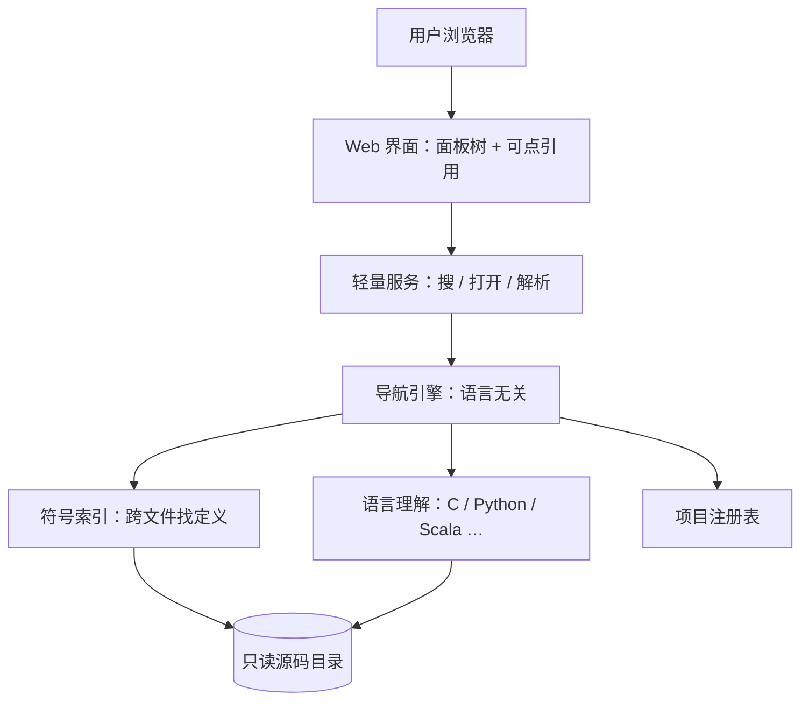

# SmartCode Browser · 30 分钟介绍 · 详细大纲

> **目标听众**：未必用过本工具，需要听懂「是什么、为什么、怎么用、和设计思路」。  
> **不讲**：源码结构、适配器实现、API 字段。  
> **建议配比**：讲 PPT 约 **18～20 分钟** + **现场演示 8～10 分钟** + 收尾 **2 分钟**（Q&A 另计，可预留 5～10 分钟）。

---

## 一、时间总表（30 分钟版）

| 时段 | 分钟 | 模块 | 形式 |
|------|------|------|------|
| 0:00–2:00 | 2 | 开场与议程 | 讲 |
| 2:00–7:00 | 5 | 背景：读大库的痛点 | 讲 |
| 7:00–11:00 | 4 | 产品是什么、不是什么 | 讲 |
| 11:00–21:00 | 10 | **核心演示**（跟一条调用链） | 演示为主 |
| 21:00–26:00 | 5 | 设计思路（概念层） | 讲 |
| 26:00–28:00 | 2 | AI 如何参与（造工具 + 可选分析） | 讲 |
| 28:00–30:00 | 2 | 总结与下一步 | 讲 |

**弹性**：演示若超时，从「设计思路」里压缩「多项目 / 大库策略」各 1 分钟；若演示顺利，可在设计段多举 1 个内核/芯片例子。

---

## 二、幻灯片结构（建议 18～22 页 + 演示）

### 第一部分 · 开场（2 分钟 · 2 页）

#### 幻灯片 1 · 标题页
- **标题**：SmartCode Browser — 级联式代码浏览器
- **副标题**：用语言无关的 Web 方式，沿调用链读大库
- **可选一行**：工具由 AI（Cursor Agent）辅助迭代完成

**讲什么（约 1 分钟）**
- 自我介绍 + 今天目的：介绍一个**专门用来追调用链**的小工具，后面有 live demo。
- 不展开安装细节，需要的人会后看 README。

#### 幻灯片 2 · 今天的路线
- ① 为什么需要它  
- ② 它是什么  
- ③ **演示**：从入口函数跟到下游  
- ④ 设计思路（不讲代码）  
- ⑤ AI 与总结  

**讲什么（约 1 分钟）**
- 提前说明：中间演示占约三分之一时间，是重点。

---

### 第二部分 · 背景与痛点（5 分钟 · 4 页）

#### 幻灯片 3 · 大家在读什么代码？
- Linux 内核 / 驱动（C，文件多、层深）
- 芯片栈：Chisel、Scala 生成逻辑、部分 Verilog/C
- 自研固件、BSP、长期维护的内部仓库

**讲什么（约 1.5 分钟）**
- 用听众熟悉的域举例（若听众偏内核就多讲 cpuidle；偏芯片就多讲 Chipyard）。
- 共同点：**体量大、跨文件、调用关系比单文件语法更重要**。

#### 幻灯片 4 · 现有方式哪里不够用？
| 方式 | 优点 | 读大库时的别扭之处 |
|------|------|-------------------|
| IDE 跳转 | 准、可改代码 | 标签多、路径在脑子里，**难复述给别人** |
| 文本搜索 / grep | 快 | 只有「出现位置」，**没有调用层次** |
| 文档 / 网页源码 | 轻 | 多为单文件，**跟链费劲** |
| 问 AI | 快出解释 | **难核对行号**，路径不稳定 |

**讲什么（约 2 分钟）**
- 强调痛点不是「IDE 不好」，而是 **「调查一条链」** 这类任务的信息组织方式不对。
- 可口述例子：「从 cpuidle 入口往下，经过 governor、driver、平台 ops，中间跨了十几个文件。」

#### 幻灯片 5 · 我们希望的工作流
- 从**一个入口符号**出发
- **顺着调用**一层层展开，左侧历史不丢
- 路径能**保存、恢复、分享**（评审、交接、写 issue）

**讲什么（约 1 分钟）**
- 用一句话收束：**「跟链」要像在树上散步，而不是在迷宫里瞬移。**

#### 幻灯片 6 · 核心诉求（金句页）
> 从入口函数出发，沿「谁调谁」往下看，路径可见、可续、可讲清楚。

**讲什么（约 0.5 分钟）**
- 停顿，过渡到下一部分「我们做了什么来满足它」。

---

### 第三部分 · 产品是什么（4 分钟 · 4 页）

#### 幻灯片 7 · 一句话定义
- **SmartCode Browser**：浏览器里的代码导航工具  
- 点击函数内**蓝色调用** → **右侧**打开定义 → 形成**横向级联调用树**

**讲什么（约 1 分钟）**
- 对比 IDE：我们是 **读**，不是 **改**。

#### 幻灯片 8 · 三个特点（图标或三列）
| 级联 | 无关 | 可续 |
|------|------|------|
| 调用关系在屏幕上长出来 | 换语言、换项目靠配置 | 刷新恢复、命名标签 |

**讲什么（约 1.5 分钟）**
- **级联**：每点一次，多一块面板，整条调查路径摆在眼前。  
- **无关**：同一套界面浏览 C 内核、Python、Scala 等。  
- **可续**：被打断或明天接着看，不必重新搜一遍。

#### 幻灯片 9 · 不是什么（避免误解）
- ✗ 全功能 IDE（无编译、调试、重构）  
- ✗ 代码托管平台  
- ✗ 替代「通读 AI」—— AI 是辅助，**跟链仍靠可点击的源码**

**讲什么（约 1 分钟）**
- 降低预期，避免被问「能不能提交 patch」。

#### 幻灯片 10 · 能力清单（一览表）
| 能力 | 一句话 |
|------|--------|
| 调用 → 定义 | 点蓝色引用，级联展开（多实现时优先真实现） |
| 变量 → 声明 | 局部高亮，全局/字段开新面板 |
| 查找用法 | 谁在用这个符号 |
| 符号搜索 | 任意入口开始跟链 |
| 会话 / 标签 | 自动恢复 + 命名保存路径 |
| 多项目 | 顶栏切换不同代码库 |
| 可选 AI | 对当前函数提问（Cursor CLI） |

**讲什么（约 0.5 分钟）**
- 「下面演示里会看到这些里的主干能力。」

---

### 第四部分 · 现场演示（10 分钟 · 可不单独做页，用「演示提纲」页过渡）

#### 幻灯片 11 · 演示提纲（过渡页，30 秒）
1. 选项目 → 搜索入口  
2. 点 2～3 层调用，展示级联  
3. 点变量 / 查用法（二选一，视时间）  
4. 保存标签 → 刷新恢复  

**演示前检查（会前完成，不讲给观众）**
- 服务已启动，registry 里至少一个**真实可访问**的项目（建议内核子树或本仓库 demo）
- 浏览器窗口放大，字号合适
- 索引已 warmed（首次打开可能慢，可提前访问一次）

---

#### 演示脚本 A · 内核 / C 场景（推荐，约 10 分钟）

| 步骤 | 时间 | 操作 | 讲解要点 |
|------|------|------|----------|
| 1 | 1:00 | 打开 `http://host:port`，顶栏选项目（如 Linux cpuidle） | 工具与内核树**分离**；只索引了子目录所以能用在超大库上 |
| 2 | 1:30 | 搜索框输入入口函数（如 `cpuidle_idle_call` 或你熟悉的符号） | 搜索是**符号索引**，不是全文瞎搜 |
| 3 | 2:00 | 打开后指出：源码、顶部签名/注释、**蓝色可点调用** | 蓝色 = 「可以继续跟」的锚点 |
| 4 | 3:00 | 连续点击 2～3 个调用，右侧长出 2～3 个面板 | **左侧不丢**：这就是级联；口头说出调用链 A→B→C |
| 5 | 1:30 | 若出现**多个候选定义**，点选其中一个 | 大库里同名/桩函数常见；工具会**优先真实现**（口头提即可） |
| 6 | 1:00 | 点击某个全局变量或字段名 | 展示「声明在哪」；局部变量可提一句「本面板闪一下」 |
| 7 | 1:00 | Alt/Ctrl+点击 或右键 → 查找用法，选一条跳转 | 「往回看」谁依赖这个函数 |
| 8 | 1:00 | 顶栏「保存到标签」，起名如 `cpuidle-调查-2025-06` | 路径可交付给同事 |
| 9 | 0:30 | F5 刷新 | 树恢复；强调**可续** |
| 10 | 可选 | 打开 AI 面板问一句「这个函数在内核 idle 路径里扮演什么角色？」 | 说明：**可选**、不替代跟链；需 cursor-agent |

**演示话术示例（跟链时）**  
「我现在在 governor 这一层；点这个调用，右侧打开 driver 里的实现——整条路径还在屏幕上，不用回忆刚才从哪个文件跳过来的。」

**演示风险与备选**
- 索引慢 → 提前 warm；口播「第一次建索引会久一点，之后会缓存」  
- 解析到多个候选 → 正好演示「大库 reality」  
- 某调用解析失败 → 诚实说「边界情况还在增强」，切到已验证的下一个蓝色调用  

---

#### 演示脚本 B · 芯片 / Scala 场景（备选，若听众偏硬件）

- 切换 registry 里的 Chipyard / Scala 项目  
- 搜索 `Module` 或熟悉的 generator 入口  
- 跟 2 层 `inst` / 方法调用，强调**同一套 UI 读不同语言**  
- 时间紧则只做 6 分钟版：搜索 → 两级级联 → 标签保存  

---

### 第五部分 · 设计思路（5 分钟 · 5 页，不讲代码）

#### 幻灯片 12 · 设计目标（回顾痛点 → 设计回应）
| 痛点 | 设计回应 |
|------|----------|
| 跟链丢上下文 | 横向级联面板，历史可见 |
| 不想绑死 IDE | Web + 只读浏览 |
| 库太大 | 注册表限定子路径 + 索引缓存 |
| 路径难分享 | 标签 + 会话恢复 |
| 多仓库 | 项目注册表，一台服务多个 root |

**讲什么（约 1.5 分钟）**
- 每一条都对应前面痛点，形成闭环。

#### 幻灯片 13 · 概念架构（一张图即可）

**讲什么（约 1.5 分钟）**
- **前端记住探索树**；后端只回答「这个符号是什么」「这个调用指向哪」—— 简单、好部署。  
- **语言差异**关在「语言理解」层，上面统一成：符号、引用、候选定义。  
- 不必记目录名，记住**分工**即可。

#### 幻灯片 14 · 语言无关：统一心智模型
- **符号**：能打开的面板单元（函数、方法、类等）  
- **引用**：函数里某次调用/成员访问的位置  
- **候选**：一次点击可能对应多个定义 → 用户选  

**讲什么（约 1 分钟）**
- 新语言 = 多一种语法理解，**不换界面、不换使用方式**。

#### 幻灯片 15 · 大库场景的产品取舍（口头案例）
- **只索引子目录**：内核不必全盘扫描  
- **多候选 + 排序**：同名、空桩、弱符号 → 优先真实现  
- **表驱动 / 函数指针**：需要上下文才能解析（说明「有边界，在持续加强」）  
- **grep 回退**：保证「至少能搜到名字」  

**讲什么（约 1 分钟）**
- 体现「为真实工程做」，不是玩具 demo。

#### 幻灯片 16 · 部署与安全（极简，30 秒～1 分钟）
- 单机：装工具 → 配 registry → 浏览器访问  
- 服务器：内网常驻；源码单独 clone  
- **安全**：无内置登录，能读 registry 指向的所有文件 → **勿裸奔公网**，用 VPN / SSH 隧道 / 反代认证  

**讲什么**
- 只提醒风险，不展开 systemd 命令（细节放 README）。

---

### 第六部分 · AI 的角色（2 分钟 · 2 页）

#### 幻灯片 17 · AI 造了这个工具
- 起点：**具体场景**（读 cpuidle 调用链），不是「先选一个框架」  
- 过程：Cursor Agent 迭代 UI、索引策略、多语言支持  
- 人的作用：定边界、验真场景、调优先级（如真实现优先）  

**讲什么（约 1 分钟）**
- 适合对管理层/同事说明：**专用工具 + AI 提效**，不是又一个 Chat 窗口。

#### 幻灯片 18 · 工具里的 AI（可选能力）
- 对**当前面板函数**提问  
- 走 cursor-agent，复用 Cursor 登录  
- 与跟链**正交**：一个负责**路径**，一个负责**含义**  

**讲什么（约 1 分钟）**
- 若听众问合规：说明数据范围取决于 Cursor/部署策略，可按公司规定关闭或不用。

---

### 第七部分 · 收尾（2 分钟 · 2 页）

#### 幻灯片 19 · 谁适合用、怎么开始
| 角色 | 典型用法 |
|------|----------|
| 内核 / 驱动 | 从子系统入口跟到平台层 |
| 芯片 / 验证 | 跟生成逻辑与连接 |
| 评审 / Lead | 标签分享调查路径 |
| 基础设施 | 内网只读挂载多仓库 |

- **怎么开始**：clone 工具 → 配 `registry.yaml` → 启动 → 浏览器打开（README 有步骤）

**讲什么（约 1 分钟）**
- 邀请试用时可给**一个已配好的内网地址**或仓库链接。

#### 幻灯片 20 · 总结
- **三个词**：级联 · 无关 · 可续  
- **一句定位**：IDE 负责改，SmartCode Browser 负责跟  
- **一句收尾**：把读大库变成「沿调用树散步」  

**讲什么（约 1 分钟）**
- 谢谢 + 提问（若安排 Q&A，此处可只说「欢迎提问」）。

---

## 三、Q&A 预案（不计入 30 分钟，建议预留 5～10 分钟）

| 可能问题 | 回答方向（仍不讲代码细节） |
|----------|---------------------------|
| 和 Sourcegraph / IDE 比？ | 我们更轻、偏个人/小团队**追一条链**；不做全库语义搜索平台 |
| 支持哪些语言？ | C/C++、Python、Java、Scala/Chisel 等；新语言加适配，界面不变 |
| 准确率？ | 语法 + 索引 + 启发式；大库有边界，演示里可多候选为例 |
| 能否改代码？ | 当前只读；定位是调查阅读 |
| 必须装 Cursor 吗？ | **浏览不需要**；仅面板内 AI 分析需要 cursor-agent |
| 多大库能用？ | 靠 include_paths 限定范围 + 缓存；内核子树已验证思路 |
| 多人同时用？ | 无状态 API，可多用户读；注意源码目录权限与网络安全 |

---

## 四、讲者备忘

### 节奏控制
- **11～21 分钟**演示是锚点；宁可少讲一页「大库取舍」，勿砍演示到 5 分钟以下。  
- 每部分结束用**过渡句**：「痛点清楚了 → 看我们怎么做的 → 直接看屏幕。」

### 建议准备的素材
- [ ] 3～5 张演示截图（防现场网络/服务挂掉）  
- [ ] 一条你熟的调用链「故事线」（口播用）  
- [ ] registry 示例一页（只展示结构：id、root、include_paths，不讲实现）  

### 若只有 25 分钟
- 背景减 1 分钟（幻灯片 3～4 合并讲）  
- 演示减到 7 分钟（跟 2 层即可，跳过查用法）  
- 设计思路只保留幻灯片 12～13  

### 若有 35～40 分钟
- 演示加第二语言 3 分钟或 AI 问答 2 分钟  
- Q&A 正式纳入议程  
- 加一页「与 IDE 对比表」（README 级信息即可）  

---

## 五、幻灯片清单速查（20 页 + 演示）

| # | 标题 | 分钟 |
|---|------|------|
| 1 | 封面 | 1 |
| 2 | 今天讲什么 | 1 |
| 3 | 我们在读什么代码 | 1.5 |
| 4 | 现有方式哪里不够 | 2 |
| 5 | 目标工作流 | 1 |
| 6 | 核心诉求（金句） | 0.5 |
| 7 | 一句话定义 | 1 |
| 8 | 级联 · 无关 · 可续 | 1.5 |
| 9 | 不是什么 | 1 |
| 10 | 能力一览 | 0.5 |
| 11 | 演示提纲 | 0.5 |
| — | **现场演示** | **10** |
| 12 | 设计目标 ↔ 痛点 | 1.5 |
| 13 | 概念架构图 | 1.5 |
| 14 | 语言无关心智模型 | 1 |
| 15 | 大库产品取舍 | 1 |
| 16 | 部署与安全提示 | 0.5～1 |
| 17 | AI 如何做出工具 | 1 |
| 18 | 工具内可选 AI | 1 |
| 19 | 谁用、如何开始 | 1 |
| 20 | 总结 | 1 |

**合计**：讲约 20 分钟 + 演示 10 分钟 ≈ **30 分钟**（不含 Q&A）。

---

## 六、与短版讲稿的关系

- `docs/PPT_设计思路.md`：7 页极简介绍，适合 5～10 分钟或发文字预览。  
- **本文档**：30 分钟完整节奏、演示脚本、Q&A 与弹性裁剪。  

制作 PPT 时：以本文档的 20 页为骨架，演示部分可用全屏浏览器 + 一页「演示提纲」切换。
