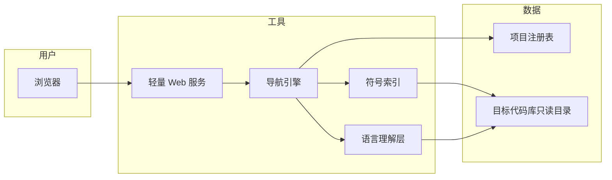

# SmartCode Browser · 设计思路（PPT 讲稿素材）

> **用途**：按「一节 = 一页幻灯片」拆分即可。本文只讲产品与设计，不涉及实现细节。  
> **背景**：本项目由 AI 辅助（Cursor Agent）迭代完成，面向「读大库、追调用链」的真实工作流。

---

## 第 1 页 · 封面

**SmartCode Browser — 级联式代码浏览器**

- 语言无关 · 项目无关 · Web 即用
- 用「点击调用 → 右侧展开定义」的方式，把跨文件阅读变成可视化的调用树
- 工具本体与目标代码库分离：同一套浏览器，可挂载 Linux 内核、Chipyard、自研仓库等

**讲者提示（可选）**：强调这不是 IDE 替代品，而是「专注追链」的轻量导航层。

---

## 第 2 页 · 我们解决什么问题？

**典型痛点**

| 场景 | 困难 |
|------|------|
| Linux 内核 / 大型 C 工程 | 函数分散在几十个文件，IDE 跳转容易迷路 |
| 芯片 / Chisel / Scala | 生成代码多、层次深，「谁调了谁」不直观 |
| 临时读别人仓库 | 不想完整导入 IDE 工程，只想快速跟一条路径 |
| 远程服务器上的源码 | 本机 IDE 够不到，但需要像读网页一样浏览 |

**核心诉求（一句话）**

> 我想从入口函数出发，**沿着调用关系一层层往下看**，并且随时能回到刚才的路径。

---

## 第 3 页 · 产品定位

**是什么**

- 运行在浏览器里的 **代码导航工具**
- 以「函数 / 方法」为面板单元，横向级联展开，形成 **调用探索树**

**不是什么**

- 不是全功能 IDE（无编译、无重构、无调试器）
- 不是静态站点生成器
- 不托管你的业务代码仓库（只读本地/服务器上已 clone 的目录）

**价值主张**

- **少切换上下文**：读调用链时，不必在几十个标签页之间来回跳
- **路径可保存**：探索过的树可以命名、恢复，适合评审、交接、写文档
- **语言与项目可换**：同一界面浏览 C 内核、Python 服务、Scala 生成逻辑

---

## 第 4 页 · 核心交互设计（灵魂）

**主路径：调用 → 定义 → 再调用**

```
[ 面板 A：函数 foo ]  --点击蓝色调用-->  [ 面板 B：函数 bar ]  --点击-->  [ 面板 C：... ]
         ↑                                        ↑
    当前阅读焦点                            在右侧「长」出来，而不是覆盖左侧
```

**三条辅助路径（同一套心智模型）**

1. **变量 / 标识符** → 跳到声明（局部在本面板高亮，全局开新面板）
2. **查找用法** → 列出「谁在用这个符号」，再选一个跳过去
3. **搜索** → 从符号名进入任意入口，再开始级联

**设计原则：探索状态在前端，后端只答「打开谁」**

- 后端保持简单、无会话：适合部署在团队内网、多用户只读浏览
- 「树长什么样、滚到哪」由浏览器端记住（含刷新恢复、命名标签）

---

## 第 5 页 · 信息架构（概念层）



**各层职责（一句话）**

| 层 | 职责 |
|----|------|
| 项目注册表 | 声明「有哪些库、根目录在哪、索引哪些子路径」 |
| 语言理解层 | 把不同语法里的函数、调用、成员访问统一成同一套「符号」 |
| 符号索引 | 回答：搜什么、打开某函数显示什么、点击某调用指向哪几个定义 |
| 导航引擎 | 对外提供「项目列表 / 搜索 / 打开 / 解析引用」四类能力 |
| Web + 前端 | 展示源码、高亮可点区域、维护级联面板与标签 |

---

## 第 6 页 · 语言无关：怎么做到「一种前端，多种语言」？

**统一抽象（概念）**

- **可导航单元**：函数、方法、类、模块等 → 都叫「符号」
- **可点击点**：函数体内的调用、成员访问 → 都叫「引用」
- **解析结果**：一个引用可能对应多个定义（重载、弱符号、多文件同名）→ 列表供用户选择

**扩展方式**

- 新语言 = 增加一种「语法适配」能力（基于 tree-sitter 一类语法树工具）
- 已覆盖方向：C/C++、Python、Java、Scala/Chisel 等；大库场景以 C 与 Scala 为首要验证对象

**大库策略**

- 注册表可限定 **只索引子目录**（例如内核只索引 `drivers/cpuidle` + 相关 `include`）
- 索引可磁盘缓存，避免每次启动全库扫描
- 极端情况下用文本搜索做补充回退（保证「至少能搜到名字」）

---

## 第 7 页 · 多项目：一台服务，多个代码库

**项目 = 配置项，不是 fork 工具**

- 每个项目：名称、磁盘根路径、主语言、包含/排除目录
- 顶部下拉切换：今天看 cpuidle，明天看 Chipyard，**无需改代码、无需重装**

**与部署的关系**

- 浏览器仓库 **只含工具**
- Linux / Chipyard 等 **各自 clone 在服务器路径**，通过 YAML 注册
- 适合：内网一台机器挂多个团队的只读镜像

---

## 第 8 页 · 为「真实大库」做的产品决策

**C / 内核向**

- 同名函数、空桩、`#ifndef` 里的 inline 占位 → **多候选 + 排序**（优先真实现）
- 函数指针、表驱动调用（如 `ops->handler`）→ 需要 **接收者上下文** 才能解析
- 内核风格注释 → 在面板顶部展示，减少再开文档的频率

**用法查找**

- 支持快捷键 / 右键：「谁调用了这个符号」
- 适合代码评审、回归分析、找遗漏调用点

**会话与标签**

- 刷新页面可恢复上次探索树（降低「读了一半被打断」的成本）
- 「保存到标签」= 把一条调查路径命名存档，便于汇报或下次接着看

---

## 第 9 页 · AI 在本项目中的两重角色

### 角色 A：工具是如何被做出来的（工程故事）

- **需求驱动**：从「读内核 cpuidle 调用链」的具体场景出发，而不是从框架选型出发
- **AI 结对开发**：在 Cursor 中用 Agent 迭代功能（适配器、索引策略、前端级联交互）
- **人的职责**：定边界（要什么 / 不要什么）、验场景、调排序规则与注册表配置
- **适合对外说明的一点**：这是 **AI 加速交付** 的专用工具，不是通用 Copilot 换皮

### 角色 B：工具内置的「函数级 AI 分析」（可选能力）

- 在某一 Panel 上对当前函数发问（实现意图、边界条件、与上下游关系等）
- 通过 **Cursor CLI（cursor-agent）** 调用，复用已有登录态，**无需单独配置 OpenAI Key**
- 与导航正交：不替代「点蓝色调用追链」，而是对 **当前焦点函数** 做解释型问答

**讲者提示**：若听众关心合规，说明 AI 分析是可选功能、数据范围由 cursor-agent 策略与部署环境决定。

---

## 第 10 页 · 典型使用场景

| 角色 | 用法 |
|------|------|
| 内核 / BSP 工程师 | 从 `cpuidle` 入口沿 governor → driver → 平台钩子等路径逐级展开 |
| 架构 / 验证 | 在 Chisel/Scala 生成逻辑里追模块实例化与连接关系 |
| Tech Lead / Reviewer | 保存「问题调查标签」，会上直接打开同一条调用树 |
| 远程协作 | SSH 隧道或内网部署，浏览器访问服务器上的只读源码 |

**成功标准（可放在本页底部）**

- 能在 **10 分钟内** 从陌生入口跟到关键下游，且路径可复述、可分享

---

## 第 11 页 · 部署与安全（设计层面）

**部署形态**

- 单机：`python` 虚拟环境 + 一条启动命令 + 本机浏览器
- 服务器：systemd 常驻 + 注册表放在 `/etc` 等标准路径
- 访问：默认仅监听本机；远程通过 **SSH 端口转发** 或 **反向代理 + 认证**

**安全边界（必须讲清）**

- 服务 **无内置账号体系**：能读注册表指向的所有源码
- **不应直接暴露公网**；推荐 VPN、内网、或带认证的反代
- 工具与业务仓库分离，降低「把浏览器仓库当成产品代码」的误用

---

## 第 12 页 · 与 IDE / 文档站 / AI Chat 的对比

| 维度 | 传统 IDE | 文档/源码网站 | 通用 AI 对话 | SmartCode Browser |
|------|----------|----------------|--------------|-------------------|
| 跨文件追调用 | 强，但面板多、易丢上下文 | 弱（多为单文件） | 不稳定、难核对行号 | **为追链优化** |
| 大库索引成本 | 高（全量工程） | 中 | 无索引 | **可限定子路径** |
| 路径可视化 | 调用层次不直观 | 无 | 无 | **横向级联树** |
| 路径复现 | 依赖本地历史 | 无 | 无 | **标签 + 会话恢复** |
| 环境依赖 | 重 | 中 | 低 | **轻（Web）** |

**定位句**：IDE 负责「改」，SmartCode Browser 负责「跟」。

---

## 第 13 页 · 演进方向（路线图素材）

**近期可增强**

- 更多语言适配、更细的「成员/宏/条件编译」解析
- 索引增量更新、更大库的性能观测
- AI 分析模板化（如「画序列图要点」「列不变量」）

**刻意不做（保持专注）**

- 在线编辑、补丁提交、CI 集成
- 替代完整 LSP 的所有语义（类型推断、重构）

---

## 第 14 页 · 总结

**一句话**

> SmartCode Browser 把「读代码」变成「沿调用树散步」—— 轻量、可部署、语言无关，并由 AI 辅助快速落地到真实大库场景。

**三个关键词**

1. **级联**：调用关系看得见、摸得着  
2. **无关**：语言与项目通过配置切换  
3. **可续**：路径可恢复、可命名、可协作  

**收尾（可选金句）**

- 代码库越大，越需要一种 **不绑架 IDE、不绑架编译环境** 的导航方式。  
- AI 让我们更快做出这种 **场景专用** 的工具；用好它的方式，是 **人的场景判断 + AI 的实现速度**。

---

## 附录 A · 建议的 PPT 页序（14 页标准版）

1. 封面  
2. 问题与痛点  
3. 产品定位  
4. 核心交互（级联）  
5. 信息架构图  
6. 语言无关设计  
7. 多项目配置  
8. 大库场景决策  
9. AI 双重角色  
10. 使用场景  
11. 部署与安全  
12. 竞品/替代对比  
13. 路线图  
14. 总结  

**附录 B · 可选附录页**

- 演示截图页：入口搜索 → 三点级联 → 保存标签  
- 注册表示例页（只展示 YAML 结构，不讲字段实现）  
- FAQ：「和 Sourcegraph 有何不同？」→ 我们更轻、更偏个人/小团队追链，而非全库语义搜索平台  

---

## 附录 C · 每页一句话标题（方便做幻灯片母版）

| 页 | 标题 |
|----|------|
| 1 | SmartCode Browser：级联式代码浏览器 |
| 2 | 大库阅读：为什么「跳转」还不够？ |
| 3 | 定位：专注「追调用链」的 Web 导航层 |
| 4 | 核心体验：点击调用，右侧长成一棵树 |
| 5 | 分层架构：前端记路径，后端答符号 |
| 6 | 一种界面，多种语言 |
| 7 | 一个服务，多个代码库 |
| 8 | 为内核与芯片代码做的产品决策 |
| 9 | AI：既造工具，也可分析当前函数 |
| 10 | 谁在用？典型场景 |
| 11 | 怎么部署才安全 |
| 12 | 和 IDE、文档站、Chat 的分工 |
| 13 | 下一步做什么、不做什么 |
| 14 | 总结：级联 · 无关 · 可续 |

---

*文档版本：与 smartcode-browser 0.1 产品描述对齐，可根据演示对象删减第 9、11 页。*
